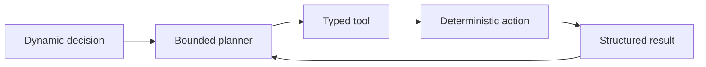
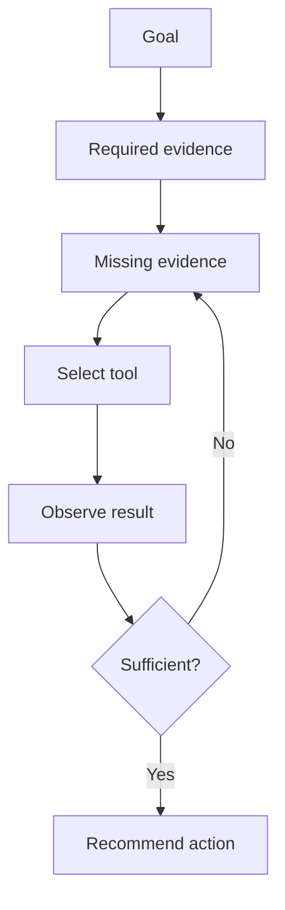
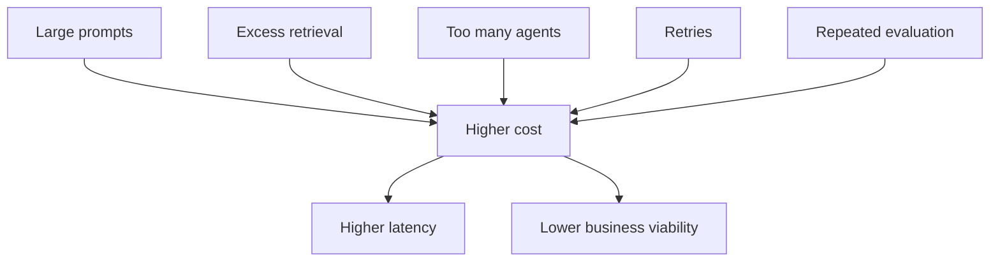
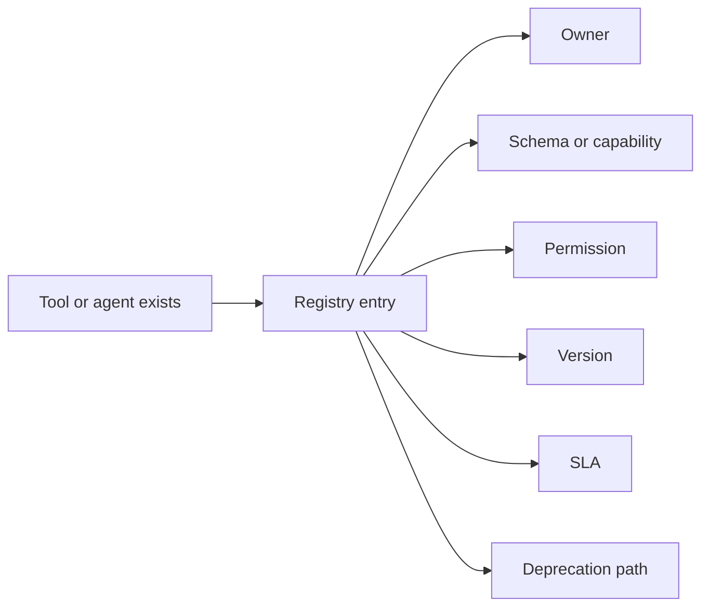

# Architecture Decision Lab
## Facilitator Solution Key

This file contains the answer key and recommended facilitation sequence for the companion learner exercise.

---

## 1. Phase 1 Answers

### Classification

| Requirement | Answer |
|---|---:|
| Generate a summary of one support ticket | C |
| Execute a fixed five-step account data refresh | B |
| Select which account evidence to retrieve based on detected renewal risk | D |
| Convert CRM JSON into a fixed PDF template | A |
| Decide whether to retrieve support, commercial, or adoption data | D |
| Run a predefined sequence of six API calls every Monday | B |
| Produce a risk explanation from fixed supplied facts | C |
| Revise the account plan after observing missing evidence | D |

**Q1:** C

A bounded agent is justified for dynamic evidence selection. Retrieval and action execution should remain deterministic wherever possible.

---

## 2. Phase 2 Answers

### Failure Classification

| Incident | Answer |
|---|---:|
| Wrong evidence tool selected | CP |
| Correct tool returns HTTP 504 | EP |
| Claims CRM task creation without tool call | CP |
| Wrong account identifier generated by planner | BOTH |
| Backend returns another customer’s data | EP |
| Same empty retrieval repeated | CP |
| Timeout interpreted as no risk | BOTH |
| Duplicate CRM tasks created | EP |

### Test Mapping

| Failure | Answer |
|---|---:|
| Same CRM action executed twice | T3 |
| Planner re-enters same state | T5 |
| Incorrect tool selected | T1 |
| Response violates schema | T2 |
| Cross-tenant data returned | T6 |
| Tool never returns | T4 |

---

## 3. Phase 3 Answers

PRD selections:

1. B  
2. C  
3. C  
4. B  
5. C  
6. C  
7. B  
8. C  

---

## 4. Phase 4 Answers

### HLD Components

`C1, C2, C3, C4, C5, C6, C7, C8, C9, C10, C11, C12`

Exclude:

- C13 because customer-environment modification is outside the autonomy boundary.
- C14 because public internet retrieval is not required.
- C15 because unrestricted cross-account memory violates isolation.

### HLD Design Review

| Statement | Answer |
|---|---:|
| Planner chooses missing evidence source | KEEP |
| CRM tool without idempotency | MODIFY |
| Risk calculated through unconstrained prose | MODIFY |
| Explicit account state | KEEP |
| Query every source for every account | REMOVE |
| Agent contains all API credentials | REMOVE |
| Structured evidence into evaluator | KEEP |
| Stop on sufficiency or cost threshold | KEEP |
| Commitments represented as normal tasks | REMOVE |
| Schemas discoverable through registry | KEEP |

---

## 5. Phase 5 Answers

| Design item | Answer |
|---|---:|
| Renewal risk is a business outcome | PRD |
| Planner connects to retrieval and CRM | HLD |
| Account ID UUID requirement | LLD |
| Eight-second timeout | LLD |
| Draft but not approve commitments | PRD |
| Structured account-state object | HLD |
| Retry selected HTTP codes | LLD |
| Customer-success manager is primary user | PRD |
| Planner plus deterministic tools | HLD |
| Final JSON fields | LLD |

---

## 6. Phase 6 Answers

### Prompt Layers

| Instruction | Answer |
|---|---:|
| Review account ACME-104 | U |
| Never represent concession as approved | S |
| Use contract tool only for assigned accounts | T |
| CRM input fields | T |
| Focus on adoption risk this time | U |
| Must not modify customer environment | N |
| Return declared JSON | S |
| Compare previous and current quarter | U |

The prohibition on modifying customer environments must not rely on prompt wording alone. The capability should be unavailable through tool scope and permissions.

### Prompt Failures

| Example | Answer |
|---|---:|
| “Find problematic accounts soon” | P1 |
| Concise versus detailed | P2 |
| Narrative returned instead of JSON | P3 |
| Excessive documents in one prompt | P4 |
| Retrieved instruction to ignore rules | P5 |

---

## 7. Prompt Lab Evaluation Guidance

### Prompt A Expected Characteristics

| Dimension | Expected |
|---|---|
| Parseability | Low |
| Policy clarity | Low |
| Hallucination exposure | High |
| Testability | Low |
| Flexibility | High |

### Prompt B Expected Characteristics

| Dimension | Expected |
|---|---|
| Parseability | High |
| Policy clarity | High |
| Hallucination exposure | Medium |
| Testability | High |
| Flexibility | Medium |

Prompt B reduces, but does not eliminate, hallucination exposure. The model can still infer unsupported facts unless evidence grounding is tested.

### Prompt C Likely Decision

A defensible response is:

```json
{
  "next_action": "REQUEST_EVIDENCE",
  "evidence_category": "CONTRACT_ENTITLEMENT",
  "reason_code": "MISSING_ENTITLEMENT_CONTEXT"
}
```

A team may select `COMMERCIAL_HISTORY` with `MISSING_COMMERCIAL_CONTEXT` if it can defend that the concession request materially changes renewal strategy. Since the exercise prohibits subjective prose, accept either only when the JSON obeys the declared contract.

---

## 8. Phase 8 Answers

### Memory Mapping

| Data item | Answer |
|---|---:|
| Evidence retrieved in current review | ST |
| Last review failed due to timeout | EP |
| Premium entitlement | LT |
| Manager rejects low-confidence recommendations | BH |
| Average token cost | OP |
| Raw authentication token | NS |
| Unsupported churn statement | NS |
| Current planner step | ST |
| Prior completed review | EP |
| Another customer’s support history | NS |

### Retention

| Data | Answer |
|---|---:|
| Current workflow state | B |
| Tool latency metrics | B |
| Stable account entitlement | A |
| Raw contract chunks | A |
| Model-generated inferred risk | B |

---

## 9. Phase 9 Answers

### Retrieval Design

| Corpus | Chunking | Ranking | Freshness | Access control |
|---|---:|---:|---:|---:|
| Contracts | CH2 | RK3 | FR2 | AC2 |
| Release notes | CH2 | RK3 | FR2 | AC2 |
| Knowledge articles | CH2 | RK3 | FR2 | AC2 |
| Customer case notes | CH2 | RK3 | FR2 | AC2 |

### Metadata

Recommended:

`M1, M3, M4, M5, M6, M11`

`M2` and `M9` are also useful. However, tenant, validity dates, access level, source, and lifecycle status are more foundational.

### Source Authority Ranking

1. Current signed contract  
2. Product documentation  
3. Customer-success manager note  
4. Draft commercial proposal  
5. Model-generated prior summary  

The ordering of product documentation and customer-success notes can vary by question. The key principle is that authoritative signed evidence outranks drafts and model-generated summaries.

---

## 10. Phase 10 Answers

### Tool Contract

| Field | Answer |
|---|---:|
| Input schema | B |
| Idempotency | B |
| Timeout | B |
| Retry policy | B |
| Permission scope | B |

### Retry Classification

| Result | Answer |
|---|---:|
| HTTP 429 | R |
| HTTP 400 | T |
| HTTP 401 | C |
| HTTP 404 | T |
| HTTP 502 | R |
| HTTP 409 duplicate key | C |
| HTTP 503 | R |
| Local schema validation failure | T |

**Q2:** C  
**Q3:** C

A 401 is conditional because a token refresh may make the operation retryable. A 409 duplicate idempotency key requires checking whether the original operation succeeded rather than blindly retrying.

---

## 11. Phase 11 Answers

### Registry Mapping

| Metadata | Answer |
|---|---:|
| Input-output schema | TR |
| Business capability | BOTH |
| Tool timeout | TR |
| Agent owner | AR |
| Tool owner | TR |
| Supported account types | AR |
| Agent version | AR |
| Tool retry policy | TR |
| Model family | AR |
| Permission scope | BOTH |
| Average cost per execution | BOTH |
| Deprecation date | BOTH |

**Q4:** B

---

## 12. Phase 12 Answers

### Cost Ranking

Recommended ranking:

1. Entire contract and support history on every turn  
2. Four unnecessary sub-agents  
3. Evaluator after every intermediate step  
4. Unclassified retries  
5. Concise structured state  
6. Filtered top-k retrieval  

Items 5 and 6 are cost controls, not cost amplifiers.

### Cost Calculation

Architecture A:

```text
2 × 6 × 8 × 4 × 1.4 × 2
= 1,075.2 units
```

Architecture B:

```text
2 × 4 × 3 × 1 × 1.1 × 1.25
= 33 units
```

Ratio:

```text
1,075.2 ÷ 33
≈ 32.58
```

| Architecture | Cost units |
|---|---:|
| Architecture A | 1,075.2 |
| Architecture B | 33 |
| A divided by B | 32.58 |

### Cost Controls

| Cost source | Answer |
|---|---:|
| Planner repeatedly requests evidence | CC2 |
| Same document repeatedly retrieved | CC6 |
| Expensive model used for validation | CC4 |
| Four agents retrieve same data | CC7 |
| Entire conversation replayed | CC5 |
| Malformed request repeatedly retried | CC3 |
| Twenty-five large chunks retrieved | CC1 |
| Cost exceeds business value | CC8 |

---

## 13. Simplification Challenge Answers

**Best design:** B

| Component | Answer |
|---|---:|
| Account Intake Agent | DETERMINISTIC SERVICE |
| Support Analysis Agent | TOOL |
| Contract Analysis Agent | TOOL |
| Product Adoption Agent | TOOL |
| Renewal Strategy Agent | AGENT |
| Contract API retrieval | TOOL |
| Usage decline calculation | DETERMINISTIC SERVICE |
| Risk-threshold comparison | DETERMINISTIC SERVICE |
| Selection of missing evidence | AGENT |
| CRM task creation | TOOL |

“Renewal Strategy Agent” can be renamed “Account Planner” because its primary responsibility is selecting the next evidence or action, not independently executing every capability.

---

## 14. Consolidation MCQ Answers

| Question | Answer |
|---|---:|
| Q5 | C |
| Q6 | B |
| Q7 | C |
| Q8 | D |
| Q9 | B |
| Q10 | B |
| Q11 | C |
| Q12 | B |
| Q13 | B |
| Q14 | C |
| Q15 | B |

---

## 15. Facilitator Run Sequence

### Round 1: Individual Calibration - 8 minutes

Participants independently answer:

- Phase 1 classification
- Q1
- control versus execution classification
- Q5-Q7

No discussion during this round.

### Round 2: Team Architecture - 20 minutes

Teams complete:

- PRD selection
- HLD component selection
- HLD design review
- HLD versus LLD classification

Assign roles:

| Role | Responsibility |
|---|---|
| Architect | Component boundaries |
| Test architect | Failure and test coverage |
| AWS architect | Integration and runtime constraints |
| Customer-success representative | Business correctness |
| Challenger | Identify unnecessary agentic complexity |

### Round 3: Prompt and Memory Lab - 15 minutes

Teams run Prompts A, B, and C.

They complete only:

- Yes or No evaluation tables
- Low, Medium, High comparisons
- prompt-layer mapping
- memory mapping

### Round 4: Retrieval and Tool Design - 15 minutes

Teams complete:

- RAG decision table
- metadata selection
- tool contract
- retry classification
- registry classification

### Round 5: Cost and Simplification - 12 minutes

Teams calculate Architecture A and B and answer the simplification challenge.

### Round 6: Reveal and Challenge - 10 minutes

For contested items, teams defend using one evidence code:

- P: Product boundary
- A: Architecture boundary
- T: Testability
- S: Security or permission boundary
- C: Cost
- O: Operability

Response format:

```text
Q6: B, evidence code T
```

---

## 16. Mental Models to Reinforce

### Agentic Core, Deterministic Shell



### Evidence Before Action



### Contracts at Every Boundary

| Boundary | Contract |
|---|---|
| Business to system | PRD |
| Components to architecture | HLD |
| Component internals | LLD |
| Planner to tool | Tool schema |
| Tool or agent to organisation | Registry entry |
| Architecture to finance | Cost ceiling |

### Cost Is Architectural



### Registry as Operating Model


