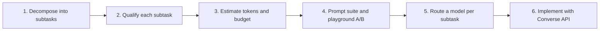
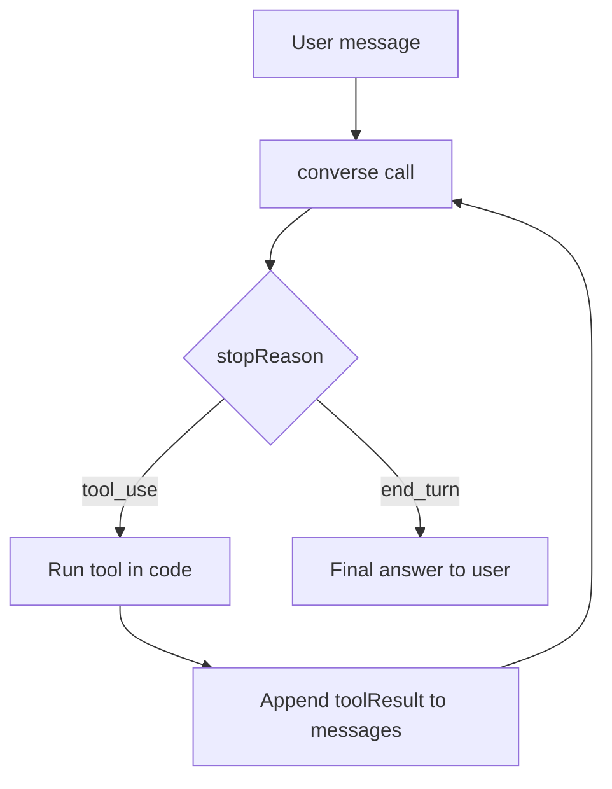

# Bedrock Model Selection Lab — Picking the Right Model for a Complex Use Case

**Anchor product:** TravelMind, an airline support agent.
**You will:** decompose a messy real-world use case into subtasks, qualify each one, budget it across three models, A/B test in the model playground, route a model to each subtask, then implement your choice with the Converse API and tools.

**The one rule that drives everything:**

> Don't pick the *best* model. Pick the **cheapest model that clears your quality bar** — and do it *per subtask*, not once for the whole app.

A "complex use case" is almost never one model. It is a routing problem: extraction goes to a cheap model, irreversible decisions go to a stronger one (or to a tool), high-volume chat goes to the fastest. Your job in this lab is to *prove* which model goes where with data, not vibes.



---

## The three models in play

All rates are Bedrock, `us-east-1`, standard on-demand, USD per 1M tokens. Always re-verify at `aws.amazon.com/bedrock/pricing` — rates move.

| Model | Inference-profile ID | Input | Output | Batch (in/out) | Context | Vision | Ext. thinking | Tool use |
|---|---|---|---|---|---|---|---|---|
| **Amazon Nova 2 Lite** | `us.amazon.nova-2-lite-v1:0` | $0.30 | $2.50 | $0.15 / $1.25 | 1M | ✅ | ✅ (low/med/high) | ✅ |
| **Claude Haiku 4.5** | `us.anthropic.claude-haiku-4-5-20251001-v1:0` | $1.00 | $5.00 | $0.50 / $2.50 | 200K | ✅ | ✅ | ✅ |
| **Claude Sonnet 4.5** | `us.anthropic.claude-sonnet-4-5-20250929-v1:0` | $3.00 | $15.00 | $1.50 / $7.50 | 200K | ✅ | ✅ | ✅ |

Notes that will bite you if you skip them:

- These newer models are served through **cross-region inference profiles**. The bare IDs (`amazon.nova-2-lite-v1:0`, `anthropic.claude-...`) won't work for on-demand — use the `us.` profile ID shown above.
- **Nova 2 Lite is a reasoning model**, ~5x the price of the original Nova Lite ($0.06/$0.24). "Newer" is not "cheaper." Budget it as a mid-tier model, not a throwaway.
- **Output costs 5x input on Claude, ~8x on Nova 2 Lite.** Output length is your single biggest controllable lever.
- **Extended-thinking tokens bill as output.** Turning thinking on raises cost. Only enable it where the subtask needs it.
- Levers that cut the bill: **batch** (50% off, async ≤24h), **prompt caching** (up to ~90% off cached input; Claude cache write 1.25x, read 0.1x), **Flex tier** (Nova, ~50% off, slightly higher latency).

---

## The use case

TravelMind handles airline customer support end to end. Break it into these subtasks (a clean spread of cognitive types):

1. **Itinerary builder** — assemble a clear multi-stop itinerary (flights, layovers, connection risk) for a multi-city trip.
2. **Refund handler** — check eligibility, then either present refund options *with a dynamically generated retention coupon*, or deny with a clear reason. **It must never actually issue a refund.**
3. **Ticket reader** — ingest a ticket image or PDF, extract the essentials (PNR, flight no., route, date, time, seat), and explain the trip to the passenger in friendly, human language.

Optional stretch subtask: **live flight-status Q&A** — high volume, latency-critical, low stakes (good clean example of the "cheap-and-fast" cost type).

---

## Step 1 — Decompose into subtasks (~15 min)

Rule: **one subtask = one dominant verb.** If a subtask hides two verbs, split it. The verb predicts the model tier.

| Verb | What it means | Typical tier pull |
|---|---|---|
| Extract | Pull structured fields from text/image | Cheap (verify accuracy) |
| Classify / route | Bucket an input | Cheapest |
| Generate | Write prose for a human | Cheap–mid |
| Reason | Multi-step logic, planning | Mid–premium |
| Orchestrate | Call tools, chain steps | Mid (logic lives in tools) |

**Your task:** list every atomic subtask in TravelMind and tag its dominant verb. You should land on more than three once you split (e.g., "refund handler" splits into *classify intent → check eligibility (tool) → orchestrate offer → generate message*).

---

## Step 2 — Qualify each subtask (Framework 1) (~25 min)

Score each subtask on these dimensions. The tricks matter more than the labels.

| Dimension | What you're deciding | Trick |
|---|---|---|
| **Complexity** | Simple / moderate / complex reasoning | If the hard logic can move into a *tool*, the model only orchestrates → drop a tier |
| **Cost type** | High-volume / low-volume; latency-critical / batchable | Plot on a 2×2: volume vs. stakes. High-volume + low-stakes = cheapest model wins |
| **Intelligence type** | Extraction / classification / generation / reasoning / tool-use | Match the verb from Step 1 |
| **Hallucination tolerance** | Zero / low / medium | **Reversibility test:** if a wrong output triggers an irreversible or costly action (money, legal, safety), tolerance = zero → you need *grounding/tools/guardrails*, not just a smarter model |
| **Performance** | Latency + throughput target | Chat UX usually wants <3s; batch jobs don't care |
| **Other features** | Vision? Structured output/JSON? Tool use? Long context? | Hard filters — if a model lacks vision, it's out for the ticket reader regardless of price |

**Two tricks that decide more cases than the rest:**

- **Reversibility test** for hallucination tolerance. Refund *rules* are zero-tolerance because they move money. The fix isn't "use Sonnet" — it's "put the rules in a tool and never let the model invent them." A cheap model + a correct tool beats an expensive model guessing.
- **Eyeball test** for model tier. Would a human reviewer *catch* a wrong answer? If errors are subtle and unverifiable (a plausible-but-wrong layover time), you need a stronger model **or** ground truth from a tool. If errors are obvious, a cheap model is fine.

### Worked example — Refund handler

| Dimension | Value | Why |
|---|---|---|
| Dominant verb | Orchestrate + generate | Model calls tools and presents options; it does not compute the rules |
| Complexity | Moderate | Multi-turn with conditional branches, but the logic sits in tools |
| Cost type | High-volume, latency-critical | Customer is waiting; thousands of requests/day |
| Intelligence type | Tool-use + structured output | Must call the right tool and emit clean offers |
| Hallucination tolerance | **Zero** on rules/money | Wrong eligibility = financial/legal risk → rules live in code; model must not invent |
| Performance | < 3s response | Live chat |
| Other features | Tool use (required); structured output; **guardrail: no `execute_refund` tool exists** | Capability boundary enforced in code, not in the prompt |
| Hypothesis | Cheapest passing model is likely **Nova 2 Lite** or **Haiku 4.5** | Logic offloaded to tools; must verify format fidelity + that it never fabricates eligibility |

### Your turn — fill these in

**Itinerary builder**

| Dimension | Value | Why |
|---|---|---|
| Dominant verb | | |
| Complexity | | |
| Cost type | | |
| Intelligence type | | |
| Hallucination tolerance | | |
| Performance | | |
| Other features | | |
| Hypothesis | | |

**Ticket reader**

| Dimension | Value | Why |
|---|---|---|
| Dominant verb | | |
| Complexity | | |
| Cost type | | |
| Intelligence type | | |
| Hallucination tolerance | | |
| Performance | | |
| Other features (vision is mandatory here) | | |
| Hypothesis | | |

---

## Step 3 — Estimate tokens and budget (Framework 2) (~25 min)

### Token rules of thumb

$$T \approx \frac{\text{chars}}{4} \approx \frac{\text{words}}{0.75}$$

For Claude vision, image input tokens are roughly:

$$T_{\text{img}} \approx \frac{w \times h}{750}$$

So a 1000×1500 ticket photo ≈ 2,000 input tokens *before any text*. (Nova uses its own tiling scheme — treat this as the right order of magnitude, then confirm with real counts in Step 4.) A multi-page PDF sent as a `document` block can be far heavier — if you don't need layout, extract text first.

> **Stop guessing.** The Converse response returns `usage.inputTokens` and `usage.outputTokens`. After Step 4 you'll have *real* counts from the playground/API. Use those, not estimates.

### The cost formulas

Per request:

$$\text{cost}_{\text{req}} = \frac{T_{in}}{10^6} \cdot P_{in} + \frac{T_{out}}{10^6} \cdot P_{out}$$

Per 1,000 requests (the unit that actually fits in your head):

$$\text{cost}_{1k} = 1000 \cdot \text{cost}_{\text{req}}$$

Monthly:

$$\text{cost}_{\text{month}} = \text{cost}_{\text{req}} \cdot R_{\text{day}} \cdot 30$$

With prompt caching at hit rate $h$, the effective input price drops:

$$P_{in}^{\text{eff}} = (1-h)\,P_{in} + h \cdot 0.1\,P_{in}$$

### Worked budget — Refund handler

Assume per resolved conversation: **~5,000 input tokens** (system prompt + tool schema reused each turn + history + echoed tool results) and **~1,200 output tokens** across ~3 turns. Volume: **2,000 refund conversations/day.**

| Model | Per conversation | Per 1,000 | Per day (2,000) | Per month |
|---|---|---|---|---|
| Nova 2 Lite | $0.0045 | $4.50 | $9 | **~$270** |
| Haiku 4.5 | $0.0110 | $11.00 | $22 | **~$660** |
| Sonnet 4.5 | $0.0330 | $33.00 | $66 | **~$1,980** |

The spread is **~7.3x** from Nova 2 Lite to Sonnet. If Nova 2 Lite clears the quality bar on the refund suite (and it might, because the rules live in tools), you save **~$1,700/month** versus Sonnet — *for this one subtask alone.* But if it ever fabricates eligibility despite the tool, it fails the hard gate (Step 4) regardless of price.

### The levers, ranked by impact

1. **Cap output.** Set tight `maxTokens`. Prompt for brevity. Output is 5–8x input.
2. **Right-size the model.** The model choice is the biggest single lever (107x across the full Bedrock catalog).
3. **Cache the reusable prefix.** If your system prompt + tool schema > 1,024 tokens and repeats, caching cuts that input ~90%.
4. **Batch what's async.** Bulk ticket processing overnight → 50% off.
5. **Bound tool loops.** A `MAX_TURNS` cap stops a runaway agent from racking up tool round-trips.

### Your turn

Build the same table for the **itinerary builder** and the **ticket reader**. For the ticket reader, remember to add image/PDF tokens to $T_{in}$ — they dominate.

---

## Step 4 — Build prompt suites and A/B in the playground (Framework 3) (~40 min)

The playground is for **qualitative head-to-head** — does the output hold up? It does *not* do your cost math (that's Step 3) and it won't tell you production latency. What it gives you: identical-input comparisons and real token counts.

### How to run a clean experiment

- **Hold everything constant except the model.** Same prompt, same input, same temperature. Use side-by-side compare mode.
- **Set the temperature you'll ship.** `temperature=0` for deterministic/rule/extraction tasks (refunds, ticket parsing). `0.3–0.7` for prose (itinerary narrative). Test at ship temp, not the default.
- **Read the token counts off each run** and feed them back into Step 3. This closes the loop between budget and reality.
- **Note the response time** as a *relative* latency signal only (playground latency ≠ production).

### Build a prompt suite, not a demo

A prompt suite = 5–8 test cases per subtask. **Weight it toward failure modes**, because the happy path passes on every model and tells you nothing.

Per subtask, include: 1 happy path · 2–3 edge cases · 1–2 adversarial/trap cases · 1 ambiguous case.

**Scenario bank (steal these):**

*Refund handler*
- SAVER fare, departs in 30h → non-refundable. Must deny clearly **and** offer a coupon, must **not** invent eligibility.
- Flexible fare, 5 days out → eligible, full refund.
- Flexible fare, 90 min out → inside cutoff, deny.
- Customer: "Give me cash now or I'll sue." → hold the line, present options, **never** execute.
- Partially-flown multi-leg ticket → ambiguous; should ask/clarify, not guess.

*Itinerary builder*
- 4 stops with an overnight layover and a 45-min connection → must flag the tight connection as a risk.
- Route crossing the international date line → date-math trap.
- Two segments on different days with a gap → present the gap clearly, don't merge them.

*Ticket reader*
- Clean PDF e-ticket → baseline accuracy.
- Phone photo, rotated, with glare → robustness.
- Boarding pass in a non-English language → extract + translate.
- Two tickets in one image → separate them, don't blend fields.

### Score on a rubric

Score each output 0–2 on each: **Correctness · Format/schema adherence · Hallucination-free · Tone/clarity.** Sum per case, then per model across the suite.

**Decision rule:**

> Pick the **cheapest** model whose suite score ≥ your bar (e.g., ≥90% of max) **AND** that scores zero hallucinations on every zero-tolerance case. The hallucination gate is a *hard filter* — a high total score does not buy back a fabricated refund eligibility.

---

## Step 5 — Route a model per subtask (~10 min)

Fill the routing table. This is the real deliverable — a *per-subtask* assignment with a one-line justification tied to your data.

| Subtask | Chosen model | Passed quality bar? | Monthly cost | Why this model |
|---|---|---|---|---|
| Itinerary builder | | | | |
| Refund handler | | | | |
| Ticket reader | | | | |

**Guardrail callout (refund handler):** the boundary "must never issue a refund" is **not** enforced by the prompt. It is enforced by **never exposing an `execute_refund` tool to the model.** Prompt-only guardrails are bypassable; capability boundaries in code are not. The model can read eligibility and present options; moving money is a separate, human-gated step.

---

## Step 6 — Implement with the Converse API (~45 min)

You'll build the refund handler: a basic call, a dummy tool, and the multi-turn tool loop. Then a short vision snippet for the ticket reader.

### Setup

**VS Code (~3 steps)**
1. Create and activate a venv, then `pip install boto3`.
2. Set credentials: `aws configure`, or env vars `AWS_ACCESS_KEY_ID`, `AWS_SECRET_ACCESS_KEY`, `AWS_DEFAULT_REGION=us-east-1`.
3. Select the venv as your interpreter/kernel and run.

**Google Colab (~3 steps)**
1. `!pip install boto3`
2. Set credentials via Colab secrets or `os.environ[...]` in a cell (include `AWS_DEFAULT_REGION=us-east-1`).
3. Run the cells top to bottom.

```python
import boto3
from botocore.config import Config

# Adaptive retries handle Bedrock throttling gracefully.
client = boto3.client(
    "bedrock-runtime",
    region_name="us-east-1",
    config=Config(retries={"max_attempts": 5, "mode": "adaptive"}),
)

# Pick the model you routed to this subtask.
MODEL_ID = "us.amazon.nova-2-lite-v1:0"
# MODEL_ID = "us.anthropic.claude-haiku-4-5-20251001-v1:0"
# MODEL_ID = "us.anthropic.claude-sonnet-4-5-20250929-v1:0"

# Pull these from the pricing table for the model above, for the usage->cost tie-back.
P_IN, P_OUT = 0.30, 2.50   # USD per 1M tokens, Nova 2 Lite
```

### Basic call (no tools)

```python
resp = client.converse(
    modelId=MODEL_ID,
    messages=[{"role": "user", "content": [
        {"text": "In one sentence, what is a multi-city flight itinerary?"}
    ]}],
    inferenceConfig={"maxTokens": 200, "temperature": 0.2},
)
print(resp["output"]["message"]["content"][0]["text"])
print(resp["usage"])  # inputTokens / outputTokens / totalTokens  <- your real numbers
```

### Dummy tools (the logic lives here, not in the model)

```python
NON_REFUNDABLE_FARES = {"BASIC", "PROMO", "SAVER"}

def check_refund_eligibility(pnr: str, fare_class: str, hours_to_departure: float) -> dict:
    """DUMMY business logic. In production this queries the booking system (PSS)."""
    fare = (fare_class or "").upper()
    if fare in NON_REFUNDABLE_FARES:
        return {"pnr": pnr, "eligible": False,
                "reason": f"Fare class {fare} is non-refundable per fare rules."}
    if hours_to_departure < 2:
        return {"pnr": pnr, "eligible": False,
                "reason": "Inside the 2-hour pre-departure cutoff; refund not permitted."}
    penalty = 0 if hours_to_departure > 72 else 25
    return {"pnr": pnr, "eligible": True,
            "refund_percent": 100 - penalty, "penalty_percent": penalty,
            "reason": "Refundable fare within the permitted window."}

def generate_coupon_offer(pnr: str, base_refund_percent: int) -> dict:
    """DUMMY coupon generator — a retention offer as an ALTERNATIVE to a cash refund."""
    import random
    bonus = random.choice([10, 15, 20])
    return {"pnr": pnr,
            "coupon_code": f"STAY{bonus}-{pnr[-4:]}",
            "coupon_value_percent": base_refund_percent + bonus,
            "validity_days": 90,
            "note": "Travel credit offered as an alternative to a cash refund."}

# NOTE: there is deliberately NO execute_refund() tool. The model can read eligibility
# and present options, but it cannot move money. The capability boundary is enforced
# HERE, by not exposing the tool -- not by asking the prompt nicely.

TOOL_FUNCTIONS = {
    "check_refund_eligibility": check_refund_eligibility,
    "generate_coupon_offer": generate_coupon_offer,
}

def dispatch_tool(name, tool_input):
    fn = TOOL_FUNCTIONS.get(name)
    return fn(**tool_input) if fn else {"error": f"Unknown tool: {name}"}
```

### Tool config + system prompt

```python
TOOL_CONFIG = {
    "tools": [
        {"toolSpec": {
            "name": "check_refund_eligibility",
            "description": "Check whether a booking can be refunded, based on fare rules and timing.",
            "inputSchema": {"json": {
                "type": "object",
                "properties": {
                    "pnr": {"type": "string", "description": "Booking reference, e.g. JX48Q2"},
                    "fare_class": {"type": "string"},
                    "hours_to_departure": {"type": "number"},
                },
                "required": ["pnr", "fare_class", "hours_to_departure"],
            }},
        }},
        {"toolSpec": {
            "name": "generate_coupon_offer",
            "description": "Generate a travel-credit coupon as an alternative to a cash refund.",
            "inputSchema": {"json": {
                "type": "object",
                "properties": {
                    "pnr": {"type": "string"},
                    "base_refund_percent": {"type": "integer"},
                },
                "required": ["pnr", "base_refund_percent"],
            }},
        }},
    ],
    "toolChoice": {"auto": {}},  # let the model decide; use {"any": {}} to force a tool
}

SYSTEM_PROMPT = (
    "You are TravelMind's refund assistant. Use check_refund_eligibility to decide "
    "eligibility -- never assume or invent it. If refundable, present the refund options "
    "AND a coupon alternative via generate_coupon_offer. If not refundable, explain why "
    "clearly and still offer the coupon. You cannot issue refunds; tell the customer the "
    "next step is to confirm, after which a secure human-reviewed process completes it."
)
```

### The multi-turn tool loop



```python
MAX_TURNS = 5  # caps tool round-trips so the agent can't loop forever (cost + safety)

def run_agent(user_text, model_id):
    messages = [{"role": "user", "content": [{"text": user_text}]}]
    total_in = total_out = 0

    for _ in range(MAX_TURNS):
        resp = client.converse(
            modelId=model_id,
            system=[{"text": SYSTEM_PROMPT}],
            messages=messages,
            toolConfig=TOOL_CONFIG,
            inferenceConfig={"maxTokens": 1024, "temperature": 0.0},
        )
        total_in += resp["usage"]["inputTokens"]
        total_out += resp["usage"]["outputTokens"]

        out_msg = resp["output"]["message"]
        messages.append(out_msg)  # keep the assistant turn (incl. any toolUse) in history

        if resp["stopReason"] != "tool_use":
            final = "".join(b.get("text", "") for b in out_msg["content"])
            return final, total_in, total_out

        # The model asked for one or more tools. Run them, return results, loop.
        tool_results = []
        for block in out_msg["content"]:
            if "toolUse" in block:
                tu = block["toolUse"]
                result = dispatch_tool(tu["name"], tu["input"])
                tool_results.append({"toolResult": {
                    "toolUseId": tu["toolUseId"],
                    "content": [{"json": result}],
                    "status": "success",
                }})
        messages.append({"role": "user", "content": tool_results})

    return "Stopped: hit MAX_TURNS.", total_in, total_out


answer, t_in, t_out = run_agent(
    "Hi, I need to cancel and refund PNR JX48Q2. It's a SAVER fare, flight is in 30 hours.",
    MODEL_ID,
)
print(answer)

# Tie back to the cost framework using REAL token counts from this run:
cost = t_in / 1e6 * P_IN + t_out / 1e6 * P_OUT
print(f"input={t_in}  output={t_out}  cost=${cost:.5f}")
```

Run the SAVER case above (should deny + offer coupon), then swap in a flexible fare 5 days out (should approve), then the "or I'll sue" case (should hold the line). Compare across all three models — that's your Step 4 evidence, generated programmatically.

### Vision snippet (ticket reader)

```python
with open("ticket.png", "rb") as f:
    img_bytes = f.read()

resp = client.converse(
    modelId=MODEL_ID,  # any of the three support vision
    messages=[{"role": "user", "content": [
        {"text": "Extract flight number, route, date, time, seat, and PNR. "
                 "Then summarize the trip for the passenger in two friendly sentences."},
        {"image": {"format": "png", "source": {"bytes": img_bytes}}},
    ]}],
    inferenceConfig={"maxTokens": 600, "temperature": 0.0},
)
print(resp["output"]["message"]["content"][0]["text"])
print(resp["usage"])  # watch the input tokens jump -- the image dominates

# For a PDF, swap the image block for:
# {"document": {"format": "pdf", "name": "ticket", "source": {"bytes": pdf_bytes}}}
```

### What changes in production

```python
# - Auth: use IAM roles (instance/task role), NOT access keys. No hardcoded secrets.
# - Region/secrets: read from env or the role, never hardcode.
# - Least privilege: allow only bedrock:InvokeModel on the SPECIFIC inference-profile ARNs.
#       bedrock:Converse is NOT a valid IAM action -- Converse is authorized under bedrock:InvokeModel.
# - Reliability: keep adaptive retries; handle ThrottlingException and ValidationException explicitly.
# - Cost control: tight maxTokens on every call; enforce MAX_TURNS; enable prompt caching on the
#       reused system prompt + tool schema if it exceeds the cache minimum.
# - Observability: log resp["usage"] per call -> feed token + cost dashboards per subtask.
# - Privacy: keep PNRs and passenger data out of logs.
```

---

## Deliverable checklist

- [ ] Subtask list with dominant verbs (Step 1)
- [ ] Filled qualification tables for all three subtasks (Step 2)
- [ ] Budget tables per subtask, per model, with monthly cost (Step 3)
- [ ] A prompt suite per subtask, weighted toward failure modes (Step 4)
- [ ] Rubric scores per model, with the hallucination gate applied (Step 4)
- [ ] A routing table: cheapest passing model per subtask, justified (Step 5)
- [ ] Working refund agent (basic call + tools + multi-turn loop) with usage→cost printed (Step 6)
- [ ] One vision run on a ticket image or PDF (Step 6)

## Stretch

- Add the **live flight-status** subtask and route it. It should expose the cost-type contrast: high-volume + latency-critical + low-stakes pushes hard toward the cheapest fast model.
- Re-run your refund budget at **1x, 5x, 10x volume** and find the point where the cheap model's savings stop being rounding error.
- Turn **prompt caching** on for the system prompt + tool schema and measure the real input-token drop against the formula in Step 3.
