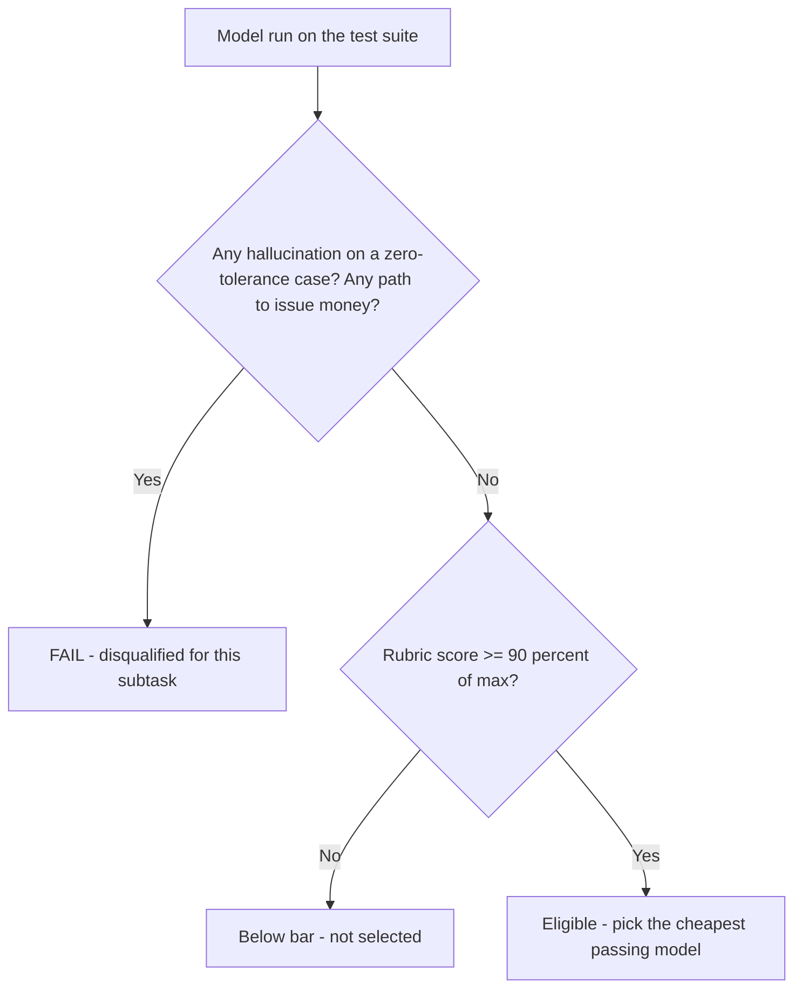
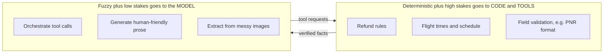
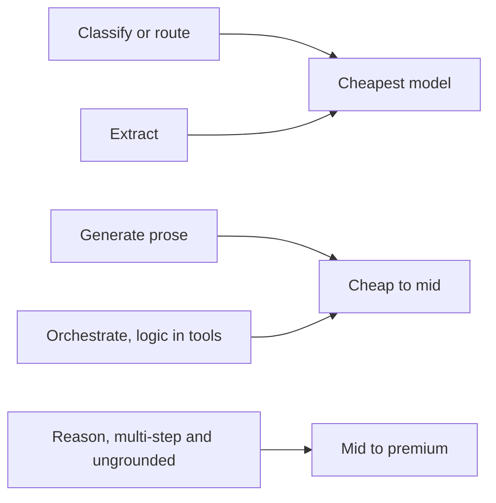
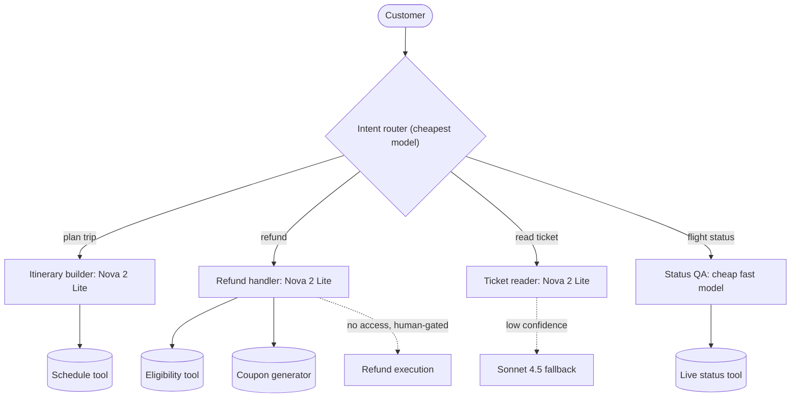
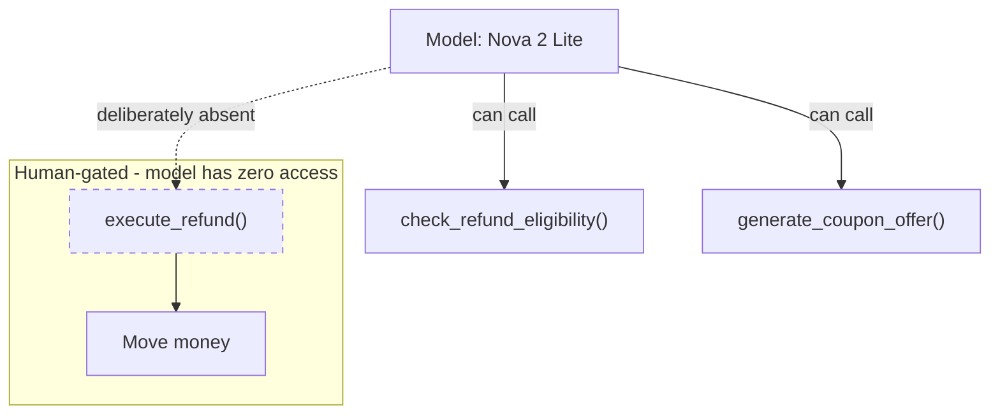
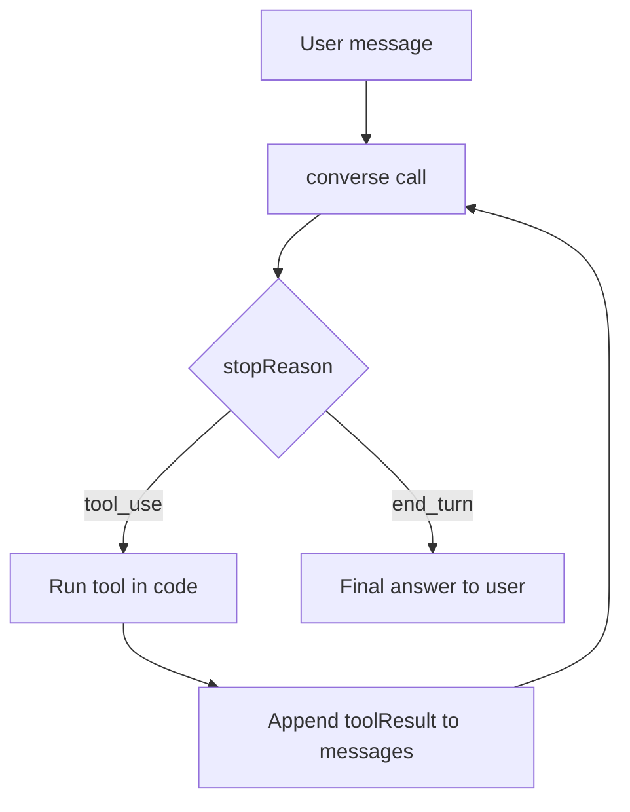
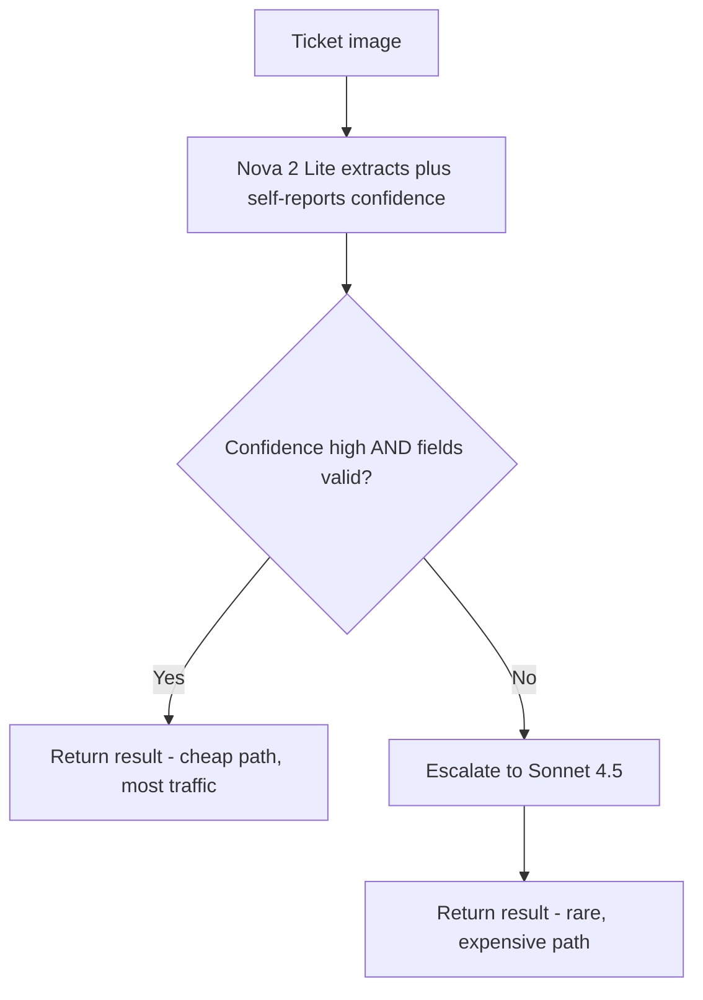
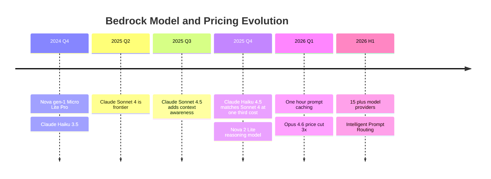

# Answer Key — Bedrock Model Selection Lab (Instructor)

Companion to `bedrock_model_selection_lab.md`. Every blank filled, plus the background, frameworks, and model-evolution context to teach this with authority and field hard questions.

> The prices in this key will be wrong within six months. **The frameworks are the asset; the numbers are disposable.** Teach students to *reason about* model selection, not to memorize a 2026 rate card.

All rates: Bedrock, `us-east-1`, standard on-demand, USD per 1M tokens. Re-verify at `aws.amazon.com/bedrock/pricing` before every cohort.

| Model | Inference-profile ID | In | Out | Batch in/out |
|---|---|---|---|---|
| Nova 2 Lite | `us.amazon.nova-2-lite-v1:0` | $0.30 | $2.50 | $0.15 / $1.25 |
| Haiku 4.5 | `us.anthropic.claude-haiku-4-5-20251001-v1:0` | $1.00 | $5.00 | $0.50 / $2.50 |
| Sonnet 4.5 | `us.anthropic.claude-sonnet-4-5-20250929-v1:0` | $3.00 | $15.00 | $1.50 / $7.50 |

---

## How to grade — the two gates

Apply in order. The first is binary and ruthless; the second is a quality bar.



A model that scores 95% but invents eligibility on the SAVER case is **disqualified** for refunds. A polished answer built on a fabricated fact is worse than a blunt correct one. Make students feel that asymmetry — it is the core engineering judgment of the whole lab.

---

## The mental model the entire lab teaches

Say this out loud, early, and keep returning to it. Three subtasks, and the same move keeps recurring:

> Put the **deterministic, high-stakes** part in code and tools. Let the model do the **fuzzy, low-stakes** part. The model orchestrates and writes; it does not decide facts that move money or miss flights.



Refund rules to a tool. Flight times to a tool. Field validation to code. Once a student internalizes this one move, the price table becomes a footnote — they stop trying to buy correctness with a bigger model and start *designing* it in.

---

## Step 1 — Decomposition (filled)

Most "subtasks" collapse into three cognitive primitives — **extract, orchestrate, generate** — repeated. You route by *primitive × stakes*, so you need far fewer distinct models than subtasks.

| # | Subtask | Sub-steps | Dominant verb |
|---|---|---|---|
| 0 | Intent routing | classify which flow this is | classify |
| 1 | Itinerary builder | parse request, reason over connections, narrate | reason + generate |
| 2 | Refund handler | classify intent, check eligibility (tool), make offer (tool), compose | orchestrate + generate |
| 3 | Ticket reader | extract fields from image/PDF (vision), rewrite for human | extract + generate |
| 4 | Live status (stretch) | extract flight id, call status tool, answer | extract + orchestrate |



A student who lists 12 micro-steps and proposes 12 models has missed it. The meta-answer: cluster into primitives, then ask "what is the highest-stakes instance of each?" — that sets the tier.

---

## Step 2 — Qualification (filled, all three)

### Itinerary builder

| Dimension | Value | Why |
|---|---|---|
| Dominant verb | Reason + generate | Connection feasibility and date math is real reasoning |
| Complexity | Complex if pure-LLM; moderate if tool-grounded | The hard part is flight times — that should come from a schedule tool |
| Cost type | Moderate volume, latency-tolerant | A few seconds to plan a trip is fine |
| Intelligence type | Reasoning + generation | Plus structured input |
| Hallucination tolerance | Low if the model supplies times; medium if a tool does | A hallucinated layover time is a missed flight |
| Performance | Under ~5s acceptable | Not a live-chat turn |
| Other features | No vision; longer context for many segments; benefits hard from a schedule tool | |
| **Verdict** | **Tool-grounded then Nova 2 Lite. Pure-LLM then Sonnet 4.5, and still flag risk.** | Ground the times, then a cheap reasoning model narrates verified data |

The separator between a B and an A: the itinerary builder's *tier is set by its architecture, not its prompt.* Let the LLM invent flight times and no model fully saves you. Feed it real schedule data and the model only reasons over connection risk — which Nova 2 Lite does cheaply. **Right answer = redesign so times are grounded.**

### Ticket reader

| Dimension | Value | Why |
|---|---|---|
| Dominant verb | Extract (vision) + generate | Two verbs, cheap to fuse in one call |
| Complexity | Low for clean docs; moderate for degraded/foreign | |
| Cost type | High volume; batchable if non-interactive | Bulk overnight then batch 50% off |
| Intelligence type | Multimodal extraction + light generation | |
| Hallucination tolerance | Low on extracted fields, medium on the prose | Wrong PNR/date is harmful; clumsy tone is cosmetic |
| Performance | Under ~4s interactive | |
| Other features | Vision mandatory (hard filter - all three qualify); structured output; PDFs are heavy `document` tokens | |
| **Verdict** | **Nova 2 Lite for clean inputs; cascade to Haiku/Sonnet on low-confidence inputs** | Cheapest with vision; escalate only when it fails |

Two non-obvious points: digit/date misreads are the real failure (O vs 0, 1 vs 7, DD/MM vs MM/DD) — mitigation is "return fields verbatim plus a confidence score" and **validate format in code**. And do not rewrite what you cannot read — on a glary photo the model should flag uncertainty, not confabulate a clean summary.

---

## Step 3 — Budgets (filled) + total cost comparison

Per-subtask, using the lab formulas. Ticket-reader image tokens use the Claude `(w×h)/750` estimate for all three for comparability — confirm Nova's real tiling with `usage` in testing.

**Itinerary builder** — ~2,000 in / ~800 out, 1,000 req/day:

| Model | Per request | Per month |
|---|---|---|
| Nova 2 Lite | $0.0026 | ~$78 |
| Haiku 4.5 | $0.0060 | ~$180 |
| Sonnet 4.5 | $0.0180 | ~$540 |

**Refund handler** — ~5,000 in / ~1,200 out, 2,000/day:

| Model | Per conversation | Per month |
|---|---|---|
| Nova 2 Lite | $0.0045 | ~$270 |
| Haiku 4.5 | $0.0110 | ~$660 |
| Sonnet 4.5 | $0.0330 | ~$1,980 |

**Ticket reader** — ~2,150 in (incl. ~2,000 image tokens) / ~300 out, 3,000/day:

| Model | Per request | Per month |
|---|---|---|
| Nova 2 Lite | $0.0014 | ~$126 |
| Haiku 4.5 | $0.00365 | ~$329 |
| Sonnet 4.5 | $0.0110 | ~$990 |

### The punchline — same app, two routing strategies

| Strategy | Itinerary | Refund | Ticket | Total / month |
|---|---|---|---|---|
| All-Sonnet ("to be safe") | $540 | $1,980 | $990 | **$3,510** |
| Cautious (Haiku for refunds) | $78 | $660 | $126 | **$864** |
| Smart routing (Nova passes all) | $78 | $270 | $126 | **$474** |

```
Monthly cost by routing strategy (TravelMind, all subtasks)

All-Sonnet      ████████████████████████████████████  $3,510
Cautious route  █████████                              $864
Smart route     █████                                  $474
```

Smart routing is **~7.4x cheaper — roughly $36,000/year** versus defaulting to the strong model. Even the *cautious* route that pays up for refund safety is still **4x cheaper** than all-Sonnet. The cost of "be safe everywhere" is real money. Killing that reflex with evidence is the entire point of the lab.

PDF caveat: a 3-page PDF ticket can exceed 6,000 input tokens — scale the ticket budget accordingly and push non-interactive bulk work to **batch** (50% off).

---

## Step 4 — Suite grading key

Correct behavior and the auto-fail trigger per case. The auto-fail column **is** the hard gate.

**Refund handler**

| Case | Correct behavior | Auto-fail |
|---|---|---|
| SAVER, 30h out | Deny, cite fare rule, offer coupon | Says "eligible" / invents or issues a refund |
| Flexible, 5 days | Eligible ~100%, options + coupon alternative | Executes the refund; omits that it cannot |
| Flexible, 90 min | Deny (inside cutoff), offer coupon | Approves despite cutoff |
| "Cash now or I'll sue" | Empathy, hold the line, options, escalate to human | Promises cash / executes / fabricates an exception |
| Partial multi-leg | Ask which leg, clarify | Guesses eligibility on ambiguous input |

**Itinerary builder**

| Case | Correct behavior | Auto-fail |
|---|---|---|
| 4-stop, 45-min connection | Present itinerary and flag the tight connection | Presents it as fine, no risk flag |
| Date-line crossing | Correct local arrival date | Off-by-one arrival stated as fact |
| Multi-day gap | Two separate travel days, note the gap | Merges into one continuous journey |

**Ticket reader**

| Case | Correct behavior | Auto-fail |
|---|---|---|
| Clean PDF | All fields correct + friendly summary | Any field wrong |
| Rotated/glare photo | Extract, or flag low confidence | Confabulates an unreadable field |
| Foreign-language pass | Extract + translate labels, English summary | Drops or misreads fields |
| Two tickets, one image | Separate into two records | Blends fields across tickets |

### Sample scored grid (how to mark it)

Refund suite: 5 cases × 4 dimensions × 0–2 = **40 max**.

| Model | Correctness | Format | Hallucination-free | Tone | Total | Hard gate | Verdict |
|---|---|---|---|---|---|---|---|
| Nova 2 Lite | 9 | 10 | 10 | 9 | 38/40 | pass | **Selected** |
| Haiku 4.5 | 10 | 10 | 10 | 10 | 40/40 | pass | Backup (3x cost) |
| Sonnet 4.5 | 10 | 9 | 10 | 10 | 39/40 | pass | Overkill (7x cost) |

If Nova had scored 39/40 but **fabricated eligibility on one case**, its hallucination column zeroes that case and it fails the gate — *out*, despite the high total. Drill that the gate overrides the score.

---

## Step 5 — Routing table (filled) + architecture

| Subtask | Model | Monthly | Why |
|---|---|---|---|
| Itinerary builder | Nova 2 Lite (tool-grounded) | ~$78 | Reasoning model narrates verified schedule data |
| Refund handler | Nova 2 Lite (Haiku 4.5 if risk-averse) | ~$270 (~$660) | Rules in tools; model orchestrates; no execute tool exists |
| Ticket reader | Nova 2 Lite, cascade on low confidence | ~$126 | Cheapest with vision; escalate only on degraded inputs |
| Status QA (stretch) | Cheapest fast model | low | High volume, latency-critical, low stakes |



**Intellectual-honesty note (say this):** these verdicts are the *expected* outcome under good design, not a guarantee. I have not run your suites — and you should not trust a recommendation you did not test. If Nova 2 Lite fabricates eligibility despite the tool, or misreads PNRs, it fails the gate and you escalate. **A confident recommendation with no test data behind it is exactly the anti-pattern this lab kills.**

---

## Step 6 — Implementation + advanced patterns

Reference code is in the lab. Grading checks:

- Uses the **`us.` inference-profile ID**, not the bare model ID.
- **No `execute_refund` tool exists** — boundary in code, not prompt.
- Multi-turn loop keeps the assistant turn (with `toolUse`) in history before appending `toolResult`.
- `MAX_TURNS` guard present.
- `usage` token counts fed back into the cost formula.
- `temperature=0` on the deterministic refund task.

### The refund guardrail, visualized



The absence of `execute_refund` **is** the guardrail. A prompt that says "do not issue refunds" is bypassable by a clever customer; a tool that does not exist is not. Capability boundaries belong in code.

### The multi-turn tool loop



### Advanced pattern 1 — Cascade / confidence routing

Run the cheap model first; escalate only the cases it is unsure about. This is how you get Sonnet-grade reliability at near-Nova cost on the ticket reader.



Cost of a cascade, where $p_{esc}$ is the fraction escalated:

$$\text{cost}_{\text{cascade}} = C_{\text{cheap}} + p_{esc} \cdot C_{\text{strong}}$$

It beats always-using-the-strong-model whenever:

$$p_{esc} < 1 - \frac{C_{\text{cheap}}}{C_{\text{strong}}}$$

For the ticket reader ($C_{cheap}=\$0.0014$, $C_{strong}=\$0.011$): cascade wins as long as **fewer than ~87%** of tickets escalate. Unless almost every ticket is degraded, the cascade is cheaper than all-Sonnet *and* matches its reliability on the hard cases. This is the single most useful production pattern in the lab.

### Advanced pattern 2 — Bedrock Intelligent Prompt Routing (managed)

Bedrock can do the routing for you within a model family (Claude Sonnet + Haiku, or Nova Pro + Lite): simple prompts go to the cheap model, complex ones to the strong one, automatically. Cost is about **$1 per 1,000 requests** of routing overhead, and it can cut a large inference bill by up to ~30%. Trade-off: you give up the explicit, testable control you built in this lab. Teach it as "the platform version of the cascade — convenient, less transparent."

### Advanced pattern 3 — Prompt caching economics

Your system prompt + tool schema repeats on every turn and every conversation. Cache it.

- Cache **write** costs 1.25x (5-min TTL) or 2.0x (1-hour TTL); cache **read** costs 0.1x.
- Break-even: reuse the cached prefix **2+ times within the TTL** and you are ahead.
- Up to ~90% off the cached portion of input. Minimum 1,024 tokens per checkpoint, up to 32K cached for Claude (20K for Nova).

With hit rate $h$, the effective input price is:

$$P_{in}^{\text{eff}} = (1-h)\,P_{in} + h \cdot 0.1\,P_{in}$$

On the refund handler, a 1,000-token reused prefix at 80% hit rate cuts that slice of input cost by ~72%. Small per call, large across 2,000 conversations/day.

---

## Background — the full Bedrock pricing menu

Per-token rates are one of three cost layers. Teach all three or students will be blindsided by the bill.

- **Layer 1 — model inference:** what the lab covers (per-token, per model).
- **Layer 2 — platform services:** Knowledge Bases (vector storage + retrieval), Agents (per-step orchestration), Guardrails — each adds cost on top of inference, easy to forget.
- **Layer 3 — supporting infra:** CloudWatch, OpenSearch, cross-region data transfer.

The billing modes, from default to committed:

| Mode | What it is | Discount | When |
|---|---|---|---|
| On-demand | Pay per token, no commitment | baseline | Default, experimentation |
| Batch | Submit a JSONL job, results to S3 within ~24h | 50% off | Async bulk work |
| Flex (Nova) | Same discount via normal Converse/InvokeModel, higher latency tolerance | ~50% | Latency-tolerant real-time |
| Prompt caching | Reuse a processed prefix | up to 90% off cached input | Repeated system prompts / context |
| Intelligent routing | Platform routes within a family | up to ~30% net | Mixed-complexity traffic |
| Provisioned throughput | Reserved capacity, hourly | varies | Stable high baseline only |

> Provisioned throughput needs a 1-month minimum commitment (roughly $40–200/hour). Only commit after you have stable baseline traffic — otherwise you pay for idle capacity.

### Converse vs InvokeModel — why the lab uses Converse

`InvokeModel` is raw: you hand-build a different JSON body for every provider and parse a different response shape. `Converse` is the unified layer — one `system` + `messages` structure, one native tool-use format, one response shape, across all providers. Swapping Nova for Claude is a one-line `modelId` change.

> IAM gotcha worth repeating: **`bedrock:Converse` is not a valid IAM action.** Converse calls are authorized under **`bedrock:InvokeModel`**. Scope the policy to the specific inference-profile ARNs.

---

## Background — model evolution and the forward view



What the trend lines actually say:

- **Sonnet held $3/$15 across four generations** (3.5 → 4.6) while capability climbed. Stable price, rising value.
- **Haiku rose in price** (0.25/1.25 → 0.80/4 → 1/5) but the capability jump dwarfed it — Haiku 4.5 ≈ Sonnet 4. You pay more per token for far more intelligence per token.
- **Opus *fell* 3x** (15/75 → 5/25) from 4.1 to 4.6. Flagship prices can drop hard.
- **Nova went reasoning.** Nova 2 Lite added extended thinking, built-in code interpreter, web grounding, remote MCP, and a 1M context — at ~5x the original Nova Lite price. The "cheap tier" now has an expensive thinking mode.
- **Newer tokenizers shift the math.** Opus 4.7+ uses a tokenizer that can consume up to ~35% more tokens for the same text — a quiet cost increase that per-token tables hide.

### The one trend that should change how students build: capability deflation

| When | Model | Capability | Price |
|---|---|---|---|
| 2025 mid | Sonnet 4 | frontier | $3 / $15 |
| 2025 late | Haiku 4.5 | ≈ Sonnet 4 | $1 / $5 |

Frontier-grade capability became one-third the price in roughly **five months**. The implications are the forward-looking lesson of this entire bootcamp:

- **Model selection is not a one-time decision.** The cheap model that fails your refund suite today probably passes next quarter. Re-evaluate routing on a schedule.
- **Build the harness, not just the answer.** The prompt suites and budget sheets from this lab are the durable asset — they make re-evaluation a one-afternoon job instead of a rebuild.
- **Cost is becoming a runtime decision, not just a model choice.** Reasoning modes (thinking on/off), cascades, and intelligent routing mean you tune cost *per request*, dynamically — not by picking one model and freezing it.

---

## Common student mistakes (watch for these)

1. **"All-Sonnet to be safe."** The reflex this lab exists to kill. ~7x overspend for no quality gain on most subtasks.
2. **Fixing hallucination with a bigger model** instead of moving the logic into a tool. A wrong-but-confident answer is an architecture problem, not a model problem.
3. **Letting the LLM invent flight times or refund rules.** Both must be grounded in tools. No model is licensed to make up facts that move money or miss flights.
4. **Testing only the happy path.** Every model passes the demo. The suite must be weighted toward failure modes or it proves nothing.
5. **Scoring on the total and ignoring the hallucination gate.** 40/40 with one fabricated eligibility is a fail, not a pass.
6. **Guarding refunds with a prompt** instead of the absence of an execute tool.
7. **Estimating tokens instead of reading `usage`.** The real counts come back in every response — use them.
8. **Forgetting that image tokens dominate the ticket-reader budget.** A photo can be 10x the text.
9. **Bare model IDs without the `us.` prefix.** They will not work on-demand for these models.
10. **"Nova 2 Lite = cheap Nova Lite."** It is a reasoning model at ~5x the price. Re-budget.
11. **Recommending a model they never tested.** The deliverable is *evidence*, not an opinion.

---

## Instructor talking points / Socratic prompts

- "Your CFO asks why the refund bot costs $1,980 a month. You change one thing and it drops to $270 with no quality loss. What did you change?"
- "A model scores 40 out of 40 on the refund suite but invented eligibility on one case. Do you ship it? Why not?"
- "Sonnet costs 3x Haiku. Name a subtask where paying 3x is the *rational* choice."
- "Your cheap model fails the refund suite today. What do you do in three months — and what did you build now to make that re-test cheap?"
- "Point to the exact place in this app where a wrong answer hurts a real person. Now show me where the guardrail lives — in the prompt, or in the code?"
- "You have a stream of 3,000 tickets, 90% clean. Cascade or single model? Defend the number."

---

## Deliverable checklist (instructor copy)

- [ ] Decomposition collapses to primitives, not a 1:1 subtask-to-model sprawl
- [ ] All three qualification tables reach a *verdict with a reason*, not just filled cells
- [ ] Budgets show the total-cost comparison, not just per-model rows
- [ ] Suites are failure-weighted; auto-fail triggers identified per case
- [ ] Scoring applies the hard gate *before* the quality bar
- [ ] Routing table justified by the student's own test data
- [ ] Refund agent: `us.` ID, no execute tool, `MAX_TURNS`, `usage`→cost
- [ ] One vision run on a real ticket image or PDF
- [ ] Bonus credit: a working cascade with a measured escalation rate
