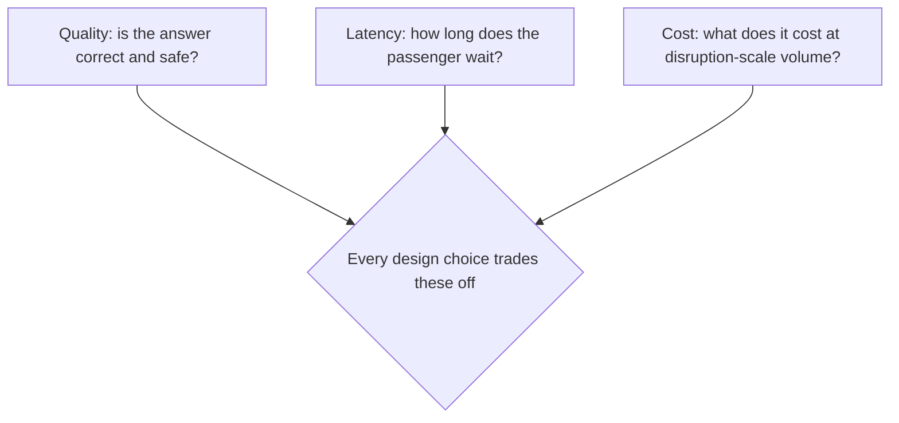
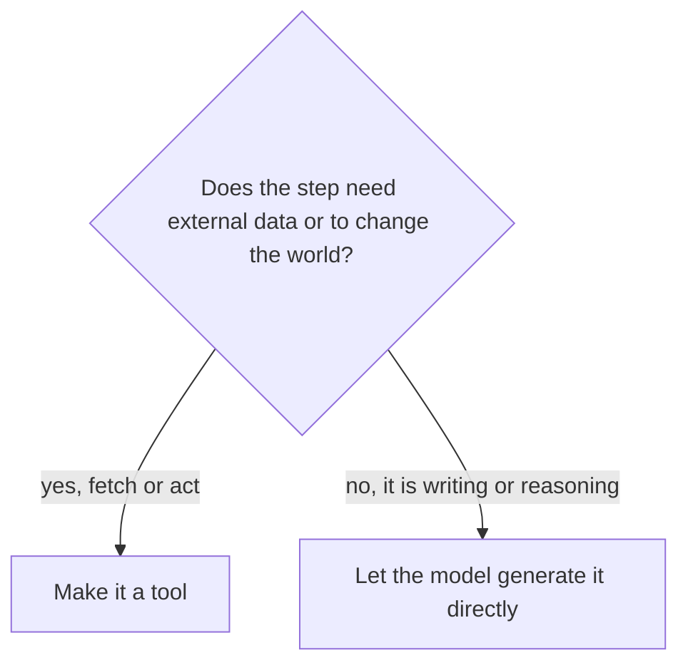
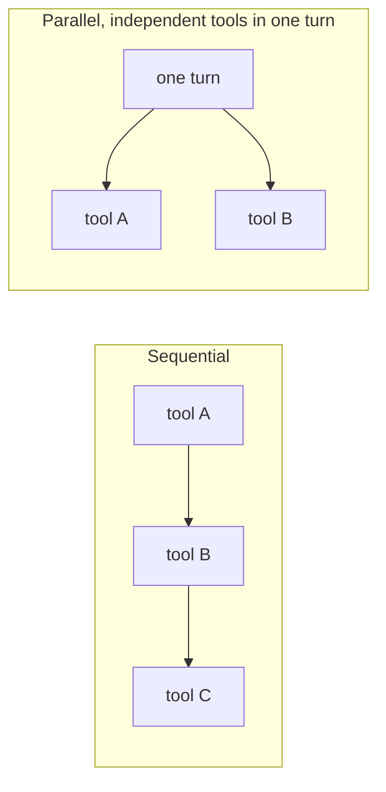

# TravelMind Disruption Desk: Build and Reason About an Agent

**The job:** a storm just cancelled flight TM482. Build an agent that helps a stranded passenger: pull their booking, find rebooking options, check the vouchers they are owed, and draft a notification. The agent **presents** options. It cannot rebook a seat or charge a card. That stays human-gated.

**What you practice:** designing an agent on paper, defending the design against the three lenses that decide every production AI system, then building it, running it, and measuring whether reality matches your prediction.



Working rule for this exercise: quality first (a wrong rebooking strands a person), latency second (they are waiting on a cancelled flight), cost third (but a mass disruption is high volume, so cost still bites). You will set your own weights in Part 2 and defend them.

### How this works

- Parts 1 to 5: predict, decide, fill tables, build, run, measure.
- You write down your predictions before you measure. The gap between your guess and the real number is where the learning lives.
- Stretch tasks at the end for when you finish early.

---

## Part 1: Predict before you build

An agent is not one model call. It is a loop. The model asks for a tool, you run it, you hand the result back, it asks for another, and so on until it is done. Each loop is a fresh `converse` call that **resends the entire conversation so far**.

```mermaid
flowchart LR
    U["Passenger message"] --> A1["converse call 1"]
    A1 -->|needs booking| T1["get_booking"]
    T1 --> A2["converse call 2 resends all"]
    A2 -->|needs flights| T2["find_rebooking_options"]
    T2 --> A3["converse call 3 resends all"]
    A3 -->|needs vouchers| T3["check_entitlements"]
    T3 --> A4["converse call 4 resends all"]
    A4 --> F["Final turn drafts the notification"]
```



See "resends all" on every step. That is the single most important agentic intuition. Before you write any code, predict what it does to your token bill.

**Fill Table 1A (your prediction).** No calculator pressure, just reason it out. Assume the system prompt plus tool schemas is about 700 input tokens, and each turn adds about 250 tokens of history (the prior tool call plus its result):

| Turn | What the model is doing | Input tokens (your guess) |
|---|---|---|
| 1 | reads request, asks for booking | |
| 2 | reads booking, asks for flights | |
| 3 | reads flights, asks for vouchers | |
| 4 | reads vouchers, drafts notification | |
| | **Total input across the agent** | |

A single non-agentic call would be about 700 input tokens, full stop.

**Q1.** Roughly how many times more input tokens does the 4-step agent burn versus one call? Your number: ______

**Q2.** If you could delete one tool round-trip, which would you cut, and why? ______

Keep these answers. You check them against real numbers in Part 5.

---

## Part 2: Design decisions

### Decision 1: pick the agent's model

Here is what you need to fill the matrix. You already know these three.

| Model | Input $/1M | Output $/1M | Speed class | Reasoning strength |
|---|---|---|---|---|
| Nova 2 Lite | 0.30 | 2.50 | fast | good (reasoning model) |
| Haiku 4.5 | 1.00 | 5.00 | fastest | strong (near Sonnet 4) |
| Sonnet 4.5 | 3.00 | 15.00 | slower | strongest |

**Step 1: set your weights.** They must sum to 100. Justify each in one line.

| Lens | Weight (sum to 100) | Why this weight for a mass disruption |
|---|---|---|
| Quality | | |
| Latency | | |
| Cost | | |

**Step 2: score each model 1 to 5 on each lens** (5 = best). One cell per row is filled to show the idea.

| Model | Quality | Latency | Cost | Weighted total |
|---|---|---|---|---|
| Nova 2 Lite | _ | _ | 5 | |
| Haiku 4.5 | _ | 5 | _ | |
| Sonnet 4.5 | 5 | _ | _ | |

Weighted total (use weights as fractions, so 50 becomes 0.5):

$$\text{score} = w_Q \cdot q + w_L \cdot l + w_C \cdot c$$

**Your pick: __________. One-line defense: __________**

> Trap to avoid: do not pick Sonnet "to be safe" without checking that the cheaper model fails the quality bar first. The right model is the one your weights justify, not the most powerful one on the menu.

### Decision 2: what is a tool, and what is not

Tools FETCH data or take ACTIONS in the world. Writing prose and reasoning over data you already have is generation, which the model does for free. Drawing this line wrong is the most common beginner mistake.



**Fill Table 2A.** For each step, decide tool or generation, and why.

| Step | Tool or generation? | Why |
|---|---|---|
| Look up the booking by PNR | | |
| Find rebooking flight options | | |
| Check voucher entitlements | | |
| Write the passenger notification | | |
| Decide which option to recommend | | |

**Granularity choice.** You could build one mega-tool `handle_disruption(pnr)` that does everything, or three small tools. Pick one and note the trade-off. There is no single correct answer here.

| Option | Pro | Con | Your pick? |
|---|---|---|---|
| One big tool | fewer round-trips, lower token cost | model has no visibility or control, brittle, hard to debug | |
| Three small tools | model orchestrates, transparent, testable | more round-trips, more tokens and latency | |

> The deeper point: small tools make the system more agentic, which costs more tokens and latency but gives the model control and you observability. A big tool is cheaper and faster because you moved the logic out of the agent. Sometimes that is exactly right.

### Decision 3: orchestration shape



In this flow, `find_rebooking_options` needs the route from `get_booking` first, so those are sequential. But `check_entitlements` only needs delay hours and fare class, which you may know early.

**Q3.** Which two steps could run in parallel if you restructure, and which lens does that improve (quality, latency, or cost)? __________

### Decision 4: guardrails and loop control

The agent presents options. It must never rebook a seat or charge a card.

**Q4.** How do you guarantee the agent cannot charge a card? (Hint from the refund lab.) __________

**Set two safety knobs and justify each:**

| Knob | Your value | Why |
|---|---|---|
| `MAX_TURNS` | | bounds runaway loops and cost |
| `temperature` | | deterministic for rules and rebooking; warmth only for the prose |

---

## Part 3: Build it (fill the blanks)

Copy this into a file called `disruption_desk.py`. Fill every `# TODO`. The blanks are exactly the decisions you just made.

```python
import json, time, boto3
from botocore.config import Config
from botocore.exceptions import ClientError

REGION = "us-east-1"

# TODO 1 (Decision 1): set MODEL_ID to the model you picked.
#   "us.amazon.nova-2-lite-v1:0"
#   "us.anthropic.claude-haiku-4-5-20251001-v1:0"
#   "us.anthropic.claude-sonnet-4-5-20250929-v1:0"
MODEL_ID = "____"

PRICE = {"us.amazon.nova-2-lite-v1:0": (0.30, 2.50),
         "us.anthropic.claude-haiku-4-5-20251001-v1:0": (1.00, 5.00),
         "us.anthropic.claude-sonnet-4-5-20250929-v1:0": (3.00, 15.00)}

bedrock = boto3.client("bedrock-runtime", region_name=REGION,
                       config=Config(retries={"max_attempts": 5, "mode": "adaptive"}))

# ---- Tools (dummy data; production would call real systems) ----
def get_booking(pnr):
    return {"pnr": pnr, "origin": "BLR", "destination": "SIN",
            "fare_class": "FLEX", "original_flight": "TM482", "status": "CANCELLED"}

def find_rebooking_options(origin, destination, earliest_dep):
    return {"options": [{"flight": "TM488", "dep": "later same day", "seats": 4},
                        {"flight": "TM902", "dep": "next morning", "seats": 12}]}

def check_entitlements(delay_hours, fare_class):
    return {"meal_voucher": delay_hours >= 2,
            "hotel_voucher": delay_hours >= 6,
            "fare_class": fare_class}

# TODO 2 (Decision 2): you decided some steps are NOT tools.
#   Do NOT add draft_notification or recommend_option as tools.
#   The final model turn generates those. Just confirm you understand why.

TOOL_FUNCTIONS = {"get_booking": get_booking,
                  "find_rebooking_options": find_rebooking_options,
                  "check_entitlements": check_entitlements}

TOOL_CONFIG = {
    "tools": [
        {"toolSpec": {
            "name": "get_booking",
            "description": "Look up a passenger booking by PNR.",
            "inputSchema": {"json": {
                "type": "object",
                "properties": {"pnr": {"type": "string"}},
                "required": ["pnr"]}}}},
        {"toolSpec": {
            "name": "find_rebooking_options",
            "description": "Find alternative flights for a cancelled segment.",
            "inputSchema": {"json": {
                "type": "object",
                "properties": {"origin": {"type": "string"},
                               "destination": {"type": "string"},
                               "earliest_dep": {"type": "string"}},
                "required": ["origin", "destination", "earliest_dep"]}}}},
        {"toolSpec": {
            "name": "check_entitlements",
            "description": "Decide meal and hotel voucher eligibility from delay and fare.",
            "inputSchema": {"json": {
                "type": "object",
                "properties": {
                    # TODO 3: add delay_hours (number) and fare_class (string)
                },
                "required": [ ]}}}},   # TODO 3: list the required fields
    ],
    # TODO 4 (Decision 4): choose toolChoice. "auto" lets the model decide.
    "toolChoice": {"____": {}},
}

# GUARDRAIL (Decision 4): there is no confirm_rebooking() and no charge_card() tool.
# The agent can present options but cannot act on money or seats. Keep it that way.

SYSTEM_PROMPT = (
    "You are TravelMind's disruption assistant. The passenger's flight was cancelled. "
    "Use the tools to look up their booking, find rebooking options, and check voucher "
    "entitlements. Then recommend the best option and draft a short, warm notification. "
    "You cannot rebook or charge anything; present options for the passenger to confirm."
)

# TODO 5 (Decision 4): set the loop bound and temperature you chose.
MAX_TURNS = ____
TEMPERATURE = ____

def run_agent(user_text):
    messages = [{"role": "user", "content": [{"text": user_text}]}]
    tin = tout = 0
    t_start = time.time()
    for turn in range(MAX_TURNS):
        resp = bedrock.converse(
            modelId=MODEL_ID, system=[{"text": SYSTEM_PROMPT}],
            messages=messages, toolConfig=TOOL_CONFIG,
            inferenceConfig={"maxTokens": 1024, "temperature": TEMPERATURE})
        tin += resp["usage"]["inputTokens"]
        tout += resp["usage"]["outputTokens"]
        print(f"  turn {turn+1}: input={resp['usage']['inputTokens']} "
              f"output={resp['usage']['outputTokens']} "
              f"latency={resp['metrics']['latencyMs']}ms stop={resp['stopReason']}")

        out_msg = resp["output"]["message"]
        messages.append(out_msg)

        # TODO 6 (stop condition): break when the model is done.
        #   It is done when stopReason is NOT "tool_use".
        if resp["stopReason"] ____ "tool_use":
            break

        results = []
        for block in out_msg["content"]:
            if "toolUse" in block:
                tu = block["toolUse"]
                output = TOOL_FUNCTIONS[tu["name"]](**tu["input"])
                # TODO 7 (round-trip): complete the toolResult.
                results.append({"toolResult": {
                    "toolUseId": ____,
                    "content": [{"json": ____}],
                    "status": "success"}})
        messages.append({"role": "user", "content": results})

    final = "".join(b.get("text", "") for b in messages[-1]["content"] if "text" in b)
    p_in, p_out = PRICE[MODEL_ID]
    cost = tin/1e6*p_in + tout/1e6*p_out
    elapsed = time.time() - t_start
    print("\n--- FINAL NOTIFICATION ---")
    print(final)
    print(f"\n[total input={tin} output={tout} cost=${cost:.6f} wallclock={elapsed:.1f}s]")
    return final

if __name__ == "__main__":
    run_agent("My flight TM482 from Bangalore to Singapore got cancelled. PNR JX48Q2. "
              "I've now been delayed about 7 hours. What are my options?")
```

**Stuck on a blank? Gentle nudges, not answers:**

- TODO 3: copy the shape of the other tools' `properties` and `required`. Two properties, both required.
- TODO 4: the value that means "the model decides whether to call a tool."
- TODO 6: the operator that means "not equal to."
- TODO 7: the model gave you a `toolUseId` on the `toolUse` block, and `output` is what your function returned.

---

## Part 4: Run it on VS Code

1. Make a folder (for example `disruption-desk`) and open it in VS Code with **File > Open Folder**.
2. Open a terminal with **Terminal > New Terminal**, then create and activate a virtual environment:
   - macOS or Linux: `python3 -m venv .venv` then `source .venv/bin/activate`
   - Windows: `python -m venv .venv` then `.venv\Scripts\activate`
3. Install the one dependency: `pip install boto3`
4. Give that terminal your AWS access (pick one):
   - Easiest: run `aws configure`, paste your Access Key and Secret Key, set region `us-east-1`, output `json`.
   - Or set env vars in the same terminal (they last only for that terminal session): `AWS_ACCESS_KEY_ID`, `AWS_SECRET_ACCESS_KEY`, `AWS_DEFAULT_REGION=us-east-1`.
5. Confirm Bedrock model access for your chosen model in `us-east-1`: Bedrock console > Model access. If it is off, the run will print an `AccessDenied` message.
6. Create `disruption_desk.py`, paste your filled skeleton, save.
7. Run it: `python disruption_desk.py`
8. Read the per-turn lines and the final summary. Copy those numbers into Part 5.

**Is it working?** You should see one line per turn with input and output tokens, then the final notification, then a summary with total cost and wallclock seconds.

| Symptom | Likely cause | Fix |
|---|---|---|
| `NoCredentialsError` | creds not set in this terminal | run `aws configure` here |
| `AccessDeniedException` | model not enabled | enable model access in Bedrock console (us-east-1) |
| `ValidationException` | a schema blank is malformed | recheck TODO 3 and TODO 7 |
| loop never stops or hits MAX_TURNS | TODO 6 operator wrong | it should be the "not equal" operator |

---

## Part 5: Measure and reflect

The run printed real numbers. Fill Table 5A with the ACTUAL per-turn input tokens, then compare to your Part 1 guess.

| Turn | Predicted input (Part 1) | Actual input | Gap |
|---|---|---|---|
| 1 | | | |
| 2 | | | |
| 3 | | | |
| 4 | | | |
| Total | | | |

```
Input tokens per turn (your run will look similar)
turn 1  █████        ~700
turn 2  ██████       ~950
turn 3  ████████     ~1200
turn 4  ██████████   ~1450
```

The bars grow because the conversation grows. That growth is the price of autonomy.

**Reflection:**

- Did input grow each turn the way you predicted? Where was your guess off, and why?
- What fraction of total cost came from the LAST turn versus the FIRST? The last turn carries the most history.
- The agent took a few seconds for about 4 model calls. If a real storm strands 500 passengers in 10 minutes, does this design hold? What do you change first: model, tool count, or parallelism?

---

## Part 6: Trade-off experiments (light)

Run each, record one number, write one sentence.

| Experiment | Total cost | Wallclock | What moved |
|---|---|---|---|
| Baseline | | | |
| Model swap (change MODEL_ID one tier) | | | |
| Cut a round-trip (pass delay hours in the first prompt) | | | |

**Q5.** After the model swap, which lens improved and which got worse? __________

**Q6.** After cutting a round-trip, did total input drop, and roughly by how much? __________

---

## Stretch tasks (for the proficient)

Pick any. This is where the production skill lives.

1. **Cascade.** Run on the cheap model. Add a `confidence` field to the final output via forced structured output. If confidence is low, rerun that one case on Sonnet. Measure escalation rate and blended cost. Goal: Sonnet-grade quality at near-cheap cost.

2. **Prompt caching.** The system prompt and tool schemas repeat every turn. Enable prompt caching on that prefix and measure the input-token drop across the 4 turns. Predict the savings first:
$$P_{in}^{\text{eff}} = (1-h)P_{in} + h \cdot 0.1 P_{in}$$

3. **Parallelize.** Restructure so `check_entitlements` and `find_rebooking_options` are requested in the same turn once the booking is known. Measure the latency cut.

4. **Two-temperature design.** Keep the tool and decision turns at temperature 0, then make a separate final call at a higher temperature for the notification prose only. Compare the warmth of the message.

5. **Guarded output.** Force the final options into a fixed schema (flight, voucher, action_required) so a downstream UI can render it without parsing prose.

6. **Eval harness.** Write 5 scenarios (cancelled vs delayed, FLEX vs SAVER, short vs long delay). Run all on two models. The voucher decision is rule-based, so you can score correctness automatically. Which model passes, and at what cost?

7. **Failure injection.** Make `get_booking` return an error for an unknown PNR. Confirm the agent asks the passenger to recheck the code instead of hallucinating a booking.

8. **The most important question on this page: should this even be an agent?** Rebuild the whole thing as a SINGLE structured call: one model call, all the dummy data passed in the prompt, forced structured output. Compare cost, latency, and quality to the agent. When is the non-agentic version the right answer?

---

The instinct to make everything agentic is the expensive instinct. Every tool round-trip is a network hop, a fresh bill, and a new failure point. The senior move is to use the fewest steps that still hit your quality bar, and to know when one well-structured call beats a loop. Build the agent here to feel the cost of autonomy in real numbers. Then spend it on purpose.
