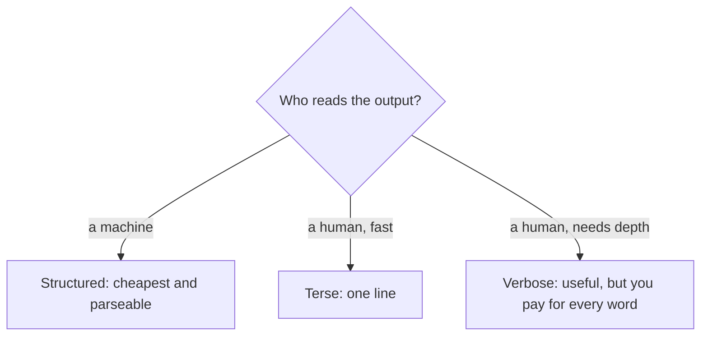

# The Verbosity Tax

**Claim:** two identical questions, same model, can cost 7x different. The gap is not intelligence. It is how much the model talked.

You have built agents, costed them, cached them, and cascaded them. This 20 minute experiment isolates the one cost lever you control on every single call, and it is not the one most people reach for.

**Time budget:** predict 2 min, run 8 min, read the reveal 5 min, take the intuition 5 min.

---

## Why this matters before you run anything

On Claude, output tokens cost **5x** input tokens. On Nova 2 Lite, closer to **8x**. The model spends far more compute generating words than reading them.

```
Haiku 4.5 price per 1M tokens
input   █                $1
output  █████            $5     (5x)
```

So the size of the answer, not the size of the question, usually decides the bill. Hold that thought, then test it.

---

## Step 1: Predict

Same model, same facts, asked three ways:
- **verbose**: explain everything
- **terse**: one sentence
- **structured**: force a schema, return only the fields

Before you run it, write one number. How many times more will the verbose call cost than the structured one?

> My guess: verbose is ______ x the cost of structured.

Most people guess 2x. Hold yourself to a number.

---

## Step 2: Run it

Save as `verbosity_tax.py`, set `aws configure` with region `us-east-1`, then `python verbosity_tax.py`.

```python
import boto3, json
from botocore.config import Config

REGION = "us-east-1"
MODEL_ID = "us.anthropic.claude-haiku-4-5-20251001-v1:0"
P_IN, P_OUT = 1.00, 5.00   # Haiku 4.5, USD per 1M tokens. Output is 5x input.

bedrock = boto3.client("bedrock-runtime", region_name=REGION,
                       config=Config(retries={"max_attempts": 5, "mode": "adaptive"}))

FACTS = ("Flight TM482 BLR to SIN cancelled, FLEX fare, delayed 7 hours, PNR JX48Q2. "
         "Rebooking options: TM488 later today, TM902 tomorrow morning, both with seats. "
         "What should the passenger do, and what vouchers are they owed?")

def cost(tin, tout):
    return tin / 1e6 * P_IN + tout / 1e6 * P_OUT

def run(label, system, max_tokens, tool=None):
    kw = dict(modelId=MODEL_ID, messages=[{"role": "user", "content": [{"text": FACTS}]}],
              system=[{"text": system}],
              inferenceConfig={"maxTokens": max_tokens, "temperature": 0.0})
    if tool:
        kw["toolConfig"] = {"tools": [tool],
                            "toolChoice": {"tool": {"name": tool["toolSpec"]["name"]}}}
    r = bedrock.converse(**kw)
    u = r["usage"]
    print(f"{label:11s} input={u['inputTokens']:4d}  output={u['outputTokens']:4d}  "
          f"cost=${cost(u['inputTokens'], u['outputTokens']):.6f}")
    return r

# A. Verbose: let it talk.
run("verbose", "Explain thoroughly and empathetically, covering every consideration.", 800)

# B. Terse: one line.
run("terse", "Answer in ONE short sentence. No preamble, no lists.", 100)

# C. Structured: force a schema, get only the fields back.
RESOLVE = {"toolSpec": {"name": "resolve", "description": "Return the resolution.",
    "inputSchema": {"json": {"type": "object", "properties": {
        "recommended_flight": {"type": "string"},
        "meal_voucher": {"type": "boolean"},
        "hotel_voucher": {"type": "boolean"},
        "action_required": {"type": "string"}},
        "required": ["recommended_flight", "meal_voucher", "hotel_voucher", "action_required"]}}}}
r = run("structured", "Resolve using the tool.", 200, tool=RESOLVE)
decision = next((b["toolUse"]["input"] for b in r["output"]["message"]["content"] if "toolUse" in b), None)
print("structured output ->", json.dumps(decision))
```

---

## Step 3: The reveal

Your exact numbers will vary, but the shape holds. A representative run:

| Variant | input | output | cost |
|---|---|---|---|
| verbose | ~90 | ~450 | ~$0.00234 |
| terse | ~90 | ~35 | ~$0.00027 |
| structured | ~90 | ~45 | ~$0.00032 |

```
Cost per call

verbose     ████████████████████████████████████  $0.00234
structured  █████                                  $0.00032
terse       ████                                   $0.00027
```

Verbose is about **7x** the cost of structured. Did your guess hold?

Now the part that makes it click. Input was **identical** across all three. So every cent of the difference came from output. Break down the verbose bill alone:

```
Where the verbose dollar goes
input   ██                4 percent
output  ██████████████   96 percent
```

The question cost nothing to change. The answer cost everything.

And the kicker: the **cheapest** option, structured, is also the **most useful**. A downstream system can read `{"meal_voucher": true}` directly. The verbose paragraph is the most expensive output and the hardest to parse. You paid more for something a machine likes less.

---

## Step 4: The intuition

Three things to carry out of this:

- **Output is the bill.** It costs 5x to 8x input. The length of the answer is your biggest per-call lever, and it is free to pull. Cap `maxTokens`, ask for brevity, and the savings are real with zero quality loss on a fixed-format task.
- **Match output length to the reader.**



- **Verbosity is a tax you pay twice.** Once on the bill, once on the parser. For anything a system consumes, structured output is the cheat code: lowest cost, highest usefulness.

At 2000 calls a day, the verbose version runs about $140 a month and the structured one about $19. Same model, same answer quality on the decision that matters, $120 saved a month for choosing the right output shape.

---

## Step 5: The twist

Extended thinking tokens bill as **output**. So a reasoning model that thinks hard before answering is paying the verbosity tax internally, on words you never read.

That reframes when to turn thinking on. For a rule lookup like the voucher decision, the rule is fixed, so thinking buys nothing and just inflates the output you pay for. For a genuinely hard, multi-constraint plan, the thinking might change the answer enough to be worth it.

**The rule:** thinking is output you pay for whether or not you read it. Spend it only where it changes the answer, not by default.

---

One line to remember: on every call, you are billed mostly for talk, so make the model say exactly what the reader needs and not one token more.
