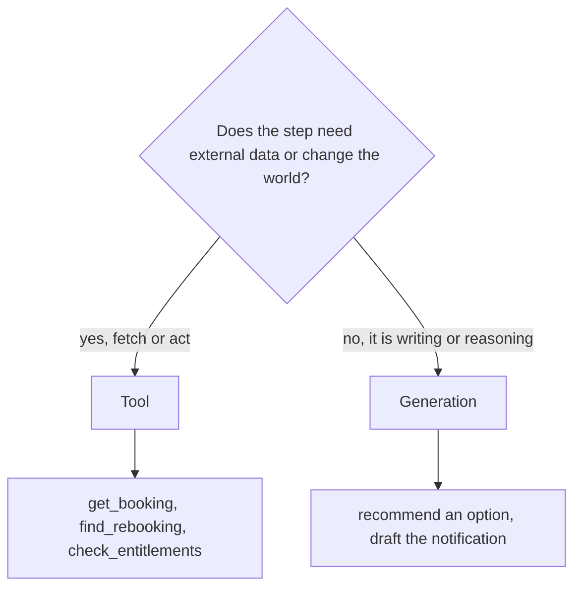
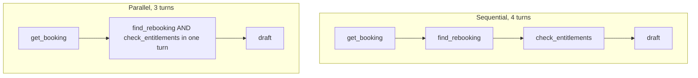
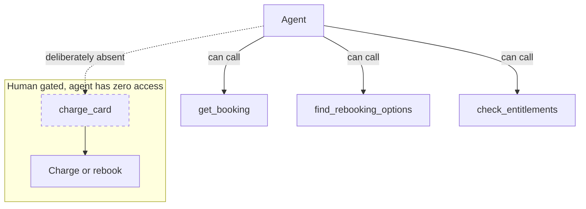
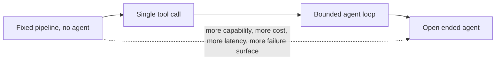
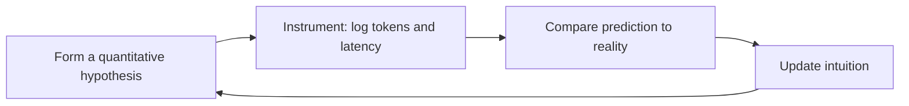
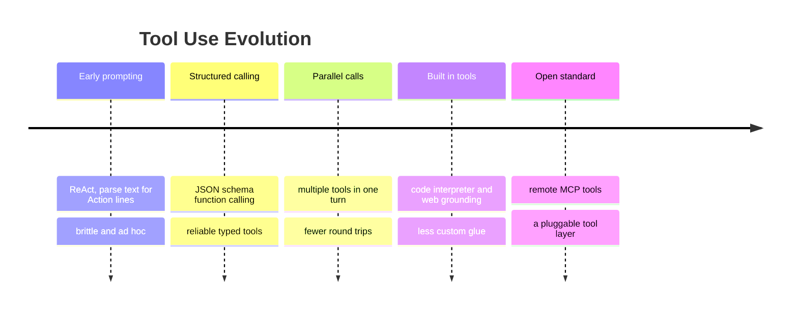

# Answer Key: Disruption Desk (Instructor)

Companion to `disruption_desk_exercise.md`. Every blank filled with the reasoning, plus the agentic frameworks, context, and evolution to teach it with authority and field hard questions.

> What you are really assessing is not "did they pick the right model." It is "can they defend a choice against the three lenses, and can they predict the cost of autonomy before they measure it." The numbers below are disposable. The intuitions are the asset.

---

## How to grade

| Signal of mastery                                                  | Signal of trouble                                             |
| ------------------------------------------------------------------ | ------------------------------------------------------------- |
| Predicted that input tokens grow per turn, before measuring        | Predicted flat tokens across turns                            |
| Picked a model their weights justify, and can defend the weights   | Picked Sonnet "to be safe" with no test                       |
| Made the notification and the recommendation generation, not tools | Wrapped writing or reasoning in a tool                        |
| Enforced the no-charge rule by omitting the tool                   | Wrote "do not charge" in the prompt and called it a guardrail |
| Can say when this should not be an agent at all                    | Thinks more agentic is always better                          |

---

## Part 1: filled (the agentic cost model)

The exercise hides a formula. An N-turn agent resends a growing history, so total input tokens are:

$$
T_{in}^{\text{total}} = \sum_{k=1}^{N} \big( B + (k-1)\,\Delta \big) = N\,B + \Delta \cdot \frac{N(N-1)}{2}
$$

where `B` is the base (system prompt, tool schemas, first user message) and `Δ` is the history each turn adds. The `N(N-1)/2` term is the killer: history cost grows with the **square** of the turn count. Double the turns, roughly quadruple the resend cost.

With `B = 700`, `Δ = 250`:

**Table 1A (filled):**

| Turn | What the model is doing             | Input tokens |
| ---- | ----------------------------------- | ------------ |
| 1    | reads request, asks for booking     | 700          |
| 2    | reads booking, asks for flights     | 950          |
| 3    | reads flights, asks for vouchers    | 1200         |
| 4    | reads vouchers, drafts notification | 1450         |
|      | **Total input across the agent**    | **4300**     |

**Q1.** `4300 / 700 ≈ 6.1`, so about **6x** the input of a single call. A correct guess in the 5x to 7x range shows they understood the resend.

**Q2.** Cut the **`check_entitlements`** turn. It depends only on data known right after the booking (fare class plus the stated delay), not on the rebooking results, so it can run in parallel with `find_rebooking_options` instead of as its own sequential turn. Removing a later turn saves more than an early one, because later turns carry the most history.

```
Total input vs number of agent turns (B=700, delta=250)

1 turn   ████                                       700
2 turns  ████████                                  1650
3 turns  ██████████████                            2850
4 turns  ██████████████████████                    4300
5 turns  ██████████████████████████████            6000
6 turns  ████████████████████████████████████████  7950
```

The curve bends upward. That bend is why "just add another tool step" is never free.

---

## Part 2: filled decisions

### Decision 1: the model matrix

Defensible weights for a **mass disruption** (your students may differ, as long as they defend it):

| Lens    | Weight | Why                                                                                                           |
| ------- | ------ | ------------------------------------------------------------------------------------------------------------- |
| Quality | 45     | a wrong rebooking strands a person, but the rules live in tools, so raw model quality matters less than usual |
| Latency | 30     | the agent is already multi-turn and the passenger is waiting, so latency stacks                               |
| Cost    | 25     | a storm is a high-volume burst                                                                                |

Scores (1 to 5, 5 best):

| Model       | Quality | Latency | Cost | Weighted total |
| ----------- | ------- | ------- | ---- | -------------- |
| Nova 2 Lite | 4       | 5       | 5    | **4.55**       |
| Haiku 4.5   | 5       | 5       | 4    | **4.75**       |
| Sonnet 4.5  | 5       | 3       | 2    | **3.65**       |

Arithmetic, using weights as fractions:

- Nova: `0.45(4) + 0.30(5) + 0.25(5) = 1.80 + 1.50 + 1.25 = 4.55`
- Haiku: `0.45(5) + 0.30(5) + 0.25(4) = 2.25 + 1.50 + 1.00 = 4.75`
- Sonnet: `0.45(5) + 0.30(3) + 0.25(2) = 2.25 + 0.90 + 0.50 = 3.65`

```
Weighted score (max 5.0)

Haiku 4.5   ████████████████████████████  4.75   <- winner
Nova 2 Lite ███████████████████████████   4.55   <- budget pick, very close
Sonnet 4.5  ██████████████████████        3.65
```

**Pick: Haiku 4.5.** Defense: the rebooking and voucher rules live in tools, so the model only orchestrates and writes. That neutralizes Sonnet's one real advantage (deep reasoning) while its slower latency and 3x cost still count against it in a multi-turn, high-volume flow. Nova 2 Lite is a hair behind and is the right call if cost weight goes up.

**The lesson to land:** the strongest model lost. Not because it is weak, but because the task design moved the hard logic into tools, so paying for frontier reasoning buys nothing here. This is the model-selection lab's thesis, proven again.

> Sensitivity: weight cost to 40+ and Nova wins. Hand the agent a VIP or an edge-case-heavy flow where the model must reason without tool support, and Sonnet's quality margin can justify it. The weights are the argument.

### Decision 2: tool or generation

**Table 2A (filled):**

| Step                             | Tool or generation? | Why                                                                                           |
| -------------------------------- | ------------------- | --------------------------------------------------------------------------------------------- |
| Look up the booking by PNR       | **Tool**            | needs external data from the booking system                                                   |
| Find rebooking flight options    | **Tool**            | needs external data on flight availability                                                    |
| Check voucher entitlements       | **Tool**            | the rules are authoritative policy and may change, so they live in code, not the model's head |
| Write the passenger notification | **Generation**      | this is writing prose, which the model does for free                                          |
| Decide which option to recommend | **Generation**      | this is reasoning over data already fetched, no new external call                             |

The two trap rows are the notification and the recommendation. Both **use** fetched data, but neither is a tool. A student who builds a `recommend_option` tool has misread the line.



The subtle one is `check_entitlements`. The logic (delay at least 2 hours means a meal voucher) is trivial. Why a tool? Because the rule is policy that carries money and legal weight and can change, so it belongs in code where it is authoritative and testable. **Even simple rules become tools when correctness matters.** This is the deterministic-high-stakes-goes-to-code principle from the lab.

**Granularity (filled):** three small tools here. The steps have different inputs, you want the model to orchestrate, and you want the entitlement rule independently verifiable. The mega-tool would only win if the flow were fixed and latency or cost dominated, and at that point you may not need an agent at all (stretch task 8).

### Decision 3: orchestration

**Q3 (filled).** `find_rebooking_options` and `check_entitlements` can run in **parallel**. Both need only data known right after `get_booking`: the route for rebooking, the fare class and delay for entitlements. They do not depend on each other. Emitting both tool calls in one turn collapses two sequential turns into one. It improves **latency** (one fewer round-trip) and **cost** (one fewer full-history resend). Quality is unchanged.



### Decision 4: guardrails and loop control

**Q4 (filled).** Do not give the agent a `charge_card` or `confirm_rebooking` tool. The model can only call tools that exist, so the **absence of the tool is the guarantee**. A prompt that says "do not charge" is bypassable by a determined user. A missing tool is not. The real action stays in a separate human-gated or secure backend step.



**Safety knobs (filled):**

| Knob          | Value  | Why                                                                                                                                                                                                    |
| ------------- | ------ | ------------------------------------------------------------------------------------------------------------------------------------------------------------------------------------------------------ |
| `MAX_TURNS`   | 5 or 6 | the flow needs at most 4 turns (3 if parallelized), so a small buffer catches a legit long flow without letting a runaway loop bill you                                                                |
| `temperature` | 0      | tool selection, rebooking, and voucher rules must be deterministic and reproducible; the prose loses almost nothing at 0, and the clean fix for warmth is the two-temperature design in stretch task 4 |

---

## Part 3: completed code

The seven blanks, filled.

```python
# TODO 1: the matrix winner
MODEL_ID = "us.anthropic.claude-haiku-4-5-20251001-v1:0"

# TODO 2: nothing to write. The notification and the recommendation are GENERATION.
#   The final model turn produces them. They are not tools.

# TODO 3: complete the check_entitlements schema
"inputSchema": {"json": {
    "type": "object",
    "properties": {
        "delay_hours": {"type": "number"},
        "fare_class": {"type": "string"}
    },
    "required": ["delay_hours", "fare_class"]}}

# TODO 4: let the model decide whether to call a tool
"toolChoice": {"auto": {}}

# TODO 5: expected turns plus a small buffer, deterministic for rules
MAX_TURNS = 6
TEMPERATURE = 0.0

# TODO 6: stop when the model is no longer asking for a tool
if resp["stopReason"] != "tool_use":
    break

# TODO 7: the round-trip. The model handed you the toolUseId; output is what your function returned.
results.append({"toolResult": {
    "toolUseId": tu["toolUseId"],
    "content": [{"json": output}],
    "status": "success"}})
```

A correct fill runs top to bottom and produces a denial-or-options notification plus a per-turn token and latency printout.

---

## Part 4: run notes

What to watch for as students run it:

- They should see one line per turn. If they see only one line and a final, the model answered without tools, which usually means the schema or system prompt is off.
- `ValidationException` almost always traces to TODO 3 (a malformed schema) or TODO 7 (a malformed `toolResult`).
- A loop that hits `MAX_TURNS` and stops means TODO 6 has the wrong operator. It should be "not equal."
- `AccessDeniedException` is model access, not code. Bedrock console, model access, `us-east-1`.

---

## Part 5: reflection answers

- **Why input grows:** each turn appends the previous `toolUse` and its `toolResult` to the history, and the next call resends all of it. Growth is roughly `+Δ` per turn, the quadratic from Part 1.
- **Cost fraction, first versus last turn:** with 700 and 1450 out of 4300 total, the last turn is about **34%** of input cost and the first is about **16%**. The last turn costs roughly twice the first, purely because it carries more history.

```
Share of total input cost (4-turn agent)

turn 1  ██████          16 percent
turn 2  █████████       22 percent
turn 3  ███████████     28 percent
turn 4  ██████████████  34 percent
```

- **500 passengers in 10 minutes:** per-passenger wallclock is fixed by the round-trips (about 4 sequential model calls). The first lever is **concurrency**, process passengers in parallel with async or a thread pool, because per-passenger latency will not shrink by much. The second lever is **fewer turns** via the parallel-tool restructure (4 turns to 3). The third is **batching the proactive notifications** that are not interactive. Swapping the model helps latency only at the margin, since Haiku is already fast. Order of changes: concurrency, then parallel tools, then batching, then model. A student who reaches for a bigger or smaller model first has missed that the bottleneck is round-trips, not the model.

---

## Part 6: experiment answers

**Q5.** Direction matters, so accept either, stated clearly:

- Haiku to Sonnet: quality marginally up (unneeded here), latency worse, cost roughly 3x worse.
- Haiku to Nova: cost down, quality marginally down, latency similar.

**Q6.** Cutting a round-trip (passing delay hours up front so entitlements fold or parallelize) drops total input by roughly one turn's worth, about **1200 to 1450 tokens**, near a **30%** cut on a 4-turn flow. The savings come disproportionately from removing a **late** turn.

---

## Stretch task solution sketches

| #   | Task              | Solution shape                                                                                                                                                                                     |
| --- | ----------------- | -------------------------------------------------------------------------------------------------------------------------------------------------------------------------------------------------- |
| 1   | Cascade           | Run Nova, force a`confidence` field via `toolChoice` tool. If low, rerun that case on Sonnet. Blended cost `= C_nova + p_esc * C_sonnet`. Beats always-Sonnet while `p_esc < 1 - C_nova/C_sonnet`. |
| 2   | Prompt caching    | Cache the system prompt plus tool schemas prefix. Cache reads bill at 0.1x, so the per-turn resend of that prefix nearly stops costing money. Predict with`P_in_eff = (1-h)P_in + h(0.1)P_in`.     |
| 3   | Parallelize       | Emit`find_rebooking_options` and `check_entitlements` in one turn after booking. 4 turns to 3, one fewer round-trip of latency and history.                                                        |
| 4   | Two-temperature   | Keep tool and decision turns at temperature 0. Make a separate final generation call at about 0.5 for the notification prose only.                                                                 |
| 5   | Guarded output    | Force the final into a fixed schema such as`{recommended_flight, vouchers, action_required}` so a UI renders it without parsing prose.                                                             |
| 6   | Eval harness      | Five scenarios (cancelled vs delayed, FLEX vs SAVER, short vs long delay). The voucher decision is rule-based, so score correctness automatically. Compare models and cost.                        |
| 7   | Failure injection | `get_booking` returns an error for an unknown PNR. A passing agent asks the passenger to recheck the code. A failing one invents a booking.                                                        |
| 8   | Not an agent      | Rebuild as one structured call with all data in the prompt and forced structured output. Compare cost, latency, quality. The single call wins when the flow is fixed and latency or cost dominate. |

---

## Background and frameworks

### The autonomy dial

Agency is a dial, not a switch. Match it to how much the task varies.



- **Fixed pipeline:** the steps never change. Just write the code. No LLM orchestration needed beyond per-step calls.
- **Single tool call:** one fetch, one answer.
- **Bounded agent loop:** the model picks tools dynamically but inside a `MAX_TURNS` fence. This exercise lives here.
- **Open-ended agent:** the model decides its own stopping. Powerful and the most expensive and least predictable.

The field calls the left side **workflows** (predefined code paths) and the right side **agents** (the model directs its own process). Use the simplest one that solves the task. Add agency only when the path genuinely varies per request.

### Guardrails as capability boundaries

Defense in depth, strongest first:

1. **Tool surface:** the agent can only do what its tools allow. Omit dangerous tools.
2. **Bedrock Guardrails:** screen inputs and outputs for PII, topics, and policy via `guardrailConfig`.
3. **Human in the loop:** irreversible actions (charge, rebook, delete) require a human or a secure non-LLM step.

The prompt is the weakest of the four and never the boundary on its own.

### Latency budgeting

Agent wallclock is the sum over turns of network round-trip plus model latency. Your levers, in order of impact:

- **Fewer turns** (parallelize independent tools).
- **Concurrency** across requests (process many passengers at once).
- **Streaming** for perceived latency on the final message.
- **Faster model** at the margin.

### The predict-then-measure loop

The exercise itself teaches a method, not just a topic.



An engineer who guesses, measures, and corrects builds calibrated intuition fast. One who never predicts learns nothing from the same run.

---

## Evolution and the forward view



Where this is heading, and what it means for the cost of autonomy:

- **MCP is standardizing the tool layer.** Nova 2 supports remote MCP tools, and Claude supports MCP. Tools are becoming pluggable infrastructure rather than bespoke per-app schemas. Your `toolSpec` skills transfer directly.
- **Reasoning models change the turn math.** Extended thinking (Nova 2 low, medium, high, and Claude thinking) lets a model plan more per turn, which can cut external round-trips. The trade is that thinking tokens bill as output, so you move cost from "more turns" to "longer turns." Sometimes that is cheaper, sometimes not. Measure it.
- **Prompt caching is the direct antidote** to the quadratic resend cost that makes agents expensive. Caching the system prompt and tool schemas turns the per-turn history resend from full price into cache reads at one-tenth. It is the single most important cost lever for agentic loops, and it is built for exactly this.
- **The trajectory:** caching by default, parallel sub-agents under an orchestrator, and agents that prune their own context will keep shrinking the cost of autonomy. The discipline does not change. Use the fewest steps that hit your quality bar, and gate every irreversible action.

---

## Common student mistakes

1. Making the notification or the recommendation a tool.
2. Picking Sonnet "to be safe" when the tools already carry the rules.
3. Predicting flat token usage across turns, missing the resend.
4. Setting `MAX_TURNS` with no guard, or so low it cuts the flow.
5. Guarding "do not charge" in the prompt instead of omitting the tool.
6. Running everything sequentially when two tools could parallelize.
7. Building an agent when one structured call would do the job cheaper.
8. One temperature for both the rules and the prose.
9. Not instrumenting, so they cannot reason about cost at all.

---

## Instructor talking points

- "Your agent works perfectly and costs 6x a single call. Is it 6x more useful? When is that trade worth paying?"
- "The strongest model lost the matrix. What did the task design do to its only advantage?"
- "A storm strands 2,000 people at once. Walk me through what breaks, and what you change, in order."
- "Show me the line of code that stops the agent from charging a card. There is not one. That is the point. Where does the boundary actually live?"
- "When would you tear this whole agent down and replace it with one function call?"

---

## Deliverable checklist (instructor copy)

- [ ] Part 1 prediction made before the run, growth direction correct
- [ ] Model matrix weights set and defended, pick follows the math
- [ ] Tool versus generation table correct, both trap rows caught
- [ ] Guardrail enforced by tool omission, not prompt text
- [ ] `MAX_TURNS` and temperature set with a reason
- [ ] All seven code blanks filled, the agent runs end to end
- [ ] Part 5 numbers recorded and compared to the Part 1 prediction
- [ ] At least one trade-off experiment run with a one-line takeaway
- [ ] Bonus: a stretch task attempted, especially task 8

