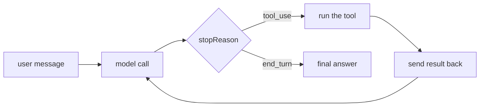
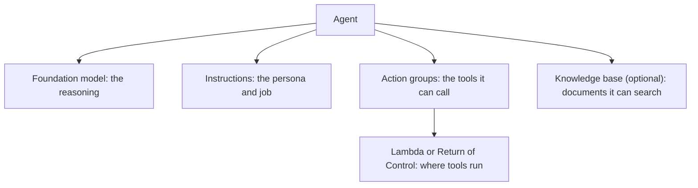
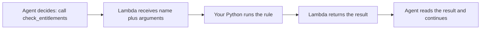
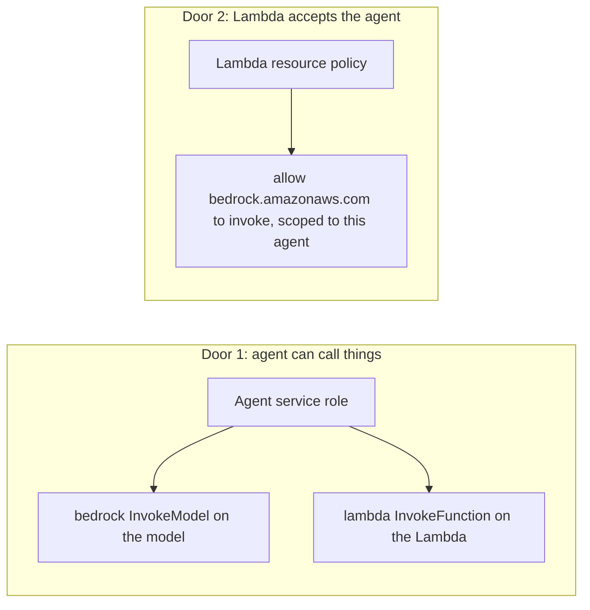
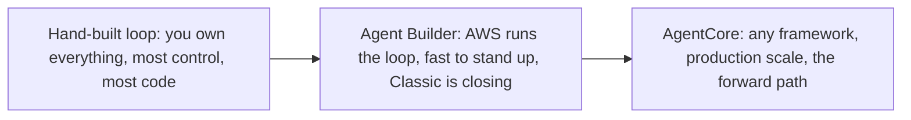

# TravelMind on Autopilot: Building the Same Agent with AWS Agent Builder

Deck content. Each `##` is a slide title. Build order is a narrative: you already wrote the agent loop by hand, so now you will hand that loop to AWS, click it together, call it from code, and finally build the whole thing from code.

---

## The Loop You Wrote by Hand

You spent days writing `run_agent`. Recall what it actually did on every turn:

- call the model
- read `stopReason`, and if it was `tool_use`, pull the tool name and arguments
- run the tool in your `dispatch` function
- feed the result back as a `toolResult`
- repeat until the model stopped asking



That while-loop is the whole job of an agent runtime. Today you give it away.

---

## Agent Builder Is That Loop, Managed

AWS Agent Builder is the console where you describe an agent and AWS runs the orchestration loop for you. You bring three things: a model, instructions, and tools. AWS brings the loop, the retries, the tracing, and the plumbing.

- You stop maintaining `run_agent`.
- You describe tools once and AWS decides when to call them.
- Same fundamentals you already know, now someone else runs the plumbing.

The mental model for the whole session: **you are not learning a new kind of agent. You are learning who runs the loop.**

---

## One Honest Warning Before We Build

Straight talk, because it changes your production choice.

- The service behind Agent Builder is **Amazon Bedrock Agents**, now branded **Bedrock Agents Classic**.
- It closes to **new customers on July 30, 2026**. Existing accounts keep working.
- The successor is **Amazon Bedrock AgentCore**, which runs agents built in any framework, including the Strands agents you already wrote.

So why learn it today? Because the concepts are the concepts. Action groups, tool schemas, aliases, and permissions transfer straight to AgentCore and to every managed agent platform. Learn the shape here, carry it everywhere.

---

## The Mapping: Your Code Becomes Their Console

Everything you hand-wrote has a home in Agent Builder. This table is the intuition for the entire deck.

| Your hand-built agent | Agent Builder equivalent |
|---|---|
| `MODEL_ID` | the agent's foundation model |
| your `system` prompt | the agent Instructions |
| `TOOL_CONFIG` toolSpec (name, schema) | an action group function definition |
| your `dispatch` plus tool functions | a Lambda function |
| the `run_agent` while-loop | the managed orchestration, invisible to you |
| `temperature`, guardrails, memory | agent settings and toggles |

Nothing new to learn. The pieces just move from your file to a console form.

---

## The Four Pieces of a Bedrock Agent



For TravelMind we need the first three. Model plus instructions plus one action group with a `check_entitlements` tool. Knowledge bases, guardrails, and memory are toggles you add later.

---

## Where Lambda Comes In, and Why

The agent reasons. It never runs your code. When it decides to call `check_entitlements(delay_hours=7, fare_class="FLEX")`, something has to actually execute that. That something is a **Lambda function**.



Split it clearly: the **model chooses** the tool and the arguments, the **Lambda executes** the tool. The Lambda is your old `dispatch` plus tool functions, now living in AWS as serverless code. A Lambda is just code that runs on demand with no server to manage.

---

## The Lambda Contract: Get This Wrong and Nothing Works

Bedrock sends your Lambda a fixed event and expects a fixed response. This is where most first agents break.

**What Bedrock sends (function schema style):**

```
{ "actionGroup": "...", "function": "check_entitlements",
  "parameters": [ {"name": "delay_hours", "type": "number", "value": "7"}, ... ] }
```

**What your Lambda must return, exactly:**

```
{ "messageVersion": "1.0",
  "response": { "actionGroup": "...", "function": "check_entitlements",
    "functionResponse": { "responseBody": { "TEXT": { "body": "JSON string here" } } } } }
```

Three rules that cause the dreaded "server encountered an error processing the Lambda response":

- `body` must be a **string**, so `json.dumps(your_dict)`, never a raw dict.
- Content type is `TEXT` for function schema tools. Match it.
- Echo back the same `actionGroup` and `function` from the event.

Also: every incoming parameter arrives as a **string**, even numbers. Cast `delay_hours` to a number yourself.

---

## Return of Control: When You Do Not Want a Lambda

You can skip Lambda entirely and let the agent hand the tool call back to your own application. This is called Return of Control.

Reach for it when:

- your existing app can already call the API, so a new Lambda is just overhead
- the task runs longer than the **15 minute** Lambda ceiling
- the action is async or long-running and you do not want the agent waiting
- the tool lives inside a private network your Lambda would need extra wiring to reach

Same agent, same action group, but your code receives the function and arguments and returns the answer. Lambda for self-contained tools, Return of Control for everything already living in your app.

---

## Permissions: A Two-Way Door People Forget

Two separate permissions, in two directions. Miss either and the agent fails with a confusing error.



- **Door 1**, the agent's service role, lets the agent invoke the model and invoke the Lambda.
- **Door 2**, the Lambda's resource policy, lets Bedrock knock on the Lambda's door.

The console wires both for you when you create the Lambda from the agent screen. Attach an existing Lambda and you own Door 2 yourself. People forget Door 2 constantly.

---

## Build It by Clicking: The Console Walkthrough

Exact steps, from scratch.

1. Bedrock console, left nav, **Builder tools**, then **Agents**, then **Create agent**.
2. Name it `travelmind-desk`, choose **Create**. The Agent builder opens.
3. Agent resource role: **Create and use a new service role**.
4. Select model: your Haiku 4.5 inference profile.
5. Instructions: paste the TravelMind policy, the same one from your notebook.
6. Choose **Save**, then the **Action groups** tab, then **Add**.
7. Name the action group `travelmind-actions`, type **Define with function details**.
8. Action group invocation: **Quick create a new Lambda function** so the console wires both permission doors.
9. Add a function: name `check_entitlements`, with parameters `delay_hours` (number, required) and `fare_class` (string, required).
10. Save. Open the created Lambda, paste your handler, deploy it.
11. Back on the agent, **Save**, then **Prepare**. Prepare compiles your draft. You must do this after every change.
12. Test in the built-in window. Ask about a seven hour delay.

If the test window says the Lambda response failed, you broke the contract. Go back three slides.

---

## Test, Version, Alias, Ship

The test window runs a hidden draft alias called `TSTALIASID`. For anything real, you deploy properly.

- **Prepare** turns your latest edits into a testable draft.
- A **version** is a frozen snapshot of the agent.
- An **alias** is a named pointer to a version, like `live`, that your app calls.

You never point production code at the draft. You point it at an alias, then move the alias to new versions as you iterate. Same idea as a git tag that your deploy tracks.

---

## Talk to It from Code: invoke_agent

Once an alias exists, your application calls the agent with a few lines.

```python
rt = boto3.client("bedrock-agent-runtime", region_name="us-east-1")
resp = rt.invoke_agent(agentId=AGENT_ID, agentAliasId=ALIAS_ID,
                       sessionId="user-123", inputText="Delay is 7 hours on a FLEX fare. What am I owed?")
answer = "".join(e["chunk"]["bytes"].decode() for e in resp["completion"] if "chunk" in e)
```

Two things to know:

- The reply comes back as a **stream**. You iterate `completion` and join the chunks.
- `sessionId` is the memory handle. Reuse it to continue a conversation, change it to start fresh.
- Add `enableTrace=True` to see every step the agent took, which is your debugger.

---

## Build It Entirely from Code: create_agent

Clicking is for learning. Real teams build agents as code so they are repeatable. The full sequence:

1. `create_agent(agentName, foundationModel, instruction, agentResourceRoleArn)` gives you an agent id.
2. `create_agent_action_group(...)` with a `functionSchema` and `actionGroupExecutor` pointing at your Lambda.
3. `prepare_agent(agentId)` compiles the draft. Skip this and nothing works.
4. `create_agent_alias(agentAliasName, agentId)` gives you something to invoke.
5. `invoke_agent(...)` as on the previous slide.

Two nuances the console hid from you: you must **poll status** until the agent and alias reach `PREPARED` before invoking, and you must add the Lambda resource policy yourself, scoped to the new agent's ARN. The notebook does all of this end to end.

---

## What Not to Do in Production

The console defaults are fine for learning and wrong for production.

- Do not leave IAM at `*`. Scope the service role to the specific model ARN and the specific Lambda ARN.
- Scope Door 2 with a **SourceArn** condition so only your agent can invoke the Lambda, not every Bedrock agent in the account.
- Do not attach `AmazonBedrockFullAccess` to your app. Grant only `bedrock:InvokeAgent` on the one alias.
- Respect the **15 minute** Lambda ceiling. Long tasks belong in Return of Control or Step Functions.
- Turn on **traces and logging**, watch token cost, and set a budget alarm. An agent loops, so a bad tool can loop your bill.
- Plan the **AgentCore** path now, since Classic is closing to new customers.

---

## Connect the Dots: Three Ways to Run the Loop



- **Hand-built** taught you how the loop actually works. Keep it for full control and for understanding.
- **Agent Builder** shows you the managed shape with almost no code. Perfect for learning and quick internal tools.
- **AgentCore** is where you take your Strands agents to production without managing infrastructure.

The skill that transfers across all three is the one you already have: tools are contracts, the model chooses and code executes, permissions are a two-way door, and every irreversible action stays gated. Learn the loop once, run it anywhere.
