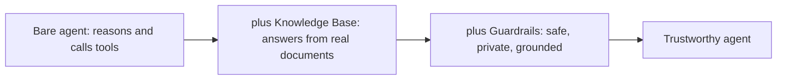
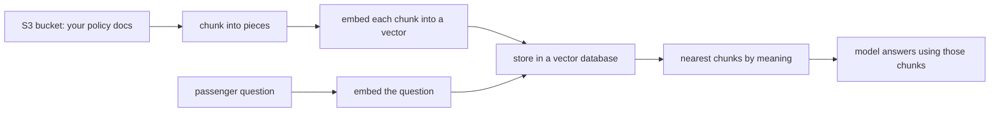
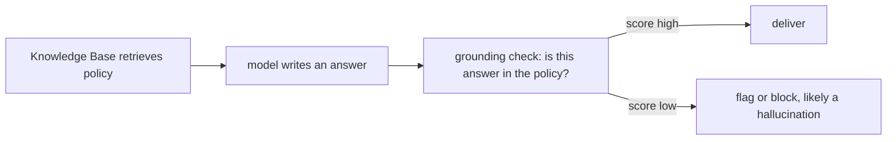
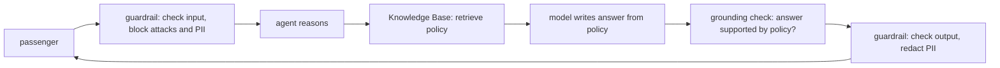

# The Harness: Knowledge Bases and Guardrails on AWS Bedrock

Deck content. Each `##` is a slide title. The story: your agent can reason and call tools, but on its own it makes up facts and has no safety net. Today you build the harness around it. A Knowledge Base gives it real documents to answer from. Guardrails keep it safe and honest.

---

## The Harness Around the Agent

Your TravelMind agent has two holes.

- Ask it a fare rule it was never told and it will invent one, confidently. That is hallucination.
- Nothing stops a passenger from jailbreaking it, leaking a card number, or dragging it off topic.

The harness closes both holes:

- **Knowledge Base**: give the agent your real airline policy documents so it answers from ground truth, not guesswork.
- **Guardrails**: a safety layer that filters harmful input and output, redacts personal data, blocks off-limits topics, and checks that answers are actually grounded.



Two new concepts today, both first-time: Knowledge Bases, then Guardrails.

---

## Part One: What Is a Knowledge Base

A Bedrock Knowledge Base is managed RAG. RAG means retrieval augmented generation: before the model answers, you retrieve relevant documents and hand them to the model as context.

The intuition: instead of hoping the model memorized your refund policy, you keep the policy in a searchable store and feed the right paragraph into the prompt at question time.

Bedrock does the whole pipeline for you:

- reads your documents from an S3 bucket
- splits them into chunks
- turns each chunk into an embedding, a vector of numbers that captures meaning
- stores the vectors in a vector database
- at query time, finds the chunks closest in meaning to the question

You bring documents. Bedrock brings the pipeline.

---

## The RAG Pipeline in One Picture



Two halves. The top row runs once at ingestion, when you sync your documents. The bottom row runs on every question. The magic is that similarity is by meaning, not keywords, so "what do I get for a long delay" finds the entitlements paragraph even if it never says "long delay."

---

## The Vector Store Choice, and the Bill That Surprises People

The vector database is a real choice with a real cost, and this is where teams get a nasty first invoice.

| Vector store | Cost shape | Use when |
|---|---|---|
| OpenSearch Serverless | idle floor around 350 dollars a month, minimum capacity units always on | production, fast queries, you already pay for it |
| S3 Vectors | no idle floor, pay per storage and per query | prototypes, training, cost-sensitive, large corpora |
| Aurora PostgreSQL Serverless | database capacity billing | you already run Aurora |

> **The cost cliff.** OpenSearch Serverless allocates a minimum block of capacity that runs whether or not anyone queries it. People build a demo, forget it, and get a bill near 260 to 350 dollars for a knowledge base nobody used. For learning and prototypes, pick **S3 Vectors**: it went generally available in December 2025, is fully serverless, scales to a billion vectors, and can be up to ninety percent cheaper. Check live pricing before you commit, since these numbers move.

One more truth: a managed knowledge base is not one price. You pay across three layers that stack. Embedding tokens at ingestion and at query time. The vector store bill. Generation tokens when the model writes the answer.

---

## Create a Knowledge Base by Clicking

From scratch, using the cheap serverless store.

1. Put your policy documents in an S3 bucket. Plain text, markdown, or PDF all work.
2. Bedrock console, left nav, **Knowledge Bases**, then **Create**, then **Knowledge Base with vector store**.
3. Name it `travelmind-policy`. For the runtime role, choose **Create and use a new service role**.
4. Data source: **Amazon S3**. Give it the S3 URI of your documents. Keep parsing and chunking on default to start.
5. Embeddings model: **Titan Text Embeddings v2**.
6. Vector store: **Quick create a new vector store**, then choose **S3 Vectors** for the low cost floor.
7. Create. Then open the data source and choose **Sync**. Sync is the ingestion job that reads, chunks, embeds, and stores. Nothing is searchable until the first sync finishes.
8. Re-sync whenever your documents change. Only new and changed files are reprocessed.

> **What goes wrong.** Query a knowledge base before the first sync and you get nothing back, because the vector store is empty. Always sync first, and re-sync after every document change.

You can build a second knowledge base the same way, for example `travelmind-ops` for airport and disruption procedures, and let the agent pick the right one.

---

## Two Ways to Use It: retrieve and retrieve_and_generate

Bedrock gives you two runtime calls, and the difference matters.

- `retrieve` returns raw chunks and their similarity scores. You decide what to do with them. Use this when you want to inject context into your own prompt, or feed it to a grounding check.
- `retrieve_and_generate` does the full RAG cycle: retrieve, then the model writes an answer with citations. Use this when you want a finished answer fast.

```python
# raw chunks, you own the prompt
rt.retrieve(knowledgeBaseId=KB_ID, retrievalQuery={"text": q},
            retrievalConfiguration={"vectorSearchConfiguration": {"numberOfResults": 5}})

# finished answer with citations
rt.retrieve_and_generate(input={"text": q},
    retrieveAndGenerateConfiguration={"type": "KNOWLEDGE_BASE",
        "knowledgeBaseConfiguration": {"knowledgeBaseId": KB_ID, "modelArn": MODEL_ARN}})
```

Rule of thumb: `retrieve` when you are building an agent and want control, `retrieve_and_generate` when you want a chatbot answer out of the box.

---

## Give the Agent the Knowledge Base

For an Agent Builder agent, you attach the knowledge base and write a short description telling the agent when to use it. The agent reads that description to decide whether to consult the store.

- In the console: open the agent, **Knowledge bases**, **Add**, pick `travelmind-policy`, and write instructions such as "consult for fare rules, refunds, and entitlements."
- In code: `associate_agent_knowledge_base(agentId, agentVersion="DRAFT", knowledgeBaseId, description, knowledgeBaseState="ENABLED")`, then prepare the agent.

> **Nuance.** The description is not decoration. A vague description makes the agent skip the knowledge base or query it at the wrong time. Write it like a tool description: say exactly what lives in this store.

Now the agent grounds its answers in your policy instead of inventing them. That closes hole one.

---

## Part Two: What Is a Guardrail

A Bedrock Guardrail is a safety layer that sits between the user and the model. It inspects the input going in and the output coming out, and it acts on anything that breaks your rules.

It works on any model, on agents, and even outside Bedrock through one API. Six policy types, mix and match:

- content filters
- denied topics
- word filters
- sensitive information filters
- contextual grounding checks
- automated reasoning checks

Think of it as a bouncer at the door and a fact-checker at the exit, both configurable.

---

## The Six Policies, Plain

| Policy | What it does | TravelMind example |
|---|---|---|
| Content filters | block hate, insults, sexual, violence, misconduct, and prompt attacks, at LOW to HIGH strength | stop a jailbreak that says "ignore your rules" |
| Denied topics | block subjects you define, with examples | refuse to book or praise competitor airlines |
| Word filters | block exact words, phrases, and profanity | block internal codenames and slurs |
| Sensitive information | block or mask PII like cards, emails, phones | redact a card number a passenger pastes |
| Contextual grounding | flag answers not supported by the source or not relevant | catch an invented fare rule |
| Automated reasoning | formal logic checks against a policy you author | advanced, verify claims mathematically |

Each content category has a strength dial. Each PII entity is either blocked or masked. You choose what to return when something is blocked.

---

## The Grounding Check: Your Anti-Hallucination Net

This is the policy that pairs with your knowledge base, and it is the point of the whole session.

Contextual grounding needs three things:

- the grounding source: the retrieved policy chunks
- the query: the passenger question
- the content to guard: the model answer

It scores two numbers between zero and one:

- grounding: is the answer supported by the source
- relevance: does the answer address the question

You set thresholds. Higher is stricter. Set both at 0.75 and any answer scoring below gets flagged or blocked.



The knowledge base gives the model facts. The grounding check verifies the model actually used them. Together they turn a confident guesser into a citable assistant.

> **Caveat.** Contextual grounding supports summarization, paraphrasing, and question answering. Free-form multi-turn chit-chat is not a supported use case, and the check runs on output only, since it needs an answer to score.

---

## Create a Guardrail by Clicking

1. Bedrock console, left nav, **Guardrails**, then **Create guardrail**.
2. Name it `travelmind-safety`. Write the blocked messages, for example "I can't help with that."
3. Content filters: set Prompt attack and Hate to HIGH, Violence and Insults to MEDIUM.
4. Denied topics: add "Competitor booking" with examples like "book me on another airline."
5. Sensitive information: block card numbers, mask email and phone.
6. Word filters: turn on the managed profanity list.
7. For a grounding guardrail, create a second one `travelmind-grounding` and set grounding and relevance thresholds to 0.75.
8. Create, then **Create version**. A version is a frozen snapshot. You develop against DRAFT and ship a numbered version.

Two guardrails, two jobs: `travelmind-safety` is the bouncer on all traffic, `travelmind-grounding` is the fact-checker on answers.

---

## Put the Guardrail to Work

Three ways to use a guardrail, all with the same guardrail you created.

- **On an agent**: attach it so every turn is filtered. Console, or `guardrailConfiguration` on the agent in code.
- **On a model call**: pass `guardrailConfig` with the identifier and version to Converse.
- **Standalone**: `apply_guardrail` checks any text with no model call at all. Perfect for running the grounding check on a finished answer.

```python
# standalone check, no model call
br.apply_guardrail(guardrailIdentifier=GID, guardrailVersion="1", source="INPUT",
                   content=[{"text": {"text": "my card is 4111 1111 1111 1111"}}])
# -> action: GUARDRAIL_INTERVENED, and the card is masked in the output
```

Because `apply_guardrail` works on any text and any model, the same safety layer covers your Bedrock agents, your hand-built Converse agent, and later your Strands and AgentCore agents.

---

## The Whole Harness, Assembled



Read it as a pipeline. Nothing reaches the model without passing the input filter. Nothing reaches the passenger without being grounded and cleaned. The agent still does the reasoning you built, but now it sits inside a harness.

---

## What Not to Do in Production

- Do not leave the vector store on OpenSearch Serverless for a demo you will forget. The idle floor bills you for nothing. Use S3 Vectors for prototypes and re-evaluate quarterly.
- Do not forget to sync. An unsynced knowledge base silently returns nothing.
- Do not ship against DRAFT guardrails. Cut a numbered version and pin your app to it.
- Do not set grounding thresholds blind. Start near 0.7, watch what gets blocked, and tune. A threshold of 1 blocks everything.
- Do not skip PII. If passengers can paste card numbers, mask or block them before they hit a log.
- Do not grant broad IAM. The agent service role needs Retrieve on the specific knowledge base and ApplyGuardrail on the specific guardrail, nothing wider.
- Remember the three cost layers: embeddings, vector store, generation. Watch all three, not just the model bill.

---

## Connect the Dots: From Toy Agent to Trustworthy Agent

You now have the full picture.

- A bare agent is a confident guesser with no safety net.
- A **Knowledge Base** gives it ground truth, so answers come from your documents.
- **Guardrails** give it a bouncer and a fact-checker, so answers are safe, private, and grounded.
- The **grounding check** is the bridge between the two: the knowledge base supplies facts, the check proves the answer used them.

The two files that follow build this twice. One wires the harness onto an Agent Builder agent. One wires it onto yesterday's hand-built production TravelMind agent, using the Converse code you already wrote. Same harness, two hosts, and the same skills carry straight to Strands and AgentCore.

Ground the answer. Guard the edges. Ship something you can trust.
