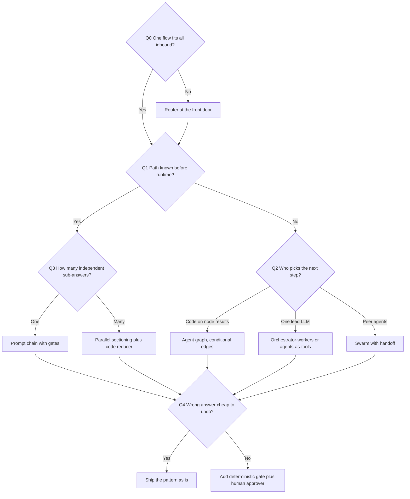
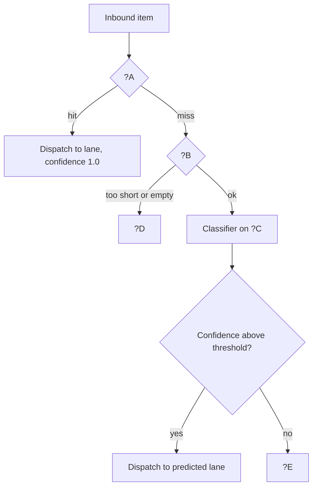
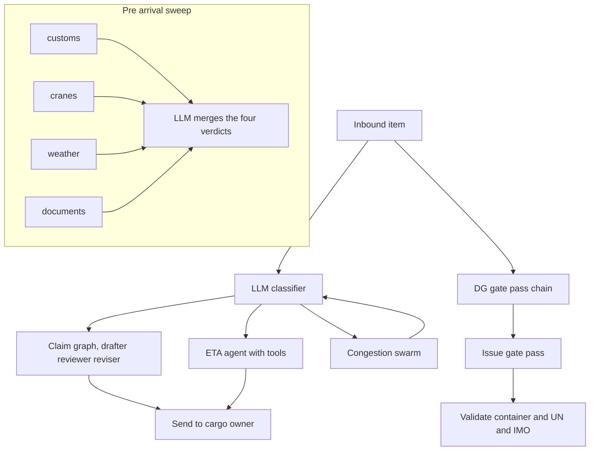

# Compound Exercise: Choosing and Wiring Agentic Patterns

**Language:** Python 3.11+ | **Topics:** Prompt chaining, augmented LLM (tools), routing, parallelisation, orchestrator-workers, evaluator-optimizer, agent graphs, swarms, composition | **Level:** Intermediate to Advanced

---

## 0. Setup

### 0.1 Install and credentials

```bash
python -m venv .venv && source .venv/bin/activate      # Windows: .venv\Scripts\activate
pip install "strands-agents==1.42.0" boto3 pydantic
aws configure                                          # or export AWS_ACCESS_KEY_ID / AWS_SECRET_ACCESS_KEY
export AWS_REGION=us-east-1
```

Colab: `!pip install -q "strands-agents==1.42.0" boto3 pydantic`, then set the three env vars in a cell, then run.

### 0.2 Shared file: `pierpoint_common.py`

Every later snippet imports from this. Create it once.

```python
# pierpoint_common.py
from strands import Agent
from strands.models import BedrockModel

REGION = "us-east-1"

# Claude on-demand REQUIRES the cross-region inference profile prefix "us."
REASONING_MODEL = "us.anthropic.claude-haiku-4-5-20251001-v1:0"
# Nova does NOT need the "us." prefix
CHEAP_MODEL = "amazon.nova-lite-v1:0"


def model(model_id: str, temperature: float = 0.2, max_tokens: int = 800) -> BedrockModel:
    """One place to build models. Set temperature only, never temperature + top_p together."""
    return BedrockModel(
        model_id=model_id,
        region_name=REGION,
        temperature=temperature,
        max_tokens=max_tokens,
    )


if __name__ == "__main__":
    for mid in (REASONING_MODEL, CHEAP_MODEL):
        probe = Agent(model=model(mid), system_prompt="Reply with exactly one word.")
        print(mid, "->", str(probe("Say READY")).strip())
```

Run `python pierpoint_common.py` before anything else. Two `READY` lines means you are clear to proceed.

### 0.3 Ground rules for this exercise

| Rule | Detail |
|---|---|
| Scope | No session managers, no memory, no retrieval. Every snippet is stateless by design. Where memory would belong, the file says `PARK`. |
| Model tiering | Classifier and worker nodes get `CHEAP_MODEL`. Nodes that judge, write, or plan get `REASONING_MODEL`. You will be asked to justify each choice. |
| Code | Every block runs standalone once its `TODO`s are filled. No pseudocode. |
| Fallback | If `structured_output` misbehaves on Nova Lite, switch that one call to `REASONING_MODEL` and note it in your answer. |

---

## 1. The scenario: PierPoint Terminal Ops Copilot

PierPoint runs a container terminal. One inbound channel (email plus a web form) carries every kind of request from every kind of counterparty. Today an ops team of nine reads all of it and decides what happens next. You are designing the copilot that sits in front of that team.

| Counterparty | What they send | What "wrong" costs |
|---|---|---|
| Shipping line | Berth and ETA questions, congestion complaints | A wrong ETA reroutes trucks. Reversible, annoying. |
| Trucker / haulier | Gate pass requests, dangerous goods paperwork | A bad DG gate pass is a regulatory incident. Not reversible. |
| Customs broker | Document status, hold clearance | Wrong answer stalls a container for days. Slowly reversible. |
| Cargo owner | Damage claims, reefer alarms | A missed reefer alarm spoils pharma cargo. Not reversible. |

Hard constraints from the ops manager:

| Constraint | Value |
|---|---|
| Median response budget | Under 4 seconds for questions, under 30 seconds for anything that drafts a document |
| Volume | Roughly 3,000 inbound items per day, spiky around vessel arrivals |
| Non-negotiable | Nothing that is irreversible leaves the system without a deterministic check plus a named human approver |
| Audit | For any answer, ops must be able to reconstruct which step produced which claim |

---

## 2. The Control Question Ladder

Before any pattern name, four questions. Answer them in order and the pattern mostly picks itself.

| # | Question | If the answer is... | You are heading toward |
|---|---|---|---|
| Q0 | Does one flow fit every inbound item? | No | A router at the front door |
| Q1 | Is the path known before runtime? | Yes | Workflow: chain, parallel section, or fixed graph |
| Q1 | Is the path known before runtime? | No | Agentic: orchestrator, graph with conditions, or swarm |
| Q2 | Who picks the next step? | Code | Graph with conditional edges |
| Q2 | Who picks the next step? | One lead LLM | Orchestrator-workers or agents-as-tools |
| Q2 | Who picks the next step? | Peer agents | Swarm |
| Q3 | How many independent sub-answers feed the result? | Many | Parallel sectioning plus a code reducer |
| Q4 | Is a wrong answer cheap to undo? | No | Deterministic gate plus human approval, wrapped around whatever you chose |



### Pattern cards

| Pattern | Who decides the next step | Shape | Breaks down when |
|---|---|---|---|
| Augmented LLM | The model, within one turn | 1 agent + tools | Tool count grows past what fits in one prompt, or the tool contract is vague |
| Prompt chain | Code, fixed order | Step 1 to step N | The order genuinely varies by input |
| Routing | Code, once, at the front | Classify then dispatch | Lanes overlap, or the classifier is a coin flip on real traffic |
| Parallel sectioning | Code, fan out then merge | N independent branches + reducer | Branches actually depend on each other |
| Orchestrator-workers | One lead LLM | Lead plans, calls workers | The lead cannot see enough to plan, so it flails |
| Evaluator-optimizer | Code, on a judge verdict | Draft, judge, revise, loop | No crisp quality signal, or the loop has no cap |
| Agent graph | Code, on node results | DAG or cyclic graph | Conditions multiply into a rules engine nobody can read |
| Swarm | Peer agents, by handoff | Agents hand off to each other | Handoffs ping-pong, or you needed an audit trail |
| Agents-as-tools | One lead LLM | Sub-agents exposed as tools | Sub-agent output is long and the lead loses the thread |

### Task 1: Match symptom to pattern

Write one pattern name per row. One pattern is used twice. One row is a trap: the honest answer is "no agent needed".

| # | Symptom heard from PierPoint ops | Pattern |
|---|---|---|
| a | "Same four checks every time before a vessel berths, and they do not depend on each other." | |
| b | "The gate pass draft is usually fine but sometimes misses the emergency contact, and we only notice after." | |
| c | "Every inbound item goes to the same overloaded queue regardless of what it is." | |
| d | "We never know in advance whether customs, yard, or comms needs to weigh in. It depends on how the incident unfolds." | |
| e | "Answering an ETA question means looking up two internal systems, nothing more." | |
| f | "Container ID validity is a fixed format rule that we have written down." | |
| g | "The steps for a DG declaration are the same every single time and the order is fixed." | |
| h | "One senior person reads the case, decides which specialist to pull in, and stitches the answer." | |
| i | "If document check fails we stop, if it passes we go to billing, and that decision is written in policy." | |

> Hint: for each row, say Q0 to Q4 out loud in order. Row f should make you uncomfortable about reaching for an LLM.

### Task map

| Situation | Tasks | Budget |
|---|---|---|
| S1 Front door | T2, T3, T4 | 20 min |
| S2 DG gate pass | T5, T6 | 20 min |
| S3 ETA answers | T7, T8 | 15 min |
| S4 Pre-arrival sweep | T9, T10, T11 | 20 min |
| S5 Damage claim narrative | T12, T13 | 25 min |
| S6 Congestion incident | T14, T15 | 20 min |
| S7 Assembly | T16 | 20 min |

---

## S1. Front door: one channel, five kinds of work

Six real inbound items:

```python
INBOX = [
    "DG-4471: container MSCU7391045, UN1263 class 3, gate pass needed for tonight's slot.",
    "REEFER alarm CAIU9083321, set point drift 4 degrees, pharma cargo on board.",
    "When is MV Northern Vega alongside? My trucks are already queued.",
    "Two of my boxes came off the vessel with dented top rails. Who pays for this?",
    "Gate 3 queue is running 90 minutes. Will that clear inside this shift?",
    "Following up on the thing from yesterday, any update?",
]
```

### Task 2: Fill the front door decision tree

Replace `?A` through `?E` with concrete labels. `?A` and `?B` are the two checks that run before any model call. `?C` is the model tier. `?D` and `?E` are the two exits.



> Hint: two of the six INBOX items should never reach the classifier at all. Find them first, then name the check that catches them.

### Task 3: Trade-off table, front door options

Row 1 is filled as a worked pass. Fill rows 2 and 3, then circle one verdict.

| Option | Who decides | Model calls per item | Cost at 3k/day | Determinism | Blast radius of a mistake | Verdict |
|---|---|---|---|---|---|---|
| A. Rules only (regex and keywords) | Code | 0 | Zero | Total | Unmatched items silently land in the wrong lane and nobody notices | Reject: cannot cover free text |
| B. LLM classifier only | | | | | | |
| C. Rules first, classifier for the rest, low confidence to human | | | | | | |

> Hint: "cost" only needs an order of magnitude. What matters is which column actually decides the verdict for PierPoint, given the constraint table in section 1.

### Task 4: Code the hybrid router

```python
# s1_router.py
from typing import Literal
from pydantic import BaseModel, Field
from strands import Agent
from pierpoint_common import model, CHEAP_MODEL

INBOX = [
    "DG-4471: container MSCU7391045, UN1263 class 3, gate pass needed for tonight's slot.",
    "REEFER alarm CAIU9083321, set point drift 4 degrees, pharma cargo on board.",
    "When is MV Northern Vega alongside? My trucks are already queued.",
    "Two of my boxes came off the vessel with dented top rails. Who pays for this?",
    "Gate 3 queue is running 90 minutes. Will that clear inside this shift?",
    "Following up on the thing from yesterday, any update?",
]

LANES = ("gate_pass", "eta_query", "damage_claim", "congestion", "human")

# TODO 1: two rules only. Map a marker found in the text to a lane.
#         One marker sends DG paperwork to gate_pass. One marker sends
#         perishable alarms straight to human. Keys are matched uppercase.
RULES: dict[str, str] = {
    # "MARKER": "lane",
}

CONFIDENCE_FLOOR = 0.6  # TODO 2: after you see the real outputs, defend or change this number


class Route(BaseModel):
    lane: Literal["gate_pass", "eta_query", "damage_claim", "congestion", "human"]
    confidence: float = Field(ge=0.0, le=1.0)
    why: str


classifier = Agent(
    model=model(CHEAP_MODEL, temperature=0.0),
    system_prompt=(
        "You classify terminal operations messages into one lane. "
        "Lanes: gate_pass, eta_query, damage_claim, congestion, human. "
        "Use 'human' when the message is too vague to act on. "
        "Set confidence honestly: below 0.6 when you are guessing."
    ),
)


def apply_rules(text: str) -> str | None:
    """Return a lane if a rule fires, else None."""
    upper = text.upper()
    # TODO 3: return the mapped lane on the first marker found in upper
    return None


def route(text: str) -> tuple[str, float, str]:
    lane = apply_rules(text)
    if lane:
        return lane, 1.0, "rule"

    # TODO 4: one call, typed result. Use classifier.structured_output(Route, text)
    decision = ...

    # TODO 5: enforce the floor. Below it, the lane becomes "human" and the
    #         original prediction is preserved in the reason string.
    return decision.lane, decision.confidence, decision.why


if __name__ == "__main__":
    for item in INBOX:
        lane, conf, why = route(item)
        print(f"{lane:<12} {conf:>4.2f}  {item[:52]}...  ({why[:40]})")
```

Correct run looks like:

| Input | Expected lane | Expected confidence | Model calls |
|---|---|---|---|
| DG-4471 gate pass | `gate_pass` | 1.00 | 0 |
| REEFER alarm | `human` | 1.00 | 0 |
| MV Northern Vega | `eta_query` | high | 1 |
| Dented top rails | `damage_claim` | high | 1 |
| Gate 3 queue | `congestion` | high | 1 |
| "Following up on the thing" | `human` | below floor | 1 |

Two of six items cost zero tokens. Note that number, you will need it in T16.

---

## S2. DG gate pass: fixed steps, unforgiving output

A dangerous goods gate pass has the same three steps every time: pull the fields out of free text, check them against written rules, draft the pass. A wrong pass is a regulatory incident.

### Task 5: Order the chain and place the gate

These five cards are shuffled. Write the correct order, then mark with `[GATE]` the one step that must be pure Python with no model in it, and mark with `[STOP]` the step after which an invalid request must exit without ever reaching the drafter.

```
(i)   Draft the gate pass text
(ii)  Validate container ID format, UN number format, IMO class, emergency contact
(iii) Extract container_id, un_number, imo_class, emergency_contact from free text
(iv)  Return the pass to ops for named approval
(v)   Return a rejection listing every field that failed
```

> Hint: if the gate can be expressed as a written rule, a model has no business enforcing it. Ask why a gate placed after step (i) would be worse than the same gate placed before it.

### Task 6: Code the chain with a hard gate

```python
# s2_chain.py
import re
from pydantic import BaseModel
from strands import Agent
from pierpoint_common import model, REASONING_MODEL, CHEAP_MODEL

REQUEST = (
    "Need a DG gate pass. Box MSCU7391045, UN1263 paint, class 3 flammable liquid, "
    "driver Kaur arriving on tonight's slot, contact on file."
)

ALLOWED_IMO = {"2.1", "2.2", "2.3", "3", "4.1", "5.1", "6.1", "8", "9"}
CONTACT_REQUIRED_FOR = {"2.3", "6.1"}       # toxic gas, toxic solids
CONTAINER_RE = re.compile(r"^[A-Z]{4}\d{7}$")   # ISO 6346 shape
UN_RE = re.compile(r"^UN\d{4}$")


class DGFields(BaseModel):
    container_id: str
    un_number: str
    imo_class: str
    emergency_contact: str | None = None


extractor = Agent(
    model=model(CHEAP_MODEL, temperature=0.0),
    system_prompt=(
        "Extract dangerous goods gate pass fields from the message. "
        "Normalise container_id to uppercase with no spaces. "
        "Normalise un_number to the form UN1234. "
        "Set emergency_contact to null when no actual name or number is given."
    ),
)

drafter = Agent(
    model=model(REASONING_MODEL, temperature=0.3),
    system_prompt=(
        "Write a terminal dangerous goods gate pass. Six lines maximum. "
        "State only the fields you are given. Never invent a field. "
        "End with a line reading: APPROVER: ____"
    ),
)


def validate(f: DGFields) -> list[str]:
    """Pure Python. No model. Returns a list of failures, empty means pass."""
    problems: list[str] = []
    # TODO 1: container_id must match CONTAINER_RE
    # TODO 2: un_number must match UN_RE
    # TODO 3: imo_class must be in ALLOWED_IMO
    # TODO 4: emergency_contact must be present when imo_class is in CONTACT_REQUIRED_FOR
    return problems


def gate_pass(message: str) -> str:
    fields = extractor.structured_output(DGFields, message)
    problems = validate(fields)

    # TODO 5: early exit. On any problem, return a rejection listing all of them
    #         and do not call the drafter at all.

    payload = fields.model_dump_json()
    return str(drafter(f"Fields: {payload}"))


if __name__ == "__main__":
    print(gate_pass(REQUEST))
    print("---- now break it ----")
    print(gate_pass("Gate pass for box MSC7391045, UN63 class 7, tonight."))
```

Correct run looks like: first call prints a six line pass ending in `APPROVER: ____`. Second call prints a rejection naming three failures (container shape, UN shape, IMO class) and makes exactly one model call, not two.

> PARK: the "contact on file" phrase is exactly where a memory or lookup layer would belong. Today the honest answer is null plus a rejection.

---

## S3. ETA answers: the model needs facts it does not have

### Task 7: Design the tool contract before writing it

Fill the table. The failure column is the one people skip and it is the one that decides whether the agent lies.

| Tool | Args (name and type) | Returns on success | Returns when not found | Why not just paste the data into the prompt |
|---|---|---|---|---|
| `berth_eta` | | | | |
| `yard_slot` | | | | |

> Hint: there are 400 vessels and 12,000 containers. Compute the prompt size before you answer the last column.

### Task 8: Code the augmented agent

```python
# s3_tools.py
from strands import Agent, tool
from pierpoint_common import model, REASONING_MODEL

BERTHS = {
    "MV NORTHERN VEGA": {"berth": "4", "eta": "today 21:40", "status": "inbound, pilot booked"},
    "MV COASTAL ARROW": {"berth": "2", "eta": "tomorrow 06:15", "status": "at anchorage"},
}
YARD = {
    "MSCU7391045": {"slot": "B12-3-2", "hold": "customs", "last_move": "discharge"},
    "CAIU9083321": {"slot": "R04-1-1", "hold": "none", "last_move": "reefer plug in"},
}


@tool
def berth_eta(vessel_name: str) -> str:
    """Look up the berth and estimated alongside time for one vessel.

    Args:
        vessel_name: TODO 1: describe the exact expected format, including the MV prefix
    """
    rec = BERTHS.get(vessel_name.strip().upper())
    # TODO 2: when rec is None, return a plain sentence saying no record exists
    #         and naming the vessel. Do not raise, do not return an empty string.
    return f"Berth {rec['berth']}, alongside {rec['eta']}, {rec['status']}."


# TODO 3: write yard_slot(container_id) with the same shape.
#         Docstring is the contract the model reads. Return slot, hold, last_move.


desk = Agent(
    model=model(REASONING_MODEL, temperature=0.2),
    system_prompt=(
        "You answer terminal status questions for shipping lines and truckers. "
        "Use tools for every fact. If a tool reports no record, say so plainly "
        "and do not guess. Two sentences maximum."
    ),
    tools=[berth_eta],   # TODO 4: add the second tool
)

if __name__ == "__main__":
    for q in [
        "When is MV Northern Vega alongside and which berth?",
        "Where is container MSCU7391045 sitting and is it on hold?",
        "What about MV Ghost Runner?",
        "Is MSCU7391045 on the same vessel as MV Northern Vega?",
    ]:
        print("Q:", q)
        print("A:", str(desk(q)).strip(), "\n")
```

Correct run looks like: question 3 produces an explicit "no record" answer. Question 4 is the interesting one. Write down in one line what the agent did with it and whether that behaviour is acceptable.

---

## S4. Pre-arrival sweep: four checks that do not know about each other

Before a vessel berths, four checks run: customs holds, crane availability, weather window, document completeness. They share no data. Ops wants one verdict.

### Task 9: Parallel or sequential

Mark each with `P` or `S` and give a one-line reason. Only two of these four earn parallelism.

| # | Mini case | P or S | Reason |
|---|---|---|---|
| a | Four independent pre-arrival checks, verdict needed in one answer | | |
| b | Extract fields, then validate them, then draft from them | | |
| c | Three drafts of the same customer apology, best one kept | | |
| d | Translate a customs notice, then summarise the translation | | |

> Hint: parallelism buys wall clock time and costs the same tokens. If step 2 needs step 1's output, no amount of asyncio helps.

### Task 10: Code the sweep

```python
# s4_parallel.py
import asyncio
from strands import Agent
from pierpoint_common import model, CHEAP_MODEL

VESSEL_FILE = (
    "MV Northern Vega, 1,240 moves booked. Customs: 3 containers flagged, 1 unresolved. "
    "Cranes: 2 of 3 available, crane 2 under maintenance until midnight. "
    "Weather: gusts 28 knots forecast, terminal limit is 32 knots. "
    "Documents: manifest received, DG declaration for MSCU7391045 missing."
)

CHECKS = {
    "customs": "You check customs readiness only. Answer READY or BLOCKED plus one reason.",
    "cranes": "You check crane readiness only. Answer READY or BLOCKED plus one reason.",
    "weather": "You check weather readiness only. Answer READY or BLOCKED plus one reason.",
    "documents": "You check document readiness only. Answer READY or BLOCKED plus one reason.",
}


async def sweep(vessel_file: str) -> dict[str, str]:
    # TODO 1: one fresh Agent per check. A single shared Agent instance will fail.
    agents = {}

    # TODO 2: fan out with invoke_async, gather with return_exceptions=True
    outputs = ...

    return {name: str(out).strip() for name, out in zip(CHECKS, outputs)}


def reduce_verdict(results: dict[str, str]) -> str:
    """Pure Python. The merge rule is fixed, so no model belongs here."""
    # TODO 3: BLOCKED if any check is blocked, listing which ones. Else READY.
    return ""


if __name__ == "__main__":
    res = asyncio.run(sweep(VESSEL_FILE))
    for k, v in res.items():
        print(f"{k:<10} {v}")
    print("VERDICT:", reduce_verdict(res))
```

Correct run looks like: four lines, then a verdict of BLOCKED naming customs and documents. Weather is a trap, 28 knots is inside the 32 knot limit.

### Task 11: Debug this

A colleague wrote the version below. It crashes.

```python
async def sweep_broken(vessel_file: str) -> list[str]:
    agent = Agent(model=model(CHEAP_MODEL), system_prompt="You check readiness.")   # line 2
    tasks = [agent.invoke_async(f"{prompt}\n\n{vessel_file}") for prompt in CHECKS.values()]  # line 3
    results = await asyncio.gather(*tasks)                                          # line 4
    return [str(r) for r in results]                                                # line 5
```

Answer three things:

1. Which line is the defect, and what exception class comes back.
2. The one-line fix.
3. A colleague suggests `Agent(..., concurrent_invocation_mode=ConcurrentInvocationMode.UNSAFE_REENTRANT)` instead. Say in one sentence why that is the wrong fix here even though it stops the crash.

> Hint: the exception name and message live in the SDK source, and the word "unsafe" in that enum is doing real work. What does an Agent hold that two concurrent branches would be writing into at the same time?

---

## S5. Damage claim narrative: quality needs a judge

A damage claim response goes to a cargo owner and may be read by an insurer. Requirements: name the container, state observed damage, state the next step, never admit liability, stay under 120 words.

### Task 12: Trace the loop

This graph is wired as: `drafter -> reviewer`, `reviewer -> reviser` when the review contains REVISE, `reviser -> reviewer`, `reviewer -> publisher` when the review contains APPROVE. Entry point is `drafter`. Limits are `reset_on_revisit(True)` and `set_max_node_executions(N)`.

Fill both rows.

| Run | Reviewer verdicts in sequence | N | Execution order | Final status | `execution_count` | `completed_nodes` |
|---|---|---|---|---|---|---|
| 1 | REVISE, REVISE, APPROVE | 10 | | | | |
| 2 | REVISE every time | 6 | | | | |

> Hint: `GraphResult.completed_nodes` counts distinct nodes, not executions, and the two numbers diverge the moment a cycle exists. For run 2, decide whether the graph raises, hangs, or returns something. Then predict which of the three a production oncall would prefer, and why the answer is not obvious.

### Task 13: Code the evaluator-optimizer graph

```python
# s5_graph.py
from strands import Agent
from strands.multiagent import GraphBuilder
from strands.multiagent.graph import GraphState
from pierpoint_common import model, REASONING_MODEL, CHEAP_MODEL

CLAIM = (
    "Cargo owner reports two containers discharged from MV Northern Vega with dented top rails: "
    "MSCU7391045 and CAIU9083321. Owner asks who pays. Terminal survey not yet done."
)

RULES = (
    "Requirements: name every container, state observed damage, state the next step, "
    "never admit or assign liability, under 120 words."
)

drafter = Agent(
    model=model(REASONING_MODEL, temperature=0.4),
    name="drafter",
    system_prompt=f"Draft a reply to a cargo damage claim. {RULES}",
)

reviewer = Agent(
    model=model(REASONING_MODEL, temperature=0.0),
    name="reviewer",
    system_prompt=(
        f"You review a damage claim reply against these rules. {RULES} "
        "Reply with exactly one word first, APPROVE or REVISE, then a colon and "
        "the specific failures. Be strict about liability language and word count."
    ),
)

reviser = Agent(
    model=model(REASONING_MODEL, temperature=0.3),
    name="reviser",
    system_prompt=f"Rewrite the reply fixing every listed failure. {RULES}",
)

publisher = Agent(
    model=model(CHEAP_MODEL, temperature=0.0),
    name="publisher",
    system_prompt="Output the approved reply text only, with no commentary.",
)


def needs_revision(state: GraphState) -> bool:
    nr = state.results.get("reviewer")
    # TODO 1: True when the reviewer's text asks for a revision
    return False


def approved(state: GraphState) -> bool:
    nr = state.results.get("reviewer")
    # TODO 2: mirror of needs_revision
    return False


builder = GraphBuilder()
builder.add_node(drafter, "drafter")
builder.add_node(reviewer, "reviewer")
builder.add_node(reviser, "reviser")
builder.add_node(publisher, "publisher")

builder.add_edge("drafter", "reviewer")
# TODO 3: the two conditional edges out of reviewer, and the edge back from reviser
builder.set_entry_point("drafter")

# TODO 4: the two safety settings. Without them this graph can spin forever.
graph = builder.build()

if __name__ == "__main__":
    result = graph(f"{CLAIM}\n\n{RULES}")
    print("status:", result.status)
    print("order:", [n.node_id for n in result.execution_order])
    print("executions:", result.execution_count, "distinct completed:", result.completed_nodes)
    final = result.results.get("publisher")
    print("\n", str(final.result).strip() if final else "no publisher output")
```

Correct run looks like: order starts `['drafter', 'reviewer', ...]`. Either the reviewer approves the first draft, or you see one or more `reviser, reviewer` pairs. If your run never approves, that is a finding, not a bug: record what the reviewer kept rejecting.

---

## S6. Congestion incident: nobody knows the path in advance

Gate 3 is at 90 minutes. Depending on what the cause turns out to be, this needs yard planning, or customs, or line comms, or two of them, or all three, and the order is not knowable up front.

### Task 14: Trade-off table, three candidate patterns

| Option | Who decides the next step | Audit trail quality | Worst case call count | Failure mode you would actually see | Verdict |
|---|---|---|---|---|---|
| A. Fixed graph, conditional edges | | | | | |
| B. Swarm with peer handoff | | | | | |
| C. Agents-as-tools under one lead | | | | | |

Then answer: PierPoint's constraint table says ops must reconstruct which step produced which claim. Which option does that constraint eliminate, and what would you have to add to bring it back?

### Task 15: Code the swarm, then the alternative

```python
# s6_swarm.py
from strands import Agent, tool
from strands.multiagent import Swarm
from pierpoint_common import model, REASONING_MODEL

INCIDENT = (
    "Gate 3 truck queue at 90 minutes since the morning peak. Two of three cranes working. "
    "Customs flagged 3 boxes on MV Northern Vega. Two shipping lines have called to complain. "
    "Reefer block R04 is at full power draw."
)

HANDOFF = (
    "You work with peers: yard_planner, customs_liaison, line_comms. "
    "Use handoff_to_agent when the next step is outside your area. "
    "When your part is done and nothing else is needed, state the final recommendation and stop."
)

yard_planner = Agent(
    model=model(REASONING_MODEL, temperature=0.2), name="yard_planner",
    system_prompt=f"You plan yard and gate throughput moves. {HANDOFF}",
)
customs_liaison = Agent(
    model=model(REASONING_MODEL, temperature=0.2), name="customs_liaison",
    system_prompt=f"You resolve customs holds and inspection sequencing. {HANDOFF}",
)
line_comms = Agent(
    model=model(REASONING_MODEL, temperature=0.3), name="line_comms",
    system_prompt=f"You draft shipping line and trucker notifications. {HANDOFF}",
)

# TODO 1: build the Swarm. Cap handoffs and iterations low enough that a
#         ping-pong loop dies in seconds, and set a node timeout.
swarm = ...

if __name__ == "__main__":
    result = swarm(INCIDENT)
    print("status:", result.status)
    print("path:", [n.node_id for n in result.node_history])   # TODO 2: read this before you read the text
    print(result)
```

Then the alternative, same incident:

```python
# TODO 3: expose two of the three specialists as tools and put one lead agent on top.
#         Wrap each agent call in a @tool function whose docstring says when to use it.
#
# @tool
# def ask_yard_planner(question: str) -> str:
#     """..."""
#     return str(yard_planner(question))
#
# lead = Agent(model=model(REASONING_MODEL), system_prompt="...", tools=[...])
```

Run both. Write down the `node_history` from the swarm and the tool call order from the lead. One line: which one would you hand to an oncall engineer at 3am, and why.

---

## S7. Assembly

### Task 16: Fix the architecture, then defend it

The diagram below is the proposed end state. It contains four defects. Find them, say what each one costs at PierPoint specifically, and redraw the corrected version.



Then finish these three:

1. **Two CI assertions.** For the pattern you consider most fragile, write two assertions you would run in a pipeline on every change. Structural checks, not model quality checks. Example shape: `assert result.execution_count <= N`.
2. **One anti-pattern call.** Somebody proposes replacing the whole front door with a single swarm of five agents "so it can figure out anything". Give the one-sentence rebuttal that uses a number from your own T4 run.
3. **The honest gap.** Name one PierPoint request from section 1 that none of these patterns handles well today, and say which capability it needs.

---

## Submission checklist

| # | Item |
|---|---|
| 1 | T1 matching table filled, including the row where the answer is "no agent" |
| 2 | T2 decision tree labelled, T3 and T9 and T14 trade-off tables filled with verdicts circled |
| 3 | T5 order plus `[GATE]` and `[STOP]` marks |
| 4 | Six runnable files: `s1_router.py`, `s2_chain.py`, `s3_tools.py`, `s4_parallel.py`, `s5_graph.py`, `s6_swarm.py` |
| 5 | T11 answers: defect line, exception class, one-line fix, why the reentrant flag is wrong |
| 6 | T12 table filled with both runs |
| 7 | T15 `node_history` and lead tool call order, plus the 3am answer |
| 8 | T16 four defects named and priced, corrected diagram, two CI assertions, anti-pattern rebuttal, honest gap |
