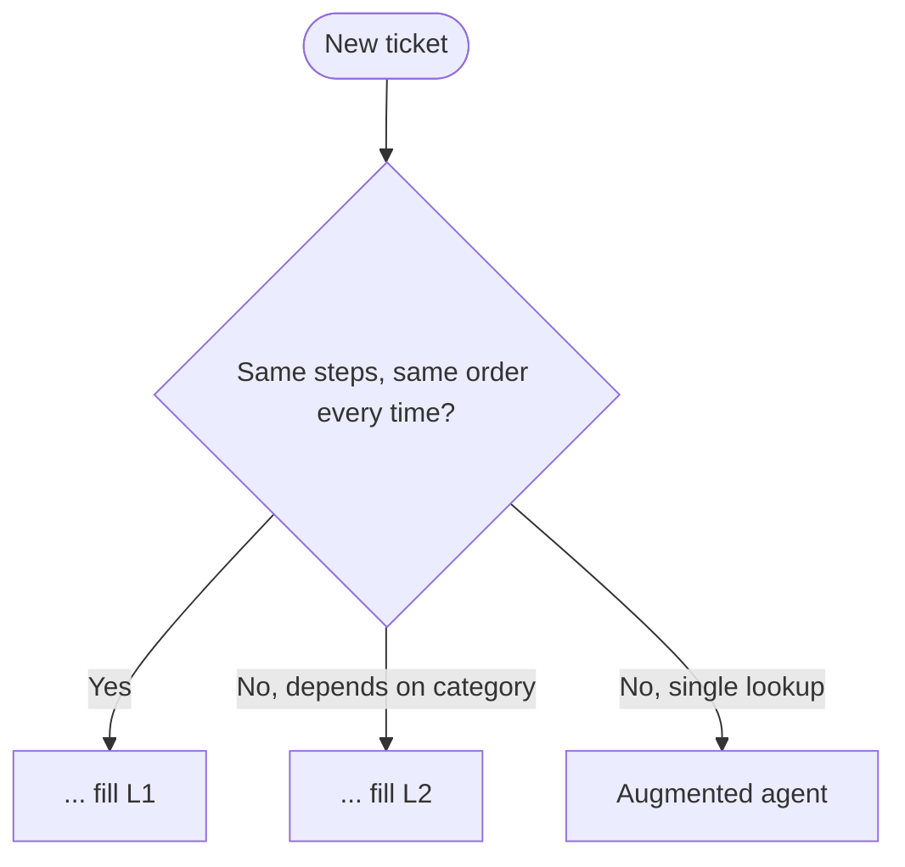

# Exercise 1: Foundations
**Est. time: 15 min | Difficulty: warm-up | Patterns: v1 augmented, v2 chaining, v3 routing**

Practice: MCQ, choose-an-option, fill-the-blank, match-the-primitive, complete-a-flowchart, spot-the-error, fix-code, predict-the-output.

Anchor booking for every task: PNR `JX48Q2`, surname `Rao`, Gold tier, `BLR-DEL` segment cancelled by the airline.

---

## Scenario

Tuesday, low tide. Priya, the ops lead, hands you the easy queue while the senior team preps for the weekend storm. Three tickets. Your job is not to build big. It is to pick the **smallest** thing that works.

The ladder, cheapest first: v1 augmented agent, v2 chaining, v3 routing.

The tickets:
- **T1.** "What's the status of my booking JX48Q2?" A lookup and a plain answer.
- **T2.** Every refund notice must run the same three steps, always in this order: verify identity, check fare rules, write the notice.
- **T3.** Inbound messages split cleanly into status, change, or refund. Each type wants a different specialist and different tools.

---

## Part A: Pick the pattern (MCQ)

Circle one per ticket.

| Ticket | a | b | c |
|---|---|---|---|
| T1 | Routing | Augmented agent | Swarm |
| T2 | Prompt chaining | Routing | Augmented agent |
| T3 | Routing | Chaining | Orchestrator-workers |

---

## Part B: Choose the design, and say why

For T1, two designs land on your desk:

- **Design 1:** one `Agent` with the `get_pnr` tool.
- **Design 2:** a three-agent `Swarm` (lookup agent, backup agent, reviewer agent) with handoffs.

Pick one. In one line, say what the loser costs you that it does not buy back: ________

---

## Part C: Fill the blank

The only question under every pattern choice on Day 6 is: who controls the ________ , you or the model?

---

## Part D: Match the primitive

Draw a line (or write the letter) from each need to the Strands tool that serves it.

| Need | | Strands primitive |
|---|---|---|
| 1. One agent that can call tools | | A. `Swarm` |
| 2. A team of peers that hand off | | B. `GraphBuilder` |
| 3. A structured, auditable flow | | C. `Agent` + `@tool` |

---

## Part E: Complete the flowchart

Fill the two blank leaves with the right pattern name.



- L1 = ________
- L2 = ________

---

## Part F: Spot the error, then fix it

Meera wires the model and gets `on-demand throughput isn't supported` on the first call.

```python
from strands.models import BedrockModel

model = BedrockModel(
    model_id="anthropic.claude-haiku-4-5-20251001-v1:0",
    region_name="us-east-1",
    temperature=0.3,
)
```

- The one thing wrong: ________
- The corrected `model_id`: ________

---

## Part G: Fill the blank (code)

Complete the augmented agent for T1.

```python
from strands import Agent, tool

travelmind = Agent(
    model=haiku,
    name="________",                      # any clear name
    system_prompt="Report flight status for a PNR. Verify identity first.",
    tools=[________],                      # which tool looks up a booking?
)
```

---

## Part H: Predict the output

The T3 router runs a cheap classifier that returns exactly one of: `status`, `change`, `refund`, `baggage`, `complaint`.

```python
label = classifier("Rao here, JX48Q2. My flight was cancelled by the airline. Can I get a refund?")
```

- `label` will be: ________
- Which specialist runs next: ________

---

## Skeptic's corner

Priya asks: "Why not just point one big agent with every tool at all three tickets and skip the pattern talk?"

Give her two lines. One cost reason, one quality reason.
