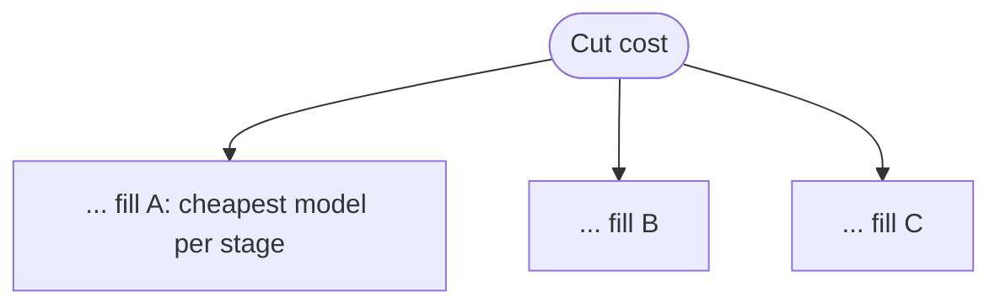

# Exercise 2: The Three Dials and the Bill
**Est. time: 25 min | Difficulty: building | Patterns: v3 routing, v4 parallelization, cost modeling**

Practice: MCQ, dials table, cost math, rank-them, debug-the-harness, spot-the-errors, red-team-the-guard, estimate-the-bill, complete-a-flowchart, two-truths-and-a-lie.

Anchor booking: PNR `JX48Q2`, surname `Rao`, Gold tier, `BLR-DEL` cancelled by the airline.

Illustrative Haiku prices: input `$1.00`, output `$5.00` per 1M tokens.

---

## Scenario

Thursday, the surge. A flash fare sale collides with a weather advisory. Traffic triples. Karan, who owns the cloud bill, is now standing at your desk watching the Bedrock spend tick up in real time.

Two engineers have opinions:
- **Ana** wants to parallelize the change-request flow "to cut the bill."
- **Ravi** wants to wrap every decision in a voting loop "for quality."

Both are about to be half-wrong. Your job is to settle it with numbers.

---

## Part A: Spot the misconception (MCQ)

Ana says running three independent checks in parallel will **save money**. What actually happens?

- a) Cost drops because the calls overlap.
- b) Cost stays about the same; only latency drops, because every call still runs.
- c) Cost drops because parallel calls are billed at a discount.
- d) Cost rises because parallel tokens cost more.

---

## Part B: Fill the dials table

Mark each dial versus a single-agent baseline as **lower**, **higher**, or **same**. Same task throughout.

| Pattern | Cost | Latency | Quality on a hard task |
|---|---|---|---|
| Routing (v3) | ____ | ____ | ____ |
| Parallelization, sectioning (v4) | ____ | ____ | ____ |
| Parallelization, voting (v4) | ____ | ____ | ____ |

---

## Part C: Do the cost math

One model call costs:

$$
\text{cost}_{\text{USD}} = \frac{T_{in}}{10^{6}} \cdot p_{in} + \frac{T_{out}}{10^{6}} \cdot p_{out}
$$

Two ways to answer the same refund query:

| Design | Call | $T_{in}$ | $T_{out}$ |
|---|---|---|---|
| Routing | classifier | 500 | 20 |
| Routing | refund specialist | 1200 | 300 |
| Mega-agent | single call | 3000 | 320 |

Fill in:
- Routing classifier cost = ________
- Routing specialist cost = ________
- Routing total = ________
- Mega-agent total = ________
- Cheaper design: ________
- One sentence, why the design with **more calls** still wins: ________

---

## Part D: Rank them by cost

Four designs for one change request, with token profiles. Compute each, then order them cheapest to priciest.

| Design | Calls and tokens ($T_{in}$ / $T_{out}$) |
|---|---|
| A. Routing | classifier 500/20, specialist 1200/300 |
| B. Mega generalist | one call 3000/320 |
| C. Parallel sectioning | 3 workers each 800/150, aggregator 900/200 |
| D. Voting x3 | three calls each 1200/300 |

Ranking (cheapest first): ________ < ________ < ________ < ________

---

## Part E: Debug the cost helper

This should total the cost of every call in a ledger. It has **two** bugs.

```python
def block_cost(ledger):
    total = 0
    for tier, usage in ledger:
        p_out, p_in = PRICES[tier]                                  # line A
        total += usage["input"] * p_in + usage["output"] * p_out    # line B
    return total
```

- Bug 1 (line A): ________
- Bug 2 (line B): ________
- Rewrite the two corrected lines: ________

---

## Part F: Red-team the parallel code

Ana ships this for the surge.

```python
async def gather_change(msg):
    return await asyncio.gather(
        asyncio.to_thread(metered, fare_agent, msg),
        asyncio.to_thread(metered, reaccom_agent, msg),
        asyncio.to_thread(metered, loyalty_agent, msg),
    )
```

It works on your laptop and melts under the surge.

- Name the two guards it is missing: ________
- What failure shows up first under 3x traffic: ________

---

## Part G: Estimate the bill

At the surge peak, TravelMind handles **10,000** change-like queries a day.

- Routing at your Part C total, daily cost = ________
- Mega-agent at your Part C total, daily cost = ________
- Yearly difference (365 days) = ________
- Karan asks for one lever to cut cost without hurting quality. Name it: ________

---

## Part H: Complete the cost-decision flowchart

Fill the three blanks with a concrete lever.



- A hint given. Fill B and C with two more cost levers from the deck: ________ , ________

---

## Part I: Two truths and a lie

One is false. Mark it, rewrite it correctly.

1. Parallel sectioning cuts wall-clock to the slowest subtask, not the sum.
2. Voting raises confidence and always lowers cost.
3. Routing sends the heavy work down one branch, so it usually beats a mega-agent on tokens.

---

## Skeptic's corner

Ravi wants voting on every reply "to be safe."

- When is voting genuinely worth 3x the calls?
- When is it just a bigger bill? Two lines.
