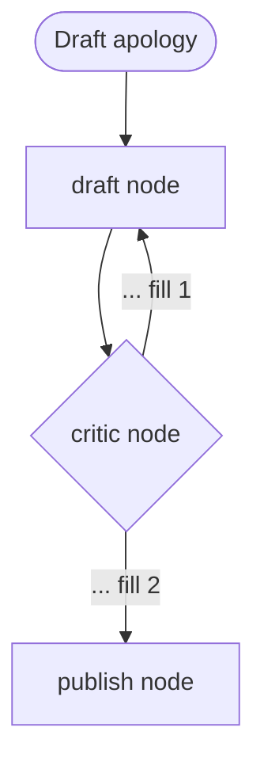

# Exercise 3: Delegation and Critique
**Est. time: 40 min | Difficulty: intermediate | Patterns: v5 orchestrator-workers, v6 evaluator-optimizer**

Practice: MCQ, choose-an-option, fill-the-blank code, fix-code, complete-a-flowchart, table-fill, spot-the-error, trace-the-delegation, name-the-failure-mode, one-line-diff, refactor-to-cheaper, estimate-the-bill, two-truths-and-a-lie.

Anchor booking: PNR `JX48Q2`, surname `Rao`, Gold tier, `BLR-DEL` cancelled by the airline.

---

## Scenario

The complaint pile grows and the apology letters pile beside it.

- **Sub-scenario 1: Nadia's mess.** "Cancelled my BLR-DEL, I'm Gold, I want a refund OR the next flight, and I paid for a seat, what happens to it?" One message, four tangled asks, no clean category.
- **Sub-scenario 2: Sofia's bar.** Every customer-facing apology must pass a written policy and tone check before it is sent. Sofia in compliance will not accept "close enough."

Two patterns, two problems. Do not mix them up.

---

## Part A: Match each sub-scenario (MCQ)

| Sub-scenario | a | b | c |
|---|---|---|---|
| Nadia's mess | Routing | Orchestrator-workers | Chaining |
| Sofia's bar | Parallelization | Evaluator-optimizer | Routing |

---

## Part B: Choose the design for Nadia

- **Design 1:** a router with a fixed classifier that picks one branch.
- **Design 2:** an orchestrator that consults specialists as tools and decides which ones at runtime.

Pick one. One line: what does routing fail to handle in Nadia's message? ________

---

## Part C: Fill the blank (agents as tools)

Complete the orchestrator so it can delegate.

```python
flight_specialist  = Agent(model=haiku, name="flight_specialist",  system_prompt="...", tools=[get_pnr])
fare_specialist    = Agent(model=haiku, name="fare_specialist",    system_prompt="...", tools=[get_pnr, get_fare_rules])
refund_specialist  = Agent(model=haiku, name="refund_specialist",  system_prompt="...", tools=[get_pnr, check_refund_eligibility])

orchestrator = Agent(
    model=haiku,
    name="orchestrator",
    system_prompt="Read the message, consult only the specialists needed, then synthesize one reply.",
    tools=[________, ________, ________],     # the three specialists
)
```

---

## Part D: Fix the broken delegation

Meera's version throws no error, but the orchestrator cannot address one specialist by name.

```python
flight = Agent(model=haiku, name="flight_specialist", system_prompt="...", tools=[get_pnr])
fare   = Agent(model=haiku, name="fare_specialist",   system_prompt="...", tools=[get_pnr, get_fare_rules])
refund = Agent(model=haiku, system_prompt="Decide refund eligibility.")    # <-- here

orchestrator = Agent(model=haiku, name="orchestrator",
                     system_prompt="Delegate to specialists.",
                     tools=[flight, fare, refund])
```

- What is wrong: ________
- The one-line fix: ________

---

## Part E: Trace the delegation

Nadia's message hits the orchestrator. List a plausible order of specialist calls the model would make, and the one part of her message each call resolves.

| Step | Specialist called | Part of Nadia's message it answers |
|---|---|---|
| 1 | ________ | ________ |
| 2 | ________ | ________ |
| 3 | ________ | ________ |
| 4 | ________ | ________ |

Then answer: on a different message ("just tell me my gate"), how many specialists would the orchestrator call, and why? ________

---

## Part F: Complete the evaluator flowchart

Fill the two edge labels.



- Label 1 = ________
- Label 2 = ________

---

## Part G: Fill the edge table

For the cyclic evaluator graph, complete the condition column.

| From | To | Condition |
|---|---|---|
| draft | critic | ________ |
| critic | draft | ________ |
| critic | publish | ________ |

---

## Part H: Spot the error and name the failure mode

Sofia's critic is strict and rarely satisfied on the first pass. Meera ships this graph.

```python
b.add_edge("draft", "critic")
b.add_edge("critic", "draft",   condition=needs_revision)
b.add_edge("critic", "publish", condition=is_approved)
b.set_entry_point("draft")
graph = b.build()
```

- What is missing: ________
- Name the failure mode in three words or fewer: ________
- The one-line diff that stops it: ________
- The second line that keeps each redraft clean: ________

---

## Part I: Red-team the critic

Ravi writes a critic prompt that says only "make it good."

- Why does this loop burn tokens without improving much: ________
- What must the critic prompt contain to be worth running: ________

---

## Part J: Refactor to cheaper

Priya finds an orchestrator wired for a queue that splits cleanly into exactly four categories, one branch each, no overlap.

```python
orchestrator = Agent(model=haiku, name="orchestrator",
                     system_prompt="Delegate to specialists.",
                     tools=[status_agent, change_agent, refund_agent, baggage_agent])
```

- What is over-engineered here: ________
- The smaller pattern that fits: ________
- One line: what you gain by switching: ________

---

## Part K: Estimate the bill

Sofia's apology loop runs a generator plus a critic each pass. Assume a per-pass cost of `$0.003`.

- Cost if the draft passes on pass 1: ________
- Cost if it takes 4 passes: ________
- Cost with an uncapped loop and a critic that never approves: ________
- The cap you would set, and why that number: ________

---

## Part L: Two truths and a lie

One is false. Mark and correct it.

1. Orchestrator-workers and routing draw the same tree, but the orchestrator lets the model choose how many branches run.
2. An evaluator-optimizer loop is the largest single lever on customer-facing quality.
3. A voting loop and an evaluator loop are the same pattern with different names.

---

## Skeptic's corner

A teammate wants an evaluator-optimizer loop on every response the system produces, including internal status lookups.

- Where does the loop earn its cost?
- Where is it pure waste? Two lines.
