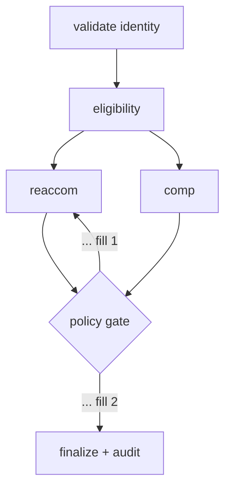

# Exercise 4: Swarm and Graph
**Est. time: 60 min | Difficulty: advanced | Patterns: v7 swarm, v8 graph**

Practice: MCQ, swarm-defect table, fix-code, sequence-the-handoff, spot-ping-pong, predict-execution-order, complete-the-AND-factory, fix-the-diamond, node-type table, spot-the-error, audit reasoning, estimate-the-bill, two-truths-and-a-lie.

Anchor booking: PNR `JX48Q2`, surname `Rao`, Gold tier, `BLR-DEL` cancelled by the airline.

---

## Scenario

Two problems land the same night.

- **Sub-scenario 1: the storm.** A monsoon grounds 40 flights. Re-accommodation, fare waivers, duty-of-care, and comms all interact, and nobody can say up front in what order. Meera reaches for a **swarm**.
- **Sub-scenario 2: the auditor.** Sofia needs involuntary rebookings to be provable later: identity checked by a hard rule, every decision logged, the path identical every run. That is a **graph**.

Dev, the on-call SRE, will get paged if either one runs up an open-ended bill. Do not let that happen.

---

## Part A: Match the sub-scenario (MCQ)

| Sub-scenario | a | b | c |
|---|---|---|---|
| The storm | Graph | Swarm | Routing |
| The auditor | Swarm | Graph | Orchestrator-workers |

---

## Part B: Debug the swarm

Meera's IRROPS swarm. It compiles and behaves badly.

```python
from strands.multi_agent import Swarm

reaccom = Agent(model=haiku, system_prompt="Find alternative flights. Hand off when done.")
fare    = Agent(model=haiku, name="fare_agent", system_prompt="Confirm fare rules and waivers.")
comms   = Agent(model=haiku, name="comms_agent", system_prompt="Write the customer message.")

irrops_swarm = Swarm(
    [reaccom, fare, comms],
    entry_point="reaccom",
)
```

Fill the review table. Each row is a real defect.

| # | Line or setting | What is wrong | The fix |
|---|---|---|---|
| 1 | `from strands.multi_agent import Swarm` | ________ | ________ |
| 2 | `reaccom = Agent(...)` | ________ | ________ |
| 3 | `entry_point="reaccom"` | ________ | ________ |
| 4 | the `Swarm(...)` call overall | ________ | ________ |

Then rewrite the whole block, corrected.

---

## Part C: Sequence the handoff

Four peers, one storm case. Write a plausible handoff path from entry to final message.

Agents: `reaccom_specialist`, `fare_specialist`, `compensation_specialist`, `comms_specialist`.

- Handoff path: ________ -> ________ -> ________ -> ________
- Now spot the trap: name two agents that could bounce control back and forth forever, and the setting that stops them: ________

---

## Part D: Complete the graph diagram, then predict the execution order

First, fill the two edge labels on Sofia's rebooking graph.



- Label 1 (the feedback edge) = ________
- Label 2 (the exit edge) = ________

Now the code behind the same diamond. `validate` fans out to `reaccom` and `comp`; both feed `gate`.

```python
b.add_edge("validate", "reaccom")
b.add_edge("validate", "comp")
b.add_edge("reaccom", "gate")
b.add_edge("comp",    "gate")
b.set_entry_point("validate")
```

In the Python SDK, a node fires when any one incoming edge is satisfied. Suppose `reaccom` finishes before `comp`.

- What runs the moment `reaccom` completes: ________
- What data is `gate` missing when it runs: ________
- Crash or silent wrong answer: ________

---

## Part E: Complete the AND-condition factory

Fix Part D so `gate` waits for both inputs.

```python
from strands.multiagent.base import Status

def all_dependencies_complete(required):
    def check(state):
        return all(________ for n in required)      # FILL the full condition
    return check

both_ready = ________                                 # FILL

b.add_edge("reaccom", "gate", condition=________)     # FILL
b.add_edge("comp",    "gate", condition=________)     # FILL
```

---

## Part F: Fill the node-type table

For the auditable rebooking graph, mark each node as **deterministic gate** (a hard rule in a tool) or **agent** (model reasoning), and give a one-line reason.

| Node | Type | Reason |
|---|---|---|
| validate identity | ________ | ________ |
| eligibility | ________ | ________ |
| reaccom | ________ | ________ |
| comp | ________ | ________ |
| policy gate | ________ | ________ |
| finalize + audit | ________ | ________ |

---

## Part G: Spot the error in the condition

The policy gate never lets the flow reach `finalize`, even when the case clearly passes.

```python
def policy_passed(state):
    r = state.results.get("policygate")               # the node was added as "gate"
    return bool(r) and "policy pass" in str(r.result).lower()
```

- What is wrong: ________
- The fix: ________

---

## Part H: Audit reasoning

Fill the blank and answer the short question.

- A swarm explores; a graph ________ .
- The auditor asks "why was this passenger rebooked this way?" Name the two artifacts a graph run gives you that a swarm cannot: ________ and ________

---

## Part I: Red-team the swarm guards

Meera set `max_handoffs=12` and two timeouts, but left out the repetitive-handoff settings.

- What can still go wrong: ________
- The two settings that close the gap: ________ and ________

---

## Part J: Estimate the swarm bill

The storm swarm ran and its `node_history` shows **6** node executions. Assume each averaged 900 input and 220 output tokens on Haiku (`$1.00` in, `$5.00` out per 1M).

$$
\text{cost}_{\text{USD}} = \frac{T_{in}}{10^{6}} \cdot p_{in} + \frac{T_{out}}{10^{6}} \cdot p_{out}
$$

- Cost per execution = ________
- Total for this run = ________
- Why is this a range and not a fixed number you can quote a client: ________

---

## Part K: Two truths and a lie

One is false. Mark and correct it.

1. A graph gives a fixed, inspectable execution order; a swarm's path emerges at runtime.
2. In the Python graph, a join node waits for all its incoming edges by default.
3. A swarm is the least deterministic pattern on cost, so it needs the tightest guards.

---

## Skeptic's corner

Meera says: "The graph is deterministic, so I don't need timeouts or execution caps."

- Where is she right?
- Where does she get paged at 3am? Two lines.
