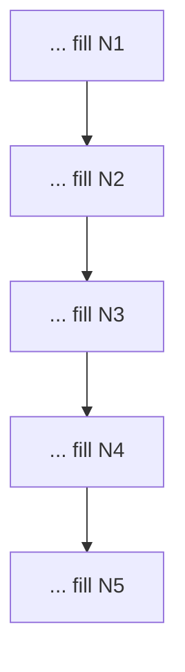

# Exercise 5: Capstone, Composition
**Est. time: 90 min | Difficulty: capstone | Patterns: v9 composition plus everything from v1 to v8**

Practice: design-on-paper, complete-the-flowchart, node-type table, wire-the-skeleton, spot-the-error, predict-execution-order, red-team-the-seams, cost-model estimate, refactor-the-bloat, self-scoring design rubric, two-truths-and-a-lie, integrative choose-and-justify, scale estimate.

Anchor booking: PNR `JX48Q2`, surname `Rao`, Gold tier, `BLR-DEL` cancelled by the airline.

---

## Scenario

One incident, start to finish. A wide-body goes tech. TravelMind must handle an **involuntary downgrade**: a Gold passenger booked business, gets moved to economy, and policy owes them a fare-difference refund plus compensation. There is a missed connection to sort too.

The constraints collide:
- **Sofia (compliance):** the whole flow must be auditable end to end. Identity by hard rule, every decision logged, deterministic order.
- **Karan (cost):** he wants the bill per event and the single most expensive node named.
- **Priya (ops):** the "assemble the best make-good package" step is open-ended and genuinely benefits from a few agents exploring together.

You cannot satisfy all three with one flat pattern. This is what composition is for: a deterministic graph on the outside, a swarm inside one node. Rails where you need them, freedom where it pays.

---

## Part A: Design on paper, complete the flow

Fill the five node purposes.



- N1 = ________
- N2 = ________
- N3 = ________
- N4 = ________
- N5 = ________

---

## Part B: Choose the shell, place the creativity (node-type table)

Mark each node **deterministic gate**, **agent**, or **swarm**, and justify in one line.

| Node | Type | Why this type |
|---|---|---|
| N1 | ________ | ________ |
| N2 | ________ | ________ |
| N3 | ________ | ________ |
| N4 | ________ | ________ |
| N5 | ________ | ________ |

Which single node is the swarm, and why does it belong inside the graph rather than replacing it? ________

---

## Part C: Wire the skeleton

Fill the blanks so the swarm becomes one node inside the compliance graph.

```python
from strands.multiagent import GraphBuilder, Swarm

options_swarm = Swarm(
    [planner, flight_finder, care_desk],
    entry_point=________,               # which agent starts the swarm
    max_handoffs=8,
    max_iterations=8,
    execution_timeout=400.0,
    node_timeout=150.0,
    repetitive_handoff_detection_window=5,
    repetitive_handoff_min_unique_agents=2,
)

cb = GraphBuilder()
cb.add_node(validate,     "validate")
cb.add_node(eligibility,  "eligibility")
cb.add_node(________, "options")        # what goes in as the "options" node
cb.add_node(gate,         "gate")
cb.add_node(finalize,     "finalize")

cb.add_edge("validate", "eligibility", condition=identity_ok)
cb.add_edge("eligibility", "options")
cb.add_edge("options", "gate")
cb.add_edge("gate", "finalize", condition=________)   # the pass condition
cb.set_entry_point("validate")
cb.set_max_node_executions(16)
composed = cb.build()
```

---

## Part D: Spot the error in the composition

A colleague writes the gate condition to read a node from **inside** the swarm.

```python
def gate_ready(state):
    r = state.results.get("flight_finder")   # flight_finder lives inside options_swarm
    return bool(r)
```

- Why is this wrong: ________
- Which node id should the condition read instead: ________

---

## Part E: Predict the outer execution order

For the graph in Part C, with a clean case that passes the gate on the first try, write the outer `execution_order`.

- Order: ________ -> ________ -> ________ -> ________ -> ________
- The `options` node is one entry in that list. Where does the swarm's own handoff history live? ________

---

## Part F: Red-team the seams

Meera's first draft of the inner swarm:

```python
options_swarm = Swarm([planner, flight_finder, care_desk], entry_point=planner)
```

She points at `cb.set_max_node_executions(16)` and says the whole system is bounded.

- Is it actually bounded: ________
- Name the missing guards on the inner swarm: ________
- One sentence: why an outer graph cap does not save you from an ungoverned swarm inside a node: ________

---

## Part G: Cost model for the whole flow

Estimate the per-event cost. Token profiles per node (Haiku, `$1.00` in / `$5.00` out per 1M):

| Node | $T_{in}$ | $T_{out}$ | Notes |
|---|---|---|---|
| validate | 400 | 30 | one gate call |
| eligibility | 1100 | 260 | one agent call |
| options (swarm) | 2600 | 720 | summed over its handoffs |
| gate | 700 | 90 | one gate call |
| finalize | 900 | 240 | one gate call |

$$
\text{cost}_{\text{USD}} = \frac{T_{in}}{10^{6}} \cdot p_{in} + \frac{T_{out}}{10^{6}} \cdot p_{out}
$$

- Cost per node (five numbers): ________
- Total per event: ________
- Most expensive node: ________
- One lever to cut that node's cost without breaking the audit trail: ________

---

## Part H: Scale it

TravelMind sees **50,000** involuntary events a month.

- Monthly cost at your Part G total: ________
- If a cheaper single-agent design cost half as much but failed the audit 3% of the time, would you ship it? One line, and name the real cost of a failed audit: ________

---

## Part I: Explain it to compliance

Sofia asks: "Prove to me why this passenger got this package."

- Name the two run artifacts you would hand her: ________ and ________
- One sentence: why a swarm alone could not answer her: ________

---

## Part J: Refactor the bloat

Someone built a full composition (graph plus inner swarm) for a plain "what's my flight status" lookup.

- What is over-engineered: ________
- The smallest pattern that answers a status lookup: ________
- Rewrite it in one or two lines of Strands: ________

---

## Part K: Self-scoring design review

Score your Part C design. One point each. Below 8 out of 9 means prototype, not product.

| Check | Pass? |
|---|---|
| Model tiering set per node, cheapest by default | ____ |
| Execution cap on the graph | ____ |
| Timeouts on the graph | ____ |
| Caps and timeouts on the inner swarm | ____ |
| Repetitive-handoff guard on the swarm | ____ |
| AND-condition on any join node | ____ |
| Hard rules in deterministic tools, not model text | ____ |
| Audit log written at the decision points | ____ |
| No hardcoded keys or region in code | ____ |

Your score: ____ / 9. The one gap you will close first: ________

---

## Part L: Two truths and a lie

One is false. Mark and correct it.

1. A `Swarm` is a valid node inside a `GraphBuilder` graph.
2. Composition lets the model own the whole path while you keep an audit trail.
3. In composition, you inherit the dials of each nested part, so every sub-pattern must be bounded.

---

## Part M: Integrative, choose and justify

Three fresh tickets. For each, name the smallest pattern (v1 to v9), who controls the path, and one line of justification.

- **Ticket X:** "Run our nightly batch that re-prices 5,000 expiring fares through the same four fixed steps every time."
- **Ticket Y:** "A VIP escalation with a cancelled flight, a service-recovery budget, a loyalty exception, and legal sensitivity, sequence unknown, must be logged."
- **Ticket Z:** "Decide refund eligibility on a disputed high-value ticket where a single model pass has been wrong before."

| Ticket | Pattern | Who controls the path | Justification |
|---|---|---|---|
| X | ________ | ________ | ________ |
| Y | ________ | ________ | ________ |
| Z | ________ | ________ | ________ |

---

## Skeptic's corner

A teammate argues: "Composition is the safest pattern, so default to it for everything."

- What does defaulting to composition cost you on a simple ticket, in money and in debugging time?
- Give the one-sentence rule that decides when composition is worth it. Two lines total.
