# Advanced Strands + Agentic Design Patterns

### Agentic AI Practitioner Bootcamp | Day 6

**Yesterday:** one Strands agent, tools, the agent loop.
**Today:** how one agent becomes many, and how to pick the right shape for a real problem without burning money or latency.

**One thesis for the whole day:**

> Multi-agent is not a badge of sophistication. It is a cost you pay to buy either *quality* or *runtime flexibility*. Pay it on purpose, never by reflex.

We will build every pattern on one evolving system: **TravelMind**, an airline customer-support agent. Same domain, nine evolutions, each one more capable and more robust than the last.

---

## How today is structured

1. The one question that decides your architecture
2. The Three Dials every design trades against
3. The Pattern Ladder (eight patterns, one map)
4. Each pattern: intuition to Strands code to a TravelMind evolution, with the dials scored
5. The master decision matrix (when to reach for which)
6. Production hardening and the cost traps that bite in month one

Notebooks run alongside. Exercises come after.

---

## Where we are: the augmented LLM

Everything today is built from one atom. Yesterday you built it.

**Augmented LLM = model + tools + memory/retrieval.** The model reasons, calls tools, reads results, and decides when it is done. That decision loop is the whole game.

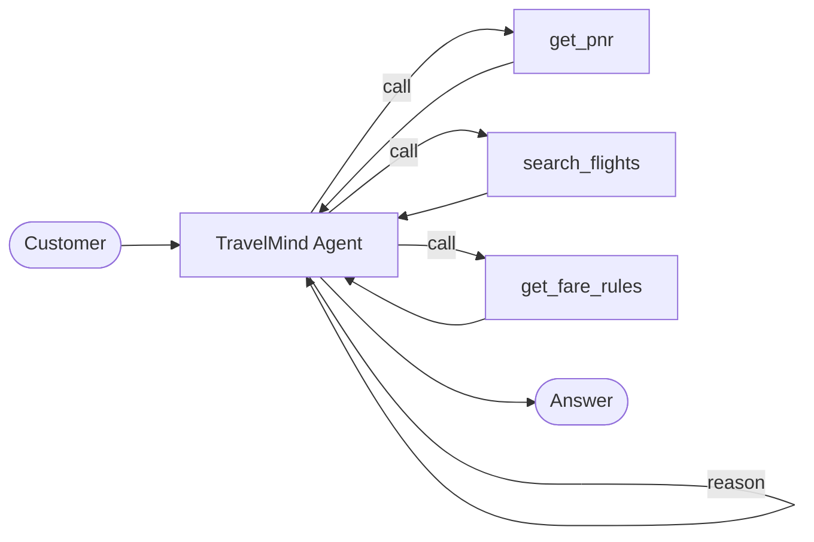

**TravelMind v1** is exactly this: one agent, a few tools, answers "what is my flight status" and simple FAQs. It is the baseline we will keep beating.

Every pattern that follows is a different answer to one question: *who gets to decide the next step?*

---

## The one question: who controls the path?

This single axis separates every pattern you will ever build.

|                           | **Workflow**               | **Agent**                    |
| ------------------------- | -------------------------- | ---------------------------- |
| Who decides the next step | You, in code               | The model, at runtime        |
| Control flow              | Predefined, fixed          | Emergent, chosen live        |
| Predictability            | High                       | Lower                        |
| Cost                      | Lower and known            | Higher and variable          |
| Debugging                 | Easy (fixed path)          | Harder (path varies per run) |
| Use when                  | Steps are known in advance | Steps depend on the input    |

**Workflows** orchestrate LLMs and tools through paths *you* wrote. **Agents** let the model direct its own process and tool use.

The skill is not knowing the patterns. It is knowing how little agency a problem actually needs. Start at the bottom of the ladder. Climb only when the problem forces you.

---

## The Three Dials

Every architecture choice moves three dials at once. Train yourself to feel all three before you write a line of code.

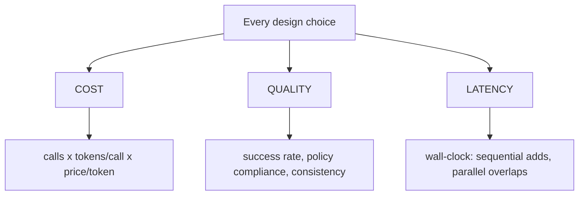

**Cost** = number of model calls × tokens per call × price per token (by model tier).
**Quality** = task success rate, policy compliance, hallucination rate, output consistency.
**Latency** = wall-clock time to a usable answer. Sequential steps stack. Parallel steps overlap. Every extra hop adds round-trip overhead.

**The trades you will see all day:**

- Routing *buys cost savings* (a cheap classifier runs; only one branch does heavy work).
- Parallelization *buys latency* (same calls, overlapped) but not cost.
- Evaluator loops *buy quality* by *spending cost* (each revision is more calls).
- Swarms *buy flexibility* by *risking cost* (autonomous handoffs are unpredictable).
- Graphs *buy determinism and auditability* at the price of upfront design work.

Write the dial scores on the whiteboard for every option. The right answer is usually visible before you code.

---

## Model tiering: the cheapest dial to turn

Before patterns, the single highest-leverage habit: match the model to the job.

| Job in the system                            | Model tier            | Why                                          |
| -------------------------------------------- | --------------------- | -------------------------------------------- |
| Classify / route / extract a field           | Cheapest (Haiku)      | Short output, easy task, runs often          |
| Draft a customer reply, tool orchestration   | Mid (Haiku or Sonnet) | Balance of quality and cost                  |
| High-stakes reasoning, final policy judgment | Strong (Sonnet)       | Worth the spend on the decision that matters |

A router built on the cheapest model that dispatches to a specialist is almost always cheaper than one large model doing everything, *and* often higher quality because each stage is focused. We will prove this with numbers in the notebook.

**Rule:** default every new agent to the cheapest model. Promote a stage to a stronger model only when you can point at the failure that forced it.

---

## The Pattern Ladder

Eight patterns, arranged by how much control you hand to the model. Read bottom to top as increasing agency, cost, and flexibility.

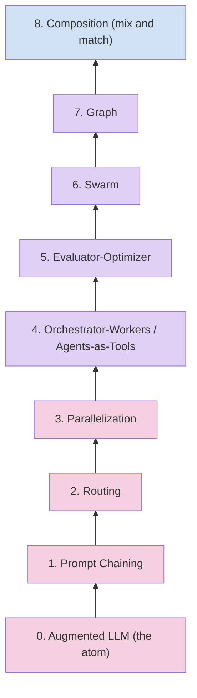

**Pink = workflows** (you own the path). **Purple = agentic** (the model owns more of the path). **Blue = composition** (nest patterns inside patterns).

TravelMind evolves once per rung: v1 at the atom, v9 at composition.

---

## TravelMind: the system context

To keep examples honest, here is the real operating environment TravelMind sits inside. Not a toy.

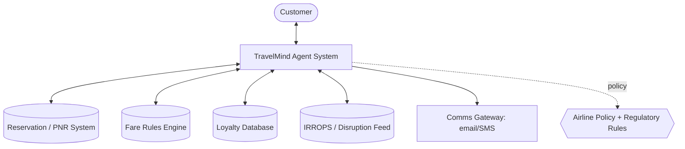

**Domain objects:** PNR / record locator, passenger, itinerary and segments, fare basis and fare rules, loyalty tier, ancillaries (seats, bags), disruption events, re-accommodation options, refund eligibility, duty-of-care and compensation rules.

**Standing policy TravelMind must obey (used by the critic later):**

- Verify identity by record locator plus surname before disclosing anything.
- Never promise a refund without checking fare rules.
- Involuntary changes (airline-caused) waive change fees; voluntary changes do not.
- Delays over a set threshold trigger duty-of-care obligations.
- Never disclose another passenger's data.

---

# Part A: Workflow Patterns

### You own the path. Cheap, predictable, debuggable.

---

## Pattern 1: Prompt Chaining

**Intuition.** Break one hard task into a fixed sequence of easier steps. Each step's output feeds the next. You wrote the order.

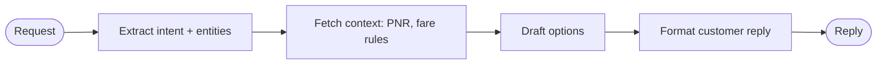

**Reach for it when:** the task decomposes cleanly into steps that always run in the same order. Add a programmatic gate between steps to catch failures early (a "does this PNR exist" check before drafting).

**Avoid when:** the path depends on the input. That is routing, not chaining.

**In Strands:** just call `Agent` instances in order, passing text forward. Or use a Graph sequential pipeline, or the built-in Workflow tool for state and monitoring.

```python
extract = Agent(name="extractor", system_prompt="Extract intent and entities as JSON.")
resolve = Agent(name="resolver", system_prompt="Given intent + PNR data, draft change options.")
reply   = Agent(name="writer",   system_prompt="Turn options into a warm, correct customer reply.")

intent  = str(extract(user_msg))
options = str(resolve(intent))
answer  = str(reply(options))
```

**TravelMind v2:** a "change my flight" request runs the fixed chain above. Predictable and easy to trace.

**Dials:** Cost = low (a few fixed calls). Quality = better than one prompt for multi-step tasks (each step is focused). Latency = sum of steps (they run in order).

---

## Pattern 2: Routing

**Intuition.** Classify the input first, then send it down the one branch that fits. Separation of concerns: the classifier is cheap and single-minded; specialists are focused and better at their niche.

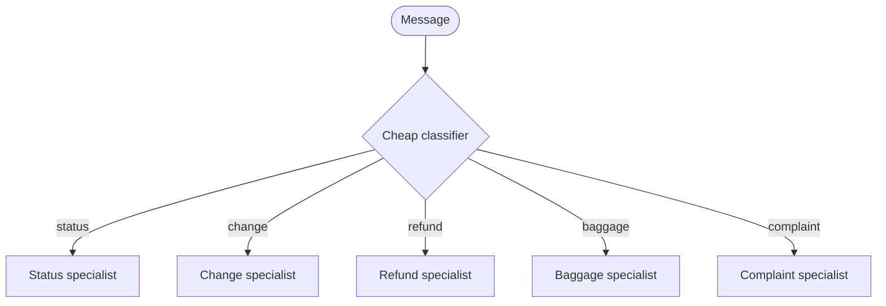

**Reach for it when:** inputs fall into distinct categories that each deserve different handling, tools, or model tiers. Routing lets you send easy queries to a cheap model and hard ones to a strong model.

**Avoid when:** categories overlap heavily or a single agent already handles the spread well. Do not add a router you do not need.

**In Strands:** an orchestrator prompt that dispatches, or a Graph with conditional edges on a classifier node.

```python
def is_refund(state):
    return "refund" in str(state.results.get("classifier").result).lower()

builder.add_edge("classifier", "refund_specialist", condition=is_refund)
```

**TravelMind v3:** a Haiku classifier tags each message, then routes to the matching specialist. The heavy work only ever runs on the branch taken.

**Dials:** Cost = *lower* than one big agent (cheap router, one branch runs). Quality = higher (focused specialists). Latency = one extra classify hop, usually tiny.

**This is the pattern people skip and regret.** Routing is the cheapest quality-and-cost win on the ladder.

---

## Pattern 3: Parallelization

Two flavors, one idea: do independent work at the same time.

**3a. Sectioning** splits a task into independent subtasks that run concurrently, then aggregates.
**3b. Voting** runs the *same* task several times and combines results (majority vote, or "flag if any run says unsafe") to raise confidence on high-stakes calls.

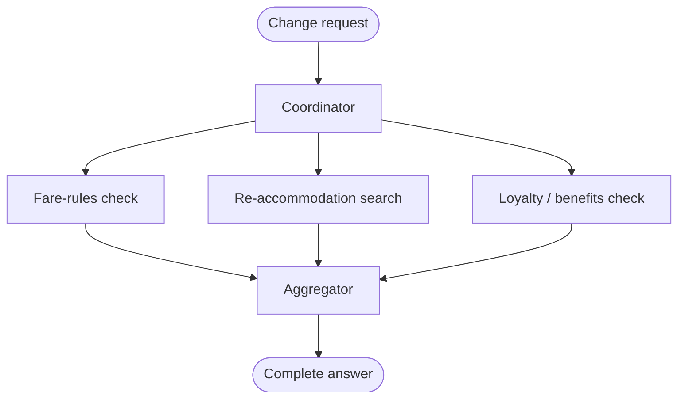

**Reach for sectioning when:** subtasks are independent and you want the wall-clock of the slowest one, not the sum of all. **Reach for voting when:** a decision is high-stakes and one model pass is too risky (refund eligibility, policy calls).

**Avoid when:** subtasks depend on each other (then it is a chain or a graph), or the task is cheap enough that overhead outweighs the gain.

**In Strands:** a Graph coordinator fanning out to workers into an aggregator, or `asyncio.gather` over agent calls, or run a Swarm/Graph node in parallel.

**TravelMind v4:** on a change request, fare-rules, re-accommodation, and loyalty checks fire concurrently, then merge. Separately, refund-eligibility runs three times and majority-votes before any promise is made.

**Dials:** Cost = *same or higher* (all calls still happen; voting multiplies them). Quality = higher for voting. Latency = *much lower* for sectioning (overlap, not sum).

**The trap:** parallel does not save money. It saves time. Voting spends money to buy confidence. Know which one you are buying.

---

## Interlude: the line between workflow and agent

You have now seen the three workflow patterns. Before climbing higher, be honest about the jump.

**A workflow is enough when:** you can draw the full flowchart in advance and it does not change per input.

**You need real agency only when:** the number of steps, the choice of steps, or the tools required cannot be known until the model sees the actual input.

Agentic patterns cost more and behave less predictably. The payoff is handling open-ended problems a fixed flowchart cannot. Everything above this line trades predictability for flexibility. Cross it deliberately.

---

# Part B: Agentic Patterns

### The model owns more of the path. Flexible, powerful, pricier.

---

## Pattern 4: Orchestrator-Workers (Agents as Tools)

**Intuition.** A manager agent handles the customer, then decides *at runtime* which specialists to consult and in what order. Specialists are wrapped as tools the orchestrator can call. This mirrors a human team: a lead delegates to experts as the problem unfolds.

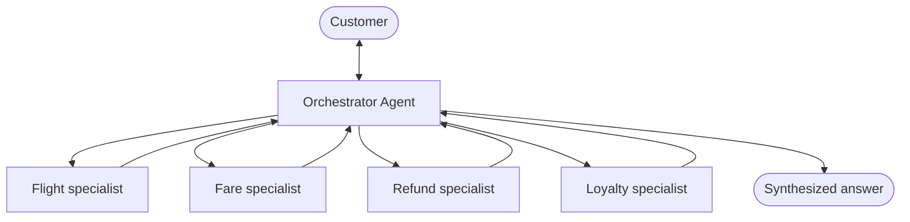

**Routing vs this:** routing picks *one* branch with fixed logic. Orchestrator-workers lets the model pick *which and how many* specialists to call, adapting to a messy multi-part query. Same tree shape, very different control.

**Reach for it when:** a query spans several domains and you cannot predict the mix in advance ("my flight got cancelled, I am Gold, I want a refund or the next flight, and I paid for a seat").

**Avoid when:** the branch is predictable (use routing) or one agent with a few tools already handles it.

**In Strands:** three ways, simplest first.

```python
# 1) Pass agents directly; each becomes a tool named by its `name`
orchestrator = Agent(system_prompt=ROUTER_PROMPT,
                     tools=[flight_specialist, fare_specialist, refund_specialist])

# 2) Customize the tool surface
orchestrator = Agent(tools=[refund_specialist.as_tool(
    name="refund_specialist",
    description="Decide refund eligibility and amounts from fare rules.")])

# 3) Full control: wrap in @tool for pre/post processing and error handling
@tool
def refund_specialist(query: str) -> str:
    """Decide refund eligibility from fare rules and reason."""
    agent = Agent(system_prompt=REFUND_PROMPT, tools=[get_fare_rules])
    return str(agent(query))
```

**TravelMind v5:** the supervisor consults only the specialists a given query needs, then synthesizes one answer.

**Dials:** Cost = higher (every consulted specialist is a call, count is variable). Quality = high on complex queries. Latency = variable (depends how many specialists get called).

---

## Pattern 5: Evaluator-Optimizer

**Intuition.** One agent generates, a second agent critiques against explicit criteria, and the generator revises. Loop until the critic approves or you hit a cap. This is how you get customer-facing quality without a human in the loop.

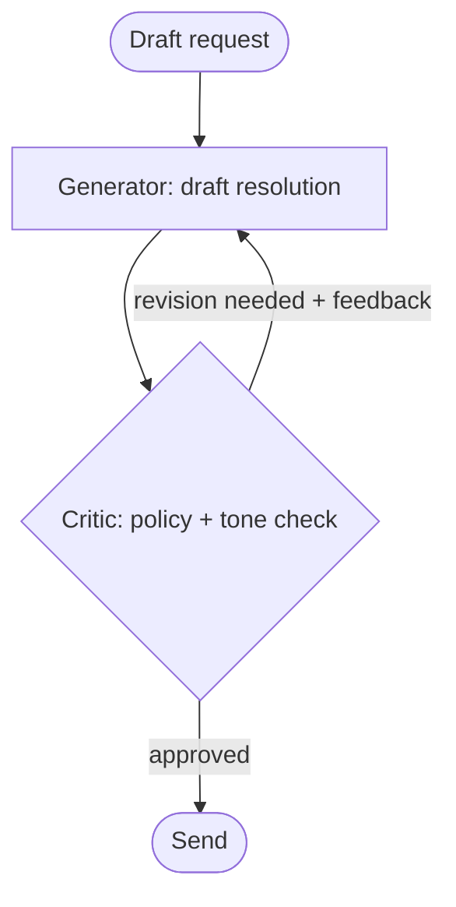

**Reach for it when:** you have clear evaluation criteria and iteration measurably improves output. Customer comms, policy-sensitive replies, anything where "close" is not good enough.

**Avoid when:** you cannot articulate what "good" means, or a single pass is already reliable. A loop with vague criteria just burns tokens.

**In Strands:** a cyclic Graph is the clean primitive. Draft node to critic node, with a conditional edge back to draft on failure, and a cap.

```python
builder.add_edge("draft", "critic")
builder.add_edge("critic", "draft",     condition=needs_revision)
builder.add_edge("critic", "publisher", condition=is_approved)
builder.set_max_node_executions(6)   # cap the loop
builder.reset_on_revisit(True)       # fresh draft state each pass
```

**TravelMind v6:** a draft reply is checked against the standing policy (refund promises, fee waivers, identity, data disclosure) and tone. It regenerates with the critic's notes until it passes.

**Dials:** Cost = higher and grows with iterations (cap it). Quality = the highest single lever for customer-facing text. Latency = higher (loops are sequential by nature).

**The trap:** an uncapped loop is an unbounded bill. Always set a max and a hard stop.

---

## Pattern 6: Swarm

**Intuition.** A team of peers with shared memory and no central boss. Any agent can hand control to any other when it hits the edge of its expertise. The path emerges from the agents themselves. Good for open-ended, collaborative problems where you cannot pre-draw the flow.

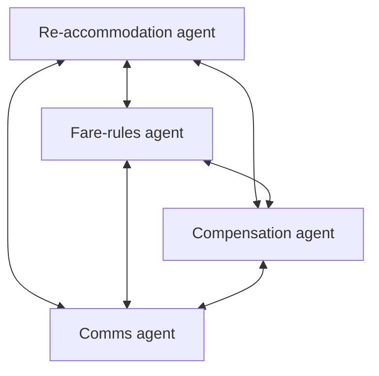

**How it works in Strands:** each agent is auto-equipped with a `handoff_to_agent` tool and shares a common context (task, who worked on it, what they found). The first agent (or `entry_point`) takes the input; agents hand off until one produces the final answer.

```python
from strands.multiagent import Swarm

swarm = Swarm(
    [reaccom_agent, fare_agent, compensation_agent, comms_agent],
    entry_point=reaccom_agent,
    max_handoffs=20,
    max_iterations=20,
    execution_timeout=900.0,
    node_timeout=300.0,
    repetitive_handoff_detection_window=8,   # guard against ping-pong
    repetitive_handoff_min_unique_agents=3,
)
result = swarm("Flight JX48Q2 cancelled. Passenger is Gold with a paid seat.")
```

**TravelMind v7:** an irregular-operations (IRROPS) cancellation kicks off the swarm. The compensation agent hands to the fare agent to confirm a fee waiver, which hands to re-accommodation for options, which hands to comms to draft the notice. Nobody scripted that order.

**Reach for it when:** the problem is collaborative and the sequence is genuinely unknown up front.

**Avoid when:** you need a guaranteed path, an audit trail, or predictable cost. Swarms are the least deterministic pattern.

**Dials:** Cost = variable and potentially high (autonomous handoffs). Quality = high on fuzzy, collaborative tasks. Latency = variable.

**The traps:** ping-pong handoffs (two agents bouncing forever, so enable repetitive-handoff detection) and unbounded runs (always set `max_handoffs` and timeouts).

---

## Pattern 7: Graph

**Intuition.** A directed graph where nodes are agents (or deterministic functions, or nested swarms/graphs) and edges are dependencies. Execution follows the structure you defined. This is how you get flexibility *and* control: the model reasons inside nodes, but the flow is yours, inspectable, and auditable.

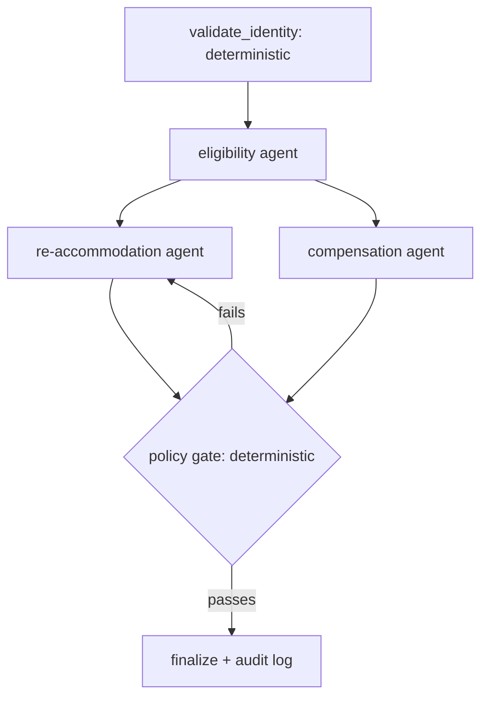

**Why Graph over Swarm for regulated flows:** you know every node that will run, the order is deterministic, and you can drop in non-LLM nodes for hard business rules and audit logging. Cost is predictable because the node count is known.

**In Strands:**

```python
from strands.multiagent import GraphBuilder

builder = GraphBuilder()
builder.add_node(validate_identity, "validate")   # a deterministic FunctionNode
builder.add_node(eligibility_agent, "eligibility")
builder.add_node(reaccom_agent,     "reaccom")
builder.add_node(compensation_agent,"comp")
builder.add_node(policy_gate,       "gate")
builder.add_node(finalize,          "finalize")

builder.add_edge("validate", "eligibility")
builder.add_edge("eligibility", "reaccom")
builder.add_edge("eligibility", "comp")
builder.add_edge("reaccom", "gate")
builder.add_edge("comp", "gate")
builder.add_edge("gate", "reaccom", condition=policy_failed)  # feedback loop
builder.add_edge("gate", "finalize", condition=policy_passed)
builder.set_max_node_executions(12)
graph = builder.build()
```

**The gotcha that will bite you (Python).** In the Python SDK, a node fires when **any** one incoming edge is satisfied (OR semantics). For a diamond where the gate must wait for *both* re-accommodation *and* compensation, you must add explicit AND conditions:

```python
from strands.multiagent.graph import GraphState
from strands.multiagent.base import Status

def all_done(required):
    def check(state: GraphState) -> bool:
        return all(n in state.results and state.results[n].status == Status.COMPLETED
                   for n in required)
    return check

builder.add_edge("reaccom", "gate", condition=all_done(["reaccom", "comp"]))
builder.add_edge("comp",    "gate", condition=all_done(["reaccom", "comp"]))
```

Miss this and your aggregator runs on half the inputs. Teach your team this on day one of Graphs.

**TravelMind v8:** involuntary rebooking runs as an auditable graph with a deterministic identity check, a deterministic policy gate, and a logged finalize step.

**Dials:** Cost = predictable (known node count). Quality = high with control. Latency = sum along the critical path; deep graphs add hops.

---

## Pattern 8: Composition

**Intuition.** The endgame. Nest patterns inside patterns. Swarms can contain graphs. Graphs can orchestrate swarms. Any node can be an agent that itself has agents as tools.

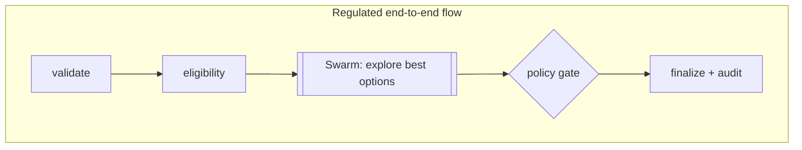

**TravelMind v9:** the top level is a compliance Graph (rails, audit, determinism). The single "find the best re-accommodation and compensation package" node is a **Swarm** (creative, collaborative, open-ended). The graph supplies the guardrails; the swarm supplies the exploratory problem-solving inside one contained step.

**The principle:** use the deterministic outer shell for anything regulated or auditable, and pocket the open-ended creativity inside a bounded node. This is how production systems actually look.

**Dials:** you inherit the dials of each nested piece. Bound every sub-pattern (swarm timeouts, graph execution caps) so the whole thing stays predictable.

---

# Part C: Choosing and Shipping

---

## The Master Decision Matrix

The one table to internalize. When a problem lands on your desk, walk this.

| Pattern                  | Who controls path       | Determinism | Cost                   | Latency              | Best for                                 | Avoid when                          | Strands primitive                             |
| ------------------------ | ----------------------- | ----------- | ---------------------- | -------------------- | ---------------------------------------- | ----------------------------------- | --------------------------------------------- |
| **Augmented LLM**        | Model (within one loop) | Medium      | Low                    | Low                  | Single-domain Q&A with a few tools       | Task needs multiple distinct stages | `Agent` + `@tool`                             |
| **Prompt Chaining**      | You                     | High        | Low                    | Sum of steps         | Fixed multi-step tasks                   | Path depends on input               | Sequential`Agent` calls / Graph               |
| **Routing**              | You (fixed logic)       | High        | **Lowest per query**   | +1 hop               | Distinct input categories                | Categories overlap heavily          | Orchestrator prompt / Graph conditional edges |
| **Parallelization**      | You                     | High        | Same or higher         | **Lowest (overlap)** | Independent subtasks; high-stakes voting | Subtasks depend on each other       | Graph parallel /`asyncio.gather`              |
| **Orchestrator-Workers** | Model (runtime)         | Medium      | Higher, variable       | Variable             | Unpredictable multi-domain queries       | Branch is predictable               | Agents as Tools                               |
| **Evaluator-Optimizer**  | You (loop) + model      | Medium      | Higher (per iteration) | Higher               | Clear criteria, iteration helps          | Criteria are vague                  | Cyclic Graph                                  |
| **Swarm**                | Model (peers)           | **Lowest**  | Variable, high         | Variable             | Open-ended collaboration                 | Need audit trail or fixed cost      | `Swarm`                                       |
| **Graph**                | You (structure)         | **High**    | Predictable            | Critical path        | Regulated / auditable flows              | Simple linear task                  | `GraphBuilder`                                |
| **Composition**          | Mixed                   | Mixed       | Inherited              | Inherited            | Regulated shell + creative core          | You have not bounded the parts      | Graph + nested Swarm                          |

**The default answer is lower on this table, not higher.** Move up only when the row you are on cannot do the job.

---

## Cost, Quality, Performance: the cheat sheet

**To cut cost:**

- Route to the cheapest model that works; promote only on proven failure.
- Add a cheap classifier so heavy work runs on one branch, not all.
- Cache static system prompts and tools (Bedrock prompt caching: big reuse discount).
- Cap every loop and swarm. Set timeouts everywhere.

**To raise quality:**

- Add an evaluator-optimizer loop with explicit, written criteria.
- Use voting on high-stakes, irreversible decisions.
- Give specialists focused prompts and only the tools they need.

**To cut latency:**

- Parallelize independent subtasks (sectioning).
- Flatten deep graphs; every hop is a round trip.
- Prefer routing (1 branch) over orchestrator-workers (many calls) when the branch is knowable.

---

## Anti-patterns and cost traps

The mistakes that show up in production month one.

| Trap                               | What happens                                                       | Fix                                                       |
| ---------------------------------- | ------------------------------------------------------------------ | --------------------------------------------------------- |
| Multi-agent by reflex              | A single agent + tools would have worked; you pay N times the cost | Start at the atom, climb only when forced                 |
| Uncapped evaluator loop            | Unbounded revisions, unbounded bill                                | `set_max_node_executions`, hard stop                      |
| Swarm ping-pong                    | Two agents hand off forever                                        | Enable repetitive-handoff detection, set`max_handoffs`    |
| Sonnet everywhere                  | Paying premium rates for routing and extraction                    | Tier your models per stage                                |
| Graph diamond fires early (Python) | Aggregator runs on partial inputs                                  | Explicit AND conditions on join nodes                     |
| No timeouts                        | One stuck tool hangs the whole system                              | `execution_timeout`, `node_timeout` on every orchestrator |
| Parallel to "save money"           | It does not; all calls still run                                   | Parallelize for latency; use voting to spend for quality  |
| Hardcoded keys / region            | Breaks portability, fails security review                          | IAM roles, no hardcoded secrets or regions                |

---

## Strands primitive quick reference

| You want                       | Use                                                                                   | Import                                               |
| ------------------------------ | ------------------------------------------------------------------------------------- | ---------------------------------------------------- |
| One agent with tools           | `Agent`, `@tool`                                                                      | `from strands import Agent, tool`                    |
| Specialist as a callable       | pass agent in`tools=[...]` or `.as_tool()`                                            | `from strands import Agent`                          |
| Peer team, autonomous handoffs | `Swarm`                                                                               | `from strands.multiagent import Swarm`               |
| Structured, auditable flow     | `GraphBuilder`                                                                        | `from strands.multiagent import GraphBuilder`        |
| Deterministic node in a graph  | subclass`MultiAgentBase` (FunctionNode)                                               | `from strands.multiagent.base import MultiAgentBase` |
| Bedrock model config           | `BedrockModel`                                                                        | `from strands.models import BedrockModel`            |
| Token + cost metrics           | `result.metrics.accumulated_usage` (agent) / `result.accumulated_usage` (multi-agent) | built in                                             |

**Model + region setup (every notebook):**

```python
from strands.models import BedrockModel
model = BedrockModel(
    model_id="us.anthropic.claude-haiku-4-5-20251001-v1:0",  # us. prefix = cross-region inference profile
    region_name="us-east-1",
    temperature=0.3,
)
```

---

## Production hardening checklist

Before any of this leaves a notebook:

- **Model tiering** set per stage, cheapest by default.
- **Timeouts** on every orchestrator: `execution_timeout`, `node_timeout`.
- **Loop caps** on every cycle and swarm: `max_node_executions`, `max_handoffs`.
- **Retries** on transient Bedrock throttling via `boto_client_config` (standard retry mode, sane attempts).
- **Prompt caching** enabled for static system prompts and tools where the token floor is met.
- **Observability**: OpenTelemetry traces on, token metrics captured per run.
- **IAM roles**, never hardcoded keys. Least-privilege: `bedrock:InvokeModel` and `InvokeModelWithResponseStream` only.
- **No hardcoded secrets or regions** in code; configuration comes from environment.
- **Guardrails / PII** applied on customer-facing text.

If you cannot check all nine, it is a prototype, not a product.

---

## What we build in the notebooks

The patterns become runnable, on TravelMind, with the three dials measured for every version.

- **Notebook 1: Foundations and Workflow Patterns**

  - TravelMind v1 (augmented agent), a mock airline ops layer, and a measurement harness that captures latency, tokens, and cost.
  - v2 prompt chaining, v3 routing, v4 parallelization (sectioning + voting).
  - A dashboard comparing v1 to v4 on cost, quality signals, and latency.
- **Notebook 2: Agentic Patterns** (next)

  - v5 orchestrator-workers (agents as tools), v6 evaluator-optimizer (policy critic loop).
- **Notebook 3: Autonomous and Deterministic Orchestration** (next)

  - v7 swarm (IRROPS), v8 graph (auditable involuntary rebooking), v9 composition (graph over swarm).
  - The decision framework applied end to end.

Every code cell ships with VS Code and Colab run steps and a "what changes in production" note.

---

## Recap: the whole day in five lines

1. The only question: **who controls the path**, you or the model.
2. Every choice moves three dials: **cost, quality, latency**. Score them first.
3. **Start low on the ladder.** Climb only when the problem forces you.
4. Workflows for known paths. Agents for unknown ones. Graphs when you need control *and* flexibility.
5. **Bound everything.** Caps, timeouts, tiered models, caching. Unbounded agency is an unbounded bill.

---

## Appendix: glossary

- **Handoff:** one swarm agent transferring control to another via `handoff_to_agent`.
- **Conditional edge:** a graph edge that only traverses if a function of the current state returns true.
- **OR / AND semantics:** in the Python Graph, a node fires on any satisfied incoming edge (OR); use explicit conditions to require all (AND).
- **Sectioning vs voting:** sectioning splits distinct subtasks in parallel; voting runs the same task repeatedly for confidence.
- **Inference profile:** the `us.` model-id prefix that routes to cross-region capacity; required for these models on Bedrock.
- **Duty of care / IRROPS:** airline obligations during irregular operations (delays, cancellations, misconnects).
