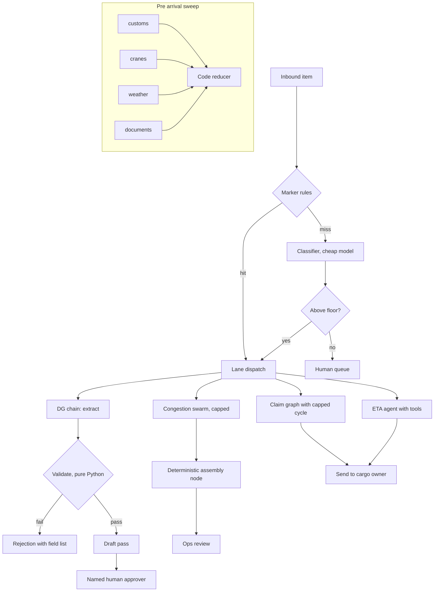

# Answer Key: Choosing and Wiring Agentic Patterns

**Language:** Python 3.11+ | **Topics:** Pattern selection, Strands multi-agent primitives, deterministic gates | **Level:** Intermediate to Advanced

Trainer copy. Behaviour in T12 is measured against `strands-agents 1.42.0`, not estimated.

---

## T1 Symptom to pattern

| # | Answer | Why |
|---|---|---|
| a | Parallel sectioning plus code reducer | Independent branches, one verdict |
| b | Evaluator-optimizer | A crisp rule exists to judge against, so a judge node earns its cost |
| c | Routing | Q0 fails, one flow does not fit all |
| d | Swarm | Path unknown at runtime, peers decide |
| e | Augmented LLM with tools | Two lookups, one turn |
| f | No agent needed, pure Python | The trap row. A written format rule is a regex |
| g | Prompt chain | Fixed order, known before runtime |
| h | Orchestrator-workers or agents-as-tools | One lead LLM decides who to pull in |
| i | Agent graph with conditional edges | Code decides on node results, policy is enumerable |

Pattern used twice: none by name, but a and c both sit under "code decides". Accept "routing" for c only.

---

## S1 Front door

### T2 Labels

| Blank | Answer |
|---|---|
| ?A | Deterministic rule match on markers (`DG-`, `REEFER`) |
| ?B | Sanity check: length, empty body, no actionable content |
| ?C | `CHEAP_MODEL` (`amazon.nova-lite-v1:0`), temperature 0.0 |
| ?D | Reject to human queue with reason "unactionable" |
| ?E | Human lane, prediction preserved for review |

Items that must never reach the classifier: the DG gate pass request and the REEFER alarm. Both are caught by literal markers, both are the two highest-consequence items in the inbox. Cheapest check guards the most expensive mistake.

### T3 Filled table

| Option | Who decides | Model calls per item | Cost at 3k/day | Determinism | Blast radius | Verdict |
|---|---|---|---|---|---|---|
| A. Rules only | Code | 0 | Zero | Total | Unmatched free text lands in the wrong lane silently | Reject, cannot cover free text |
| B. Classifier only | One cheap LLM | 1 | ~3k cheap calls | Probabilistic on every item, including the DG and reefer items | A misclassified reefer alarm means spoiled pharma cargo | Reject, puts irreversible items behind a probabilistic step |
| C. Rules first, classifier for the rest, low confidence to human | Code, then LLM, then human | 0 or 1 | ~2k cheap calls on this traffic mix | Total on the marked items, probabilistic on the rest, bounded by the floor | Bounded: worst case is an item parked in the human lane | Accept |

Deciding column is blast radius, not cost. The constraint table forbids irreversible actions behind a probabilistic step.

### T4 Solution

```python
RULES: dict[str, str] = {
    "DG-": "gate_pass",
    "REEFER": "human",
}

CONFIDENCE_FLOOR = 0.6


def apply_rules(text: str) -> str | None:
    upper = text.upper()
    for marker, lane in RULES.items():
        if marker in upper:
            return lane
    return None


def route(text: str) -> tuple[str, float, str]:
    lane = apply_rules(text)
    if lane:
        return lane, 1.0, "rule"

    decision = classifier.structured_output(Route, text)

    if decision.confidence < CONFIDENCE_FLOOR:
        return "human", decision.confidence, f"below floor, predicted {decision.lane}: {decision.why}"
    return decision.lane, decision.confidence, decision.why
```

Points to press in the debrief:

- Marker matching is uppercase on both sides. A learner who forgets `.upper()` passes on this inbox and fails on real mail.
- The floor is a product decision, not a model decision. Ask what the cost of a false human escalation is versus a false confident dispatch.
- Two of six items cost zero tokens. That number returns in T16.
- If Nova Lite returns malformed structured output, switching that call to `REASONING_MODEL` is the accepted answer, with the switch noted.

---

## S2 DG gate pass

### T5 Order

```
(iii) Extract fields
(ii)  Validate                     [GATE]  [STOP]
(i)   Draft the gate pass text
(iv)  Return to ops for approval
(v)   Return rejection             (exit taken from the gate, not reached in the happy path)
```

`[GATE]` on (ii): every rule is written down, so Python enforces it, not a model. `[STOP]` also on (ii): an invalid request exits there and the drafter is never called. A gate after (i) still catches the error but has already spent the expensive call and, worse, has produced a document that can be copied out of a log.

### T6 Solution

```python
def validate(f: DGFields) -> list[str]:
    problems: list[str] = []
    cid = f.container_id.strip().upper()
    if not CONTAINER_RE.match(cid):
        problems.append(f"container_id '{f.container_id}' is not ISO 6346 shape, four letters then seven digits")

    un = f.un_number.strip().upper()
    if not UN_RE.match(un):
        problems.append(f"un_number '{f.un_number}' is not of the form UN1234")

    imo = f.imo_class.strip()
    if imo not in ALLOWED_IMO:
        problems.append(f"imo_class '{f.imo_class}' is not an accepted class")

    if imo in CONTACT_REQUIRED_FOR and not (f.emergency_contact or "").strip():
        problems.append(f"emergency_contact is mandatory for IMO class {imo}")
    return problems


def gate_pass(message: str) -> str:
    fields = extractor.structured_output(DGFields, message)
    problems = validate(fields)

    if problems:
        return "REJECTED. Fix these before a pass can be issued:\n- " + "\n- ".join(problems)

    payload = fields.model_dump_json()
    return str(drafter(f"Fields: {payload}"))
```

Second call output: three failures (`MSC7391045` is 3 letters plus 7 digits, `UN63` is not four digits, class 7 is not in the allowed set) and exactly one model call.

Where this fails, worth saying out loud: extraction itself is probabilistic. A model that normalises `MSC7391045` into a plausible-looking `MSCU7391045` passes the gate with an invented container. The gate validates shape, not truth. Truth needs a lookup against the terminal system, which is the next capability, not this pattern.

---

## S3 ETA answers

### T7 Tool contract

| Tool | Args | Returns on success | Returns when not found | Why not paste the data |
|---|---|---|---|---|
| `berth_eta` | `vessel_name: str`, full name with MV prefix, case insensitive | Berth number, alongside time, status, one sentence | Plain sentence naming the vessel and stating no record exists | 400 vessels of live state per prompt, on every request, is unaffordable and stale within minutes |
| `yard_slot` | `container_id: str`, ISO 6346 number | Slot, hold status, last move | Plain sentence naming the container and stating no record exists | 12,000 containers exceeds any sane context, and the model would still need to be right about which row to read |

The not-found string is the whole exercise. Raising is auto-contained by the SDK as a tool error and the model then improvises around a failure it cannot see clearly. An explicit sentence gives it something true to relay.

### T8 Solution

```python
@tool
def berth_eta(vessel_name: str) -> str:
    """Look up the berth and estimated alongside time for one vessel.

    Args:
        vessel_name: Full vessel name including the MV prefix, for example "MV Northern Vega". Case insensitive.
    """
    rec = BERTHS.get(vessel_name.strip().upper())
    if rec is None:
        return f"No berthing record found for '{vessel_name}'."
    return f"Berth {rec['berth']}, alongside {rec['eta']}, {rec['status']}."


@tool
def yard_slot(container_id: str) -> str:
    """Look up the yard slot, hold status and last move for one container.

    Args:
        container_id: ISO 6346 container number, four letters then seven digits, for example "MSCU7391045".
    """
    rec = YARD.get(container_id.strip().upper())
    if rec is None:
        return f"No yard record found for container '{container_id}'."
    return f"Slot {rec['slot']}, hold: {rec['hold']}, last move: {rec['last_move']}."


desk = Agent(..., tools=[berth_eta, yard_slot])
```

Question 4 is the graded one. Nothing in either tool links a container to a vessel. A correct run calls both tools, then says it cannot confirm the link. A run that answers yes has hallucinated a join from prompt adjacency. Teaching line: the tool set defines the answerable question space, and a missing join is an architecture gap, not a prompt problem. The only thing standing between the model and a fabricated link is the "do not guess" instruction, which is a weak control compared to simply not having a tool that implies the join.

---

## S4 Pre-arrival sweep

### T9 Parallel or sequential

| # | Answer | Reason |
|---|---|---|
| a | P | Four checks share no inputs, wall clock drops to the slowest branch |
| b | S | Step 2 consumes step 1's output, no concurrency available |
| c | P | Same input, three independent generations, then pick. This is the voting variant |
| d | S | Summarising needs the translation to exist first |

Token cost is identical in P and S. Parallelism buys latency, never money.

### T10 Solution

```python
async def sweep(vessel_file: str) -> dict[str, str]:
    agents = {
        name: Agent(model=model(CHEAP_MODEL, temperature=0.0), system_prompt=prompt)
        for name, prompt in CHECKS.items()
    }
    outputs = await asyncio.gather(
        *(agents[name].invoke_async(vessel_file) for name in CHECKS),
        return_exceptions=True,
    )
    return {
        name: (f"ERROR: {out}" if isinstance(out, Exception) else str(out).strip())
        for name, out in zip(CHECKS, outputs)
    }


def reduce_verdict(results: dict[str, str]) -> str:
    blocked = [name for name, text in results.items() if text.strip().upper().startswith("BLOCKED")]
    return f"BLOCKED by: {', '.join(blocked)}" if blocked else "READY"
```

Expected verdict: `BLOCKED by: customs, documents`. Weather is the trap, 28 knots is inside the 32 knot limit, and a learner whose weather branch says BLOCKED has a prompt problem, not a pattern problem.

Substring matching is the common defect: a branch that writes "READY, not blocked by weather" trips `"BLOCKED" in text`. Accept `startswith` as shown, and flag the stronger fix: give each branch a Pydantic `Literal["READY", "BLOCKED"]` via `structured_output` so the reducer never parses prose.

### T11 Debug

| # | Answer |
|---|---|
| 1 | Line 2. One `Agent` instance is reused across four concurrent branches. `strands.types.exceptions.ConcurrencyException`, message: agent is already processing a request, concurrent invocations are not supported. Default `concurrent_invocation_mode` is `THROW`, and the guard is a non-blocking lock acquired inside `stream_async`. |
| 2 | Build the agent inside the comprehension: one fresh `Agent` per branch. |
| 3 | The flag removes the guard, not the shared state. All four branches would append into the same `agent.messages` list, so each check reads the others' turns and results stop being reproducible. The guard was reporting a real design fault. |

---

## S5 Damage claim narrative

### T12 Trace, measured on strands-agents 1.42.0

| Run | Verdicts | N | Execution order | Final status | `execution_count` | `completed_nodes` |
|---|---|---|---|---|---|---|
| 1 | REVISE, REVISE, APPROVE | 10 | drafter, reviewer, reviser, reviewer, reviser, reviewer, publisher | `COMPLETED` | 7 | 4 |
| 2 | REVISE every time | 6 | drafter, reviewer, reviser, reviewer, reviser, reviewer | `FAILED` | 6 | 3 |

Three things to land:

- `execution_count` counts executions, `completed_nodes` counts distinct nodes. Run 1 shows 7 against 4. Any dashboard built on `completed_nodes` under-reports cyclic work.
- Run 2 does not raise and does not hang. It returns a `GraphResult` with status `FAILED` and no exception, so code that never inspects `status` will happily treat a capped-out loop as success. That is the assertion worth writing in CI.
- Partial work survives. The last draft sits in `result.results["reviser"]`, so the honest production behaviour on a capped loop is to hand the best draft plus the reviewer's outstanding objections to a human, not to discard the run.

Without `set_max_node_executions`, the SDK warns at build time that a graph with cycles may run indefinitely. Ask who in the room read that warning line in their own output.

### T13 Solution

```python
def _verdict(state: GraphState) -> str:
    nr = state.results.get("reviewer")
    return "" if nr is None else str(nr.result).strip().upper()


def needs_revision(state: GraphState) -> bool:
    return _verdict(state).startswith("REVISE")


def approved(state: GraphState) -> bool:
    return _verdict(state).startswith("APPROVE")


builder.add_edge("drafter", "reviewer")
builder.add_edge("reviewer", "reviser", condition=needs_revision)
builder.add_edge("reviser", "reviewer")
builder.add_edge("reviewer", "publisher", condition=approved)
builder.set_entry_point("drafter")

builder.reset_on_revisit(True)
builder.set_max_node_executions(10)
builder.set_node_timeout(90.0)
graph = builder.build()
```

`startswith` beats `in` here for the same reason as T10: a reviewer that writes "APPROVE, no revisions needed" satisfies both `in` tests at once and the graph then fans out down two edges.

---

## S6 Congestion incident

### T14 Filled table

| Option | Who decides | Audit trail | Worst case calls | Failure mode you actually see | Verdict |
|---|---|---|---|---|---|
| A. Fixed graph | Code, on node results | Strongest: `execution_order`, per node results, conditions readable in source | Bounded by `max_node_executions` | Condition sprawl becomes an unreadable rules engine, and an item matching no condition dead ends silently | Best fit if the lanes are enumerable |
| B. Swarm | Peer agents | Weakest: `node_history` says who ran, not which claim came from where | `max_handoffs` times node cost, unbounded without caps | Two agents ping-pong politely until the cap, and the handoff reason lives in prose nobody parses | Use for exploration, with caps |
| C. Agents-as-tools | One lead LLM | Middling: tool call log exists, but the lead's summary is where detail dies | Lead's tool loop until token or turn limit | Lead compresses a specialist's specifics into a vague paragraph | Good default when one lead can see enough |

Constraint answer: the reconstructability requirement eliminates B as the primary path. To bring it back, either make every specialist return a structured contribution (`{claim, basis, agent}`) and let code assemble the final text, or wrap the swarm inside a single graph node so exploration is a swarm while output assembly stays deterministic. `repetitive_handoff_detection_window` plus `repetitive_handoff_min_unique_agents` handle ping-pong but do nothing for provenance.

### T15 Solution

```python
swarm = Swarm(
    [yard_planner, customs_liaison, line_comms],
    entry_point=yard_planner,
    max_handoffs=6,
    max_iterations=8,
    execution_timeout=300.0,
    node_timeout=90.0,
    repetitive_handoff_detection_window=3,
    repetitive_handoff_min_unique_agents=2,
)
```

Agents-as-tools variant, and the catch that matters:

```python
# Build tool-mode specialists WITHOUT the HANDOFF instruction.
tool_yard = Agent(model=model(REASONING_MODEL, temperature=0.2), name="tool_yard",
                  system_prompt="You plan yard and gate throughput moves. Answer the question you are given, nothing else.")
tool_customs = Agent(model=model(REASONING_MODEL, temperature=0.2), name="tool_customs",
                     system_prompt="You resolve customs holds and inspection sequencing. Answer the question you are given, nothing else.")


@tool
def ask_yard_planner(question: str) -> str:
    """Ask the yard and gate throughput planner. Use for queue length, crane allocation and container move questions.

    Args:
        question: One specific question about yard or gate throughput.
    """
    return str(tool_yard(question))


@tool
def ask_customs_liaison(question: str) -> str:
    """Ask the customs liaison. Use for holds, inspection sequencing and release questions.

    Args:
        question: One specific question about customs status or sequencing.
    """
    return str(tool_customs(question))


lead = Agent(
    model=model(REASONING_MODEL, temperature=0.3),
    system_prompt=(
        "You own terminal congestion incidents. Consult specialists through your tools, "
        "then write one recommendation naming which specialist supported each point."
    ),
    tools=[ask_yard_planner, ask_customs_liaison],
)
```

The catch: reusing the swarm agents as tools carries their `HANDOFF` system prompt, so they will announce handoffs to peers that do not exist in tool mode. `handoff_to_agent` is injected by `Swarm`, not by `Agent`. Same agent objects, different topology, and the prompt has to move with the topology. A learner who reuses them unchanged sees the specialist say it is handing off to `customs_liaison` and then nothing happens. That is the single most valuable failure in this exercise.

3am answer: agents-as-tools or the graph. A swarm gives an oncall engineer a transcript of a conversation and asks them to infer causality from it.

---

## S7 Assembly

### T16 The four defects

| # | Defect | Cost at PierPoint |
|---|---|---|
| D1 | `IN --> DG` bypasses the classifier | An unclassified item can enter the irreversible DG path. The rule hit that was supposed to be the audit anchor never happens. |
| D2 | `ISSUE --> VAL`, validation after issuance | A regulator-facing document exists before it is checked, and it is now in a log, a mailbox, or a driver's hand. |
| D3 | `MERGE` is an LLM | A fixed merge rule made probabilistic. Four READY branches can still produce a wrong verdict, and the failure is silent and unreproducible. |
| D4 | `SW --> CLS` back into the classifier | Unbounded cycle across the front door. `Swarm` caps apply inside the swarm only, and nothing caps a swarm to router to swarm loop. |

Corrected shape:



### CI assertions

Accept any two structural checks. Strong examples:

```python
# the claim graph cannot spin
assert result.status == Status.COMPLETED, f"graph ended {result.status}"
assert result.execution_count <= 10

# the front door never sends an irreversible item through a model
assert route("REEFER alarm CAIU9083321")[0] == "human"
assert route("REEFER alarm CAIU9083321")[2] == "rule"      # zero model calls

# the gate rejects known-bad input
assert validate(DGFields(container_id="MSC7391045", un_number="UN63", imo_class="7"))
```

Reject anything of the form "assert the draft is high quality". That is an eval, not a CI check, and it belongs in a different pipeline.

### Anti-pattern rebuttal

Two of six items in the T4 run were resolved by two regex markers, at zero tokens and confidence 1.0, and they were the two highest-consequence items in the inbox. A five agent swarm replaces that with N model calls, no cap, no provenance, and a probabilistic path in front of a regulatory document.

### The honest gap

Two acceptable answers:

- "Contact on file" (S2) and "following up on the thing from yesterday" (S1) are both references to context the system does not hold. No pattern here resolves them. Needs session memory plus a customer and booking lookup.
- The reefer alarm arrives as an inbound message in this design, and in reality it is push telemetry. Every pattern here is request-triggered. Needs an event-driven entry point, which changes the front door, not the lanes.

---

## Debrief probes

| # | Question |
|---|---|
| 1 | Where does a wrong answer become irreversible in your architecture, and what is the last deterministic check before that point? |
| 2 | Which of your nodes could be 20 lines of Python, and why is it still a model call? |
| 3 | If classifier accuracy dropped 15 points overnight, which lane hurts first, and would you notice before ops did? |
| 4 | Your swarm produced the right recommendation. Prove which agent produced the sentence about liability. |
| 5 | What is your token cost per 1,000 inbound items, and which single change halves it? |

## Common failures observed in this exercise

| Failure | Where it shows |
|---|---|
| Reaching for a swarm because the problem sounds open ended | T14, T16 rebuttal |
| Gate placed after the expensive or irreversible step | T5, T6, T16 D2 |
| LLM used as a reducer where the rule is fixed | T10, T16 D3 |
| Substring matching on model prose instead of structured output | T10, T13 |
| Cyclic graph shipped without execution caps, and status never inspected | T12, T13 |
| System prompt not moved with the topology, so handoff instructions survive into tool mode | T15 |
| Sharing one Agent instance across concurrent branches | T11 |
