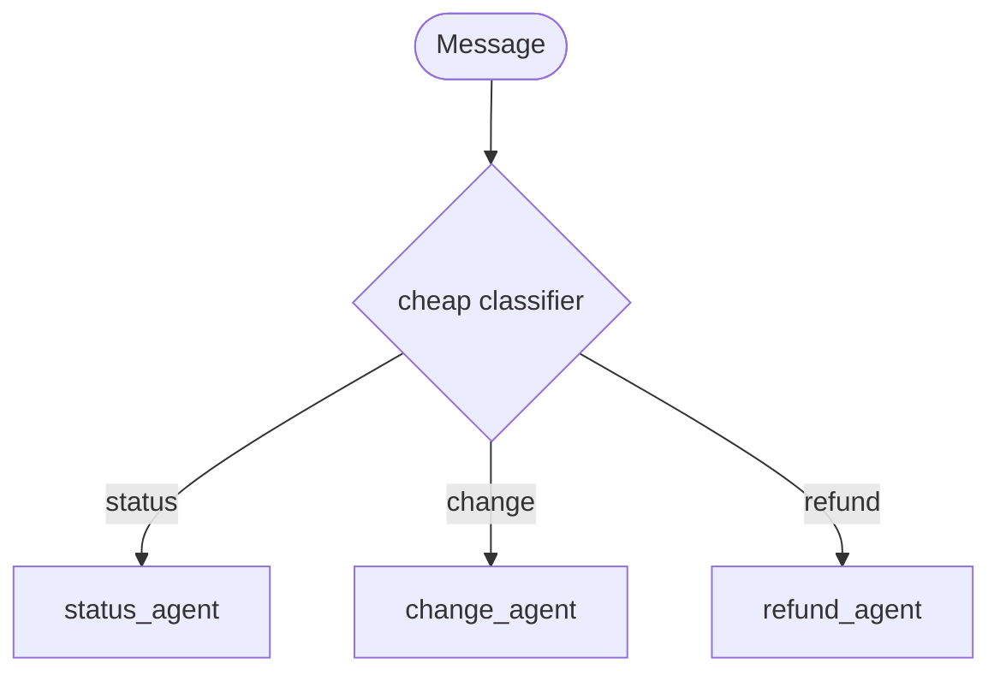

# Coding Exercise 1: Solutions (Beginner)
**v1-v3, single agent through routing**

---

## Task 1: MCQ

```python
ANSWER_TA = "a"   # status lookup -> augmented agent
ANSWER_TB = "b"   # fixed three-step -> prompt chaining
ANSWER_TC = "c"   # clean categories -> routing
```

Tell: T-A has no steps, T-B has fixed steps, T-C has branching steps you can name in advance.

---

## Task 2: Fill the blank, augmented agent

**Goal:** the smallest useful TravelMind. One agent, one job, one tool.

**Code:**

```python
travelmind = Agent(
    model=haiku,
    name="travelmind_status",
    system_prompt="Report flight status for a PNR. Verify identity first.",
    tools=[get_pnr],
)
```

**Walkthrough:**
- `name="travelmind_status"`: a stable id. It becomes the tool name if this agent is ever used as a tool, so set it always.
- `tools=[get_pnr]`: one tool. Fewer tools means fewer schemas shipped per call, which means fewer input tokens.

**Runtime:** you call it, the model emits a `get_pnr` tool call with the PNR and surname, Strands runs the tool and feeds JSON back, the model writes the answer.

**Scenarios:**
- Ask something the tool cannot answer ("weather in Delhi"): no matching tool, so it answers from the model or declines. Tool scope is a design choice.
- Wrong surname: `get_pnr` returns a mismatch, and a well-prompted agent refuses to share details.

**Prod:** add `boto_client_config` retries, OpenTelemetry traces, a Bedrock guardrail on output. The tool becomes a real reservation call behind least-privilege creds.

---

## Task 3: Debug, the model will not call

**Goal:** fix the id that kills the first call.

**The one fix:** the `us.` inference-profile prefix is missing.

```python
broken_model = BedrockModel(
    model_id="us.anthropic.claude-haiku-4-5-20251001-v1:0",  # was missing the us. prefix
    region_name="us-east-1",
    temperature=0.3,
)
```

**Runtime:** wrong id fails on call one, before any tool runs. Fast and loud, the good kind of failure.

**Scenarios:** copy a base id from a blog and you hit the same wall. Switch regions and a profile id that does not exist there throws `ValidationException` instead.

**Prod:** bake the correct id into a shared config module, never a literal per file. It is the single most common first-day Bedrock error.

---

## Task 4: Spot the errors

```python
ERROR_1 = "No docstring or Args, so the agent has no tool description, and pnr has no type hint."
ERROR_2 = "Returns a dict; a tool should return a string, for example json.dumps(...)."
```

Corrected tool:

```python
@tool
def seat_map(record_locator: str) -> str:
    """Return the seat and its payment status for a booking.

    Args:
        record_locator: PNR to look up.
    Returns:
        JSON string with seat and status.
    """
    return json.dumps({"seat": "14C", "status": "paid"})
```

Why it matters: Strands builds the tool description from the docstring and the schema from type hints. No docstring, and the model is guessing what the tool is for.

---

## Task 5: Implement chaining

**Goal:** a fixed three-step pipeline. You wrote the order, so it is a workflow.

**Code:**

```python
extractor = Agent(model=haiku, name="extractor",
    system_prompt="Extract intent and entities (PNR, surname, dates) as compact JSON. Output JSON only.")
resolver  = Agent(model=haiku, name="resolver",
    system_prompt="Given intent and entities, use tools to gather the facts to resolve a change. Summarize the options plainly.",
    tools=[get_pnr, get_fare_rules, search_reaccommodation])
writer    = Agent(model=haiku, name="writer",
    system_prompt="Turn the resolver's findings into a warm, correct, concise customer reply.")

with meter("t5_chain"):
    intent = metered(extractor, q)
    facts  = metered(resolver, "Intent+entities:\n" + intent + "\n\nOriginal:\n" + q)
    reply  = metered(writer, facts)
    print(reply)
```

**Walkthrough:**
- Each step is a focused agent. Only `resolver` gets tools, because only it needs facts.
- Output feeds forward by string concatenation. Step N reads step N-1.
- The whole chain sits in one `meter` block, so cost and latency cover all three calls.

**Runtime:** extractor returns JSON, resolver fetches facts and summarizes, writer turns that into a reply. Three calls in order, latency is their sum.

**Scenarios:**
- Bad PNR: `get_pnr` returns an error mid-chain. In prod you add a gate after the resolver to fail fast before the writer speaks.
- Extra intent types: the chain does not branch. If the path must change per input, that is routing, not chaining.

**Prod:** cache the three static system prompts, since they never change. Insert a programmatic check between steps so a bad lookup never reaches the customer-facing writer.

---

## Task 6: Predict

```python
PREDICTED_LABEL = "refund"
PREDICTED_SPECIALIST = "refund_agent"
```

The message names a cancelled flight and asks for money back. The classifier maps it to refund, and only the refund branch runs.

---

## Task 7: Fill the table

```python
STATUS_TOOLS = [get_pnr]
CHANGE_TOOLS = [get_pnr, get_fare_rules, search_reaccommodation]
REFUND_TOOLS = [get_pnr, check_refund_eligibility]
```

Every specialist gets `get_pnr` (identity plus booking), then only the tools its job needs. A refund agent has no business holding a re-accommodation search.

---

## Task 8: Flowchart plus routing

Labels:



**Goal:** classify once, run one specialist.

**Code:**

```python
def route(msg):
    label = metered(classifier, msg).strip().lower().split()[0]
    label = label if label in SPECIALISTS else "status"
    reply = metered(SPECIALISTS[label], msg)
    return label, reply
```

**Walkthrough:**
- `metered(classifier, msg)`: the cheap classify call, metered like everything else.
- `.strip().lower().split()[0]`: pull the first clean token, since a model may add stray words.
- `label if label in SPECIALISTS else "status"`: a safe default when the label is off-menu.
- `metered(SPECIALISTS[label], msg)`: run only the chosen branch. The other specialists never fire.

**Runtime:** one classify call plus one specialist call. Cheap and predictable.

**Scenarios:**
- Off-menu label ("complaint" with no specialist): the default keeps the flow alive instead of crashing.
- Overlapping categories: routing frays. That is the signal to move up to orchestrator-workers.

**Prod:** log the routing decision per message so you can audit misroutes and re-tune the classifier prompt. Send the classifier to the cheapest model, and promote only the hardest branch if needed.

---

## Task 9: Choose the design

```python
CHOICE = "Design 1"
REASON = "A swarm adds handoff overhead, latency, and nondeterminism for a one-field lookup, and buys nothing back."
```

A swarm to answer "what's my flight status" is a committee to read a clock.

---

## Skeptic's corner

"Why not one big agent for all three tickets?"
- **Cost:** a mega-agent ships every tool schema on every call. You pay for a fare engine and a refund checker to answer "what's my gate."
- **Quality:** one prompt juggling five jobs is easier to confuse and harder to guardrail per intent.

Forward view: start at the smallest pattern, measure, climb only when a real ticket breaks the one you are on.
