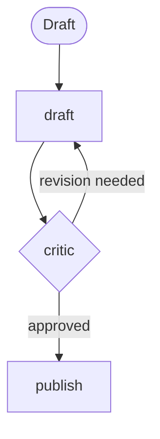

# Coding Exercise 2: Solutions (Intermediate)
**v4-v6, parallelization through the evaluator loop**

---

## Task 1: MCQ

```python
ANSWER_PA = "b"   # messy multi-part -> orchestrator-workers
ANSWER_PB = "c"   # quality gate before send -> evaluator-optimizer
```

Nadia's message spans domains at once, so the model must pick specialists at runtime. Sofia's bar is a quality gate, so a critic loop fits.

---

## Task 2: Fill the blank, wire the orchestrator

**Goal:** an orchestrator is a normal `Agent` whose tools are other agents.

**Code:**

```python
orchestrator = Agent(
    model=haiku, name="orchestrator",
    system_prompt="Read the message, consult only the specialists needed, then synthesize one reply.",
    tools=[flight_specialist, fare_specialist, refund_specialist],
)
```

**Walkthrough:**
- Each specialist goes straight into `tools=[...]`. Strands wraps it into a callable tool named by that agent's `name`.
- The orchestrator's model sees three callable specialists and decides which to invoke.

**Runtime:** the orchestrator reads the message, emits tool calls to specialists in sequence, then stitches one reply from their returns.

**Scenarios:**
- Simple message: it calls one specialist, or none. It only pays for what the query needs.
- A specialist errors: wrap it in an `@tool` for pre and post processing so you catch failures instead of crashing.

**Prod:** a sub-agent's tokens do not roll into the orchestrator's `accumulated_usage`. Wrap each specialist to record its own usage, or use OpenTelemetry, or your bill is wrong.

---

## Task 3: Debug, one specialist is unreachable

**The fix:** `refund` has no `name`, so the orchestrator cannot address it.

```python
refund = Agent(model=haiku, name="refund_specialist",
               system_prompt="Decide refund eligibility.",
               tools=[get_pnr, check_refund_eligibility])
```

**Runtime:** with a name, the specialist becomes an addressable tool and the orchestrator delegates to it. Without one, that branch is silently missing.

**Prod:** name every agent that will be used as a tool. The tool name is the agent name, full stop.

---

## Task 4: Spot the errors, cost helper

```python
BUG_A = "PRICES[tier] is (input, output); unpacking to p_out, p_in swaps them."
BUG_B = "Token counts are not divided by 1e6, so cost is 1,000,000x too high."
FIXED_LINES = "p_in, p_out = PRICES[tier]  |  total += usage['input']/1e6*p_in + usage['output']/1e6*p_out"
```

Corrected:

```python
p_in, p_out = PRICES[tier]
total += usage["input"] / 1e6 * p_in + usage["output"] / 1e6 * p_out
```

Danger case: only Bug B present means costs are proportional but 1e6 too high, so a dashboard looks consistent while every number is nonsense. Unit-test the cost function against a hand-computed figure.

---

## Task 5: Implement parallel sectioning

**Goal:** run three independent checks at once, then merge. Parallel buys time, not money.

**Code:**

```python
async def gather_change(msg):
    fare, reaccom, loyalty = await asyncio.gather(
        asyncio.to_thread(metered, fare_agent, msg),
        asyncio.to_thread(metered, reaccom_agent, msg),
        asyncio.to_thread(metered, loyalty_agent, msg),
    )
    return metered(aggregator, "Fare:\n" + fare + "\n\nReaccom:\n" + reaccom + "\n\nLoyalty:\n" + loyalty)
```

**Walkthrough:**
- `asyncio.to_thread(metered, agent, msg)`: Bedrock calls are I/O-bound, so running each sync agent call in a thread gives real overlap.
- `asyncio.gather(...)`: awaits all three at once. Wall-clock drops to the slowest branch, not the sum.
- `metered(aggregator, ...)`: one final call merges the three findings.

**Runtime:** three calls overlap, then one merge. Same total tokens as running them in sequence, lower latency.

**Scenarios:**
- One slow branch stalls the merge, because `gather` waits for all. In prod you add a per-branch timeout.
- Traffic spike: unbounded fan-out trips throttling. Add a semaphore to cap concurrency.

**Prod:** wrap each branch in a bounded, timed helper (`asyncio.Semaphore` plus `asyncio.wait_for`). Parallel with no ceiling is how you throttle your own Bedrock quota.

---

## Task 6: Predict, then trace

```python
PREDICTED_CALLS = ["fare_specialist", "refund_specialist"]
```

The Task 2 orchestrator holds flight, fare, and refund specialists. On Nadia's message it will likely call fare (is it involuntary, fee waived) and refund (eligibility), and often flight (next flight). The paid-seat question has no matching specialist here, which is itself a finding: your toolbox bounds what the model can answer.

---

## Task 7: Fill the dials table

Versus a single-agent baseline:

| Pattern | Cost | Latency | Quality on a hard task |
|---|---|---|---|
| Routing | lower | same | higher |
| Parallel sectioning | same | lower | higher |
| Parallel voting | higher | same (if parallel) | higher |
| Orchestrator-workers | higher | higher | higher |
| Evaluator-optimizer | higher | higher | higher |

```python
SECTIONING_COST    = "same"
SECTIONING_LATENCY = "lower"
SECTIONING_QUALITY = "higher"
```

---

## Task 8: Complete the flowchart, build the evaluator loop

Labels: revision needed, and approved.



**Goal:** a cyclic graph. Draft, critique against a rubric, revise, cap it.

**Code (the filled TODOs):**

```python
def is_approved(state):
    r = state.results.get("critic")
    if not r:
        return False
    t = str(r.result).lower()
    return ("approved" in t) and ("revision needed" not in t)

b.add_edge("critic", "publish", condition=is_approved)
b.set_max_node_executions(8)
b.reset_on_revisit(True)
```

**Walkthrough:**
- `is_approved` requires "approved" and the absence of "revision needed", so "not approved" does not slip through. Order of checks matters when you branch on text.
- `add_edge("critic", "publish", condition=is_approved)`: the exit edge.
- `set_max_node_executions(8)`: the hard stop. Each pass is two node executions (draft plus critic), so 8 covers about three passes plus publish.
- `reset_on_revisit(True)`: the drafter starts clean each pass, while the critic's feedback still reaches it through input propagation on the reverse edge.

**Runtime:** draft, critic. On "revision needed" the reverse edge fires and the drafter revises. On "approved" the flow moves to publish. The cap stops the loop even if the critic never approves.

**Scenarios:**
- Approves on pass 1: draft, critic, publish. Three node executions.
- Never satisfied: the loop runs to the cap, so the bill has a ceiling.
- Tune the cap to data: if quality flattens after three passes, 8 is the right number.

**Prod:** an uncapped evaluator is the most common agentic cost incident. Cache the critic prompt, keep the critic at temperature 0, log every verdict to re-tune the cap.

---

## Task 9: Choose the design

```python
CHOICE = "Design 1"
REASON = "The branch is fixed and knowable, so an orchestrator pays for runtime delegation you do not need."
```

If you can write the `if/elif`, use routing.

---

## Task 10: Fix the loop with no brakes

```python
b2.set_max_node_executions(8)
b2.reset_on_revisit(True)
```

Two lines. One caps the loop, one resets the drafter each pass. Without the cap, a strict critic bills every pass until a default limit or your budget stops it.

---

## Skeptic's corner

An evaluator loop on every response?
- **Earns its cost:** customer-facing, policy-sensitive text where "close" is not acceptable.
- **Pure waste:** internal deterministic lookups. The output is already correct, so the critic just adds a call and a delay.

Forward view: reserve the loop for text that ships to a human and carries risk. Everywhere else, one pass plus a cheap check wins.
