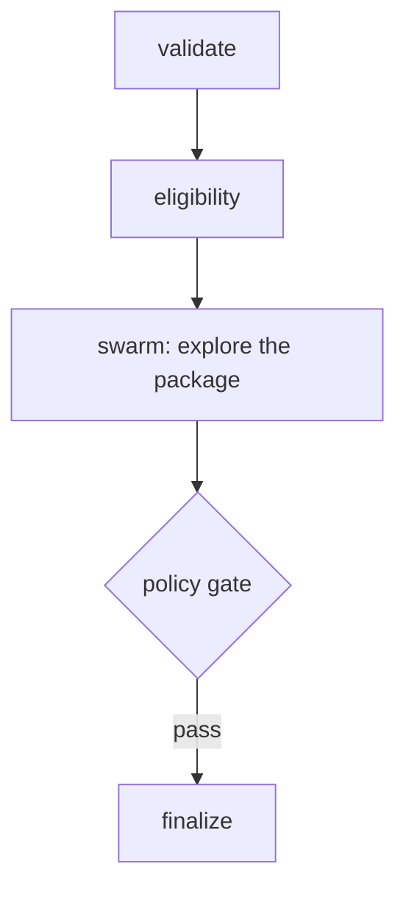

# Coding Exercise 3: Solutions (Advanced)
**v7-v9, swarm, graph, composition**

---

## Task 1: MCQ

```python
ANSWER_SA = "b"   # the storm, unknown order, collaborative -> swarm
ANSWER_SB = "a"   # the auditor, hard rules, logged, identical path -> graph
```

---

## Task 2: Fill the blank, IRROPS swarm

**Goal:** peers with shared memory and no boss. Every agent gets an auto-injected `handoff_to_agent` tool.

**Code:**

```python
irrops_swarm = Swarm(
    [sw_reaccom, sw_fare, sw_comp, sw_comms],
    entry_point=sw_reaccom,
    max_handoffs=12,
    max_iterations=12,
    execution_timeout=600.0,
    node_timeout=180.0,
    repetitive_handoff_detection_window=6,
    repetitive_handoff_min_unique_agents=3,
)
```

**Walkthrough:**
- `entry_point=sw_reaccom`: the object, not a string. This agent receives the task first.
- `max_handoffs`, `max_iterations`: hard ceilings on churn.
- `execution_timeout`, `node_timeout`: wall-clock limits for the run and for any single agent.
- `repetitive_handoff_detection_window=6` with `repetitive_handoff_min_unique_agents=3`: if the last 6 handoffs did not involve 3 distinct agents, the swarm stops the unproductive loop.

**Runtime:** the entry agent works, hands off at the edge of its expertise, control moves peer to peer until one agent produces the final message. Every guard is a tripwire.

**Scenarios:**
- Clean case: three or four handoffs, one good message, well under the caps.
- Two agents defer to each other: the repetition guard catches the bounce before the bill grows.

**Prod:** never ship a swarm without both guard families. It is the least predictable pattern on cost. Log the full handoff path per case, because an emergent flow is invisible unless you record it.

---

## Task 3: Debug, four defects

```python
from strands.multiagent import Swarm                              # 1: multiagent, not multi_agent

d_reaccom = Agent(model=haiku, name="reaccom_agent",              # 2: add name
                  system_prompt="Find alternative flights. Hand off when done.")
d_fare    = Agent(model=haiku, name="fare_agent", system_prompt="Confirm fare rules and waivers.")
d_comms   = Agent(model=haiku, name="comms_agent", system_prompt="Write the customer message.")

swarm = Swarm(
    [d_reaccom, d_fare, d_comms],
    entry_point=d_reaccom,                                        # 3: object, not string
    max_handoffs=12, max_iterations=12,                           # 4: guards and timeouts
    execution_timeout=600.0, node_timeout=180.0,
    repetitive_handoff_detection_window=6, repetitive_handoff_min_unique_agents=3,
)
```

**Walkthrough of each defect:**
- Wrong module: one underscore off and nothing imports.
- Missing `name`: handoffs address agents by name, and `entry_point` references it. No name, no address.
- String `entry_point`: it expects the agent object.
- No guards: ping-pong plus an open-ended bill.

**Prod:** the import error surfaces first, then the wiring bugs. Fix top to bottom and re-run.

---

## Task 4: Spot the errors, graph diamond

```python
DIAMOND_BUG   = "gate fires when reaccom completes (OR semantics) and runs on partial data before comp finishes."
CONDITION_BUG = "The condition reads node id 'policygate', but the node was added as 'gate', so it is always None."
```

Both are silent. No stack trace, just a gate that runs early or never fires.

---

## Task 5: Implement the auditable rebooking graph

**Goal:** hard rules as temperature-0 gate agents calling deterministic tools, an AND-join into the gate, and a capped feedback loop on failure.

**Cell 5a, the AND factory:**

```python
def all_dependencies_complete(required):
    def check(state):
        return all(n in state.results and state.results[n].status == Status.COMPLETED
                   for n in required)
    return check

both_ready = all_dependencies_complete(["reaccom", "comp"])
```

**Cell 5b, the wiring:**

```python
b.add_edge("reaccom", "gate", condition=both_ready)     # AND-join
b.add_edge("comp",    "gate", condition=both_ready)     # AND-join
b.add_edge("gate", "reaccom",  condition=policy_failed) # capped feedback
b.add_edge("gate", "finalize", condition=policy_passed)
b.set_max_node_executions(14)
b.reset_on_revisit(True)
```

**Walkthrough:**
- `all(n in state.results and state.results[n].status == Status.COMPLETED for n in required)`: true only when every required node is present and completed. The `n in state.results` guard avoids a KeyError before a node runs.
- Same `both_ready` on both edges into `gate`: whichever dependency finishes second, its edge fires and the condition is finally true. That converts Python's OR firing into AND.
- `gate -> reaccom` on `policy_failed`: the feedback edge that makes the graph cyclic.
- `gate -> finalize` on `policy_passed`: the exit.
- `set_max_node_executions(14)`: the ceiling that covers the feedback loop.
- `reset_on_revisit(True)`: `reaccom` starts fresh if the gate sends it back.

**Runtime:** validate, eligibility, then reaccom and comp fan out. The gate waits for both, decides pass or fail, writes an audit record, and either loops back once or advances to finalize. Same inputs, same path.

**Scenarios:**
- Clean involuntary case: gate passes first try, terminates, audit logged.
- Gate fails: the capped loop refines reaccom and re-checks, up to the execution cap.
- Identity fails at `validate`: the `identity_ok` edge never fires and the graph stops. No booking detail leaks.

**Prod:** put an AND-condition on every join node, assume nothing about finish order. Keep hard rules (identity, policy, audit) in deterministic tools, never in model text. The audit log plus the fixed execution order are what a regulator reads.

---

## Task 6: Predict the execution order

```python
PREDICTED_ORDER = ["validate", "eligibility", "reaccom", "comp", "gate", "finalize"]
EARLY_FIRE      = "gate"
CRASH_OR_SILENT = "silent wrong answer"
```

`reaccom` and `comp` run in parallel, so their order between each other can flip. The point stands: without the AND-join, `gate` fires the moment the first one finishes, on partial data.

---

## Task 7: Node-type table

| Node | gate or agent |
|---|---|
| validate identity | gate |
| eligibility | agent |
| reaccom | agent |
| comp | agent |
| policy gate | gate |
| finalize + audit | gate |

```python
VALIDATE_TYPE = "gate"    # hard rule against ground truth, no judgment
ELIG_TYPE     = "agent"   # reasoning over fare rules and the reason
```

Rule: anything that must be provably correct is a gate. Anything that benefits from reasoning is an agent.

---

## Task 8: Complete the flowchart, wire the composition

The `options` node is a **swarm**.



**Goal:** a `Swarm` used as one node inside a `GraphBuilder` graph. Rails outside, freedom in one boxed room.

**Code (filled TODOs):**

```python
cb.add_node(options_swarm, "options")               # a Swarm as one graph node
cb.add_edge("gate", "finalize", condition=policy_passed)
```

**Walkthrough:**
- `cb.add_node(options_swarm, "options")`: the seam. A `Swarm` satisfies the same node contract as an `Agent`, so the graph treats it as one node with id `"options"`.
- `condition=policy_passed`: the gate only advances on a pass, reading the gate node's result by id.

**Runtime:** the graph runs validate, eligibility, then hands control to the `options` node. Inside it, the swarm runs its own handoffs, bounded by its own caps, and returns one package. The outer `execution_order` shows `options` as a single entry; the swarm's internal path lives inside that node's result.

**Scenarios:**
- Gate fails: add a capped `gate -> options` edge so the swarm re-explores.
- Swarm stalls: its own timeouts fire, independent of the graph. Two layers, two sets of brakes.

**Prod:** this is what real regulated systems look like. Trace both layers, the graph for the path and the swarm inside the node for the exploration.

---

## Task 9: Choose the pattern

```python
PATTERN_X = "prompt chaining"          # fixed four steps every time, you control the path
PATTERN_Y = "composition"              # audit trail (graph) plus unknown-sequence handling (swarm)
PATTERN_Z = "parallelization/voting"   # high-stakes, irreversible, single pass has been wrong
```

Match the pattern to the shape of the problem, not to how impressive it sounds. X is boring on purpose. Z spends on purpose. Y composes because it has two natures.

---

## Task 10: Fix the condition that never fires

```python
def fixed_policy_passed(state):
    r = state.results.get("gate")          # match the node id used in add_node
    return bool(r) and "policy pass" in str(r.result).lower()
```

The node was added as `"gate"`; the broken version read `"policy_gate"`, so the lookup was always `None` and the flow stalled after the gate.

**Prod:** node ids are string keys with no compiler to catch typos. Define them as constants (`GATE = "gate"`) and use the constant in both `add_node` and every condition.

---

## Task 11: Red-team the seam

```python
IS_BOUNDED     = "no"
MISSING_GUARDS = "max_handoffs, max_iterations, execution_timeout, node_timeout, repetitive_handoff_detection_window, repetitive_handoff_min_unique_agents"
WHY_CAP_FAILS  = "The outer cap counts graph nodes; the swarm is one node, and its internal handoffs and calls sit outside that count."
```

A bounded graph with an unbounded node inside it is unbounded. The seam is exactly where people forget to look.

---

## Skeptic's corner

"Default to composition for safety."
- **Cost:** you build, cap, and trace a graph plus a swarm to answer something one agent handles. More tokens, more debugging across two failure surfaces.
- **Rule:** reach for composition only when a flow must be auditable and one step is genuinely open-ended. Fail either test, and a smaller pattern is cheaper and safer, because there is less to get wrong.

Forward view: the skill on show all day was choosing the smallest pattern that solves the problem, bounded on every seam. That is the job.
