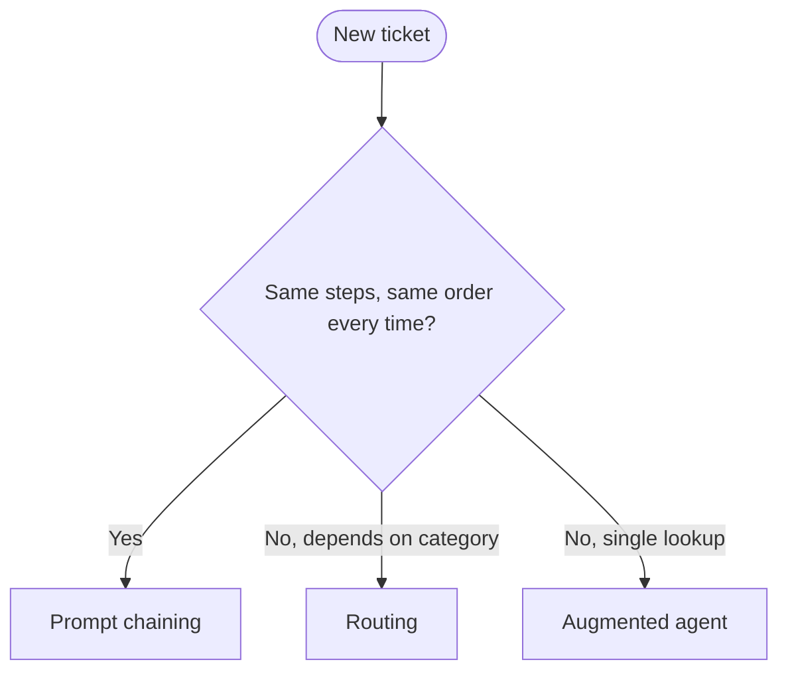

# Exercise 1: Solutions
**Foundations, v1-v3**

---

## Part A: Pick the pattern

| Ticket | Answer | Pattern | Why |
|---|---|---|---|
| T1 | b | Augmented agent (v1) | One lookup, one answer. Anything more is scaffolding you pay for and do not use. |
| T2 | a | Prompt chaining (v2) | Three fixed steps, same order every time. You can draw the flowchart before any input arrives. |
| T3 | a | Routing (v3) | Inputs fall into clean categories, each wanting a different specialist and toolset. |

The tell for each: T1 has no steps, T2 has fixed steps, T3 has branching steps you can name in advance.

---

## Part B: Choose the design for T1

**Winner: Design 1, the single agent.**

What Design 2 (the swarm) costs you, and does not buy back for a status lookup:

- **Cost:** three agents plus handoff reasoning, versus one call.
- **Latency:** handoffs are round trips. A lookup should be one hop.
- **Determinism:** a swarm's path emerges at runtime. For "read this field and report it," emergence is a liability.

One line: *a swarm to answer "what's my flight status" is a committee to read a clock.*

---

## Part C: Fill the blank

Who controls the **path**, you or the model.

That single question sorts every pattern on the ladder. Workflows: you. Agentic: the model, more and more.

---

## Part D: Match the primitive

| Need | Primitive |
|---|---|
| 1. One agent that can call tools | C. `Agent` + `@tool` |
| 2. A team of peers that hand off | A. `Swarm` |
| 3. A structured, auditable flow | B. `GraphBuilder` |

---

## Part E: Complete the flowchart



- L1 = Prompt chaining
- L2 = Routing

---

## Part F: Spot the error, then fix it

**High-level:** the model id names a Claude model but omits the region routing prefix. Bedrock refuses to serve these models on plain on-demand throughput, so the first call dies with `on-demand throughput isn't supported`.

**The one thing wrong:** the `us.` inference-profile prefix is missing.

**The fix:**

```python
from strands.models import BedrockModel

model = BedrockModel(
    model_id="us.anthropic.claude-haiku-4-5-20251001-v1:0",  # us. = cross-region inference profile
    region_name="us-east-1",
    temperature=0.3,
)
```

**Line by line**

- `from strands.models import BedrockModel`: pulls the Bedrock provider. Strands separates the model provider from the `Agent`, so you can swap models without touching agent logic.
- `model_id="us.anthropic..."`: the `us.` prefix selects a cross-region inference profile. Syntax is `<region-group>.<vendor>.<model>-<version>`. The prefix is what routes your call to capacity that supports these newer models; without it Bedrock looks for plain on-demand capacity that does not exist for this model.
- `region_name="us-east-1"`: where the boto3 client points. The inference profile still spans regions, but the client needs a home base.
- `temperature=0.3`: low but not zero. For a support agent you want steady, not robotic.

**At runtime**

- Correct id: the first `agent(...)` call reaches Bedrock, returns a response, and `result.metrics.accumulated_usage` carries the token counts.
- Wrong id: it fails on the first call, before any tool runs. Fast and loud, which is the good kind of failure.

**Scenarios**

- Copy an example from a blog that used a base id: same error. The prefix is the usual culprit.
- Switch regions: the profile id may differ or not exist in that region, which throws `ValidationException: model identifier is invalid`. Fix by using a base id for that region, or switching back.

**In production**

- This is the single most common first-day Bedrock error across every team. Bake the correct id into a shared config module, never a literal in each file.
- Region and model belong in environment or config, not source. That is also what a security review checks.

---

## Part G: Complete the augmented agent

**High-level:** build the smallest useful TravelMind. One agent, a clear identity in its system prompt, and exactly one tool: the booking lookup. The agent loop decides when to call the tool.

**The code:**

```python
from strands import Agent, tool

travelmind = Agent(
    model=haiku,
    name="travelmind_status",
    system_prompt="Report flight status for a PNR. Verify identity first.",
    tools=[get_pnr],
)
```

**Line by line**

- `model=haiku`: the `BedrockModel` from Part F. The agent holds a reference, so one model config serves many agents.
- `name="travelmind_status"`: a stable identifier. It matters the moment this agent is used as a tool by another agent, because the tool name becomes this `name`. Set it always, even for a solo agent, so future-you can promote it without a rename.
- `system_prompt=...`: the agent's job and its one hard rule (verify identity). Short and specific beats long and vague.
- `tools=[get_pnr]`: the toolbox. One entry. The agent calls `get_pnr` when it needs booking facts. Fewer tools means fewer schemas shipped per call, which means fewer input tokens.

**At runtime**

- You call `result = travelmind("What's the status of JX48Q2 for Rao?")`.
- The model reads the prompt, decides it needs the booking, and emits a tool call to `get_pnr` with the PNR and surname.
- Strands runs the tool, feeds the JSON back, and the model writes the answer.
- `str(result)` is the reply text. `result.metrics.accumulated_usage` is the token bill.

**Scenarios**

- Ask a question the tool cannot answer ("what's the weather in Delhi"): the agent has no matching tool, so it answers from the model alone or says it cannot help. This is why tool scope is a design choice, not an afterthought.
- Give it a wrong surname: `get_pnr` returns a mismatch error, and a well-prompted agent refuses to share details. The hard rule lives in both the prompt and the tool.

**In production**

- Add `boto_client_config` retries for transient throttling, an OpenTelemetry trace so every tool call and token count is captured, and a Bedrock guardrail on the output.
- The tool becomes a real reservation-system call behind least-privilege credentials, and identity verification becomes a real auth step, not a string compare.

---

## Part H: Predict the output

- `label` = **refund**. The message names a cancelled flight and asks for money back. The classifier maps it to the refund category.
- Specialist that runs next: **refund_agent** (the refund specialist).

The router spends one cheap classify call, then runs only the refund branch. The status and change specialists never fire.

---

## Skeptic's corner

Priya's "just use one big agent" fails on two fronts:

- **Cost:** a mega-agent ships every tool schema on every call. You pay input tokens for a fare engine, a loyalty database, and a refund checker even when the customer only asked for a gate number.
- **Quality:** one prompt juggling five jobs is easier to confuse and harder to guardrail per intent. A refund mistake and a baggage mistake need different guards, and a single agent blurs them.

Forward view: start at the smallest pattern, measure, and climb only when a real ticket breaks the one you are on. The ladder is a budget, not a trophy shelf.
