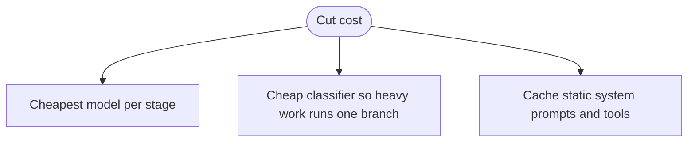

# Exercise 2: Solutions
**The three dials and the bill, v3-v4**

---

## Part A: Spot the misconception

**b.** Parallel calls all still run, so cost is roughly unchanged. Overlap cuts wall-clock, not spend. There is no parallel discount, and tokens cost the same whether calls happen at once or in sequence.

Ana's instinct confuses two different dials. Parallel buys **time**. It never buys **money**.

---

## Part B: Fill the dials table

Versus a single-agent baseline, same task:

| Pattern | Cost | Latency | Quality on a hard task |
|---|---|---|---|
| Routing (v3) | Lower | Same (one small classify hop) | Higher (focused specialist) |
| Parallelization, sectioning (v4) | Same | Lower (overlap, not sum) | Higher (focused subtasks) |
| Parallelization, voting (v4) | Higher (N runs) | Same, if runs are parallel | Higher (confidence on high-stakes) |

Routing scores against a mega-agent baseline, which is the honest comparison: the specialist carries fewer tool schemas, so fewer input tokens.

---

## Part C: Do the cost math

$$
\text{cost}_{\text{USD}} = \frac{T_{in}}{10^{6}} \cdot p_{in} + \frac{T_{out}}{10^{6}} \cdot p_{out}, \quad p_{in}=1.00,\ p_{out}=5.00
$$

- Routing classifier: $\frac{500}{10^6}(1.00) + \frac{20}{10^6}(5.00) = 0.0005 + 0.0001 = 0.0006$
- Routing specialist: $\frac{1200}{10^6}(1.00) + \frac{300}{10^6}(5.00) = 0.0012 + 0.0015 = 0.0027$
- Routing total: $0.0006 + 0.0027 = \mathbf{0.0033}$ USD
- Mega-agent: $\frac{3000}{10^6}(1.00) + \frac{320}{10^6}(5.00) = 0.0030 + 0.0016 = \mathbf{0.0046}$ USD
- Cheaper: **routing**
- Why more calls still wins: the specialist carries only its own tools, so its input token count is small. The mega-agent re-sends every tool schema on every call, and those extra input tokens outweigh the one cheap classify call.

---

## Part D: Rank them by cost

Compute each design:

- A. Routing: $0.0033$ (from Part C)
- B. Mega generalist: $0.0046$ (from Part C)
- C. Parallel sectioning: worker $\frac{800}{10^6}(1) + \frac{150}{10^6}(5) = 0.00155$, times 3 = $0.00465$; aggregator $\frac{900}{10^6}(1) + \frac{200}{10^6}(5) = 0.0019$; total $= \mathbf{0.00655}$
- D. Voting x3: each $\frac{1200}{10^6}(1) + \frac{300}{10^6}(5) = 0.0027$, times 3 $= \mathbf{0.0081}$

**Ranking:** A ($0.0033$) < B ($0.0046$) < C ($0.00655$) < D ($0.0081$)

The lesson in the order: routing is cheapest, voting is priciest, and "parallel" sits in the middle because sectioning still runs every worker plus an aggregator.

---

## Part E: Debug the cost helper

**High-level:** the helper sums per-call cost from a ledger. It corrupts the answer two ways: it maps prices to the wrong token type, and it forgets that prices are quoted per **million** tokens.

**The broken code:**

```python
def block_cost(ledger):
    total = 0
    for tier, usage in ledger:
        p_out, p_in = PRICES[tier]                                  # line A
        total += usage["input"] * p_in + usage["output"] * p_out    # line B
    return total
```

**The two bugs**

- **Bug 1, line A:** `PRICES[tier]` is `(input_price, output_price)`. Binding `p_out, p_in` reverses them, so the input rate lands on output tokens and vice versa. Output tokens cost 5x input, so this quietly mis-prices every call.
- **Bug 2, line B:** token counts are never divided by `1e6`. Prices are per 1M tokens, so the result is one million times too large. A $0.003 call reads as $3,000.

**The fix:**

```python
p_in, p_out = PRICES[tier]
total += usage["input"] / 1e6 * p_in + usage["output"] / 1e6 * p_out
```

**At runtime**

- Broken: the number is enormous and the input/output mix is wrong, so even the ratio between two designs is off. A dashboard built on this would rank designs incorrectly.
- Fixed: costs match hand-computed values from Part C, and comparisons between designs hold.

**Scenarios**

- Only Bug 2 present: costs are 1e6 too high but proportional, so rankings survive while absolute numbers are nonsense. Dangerous because the dashboard looks internally consistent.
- Only Bug 1 present: absolute scale is right but output-heavy designs look artificially cheap. This hides the cost of chatty agents.

**In production**

- Unit-test the cost function against a known token count and a hand-computed dollar figure. A cost model nobody checks is a cost model nobody should trust.
- Pull live per-region prices into config, and flag the constants as "verify before quoting." List prices drift, and a client quote built on stale numbers is a promise you did not mean to make.

---

## Part F: Red-team the parallel code

**High-level:** the gather runs three agent calls at once, which is the latency win Ana wanted. It has no ceiling on concurrency and no timeout, so under a traffic spike it turns a feature into an outage.

**The vulnerable code:**

```python
async def gather_change(msg):
    return await asyncio.gather(
        asyncio.to_thread(metered, fare_agent, msg),
        asyncio.to_thread(metered, reaccom_agent, msg),
        asyncio.to_thread(metered, loyalty_agent, msg),
    )
```

**The two missing guards**

- **Bounded concurrency:** nothing caps how many Bedrock calls fly at once. At 3x traffic, thousands of concurrent requests fan out and trip throttling.
- **Per-branch timeout:** one slow tool has no deadline, so the whole gather waits on the slowest branch with no upper bound.

**First failure under 3x traffic:** Bedrock `ThrottlingException`. Unbounded fan-out is the fastest way to hit an account's requests-per-second limit.

**The hardened version:**

```python
import asyncio

_SEM = asyncio.Semaphore(8)   # cap concurrent Bedrock calls across the process

async def _bounded(agent, msg, timeout=20):
    async with _SEM:
        return await asyncio.wait_for(asyncio.to_thread(metered, agent, msg), timeout)

async def gather_change(msg):
    return await asyncio.gather(
        _bounded(fare_agent, msg),
        _bounded(reaccom_agent, msg),
        _bounded(loyalty_agent, msg),
    )
```

**Line by line**

- `_SEM = asyncio.Semaphore(8)`: a process-wide gate that allows at most 8 in-flight calls. Extra calls wait for a slot. This is the concurrency ceiling.
- `async with _SEM`: acquires a slot before the call, releases it after. The `async with` guarantees release even on error.
- `asyncio.wait_for(..., timeout)`: wraps the call with a deadline. If a branch runs long, it raises `TimeoutError` instead of hanging the gather.
- `asyncio.to_thread(metered, agent, msg)`: runs the synchronous agent call in a thread, since Bedrock calls are I/O-bound and threads give real overlap.

**At runtime**

- Normal load: all three branches grab slots immediately, run in parallel, and you get the latency win with a safety net.
- Spike: the semaphore queues excess work instead of firing it all at once, so you degrade gracefully rather than throttling.
- Stuck branch: the timeout fires, that branch fails cleanly, and you can return partial results or retry.

**Scenarios**

- Set the semaphore to your account's safe requests-per-second, not an arbitrary number. Too high and you throttle, too low and you waste the parallelism.
- Add retries with backoff on throttling via `boto_client_config` so a brief spike self-heals instead of dropping requests.

**In production**

- Every fan-out needs a concurrency cap and a timeout. This is the difference between "parallel to be fast" and "parallel to take down your own Bedrock quota."
- Emit a metric on queue depth at the semaphore. Rising depth is your early warning that traffic is outgrowing your rate limit.

---

## Part G: Estimate the bill

- Routing daily: $0.0033 \times 10{,}000 = \mathbf{\$33}$ per day
- Mega-agent daily: $0.0046 \times 10{,}000 = \mathbf{\$46}$ per day
- Yearly difference: $(46 - 33) \times 365 = 13 \times 365 = \mathbf{\$4{,}745}$ per year
- One lever that cuts cost without hurting quality: **prompt caching** on the static system prompts and tool schemas. They never change across requests, so you stop paying full input tokens to re-send them. Model tiering (cheapest model per stage) is the close second.

$4,745 a year from one architecture choice on one query type. Multiply across every flow and the pattern you pick is a line item, not a detail.

---

## Part H: Complete the cost-decision flowchart



- B = add a cheap classifier (routing) so the expensive branch only runs when needed
- C = Bedrock prompt caching on static system prompts and tool schemas

A fourth lever worth naming: cap every loop and swarm. Cost you never bounded is cost you cannot forecast.

---

## Part I: Two truths and a lie

**Statement 2 is false.** Corrected: voting raises confidence but multiplies cost by N. It does not lower cost, it spends more to buy certainty.

Statements 1 and 3 hold: sectioning cuts wall-clock to the slowest subtask, and routing beats a mega-agent on tokens by running one lean branch.

---

## Skeptic's corner

Ravi's "vote on everything" is right in a narrow lane and wrong as a default:

- **Worth 3x:** irreversible, high-stakes calls where one pass has been wrong before. Refund eligibility on a disputed high-value ticket, a safety determination, a policy call with legal weight.
- **Just a bigger bill:** routine, reversible, low-stakes replies where a single pass is already reliable. Voting on "what's my gate" is paying triple to confirm a number the first call got right.

Forward view: put a price tag on being wrong. Where a wrong answer is cheap to undo, one pass is fine. Where it is expensive or irreversible, voting is insurance, and insurance has a premium.
