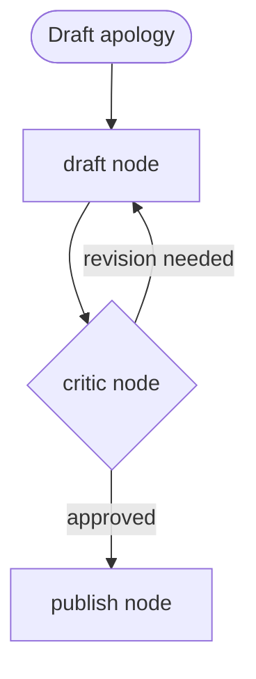

# Exercise 3: Solutions
**Delegation and critique, v5-v6**

---

## Part A: Match each sub-scenario

| Sub-scenario | Answer | Pattern |
|---|---|---|
| Nadia's mess | b | Orchestrator-workers (v5) |
| Sofia's bar | b | Evaluator-optimizer (v6) |

Nadia's message spans domains at once, so the model must pick specialists at runtime. Sofia's bar is a quality gate, so a critic loop fits.

---

## Part B: Choose the design for Nadia

**Design 2, the orchestrator.**

What routing fails on: Nadia's one message is status **and** refund **and** rebook **and** an ancillary question at the same time. A single classifier label picks one branch. Her message does not fit in one branch. The orchestrator lets the model consult several specialists and stitch one reply.

If you can write the `if/elif` for the branch, use routing. You cannot write it for Nadia.

---

## Part C and D: Wire the orchestrator, and fix the broken one

**High-level:** an orchestrator is a normal `Agent` whose tools are **other agents**. When you pass an agent into `tools=[...]`, Strands exposes it as a callable tool named by that agent's `name`. The orchestrator's model then calls specialists like any other tool, deciding which and how many at runtime.

**The correct wiring (Part C):**

```python
flight_specialist  = Agent(model=haiku, name="flight_specialist",  system_prompt="...", tools=[get_pnr])
fare_specialist    = Agent(model=haiku, name="fare_specialist",    system_prompt="...", tools=[get_pnr, get_fare_rules])
refund_specialist  = Agent(model=haiku, name="refund_specialist",  system_prompt="...", tools=[get_pnr, check_refund_eligibility])

orchestrator = Agent(
    model=haiku,
    name="orchestrator",
    system_prompt="Read the message, consult only the specialists needed, then synthesize one reply.",
    tools=[flight_specialist, fare_specialist, refund_specialist],
)
```

**Line by line**

- Each specialist is a focused `Agent`: a narrow prompt and only the tools it needs. Narrow beats broad because a small tool set means fewer schemas and clearer behavior.
- `name="flight_specialist"`: this is not decoration. When the agent is used as a tool, this string **becomes the tool name** the orchestrator calls. No name, no addressable tool.
- `tools=[flight_specialist, fare_specialist, refund_specialist]`: the specialists themselves go in the toolbox. Strands wraps each into a tool automatically. The orchestrator's model sees three callable specialists.

**The bug in Part D:**

```python
refund = Agent(model=haiku, system_prompt="Decide refund eligibility.")   # missing name=
```

- **What is wrong:** `refund` has no `name`, so when it is passed as a tool there is no stable tool name for the orchestrator to call. The delegation is unreliable or silently unavailable.
- **The one-line fix:** `refund = Agent(model=haiku, name="refund_specialist", system_prompt="Decide refund eligibility.")`

**At runtime**

- The orchestrator reads Nadia's message, decides it needs several specialists, and emits tool calls to them in sequence.
- Each specialist runs its own agent loop, calls its own tools, and returns text to the orchestrator.
- The orchestrator synthesizes one reply from all the returns.

**Scenarios**

- Simple message ("what's my gate"): the orchestrator calls one specialist, or none, and answers directly. It only pays for what the query needs.
- A specialist errors: wrap it in an `@tool` function for pre and post processing, so you catch the error and return a typed message instead of a crash.

**In production**

- Token accounting gotcha: a sub-agent's tokens do **not** roll into the orchestrator's `accumulated_usage`. To bill honestly, wrap each specialist in an `@tool` that records its own usage, or capture per-agent metrics with OpenTelemetry.
- Put a timeout on the orchestrator and every specialist so one slow branch cannot stall the whole reply. Log which specialists fired per query, because that is both your bill and your audit trail.

---

## Part E: Trace the delegation

Assuming the four specialists from Notebook 2 (flight, fare, refund, loyalty):

| Step | Specialist | Part of Nadia's message it answers |
|---|---|---|
| 1 | flight_specialist | the next flight to reach her destination (the rebook option) |
| 2 | fare_specialist | is the change involuntary, is the fee waived |
| 3 | refund_specialist | is a refund eligible given the cancellation |
| 4 | loyalty_specialist | Gold benefits and what happens to the paid seat |

On "just tell me my gate": **one** specialist. The orchestrator consults only what the query needs. That is the whole point, and also why its cost is variable, not fixed.

---

## Part F, G, H: The evaluator loop, wired and capped

**High-level:** an evaluator-optimizer loop is a **cyclic graph**. A draft node writes, a critic node judges against a written rubric, and a conditional edge sends work back to the drafter on failure or forward to publish on approval. The whole thing is capped so a strict critic cannot spin forever.

**Part F flowchart labels:**



- Label 1 = revision needed (the critic sends feedback back to the drafter)
- Label 2 = approved (the critic passes it to publish)

**Part G edge table:**

| From | To | Condition |
|---|---|---|
| draft | critic | none (unconditional) |
| critic | draft | `needs_revision` |
| critic | publish | `is_approved` |

**Part H, the full corrected build:**

```python
from strands.multiagent import GraphBuilder

draft   = Agent(model=haiku,    name="draft",   system_prompt=GEN_PROMPT, tools=[get_pnr, get_fare_rules])
critic  = Agent(model=haiku_t0, name="critic",  system_prompt=CRITIC_PROMPT)   # temp 0 for a stable rubric
publish = Agent(model=haiku,    name="publish", system_prompt="Format the approved reply. Do not change its meaning.")

def needs_revision(state):
    r = state.results.get("critic")
    return bool(r) and "revision needed" in str(r.result).lower()

def is_approved(state):
    r = state.results.get("critic")
    if not r:
        return False
    t = str(r.result).lower()
    return ("approved" in t) and ("revision needed" not in t)

b = GraphBuilder()
b.add_node(draft,   "draft")
b.add_node(critic,  "critic")
b.add_node(publish, "publish")

b.add_edge("draft", "critic")
b.add_edge("critic", "draft",   condition=needs_revision)   # feedback loop
b.add_edge("critic", "publish", condition=is_approved)

b.set_entry_point("draft")
b.set_max_node_executions(8)   # the fix: hard ceiling on the loop
b.reset_on_revisit(True)       # the second fix: fresh draft state each pass
graph = b.build()
```

**What the exercise flagged (Part H):**

- **What is missing in the buggy version:** `set_max_node_executions` and `reset_on_revisit`.
- **Failure mode in three words:** unbounded loop (a runaway bill).
- **One-line diff:** `b.set_max_node_executions(8)`
- **Second line:** `b.reset_on_revisit(True)`

**Line by line**

- `critic` uses `haiku_t0` (temperature 0): the rubric must be stable. A wobbling critic makes the loop nondeterministic and hard to trust.
- `needs_revision` / `is_approved`: pure functions of graph state. They read the critic node's latest output via `state.results.get("critic")`, which returns a `NodeResult` with a `.result` field.
- `is_approved` guards against "not approved" false positives by requiring "approved" **and** the absence of "revision needed". Order of checks matters when you branch on text.
- `add_edge("critic", "draft", condition=needs_revision)`: the reverse edge that makes the graph cyclic. This is the loop.
- `set_max_node_executions(8)`: the hard stop. Each pass is two node executions (draft + critic), so 8 covers roughly three passes plus the final publish.
- `reset_on_revisit(True)`: the drafter starts clean on each pass, while the critic's feedback still reaches it through input propagation on the reverse edge.

**At runtime**

- Draft writes, critic judges. If the critic emits "revision needed", the reverse edge fires and the drafter revises with the feedback. If it emits "approved", the flow moves to publish.
- The cap counts every node execution. When the count hits 8, the graph stops even if the critic never approved, so the bill has a ceiling.

**Scenarios**

- Critic approves on pass 1: draft, critic, publish. Three node executions, done.
- Critic never satisfied: the loop runs until `set_max_node_executions` stops it. Without that line, it runs to the framework default or your budget, whichever hurts first.
- Tune the cap to the task: if data shows quality flattens after three passes, cap at 8. Past the point where revisions stop helping, more passes are just spend.

**In production**

- An uncapped evaluator loop is the most common agentic cost incident. Cap every cycle, full stop.
- Cache the critic's system prompt once the token floor is met, since it never changes across runs.
- Log each pass and the critic's verdict, so you can see how many revisions real traffic needs and re-tune the cap.

---

## Part I: Red-team the critic

- **Why "make it good" burns tokens:** no measurable target means the critic can always find something to change, so the drafter keeps rewriting without converging. You pay per pass for churn, not improvement.
- **What the critic prompt must contain:** explicit written criteria (the standing policy) and an exact verdict token to branch on (`APPROVED` or `REVISION NEEDED`). A rubric you can test, and a signal the graph can read.

---

## Part J: Refactor to cheaper

- **Over-engineered:** an orchestrator (model picks branches at runtime) for a queue that splits into exactly four fixed categories with no overlap. You are paying for runtime delegation when the branch is already knowable.
- **Smaller pattern:** routing (v3).
- **What you gain:** a cheap classifier plus one specialist per message, deterministic branch selection, and an easy audit of misroutes. Same job, lower and more predictable cost.

---

## Part K: Estimate the bill

At a per-pass cost of $0.003:

- Passes on pass 1: $\mathbf{\$0.003}$
- Four passes: $0.003 \times 4 = \mathbf{\$0.012}$
- Uncapped, critic never approves: unbounded. It runs to the framework default or your budget, billing every pass on the way.
- The cap: `set_max_node_executions(8)`, which allows about three draft/critic cycles plus publish. Reason: revisions usually stop helping after a few passes, so three is a defensible ceiling before diminishing returns turn into pure spend.

Mapping to remember: passes $\approx \frac{\text{cap} - 1}{2}$, since each pass is a draft node plus a critic node.

---

## Part L: Two truths and a lie

**Statement 3 is false.** Corrected: a voting loop runs the **same** task N times and combines results for confidence, with no critic and no revision. An evaluator-optimizer generates, critiques against criteria, then revises. Different patterns solving different problems.

---

## Skeptic's corner

An evaluator loop on every response is right in one place and wasteful in another:

- **Earns its cost:** customer-facing, policy-sensitive text where "close" is not acceptable. Apology letters, refund explanations, anything a regulator or a customer will hold you to.
- **Pure waste:** internal deterministic lookups like status. The output is already correct and there is nothing to refine, so the critic just adds a call and a delay.

Forward view: reserve the loop for text that ships to a human and carries risk. Everywhere else, a single pass and a cheap check beat a critic that has nothing to improve.
