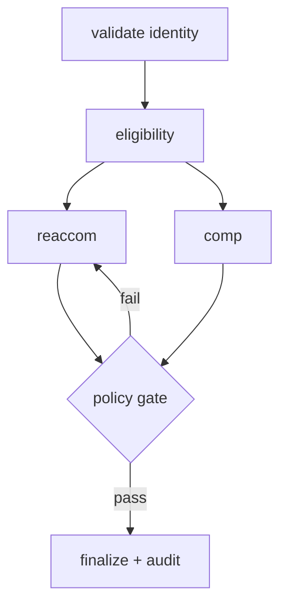

# Exercise 4: Solutions
**Swarm and graph, v7-v8**

---

## Part A: Match the sub-scenario

| Sub-scenario | Answer | Pattern |
|---|---|---|
| The storm | b | Swarm (v7) |
| The auditor | b | Graph (v8) |

Open-ended, unknown sequence, collaborative: swarm. Regulated, hard rules, identical path, logged: graph.

---

## Part B: Debug the swarm

**High-level:** a swarm is a team of peer agents that hand off to each other with shared context. It needs the right import, agents that can be **addressed by name** for handoffs, an entry agent passed as an object, and guard rails so it cannot loop or run forever.

**The defect table:**

| # | Line or setting | What is wrong | The fix |
|---|---|---|---|
| 1 | `from strands.multi_agent import Swarm` | Wrong module name | `from strands.multiagent import Swarm` |
| 2 | `reaccom = Agent(...)` | Missing `name=`; handoffs address agents by name, and `entry_point` references it | Add `name="reaccom_agent"` |
| 3 | `entry_point="reaccom"` | `entry_point` expects the agent object, not a string | `entry_point=reaccom` |
| 4 | the `Swarm(...)` call | No handoff cap, no timeouts, no ping-pong guards, so it can loop and bill without end | Add caps, timeouts, and repetitive-handoff guards |

**The corrected block:**

```python
from strands.multiagent import Swarm

reaccom = Agent(model=haiku, name="reaccom_agent",
                system_prompt="Find alternative flights. Hand off when done.")
fare    = Agent(model=haiku, name="fare_agent", system_prompt="Confirm fare rules and waivers.")
comms   = Agent(model=haiku, name="comms_agent", system_prompt="Write the customer message.")

irrops_swarm = Swarm(
    [reaccom, fare, comms],
    entry_point=reaccom,
    max_handoffs=12,
    max_iterations=12,
    execution_timeout=600.0,
    node_timeout=180.0,
    repetitive_handoff_detection_window=6,
    repetitive_handoff_min_unique_agents=3,
)
```

**Line by line**

- `from strands.multiagent import Swarm`: the correct module. One underscore off and nothing imports.
- `name="reaccom_agent"`: gives the agent an address. Strands auto-injects a `handoff_to_agent(agent_name, ...)` tool into every swarm agent, and the name is how peers target each other. It is also what `entry_point` points at.
- `entry_point=reaccom`: the object, not a string. This is the agent that receives the task first.
- `max_handoffs`, `max_iterations`: hard ceilings on how much the swarm can churn.
- `execution_timeout`, `node_timeout`: wall-clock limits for the whole run and for any single agent.
- `repetitive_handoff_detection_window=6`, `repetitive_handoff_min_unique_agents=3`: the ping-pong guard. If the last 6 handoffs did not involve at least 3 distinct agents, the swarm stops the unproductive loop.

**At runtime**

- The entry agent starts, works, and hands off when it hits the edge of its expertise. Control moves peer to peer until one agent produces the final answer.
- Every guard is a tripwire: hit the handoff cap, a timeout, or the repetition threshold, and the swarm halts instead of spending forever.

**Scenarios**

- Clean case: three or four handoffs, one good message, done well under the caps.
- Two agents defer to each other: the repetitive-handoff guard catches the bounce and stops it before the bill grows.
- A single agent hangs on a slow tool: `node_timeout` fires and the swarm fails that node cleanly.

**In production**

- Never ship a swarm without both guard families. It is the least predictable pattern on cost, so the guards are not optional.
- Log the full handoff path per case. An emergent flow is invisible unless you record it, and that log is your only way to debug or explain a run.

---

## Part C: Sequence the handoff

- Path: reaccom_specialist -> fare_specialist -> compensation_specialist -> comms_specialist
- Ping-pong risk: **reaccom_specialist and fare_specialist** can bounce. Reaccom wants a fee waiver confirmed before offering options; fare wants the options before confirming the waiver applies. Each defers to the other.
- The setting that stops them: `repetitive_handoff_detection_window` with `repetitive_handoff_min_unique_agents`. Together they detect a low-diversity handoff loop and cut it.

---

## Part D: Complete the diagram, then predict the execution order



- Label 1 (feedback edge) = fail (policy fail sends work back)
- Label 2 (exit edge) = pass (policy pass moves to finalize)

**Prediction, given `reaccom` finishes before `comp`:**

- What runs the moment `reaccom` completes: **`gate`**. The `reaccom -> gate` edge is satisfied, and Python fires a node on any one satisfied incoming edge (OR semantics).
- What data `gate` is missing: **`comp`'s output**. Compensation has not been computed yet.
- Crash or silent wrong answer: **silent wrong answer**. The gate simply runs on half the inputs. No error, just a decision made on incomplete facts.

---

## Part E: Complete the AND-condition factory

**High-level:** to make a join node wait for **all** its inputs, you attach the same condition to every incoming edge. The condition returns true only when every required node has reported `Status.COMPLETED`. This converts Python's default OR firing into the AND behavior a diamond needs.

**The fix:**

```python
from strands.multiagent.base import Status

def all_dependencies_complete(required):
    def check(state):
        return all(n in state.results and state.results[n].status == Status.COMPLETED
                   for n in required)
    return check

both_ready = all_dependencies_complete(["reaccom", "comp"])

b.add_edge("reaccom", "gate", condition=both_ready)
b.add_edge("comp",    "gate", condition=both_ready)
```

**Line by line**

- `from strands.multiagent.base import Status`: `Status` is the enum that reports a node's outcome. You compare against `Status.COMPLETED`.
- `all_dependencies_complete(required)`: a factory. It takes the list of nodes that must finish and returns a condition function. A factory lets you reuse the same logic for any join, not just this one.
- `check(state)`: the condition Strands calls before traversing an edge. It receives graph state.
- `all(n in state.results and state.results[n].status == Status.COMPLETED for n in required)`: true only when every required node is present in results **and** completed. The `n in state.results` guard avoids a KeyError before a node has run.
- `both_ready = all_dependencies_complete(["reaccom", "comp"])`: bind the factory to this diamond's two dependencies.
- Same condition on both edges into `gate`: whichever dependency finishes second, that edge fires and `both_ready` is finally true.

**At runtime**

- `reaccom` finishes first: its edge to `gate` is checked, `both_ready` sees `comp` not yet complete, returns false, and the gate does not fire.
- `comp` finishes: its edge is checked, both are now complete, `both_ready` returns true, and the gate fires once, on full inputs.

**Scenarios**

- Three-way join: pass all three ids to the factory. The pattern scales to any fan-in.
- A dependency fails instead of completing: `Status.COMPLETED` is false for it, so the gate correctly does not fire on a failed input. You decide whether to route the failure elsewhere.

**In production**

- Put an AND-condition on every join node. Assume nothing about the order dependencies finish in, because it changes with latency and load.
- This one habit prevents a whole class of silent-wrong-answer bugs, which are the worst kind: no stack trace, just quietly incorrect output that a customer notices before you do.

---

## Part F: Fill the node-type table

| Node | Type | Reason |
|---|---|---|
| validate identity | Deterministic gate | A hard rule against ground-truth data. No model judgment belongs here. |
| eligibility | Agent | Reasoning over fare rules and the disruption reason. |
| reaccom | Agent | Search plus judgment on which options fit. |
| comp | Agent | Computes compensation via a tool, then presents it. |
| policy gate | Deterministic gate | A hard pass or fail from ground truth, plus the audit write. |
| finalize + audit | Deterministic gate | Writes the audit record; composes the final message around a fixed decision. |

The rule: anything that must be provably correct (identity, policy, audit) is a deterministic gate. Anything that benefits from reasoning is an agent.

---

## Part G: Spot the error in the condition

**High-level:** a graph condition reads a node's result by its **node id**, the string you passed as the second argument to `add_node`. A typo there means the lookup returns nothing and the condition never becomes true.

- **What is wrong:** the node was added as `"gate"`, but the condition reads `"policygate"`. `state.results.get("policygate")` is always `None`, so `policy_passed` never returns true and the flow never reaches `finalize`.
- **The fix:**

```python
def policy_passed(state):
    r = state.results.get("gate")          # match the node id used in add_node
    return bool(r) and "policy pass" in str(r.result).lower()
```

**At runtime:** with the wrong id the graph stalls after the gate, since neither the pass nor fail edge can fire on a `None` result. With the correct id, the pass edge fires and the flow completes.

**In production:** node ids are string keys with no compiler to catch typos. Define them as constants (`GATE = "gate"`) and reference the constant in both `add_node` and every condition, so a rename is one edit and a typo is impossible.

---

## Part H: Audit reasoning

- A swarm explores; a graph **testifies**.
- Two artifacts a graph run gives the auditor: the **execution order** (the fixed, inspectable path) and the **audit log** (the decision-by-decision record written at each gate).

A swarm can produce a good answer but cannot answer "why, and in what order, and on what basis." A graph can.

---

## Part I: Red-team the swarm guards

- **What can still go wrong:** ping-pong. Two agents can hand off back and forth without adding value, burning iterations under the handoff cap without making progress.
- **The two settings that close the gap:** `repetitive_handoff_detection_window` and `repetitive_handoff_min_unique_agents`. They detect a low-diversity handoff loop and stop it early, before the caps would.

---

## Part J: Estimate the swarm bill

$$
\text{cost}_{\text{USD}} = \frac{T_{in}}{10^{6}} \cdot p_{in} + \frac{T_{out}}{10^{6}} \cdot p_{out}
$$

- Cost per execution: $\frac{900}{10^6}(1.00) + \frac{220}{10^6}(5.00) = 0.0009 + 0.0011 = \mathbf{0.002}$
- Total for 6 executions: $0.002 \times 6 = \mathbf{0.012}$
- Why it is a range, not a quotable number: the handoff count is **emergent**. The model decides how many hops a case needs, so node executions vary from run to run. You can bound it with `max_handoffs`, but you cannot predict the exact count for the next case.

This is the honest answer to a client asking "what will a swarm cost per ticket": a bounded range, never a fixed figure.

---

## Part K: Two truths and a lie

**Statement 2 is false.** Corrected: in the Python graph, a node fires on **any one** satisfied incoming edge (OR semantics). To wait for all inputs, you must add explicit AND conditions, as in Part E.

---

## Skeptic's corner

Meera's "deterministic, so no timeouts" is half right and about to page her:

- **Right:** once inputs are fixed, the node execution order and count are deterministic. You know the path.
- **Where she gets paged:** a single model or tool call can still hang on the network, and a cyclic graph without a cap can still loop. Determinism of the **path** says nothing about the **wall-clock** or a runaway cycle. `execution_timeout`, `node_timeout`, and `set_max_node_executions` guard those, and determinism does not.

Forward view: deterministic structure and runtime guards solve different problems. You need both, always.
