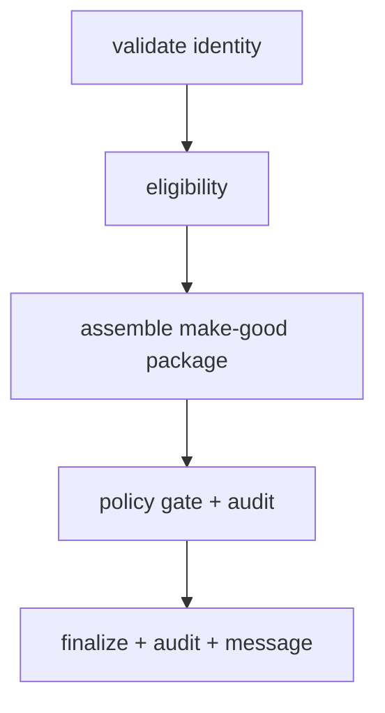

# Exercise 5: Solutions
**Capstone, composition, v9 plus everything**

---

## Part A: Design on paper



- N1 = validate identity
- N2 = eligibility (fare-difference refund owed, downgrade confirmed)
- N3 = assemble the best make-good package
- N4 = policy gate plus audit write
- N5 = finalize, write the final audit record, compose the customer message

---

## Part B: Node-type table

| Node | Type | Why |
|---|---|---|
| N1 | Deterministic gate | Identity is a hard rule against ground truth, not a judgment call. |
| N2 | Agent | Reasoning over fare rules and downgrade facts. |
| N3 | Swarm | Open-ended package assembly benefits from a few agents exploring together. |
| N4 | Deterministic gate | Pass or fail from ground truth, plus the audit record. |
| N5 | Deterministic gate | Writes the final audit; composes the message around a fixed decision. |

**The swarm is N3.** It belongs inside the graph, not in place of it, because the graph supplies rails and an audit trail while the exploration stays bounded to one node. Rails on the outside, freedom in one contained room.

---

## Part C: Wire the skeleton

**High-level:** composition means a `Swarm` is used as a single **node** inside a `GraphBuilder` graph. The graph enforces order, conditions, and audit. The swarm handles the one open-ended step. The seam is one line: `add_node(swarm, "options")`.

**The code:**

```python
from strands.multiagent import GraphBuilder, Swarm

options_swarm = Swarm(
    [planner, flight_finder, care_desk],
    entry_point=planner,                 # the agent that starts the swarm
    max_handoffs=8,
    max_iterations=8,
    execution_timeout=400.0,
    node_timeout=150.0,
    repetitive_handoff_detection_window=5,
    repetitive_handoff_min_unique_agents=2,
)

cb = GraphBuilder()
cb.add_node(validate,      "validate")
cb.add_node(eligibility,   "eligibility")
cb.add_node(options_swarm, "options")    # a Swarm as one graph node
cb.add_node(gate,          "gate")
cb.add_node(finalize,      "finalize")

cb.add_edge("validate", "eligibility", condition=identity_ok)
cb.add_edge("eligibility", "options")
cb.add_edge("options", "gate")
cb.add_edge("gate", "finalize", condition=policy_passed)
cb.set_entry_point("validate")
cb.set_max_node_executions(16)
composed = cb.build()
```

**Line by line**

- `options_swarm = Swarm([...], entry_point=planner, ...)`: a fully-formed swarm, with its own caps and guards, built before the graph. It is a self-contained unit.
- `entry_point=planner`: the object, not a string, and the agent that receives the task first inside the swarm.
- `cb.add_node(options_swarm, "options")`: the seam. A `Swarm` satisfies the same node contract as an `Agent`, so the graph treats it as one node with the id `"options"`.
- `cb.add_edge("eligibility", "options")`: the graph hands the eligibility result into the swarm.
- `cb.add_edge("gate", "finalize", condition=policy_passed)`: the gate only advances on a pass. The condition reads the gate node's result by its id.
- `cb.set_max_node_executions(16)`: the outer ceiling, on graph nodes.

**At runtime**

- The graph runs validate, then eligibility, then hands control to the `options` node.
- Inside that node, the swarm runs its own handoffs among planner, flight_finder, and care_desk, bounded by its own caps.
- The swarm returns one package result, the graph moves to the gate, and on a pass, to finalize.
- The outer `execution_order` shows `options` as a single entry. The swarm's internal path lives inside that node's result.

**Scenarios**

- Gate fails: add a capped feedback edge `gate -> options` on a fail condition, so the swarm re-explores. Cap it, or a strict gate loops.
- Swarm stalls: its own `execution_timeout` and `node_timeout` fire, independent of the graph. Two layers, two sets of brakes.

**In production**

- This is what real regulated systems look like. The deterministic shell gives you audit and predictable order; the creative core is boxed into one node you can bound and observe.
- Trace both layers. The graph trace shows the path; the swarm trace inside the node shows the exploration. You want both when something goes wrong.

---

## Part D: Spot the error in the composition

**High-level:** the outer graph only knows about outer nodes. A node **inside** the swarm is not an outer graph node, so the outer graph's state never contains it.

- **Why it is wrong:** `flight_finder` lives inside `options_swarm`. The outer graph's `state.results` only holds outer node ids (`validate`, `eligibility`, `options`, `gate`, `finalize`). `state.results.get("flight_finder")` is always `None`.
- **Which id to read instead:** `"options"`. The swarm's whole output surfaces as the `options` node result.

```python
def gate_ready(state):
    r = state.results.get("options")       # the swarm surfaces as one node
    return bool(r)
```

**In production:** respect the boundary. The outer layer sees a node; the inner layer's parts are private to that node. Crossing that line in a condition is the composition equivalent of reaching into another module's internals.

---

## Part E: Predict the outer execution order

- Order: validate -> eligibility -> options -> gate -> finalize
- The `options` node is one entry. The swarm's own handoff history lives **inside** that node's result: `composed_result.results["options"].result` carries the swarm's `node_history`.

Five outer nodes. The swarm might have made four internal hops, but from the graph's view it is one step.

---

## Part F: Red-team the seams

- **Is it bounded:** no. Meera's inner swarm has no caps or timeouts.
- **Missing guards:** `max_handoffs`, `max_iterations`, `execution_timeout`, `node_timeout`, `repetitive_handoff_detection_window`, `repetitive_handoff_min_unique_agents`.
- **Why the outer cap does not save you:** `set_max_node_executions(16)` limits how many **graph nodes** run. The swarm is one graph node. Everything it does internally, every handoff and model call, sits outside that count. An ungoverned swarm can loop and spend without ever advancing the graph's node counter.

The seam is exactly where people forget to look. A bounded graph with an unbounded node inside it is unbounded.

---

## Part G: Cost model for the whole flow

$$
\text{cost}_{\text{USD}} = \frac{T_{in}}{10^{6}} \cdot p_{in} + \frac{T_{out}}{10^{6}} \cdot p_{out}
$$

Per node:

- validate: $\frac{400}{10^6}(1) + \frac{30}{10^6}(5) = 0.0004 + 0.00015 = 0.00055$
- eligibility: $\frac{1100}{10^6}(1) + \frac{260}{10^6}(5) = 0.0011 + 0.0013 = 0.0024$
- options (swarm): $\frac{2600}{10^6}(1) + \frac{720}{10^6}(5) = 0.0026 + 0.0036 = 0.0062$
- gate: $\frac{700}{10^6}(1) + \frac{90}{10^6}(5) = 0.0007 + 0.00045 = 0.00115$
- finalize: $\frac{900}{10^6}(1) + \frac{240}{10^6}(5) = 0.0009 + 0.0012 = 0.0021$

- Total per event: $0.00055 + 0.0024 + 0.0062 + 0.00115 + 0.0021 = \mathbf{0.0124}$ USD
- Most expensive node: **options (the swarm)** at $0.0062$, half the flow's cost.
- Lever that does not break the audit trail: tighten the swarm's handoff budget and cache its agents' static system prompts. The audit lives in the deterministic gate and finalize nodes, so cutting swarm cost leaves the audit untouched.

The swarm is where cost concentrates, which is exactly why you bound it and watch it.

---

## Part H: Scale it

- Monthly cost at $0.0124$ per event, 50,000 events: $0.0124 \times 50{,}000 = \mathbf{\$620}$ per month.
- Ship the half-cost design that fails audit 3% of the time? **No.** 3% of 50,000 is 1,500 unprovable decisions a month, each a potential compliance incident. The $310 monthly saving is nothing against one enforcement action, forced manual remediation of 1,500 cases, and the legal exposure of "we could not explain why."

Real cost of a failed audit: the penalty, the remediation labor, and the trust you do not get back. Cheap decisions you cannot defend are the most expensive kind.

---

## Part I: Explain it to compliance

- Two artifacts: the **execution order** (the fixed path this case took) and the **audit log** (the decision written at each gate).
- Why a swarm alone cannot answer Sofia: it has no guaranteed path and no per-decision record. You can show her the output, but not the "why" or the "in what order, on what basis." Composition keeps the swarm's creativity while the graph keeps the paper trail.

---

## Part J: Refactor the bloat

**High-level:** a status lookup has no steps, no branches, and nothing to audit. A graph with a swarm inside it is a cathedral built to answer a doorbell.

- **Over-engineered:** a full composition (graph plus inner swarm) for reading one field.
- **Smallest pattern:** augmented agent (v1) with the status tool.
- **The rewrite:**

```python
status_agent = Agent(model=haiku, name="status_agent",
    system_prompt="Report flight status for a PNR. Verify identity first.",
    tools=[get_pnr])

# result = status_agent("What's the status of JX48Q2 for Rao?")
```

**Why this is the right size:** one call, one tool, one answer. No graph to trace, no swarm to bound, no audit to store, because none of that is what the ticket needs.

---

## Part K: Self-scoring design review

For the Part C design as written, with a properly guarded inner swarm:

| Check | Pass? |
|---|---|
| Model tiering per node, cheapest default | Yes (Haiku throughout; promote only on proven need) |
| Execution cap on the graph | Yes (`set_max_node_executions(16)`) |
| Timeouts on the graph | Partly (add `set_execution_timeout`) |
| Caps and timeouts on the inner swarm | Yes (in the Part C swarm) |
| Repetitive-handoff guard on the swarm | Yes |
| AND-condition on any join node | N/A here (the graph is linear; add it the moment you fan in) |
| Hard rules in deterministic tools | Yes (validate, gate, audit) |
| Audit log at decision points | Yes (gate and finalize) |
| No hardcoded keys or region | Yes (config and environment) |

The gap most learners leave: the graph-level `set_execution_timeout`, or, if they copied Meera's swarm from Part F, the inner swarm guards. Close the timeout first, because a hang with no deadline is the failure you cannot see coming.

---

## Part L: Two truths and a lie

**Statement 2 is false.** Corrected: in composition **you** own the outer path (the graph), and the model owns only the inside of the one swarm node. You keep the audit trail precisely because you did **not** hand the whole path to the model.

---

## Part M: Integrative, choose and justify

| Ticket | Pattern | Who controls the path | Justification |
|---|---|---|---|
| X (nightly re-pricing, same four fixed steps every time) | Prompt chaining (v2) | You | Fixed order, no branching, fully knowable in advance. A loop over the chain handles 5,000 fares. |
| Y (VIP escalation, budget, loyalty exception, legal sensitivity, sequence unknown, must be logged) | Composition (v9) | Mixed | It needs both an audit trail (graph) and open-ended handling of an unknown sequence (swarm). Neither alone covers it. |
| Z (refund eligibility, disputed high-value ticket, single pass wrong before) | Parallelization, voting (v4) | You | A high-stakes, irreversible decision where one pass has failed. Run it several times and take the majority to buy confidence. |

The through-line: match the pattern to the shape of the problem, not to how impressive it sounds. X is boring on purpose. Z spends on purpose. Y composes because it genuinely has two natures.

---

## Skeptic's corner

"Default to composition for safety" costs more than it saves on a simple ticket:

- **The cost:** you build, cap, and trace a graph plus a swarm to answer something one agent handles. More tokens, and far more debugging time across nested execution order and two failure surfaces.
- **The rule:** reach for composition only when a flow must be **auditable** and one step is genuinely **open-ended**. If it fails either test, a smaller pattern is not just cheaper, it is safer, because there is less to get wrong.

Forward view: the skill on display all day was never "build the biggest system." It was choosing the smallest one that solves the problem, and knowing exactly why you climbed when you did.
