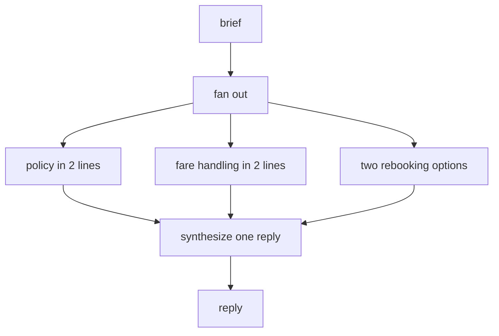

# Exercise 1 - TravelMind Triage Pipeline

**Language:** Python 3.11+
**Level:** Intermediate
**Topics:** LCEL pipe, `RunnablePassthrough.assign`, `RunnableParallel`, `RunnableLambda`, structured output, debugging, plain-Python to LCEL conversion

You are wiring the intake path for *TravelMind*, an airline support assistant. A passenger message comes in, you enrich it, gather facts in parallel, and produce one reply. Every task below builds one piece of that path.

Run this once so every snippet works:

```python
from langchain_aws import ChatBedrockConverse
from langchain_core.prompts import ChatPromptTemplate
from langchain_core.output_parsers import StrOutputParser
from langchain_core.runnables import RunnablePassthrough, RunnableParallel, RunnableLambda
from pydantic import BaseModel, Field

MODEL_ID = "us.anthropic.claude-haiku-4-5-20251001-v1:0"
llm = ChatBedrockConverse(model_id=MODEL_ID, region_name="us-east-1", temperature=0.2)
```

The anchor booking for every part: PNR `JX48Q2`, passenger Rao, Gold tier, the BLR to DEL leg cancelled.

---

## Part A - Trace it (~4 min)

Read this chain. Do not run it yet.

```python
step = (
    {"issue": lambda x: x["complaint"].strip().lower()}
    | RunnablePassthrough.assign(words=lambda x: len(x["issue"].split()))
)

print(step.invoke({"complaint": "  BAG Lost at DEL  "}))
```

**A1.** Fill the trace table. What keys exist, and what is in `issue`, after each stage?

| Stage | Keys present | `issue` value |
|---|---|---|
| after the dict map | ? | ? |
| after `.assign(words=...)` | ? | ? |

**A2.** Write the exact dict that gets printed.

**A3.** The lambda inside `{"issue": ...}` reads `x["complaint"]`. Explain in one line why `x` is the whole input dict and not just the string.

> **Skeptic's prompt.** If you renamed the input key from `complaint` to `text` but left the lambda untouched, what breaks, and at which stage?

---

## Part B - Debug and fix (~5 min)

Each snippet has exactly one bug. Name the broken line, then give a one-line fix.

**B1.**

```python
chain = ChatPromptTemplate.from_messages([("human", "{q}")]) | llm | StrOutputParser
print(chain.invoke({"q": "Is 14C a window seat on JX48Q2?"}))
```

**B2.**

```python
gather = RunnableParallel(
    policy=ChatPromptTemplate.from_messages([("human", "Policy for: {brief}")]) | llm | StrOutputParser(),
    fare=ChatPromptTemplate.from_messages([("human", "Fare handling for: {text}")]) | llm | StrOutputParser(),
)
gather.invoke({"brief": "JX48Q2 cancelled, Gold tier"})
```

**B3.**

```python
routes = {"rebooking": rebooking_chain, "refund": refund_chain}

def route(inp):
    category = classifier.invoke({"request": inp["request"]}).category
    return routes[category]

router = RunnableLambda(route)
print(router.invoke({"request": "trace my lost bag"}))
```

For B3, there are two defects. State both, then write the corrected `return` line.

---

## Part C - Diagram to code (~5 min)

This is the parallel fact-gathering stage. Turn the diagram into working code by filling the `TODO` lines.



Boilerplate:

```python
policy =    # TODO: prompt asking for the Gold-tier cancellation policy in 2 lines -> llm -> StrOutputParser
fare =      # TODO: prompt asking for fare-difference handling in 2 lines -> llm -> StrOutputParser
options =   # TODO: prompt asking for two rebooking options -> llm -> StrOutputParser

gather =    # TODO: RunnableParallel over policy, fare, options

synth = ChatPromptTemplate.from_messages([
    ("system", "Merge the notes into one calm passenger reply."),
    ("human", "policy: {policy}\nfare: {fare}\noptions: {options}"),
]) | llm | StrOutputParser()

pipeline =  # TODO: connect gather to synth

print(pipeline.invoke({"brief": "PNR JX48Q2, BLR to DEL cancelled, Gold tier."}))
```

The connection in the last `TODO` is the whole point. Look at what `gather` outputs and what `synth` needs as input, then ask yourself why no glue code is required between them.

---

## Part D - Convert plain Python to LCEL (~4 min)

Here is a naive sequential version using raw boto3. It works, but it is three hand-rolled calls with string glue.

```python
import boto3
brt = boto3.client("bedrock-runtime", region_name="us-east-1")

def call(text):
    r = brt.converse(
        modelId=MODEL_ID,
        messages=[{"role": "user", "content": [{"text": text}]}],
    )
    return r["output"]["message"]["content"][0]["text"]

def triage(complaint):
    issue = call(f"Extract the core issue in one sentence: {complaint}")
    urgency = call(f"Urgency as low, medium, or high. Label only. Issue: {issue}")
    reply = call(f"Draft a TravelMind reply. Issue: {issue}. Urgency: {urgency}")
    return reply
```

**Task.** Rewrite `triage` as a single LCEL chain that produces the same three-stage flow. Use `ChatPromptTemplate` for each stage and `RunnablePassthrough.assign` to carry `issue` and `urgency` forward.

Constraint: the finished chain must accept `{"complaint": ...}` and return the reply string, with no intermediate print statements.

> **Skeptic's prompt.** The boto3 version and your LCEL version make the same three model calls. Name two things the LCEL version gives you that the boto3 version does not, without adding lines.

---

## Part E - Build the front door (~4 min)

Cheap requests should not pay for the full parallel gather from Part C. Add a router that classifies first, runs the expensive `pipeline` only for `rebooking` or `refund`, and short-circuits everything else to a one-line acknowledgement.

Boilerplate:

```python
class Intent(BaseModel):
    category: str = Field(description="one of: rebooking, refund, other")

classifier =  # TODO: prompt -> llm.with_structured_output(Intent)
quick =       # TODO: prompt for a one-line acknowledgement -> llm -> StrOutputParser

def front_door(inp):
    # TODO: classify, branch to pipeline for rebooking/refund, else quick
    ...

router = RunnableLambda(front_door)

for brief in [
    "Move JX48Q2 to the morning flight.",
    "What time is boarding, roughly?",
]:
    print(router.invoke({"brief": brief}))
    print("---")
```

Both `pipeline`, `quick`, and `classifier` read the same `{"brief": ...}` input, so the branches stay interchangeable.

---

## Definition of done

- Part A: table filled, exact dict written, one-line reason given
- Part B: three bugs named with one-line fixes each
- Part C: pipeline runs and prints one merged reply
- Part D: single LCEL chain returns the reply string
- Part E: `rebooking` and `refund` briefs hit the full pipeline, `other` briefs return one line

---
---

# Answer key (instructor)

## Part A

**A1.**

| Stage | Keys present | `issue` value |
|---|---|---|
| after the dict map | `issue` | `bag lost at del` |
| after `.assign(words=...)` | `issue`, `words` | `bag lost at del`, `words=4` |

**A2.** `{'issue': 'bag lost at del', 'words': 4}`

**A3.** In an LCEL sequence a plain dict becomes a `RunnableParallel`, and each value runnable receives the sequence's current input, which here is the whole `{"complaint": ...}` dict.

**Skeptic.** The dict-map stage raises `KeyError: 'complaint'` because the lambda still reads `x["complaint"]` while the input now has key `text`.

## Part B

**B1.** Broken line: `... | StrOutputParser`. It is the class, not an instance. Fix: `StrOutputParser()`.

**B2.** Broken line: `("human", "Fare handling for: {text}")`. The branch needs `text`, but the input only carries `brief`, so it raises `KeyError: 'text'`. Fix: `("human", "Fare handling for: {brief}")`.

**B3.** Two defects: `routes[category]` raises `KeyError` for any category outside the dict, and it returns a runnable without running it. Corrected return line:

```python
    return routes.get(category, quick).invoke(inp)
```

(any sensible default chain works in place of `quick`).

## Part C

```python
policy = ChatPromptTemplate.from_messages([
    ("system", "State the Gold-tier cancellation policy in 2 lines."),
    ("human", "{brief}"),
]) | llm | StrOutputParser()

fare = ChatPromptTemplate.from_messages([
    ("system", "Explain fare-difference handling for an involuntary change in 2 lines."),
    ("human", "{brief}"),
]) | llm | StrOutputParser()

options = ChatPromptTemplate.from_messages([
    ("system", "List two concrete rebooking options."),
    ("human", "{brief}"),
]) | llm | StrOutputParser()

gather = RunnableParallel(policy=policy, fare=fare, options=options)

pipeline = gather | synth
```

Why no glue: `gather` returns `{"policy": ..., "fare": ..., "options": ...}`, which is exactly the set of variables `synth` expects, so piping is enough.

## Part D

```python
extract = ChatPromptTemplate.from_messages([
    ("system", "Extract the core issue in one sentence."),
    ("human", "{complaint}"),
]) | llm | StrOutputParser()

classify = ChatPromptTemplate.from_messages([
    ("system", "Urgency as low, medium, or high. Reply with only the label."),
    ("human", "Issue: {issue}"),
]) | llm | StrOutputParser()

draft = ChatPromptTemplate.from_messages([
    ("system", "Draft a TravelMind reply matched to the urgency."),
    ("human", "Issue: {issue}\nUrgency: {urgency}"),
]) | llm | StrOutputParser()

triage = (
    {"issue": extract}
    | RunnablePassthrough.assign(urgency=classify)
    | draft
)
# triage.invoke({"complaint": "..."}) -> reply string
```

**Skeptic.** Free `batch` concurrency across many complaints, and `stream` for token-by-token output, both available on the LCEL chain with no extra code. Portability across providers is a third.

## Part E

```python
classifier = ChatPromptTemplate.from_messages([
    ("system", "Classify the request into exactly one of: rebooking, refund, other."),
    ("human", "{brief}"),
]) | llm.with_structured_output(Intent)

quick = ChatPromptTemplate.from_messages([
    ("system", "Give a one-line acknowledgement to the passenger."),
    ("human", "{brief}"),
]) | llm | StrOutputParser()

def front_door(inp):
    category = classifier.invoke(inp).category
    if category in ("rebooking", "refund"):
        return pipeline.invoke(inp)
    return quick.invoke(inp)

router = RunnableLambda(front_door)
```
