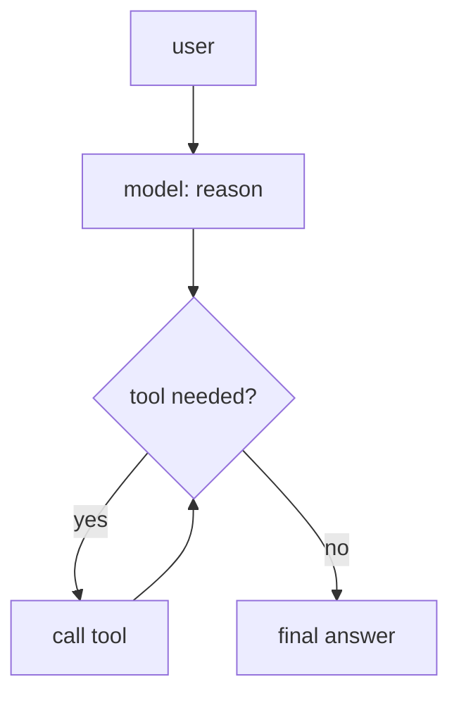
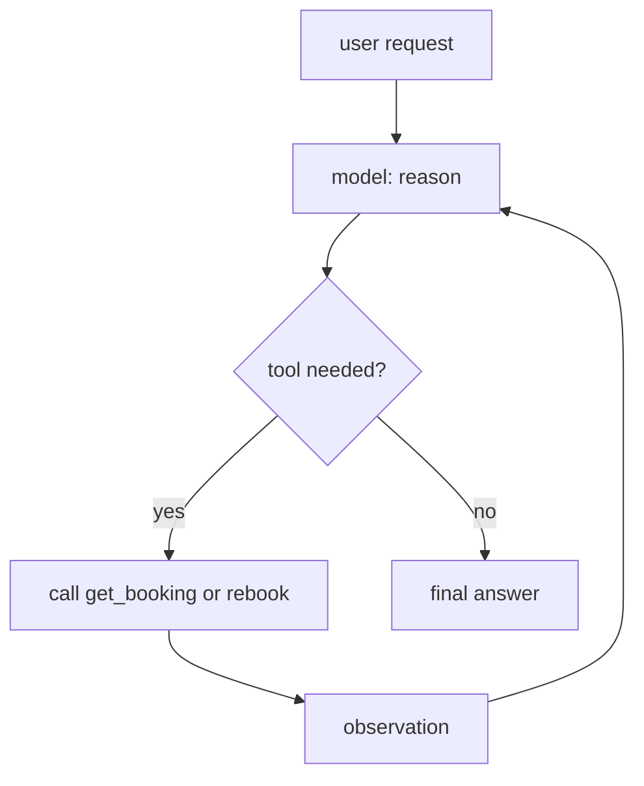

# Exercise 2 - Give TravelMind Hands: the Agent

**Language:** Python 3.11+
**Level:** Intermediate
**Topics:** `@tool`, `create_agent`, the reason-act-observe loop, memory with `InMemorySaver` and `thread_id`, agent debugging, Strands to LangChain conversion, diagram to agent

In Exercise 1 you controlled every step. Now the model controls the steps. You hand it tools and a goal, and it decides when to call them. Same *TravelMind* booking, `JX48Q2`, Rao, Gold tier, BLR to DEL cancelled.

Run this once so every snippet works:

```python
from langchain.chat_models import init_chat_model
from langchain.agents import create_agent
from langchain_core.tools import tool
from langgraph.checkpoint.memory import InMemorySaver

MODEL_ID = "us.anthropic.claude-haiku-4-5-20251001-v1:0"
model = init_chat_model(MODEL_ID, model_provider="bedrock_converse", region_name="us-east-1")

BOOKINGS = {
    "JX48Q2": {"status": "CANCELLED", "seat": "14C", "tier": "Gold", "segment": "BLR-DEL"},
}
```

---

## Part A - Trace the loop (~4 min)

An agent alternates between reasoning and calling tools until it can answer. Read this tool and picture the loop.

```python
@tool
def get_booking(pnr: str) -> dict:
    """Return booking details for a PNR."""
    return BOOKINGS.get(pnr, {"error": "not found"})

agent = create_agent(model, tools=[get_booking], system_prompt="You are TravelMind.")
result = agent.invoke({"messages": [{"role": "user", "content": "What tier is JX48Q2?"}]})
print(result["messages"][-1].text())
```

**A1.** Put the loop steps in order for this single question:

- observe the tool result
- reason about the goal
- return the final answer
- call the tool

**A2.** How many times does the agent call `get_booking` to answer this one question? Give the number and one line of justification.

**A3.** Fill the message trace. What role does each message carry, start to finish?

| # | Role | Carries |
|---|---|---|
| 1 | ? | the user question |
| 2 | ? | a tool call for `get_booking` |
| 3 | ? | the tool result dict |
| 4 | ? | the final answer |

**A4.** One arrow in this loop diagram is wrong. Name it and state the correct target.



---

## Part B - Debug and fix (~5 min)

Each snippet has one bug. Name the broken line, then give a one-line fix.

**B1.**

```python
@tool
def refund(pnr: str) -> str:
    return f"Refund started for {pnr}"

agent = create_agent(model, tools=[refund], system_prompt="You are TravelMind.")
```

**B2.**

```python
agent = create_agent(model, tools=[get_booking], system_prompt="You are TravelMind.")
agent.invoke("status of JX48Q2?")
```

**B3.**

```python
agent = create_agent(model, tools=[get_booking], system_prompt="You are TravelMind.")

agent.invoke({"messages": [{"role": "user", "content": "My PNR is JX48Q2."}]})
reply = agent.invoke({"messages": [{"role": "user", "content": "What was my PNR?"}]})
print(reply["messages"][-1].text())   # the agent has no idea
```

For B3, name the two changes that make the second turn remember the first.

---

## Part C - Diagram to agent (~5 min)

Turn this loop into a two-tool agent by filling the `TODO` lines.



Boilerplate:

```python
@tool
def get_booking(pnr: str) -> dict:
    """Return booking details for a PNR."""
    # TODO: return the record from BOOKINGS, or an error dict

@tool
def rebook(pnr: str, flight: str) -> str:
    """Rebook a PNR onto a new flight number."""
    # TODO: return a confirmation string that names the pnr and flight

agent =   # TODO: create_agent with both tools and a TravelMind system prompt

result =  # TODO: invoke with "JX48Q2 was cancelled, put me on AI302"
print(result["messages"][-1].text())
```

Watch what the model does with a request that needs two facts: it may call `get_booking` first to confirm the booking, then `rebook`. You did not script that order. The model chose it.

---

## Part D - Convert Strands to LangChain (~5 min)

Your team has this working agent in the AWS Strands SDK. Convert it, line for line, to LangChain.

Strands version:

```python
from strands import Agent, tool
from strands.models import BedrockModel

@tool
def get_booking(pnr: str) -> dict:
    """Return booking details for a PNR."""
    return BOOKINGS.get(pnr, {"error": "not found"})

bedrock = BedrockModel(
    model_id="us.anthropic.claude-haiku-4-5-20251001-v1:0",
    region_name="us-east-1",
    temperature=0.2,
)

agent = Agent(model=bedrock, tools=[get_booking], system_prompt="You are TravelMind.")
result = agent("What tier is JX48Q2, and is it cancelled?")
print(result.message)
```

Use this mapping as scaffolding. Fill the right column into real code.

| Strands | LangChain |
|---|---|
| `from strands import Agent, tool` | `from langchain.agents import create_agent` and `from langchain_core.tools import tool` |
| `@tool` with a docstring | the same `@tool` with the same docstring |
| `BedrockModel(model_id=..., region_name=..., temperature=...)` | `init_chat_model(model_id, model_provider="bedrock_converse", region_name=...)` |
| `Agent(model=, tools=, system_prompt=)` | `create_agent(model, tools=, system_prompt=)` |
| `agent("text")` | `agent.invoke({"messages": [{"role": "user", "content": "text"}]})` |
| `result.message` | `result["messages"][-1].text()` |

**Task.** Write the full LangChain equivalent.

> **Skeptic's prompt.** The tool function is byte-for-byte identical in both SDKs. Which two lines actually change, and why does that tell you where each framework draws its boundary?

---

## Part E - Add memory (~4 min)

Give the Part C agent a memory so it holds the booking across turns. Fill the `TODO` lines.

```python
agent =   # TODO: create_agent with both tools, system prompt, and checkpointer=InMemorySaver()

cfg = {"configurable": {"thread_id": "rao-JX48Q2"}}

# turn 1: state the PNR
agent.invoke({"messages": [{"role": "user", "content": "My PNR is JX48Q2."}]}, config=cfg)

# turn 2: same thread, ask it to recall
reply =   # TODO: invoke "Which flight was cancelled on my booking?" with the same cfg
print(reply["messages"][-1].text())
```

Stretch, if time: add one middleware to guard the risky action. Import from `langchain.agents.middleware` and wrap `rebook` so it pauses for approval before running.

```python
from langchain.agents.middleware import HumanInTheLoopMiddleware
# TODO: pass middleware=[HumanInTheLoopMiddleware(...)] into create_agent
```

---

## Definition of done

- Part A: steps ordered, tool-call count justified, trace table filled, wrong arrow named
- Part B: three bugs named with one-line fixes each
- Part C: two-tool agent runs and returns a rebooking confirmation
- Part D: full LangChain agent produced, two changed lines identified
- Part E: turn 2 correctly recalls the cancelled segment from turn 1

---
---

# Answer key (instructor)

## Part A

**A1.** reason about the goal, call the tool, observe the tool result, return the final answer.

**A2.** One call. The tier lives in a single booking record, so one `get_booking(pnr)` returns everything needed.

**A3.**

| # | Role | Carries |
|---|---|---|
| 1 | human | the user question |
| 2 | ai | a tool call for `get_booking` |
| 3 | tool | the tool result dict |
| 4 | ai | the final answer |

**A4.** The arrow `T --> D` is wrong. After a tool runs, the observation returns to the model, so it should be `T --> M`.

## Part B

**B1.** Broken line: the `refund` definition has no docstring. The model gets no description of the tool, so it cannot use it well. Fix: add a one-line docstring, for example `"""Start a refund for a PNR."""`.

**B2.** Broken line: `agent.invoke("status of JX48Q2?")`. `create_agent` expects a state dict, not a bare string. Fix: `agent.invoke({"messages": [{"role": "user", "content": "status of JX48Q2?"}]})`.

**B3.** Two changes: pass `checkpointer=InMemorySaver()` into `create_agent`, and pass `config={"configurable": {"thread_id": "..."}}` on both `invoke` calls so they share one thread.

## Part C

```python
@tool
def get_booking(pnr: str) -> dict:
    """Return booking details for a PNR."""
    return BOOKINGS.get(pnr, {"error": "not found"})

@tool
def rebook(pnr: str, flight: str) -> str:
    """Rebook a PNR onto a new flight number."""
    return f"Rebooked {pnr} onto {flight}."

agent = create_agent(
    model,
    tools=[get_booking, rebook],
    system_prompt="You are TravelMind, a concise airline support assistant.",
)

result = agent.invoke({"messages": [
    {"role": "user", "content": "JX48Q2 was cancelled, put me on AI302"}
]})
print(result["messages"][-1].text())
```

## Part D

```python
from langchain.chat_models import init_chat_model
from langchain.agents import create_agent
from langchain_core.tools import tool

@tool
def get_booking(pnr: str) -> dict:
    """Return booking details for a PNR."""
    return BOOKINGS.get(pnr, {"error": "not found"})

model = init_chat_model(
    "us.anthropic.claude-haiku-4-5-20251001-v1:0",
    model_provider="bedrock_converse",
    region_name="us-east-1",
)

agent = create_agent(model, tools=[get_booking], system_prompt="You are TravelMind.")
result = agent.invoke({"messages": [
    {"role": "user", "content": "What tier is JX48Q2, and is it cancelled?"}
]})
print(result["messages"][-1].text())
```

**Skeptic.** Only the model construction line and the invocation line change. Strands hides the message envelope behind `agent("text")`; LangChain exposes it as an explicit `{"messages": [...]}` state. That boundary is the point: LangChain treats the message list and its state as first-class, which is exactly what lets memory, middleware, and LangGraph plug in later.

## Part E

```python
agent = create_agent(
    model,
    tools=[get_booking, rebook],
    system_prompt="You are TravelMind, a concise airline support assistant.",
    checkpointer=InMemorySaver(),
)

cfg = {"configurable": {"thread_id": "rao-JX48Q2"}}

agent.invoke({"messages": [{"role": "user", "content": "My PNR is JX48Q2."}]}, config=cfg)

reply = agent.invoke(
    {"messages": [{"role": "user", "content": "Which flight was cancelled on my booking?"}]},
    config=cfg,
)
print(reply["messages"][-1].text())
```

Turn 2 recalls `JX48Q2` and, after a `get_booking` call, reports the cancelled `BLR-DEL` segment, because the shared `thread_id` replays turn 1 into the second call.
