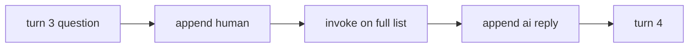
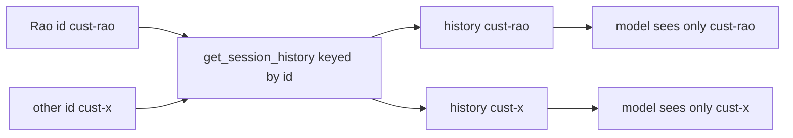
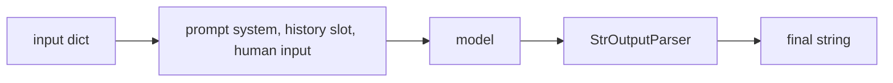

# Exercise 1: Build the Notepad

**Language:** Python
**Topics:** statelessness, RAIL, LCEL, MessagesPlaceholder, InMemoryChatMessageHistory, RunnableWithMessageHistory, session isolation
**Level:** Intermediate

Work in pairs. Run the scaffold once, then attempt each question before you open its answer. Fourteen questions across five formats: read, predict, trace, debug, and build. Every code block is real and runs offline with no API key.

The customer for every question: Rao, PNR `JX48Q2`, Gold tier, BLR to DEL leg cancelled.

---

## Scaffold (run once)

```python
# pip install langchain langchain-core
import re
from langchain_core.messages import HumanMessage, AIMessage, SystemMessage
from langchain_core.language_models.chat_models import BaseChatModel
from langchain_core.outputs import ChatResult, ChatGeneration
from langchain_core.prompts import ChatPromptTemplate, MessagesPlaceholder
from langchain_core.output_parsers import StrOutputParser
from langchain_core.chat_history import InMemoryChatMessageHistory
from langchain_core.runnables.history import RunnableWithMessageHistory
import warnings; warnings.filterwarnings("ignore", message=".*RunnableWithMessageHistory.*")

class LocalAgent(BaseChatModel):
    # Transparent offline stand-in. Remembers a PNR from context, else echoes.
    # Not a smart model. It exists so you can watch the plumbing with no API key.
    def _generate(self, messages, stop=None, run_manager=None, **kwargs):
        seen = " ".join(m.content for m in messages if isinstance(m.content, str))
        mm = re.search(r"PNR\s+([A-Z0-9]{5,8})", seen)
        pnr = mm.group(1) if mm else None
        last = next((m.content for m in reversed(messages)
                     if m.type == "human" and isinstance(m.content, str)), "")
        low = last.lower()
        if "pnr" in low and "?" in last:
            r = f"Your PNR is {pnr}." if pnr else "I do not have your PNR. Could you share it?"
        elif "cancel" in low or "leg" in low:
            r = "I see the BLR to DEL leg on your booking. I can help with that."
        elif last:
            r = f"Noted: {last}"
        else:
            r = "How can I help with your booking today?"
        return ChatResult(generations=[ChatGeneration(message=AIMessage(content=r))])

    @property
    def _llm_type(self):
        return "local-agent"

model = LocalAgent()
prompt = ChatPromptTemplate.from_messages([
    ("system", "You are a concise airline support agent."),
    MessagesPlaceholder("history"),
    ("human", "{input}"),
])
chain = prompt | model | StrOutputParser()
```

---

## Part A: Read and predict

### Q1. Predict the output  ·  Predict

```python
r1 = model.invoke([HumanMessage("I am Rao, PNR JX48Q2, Gold tier.")])
r2 = model.invoke([HumanMessage("What is my PNR?")])
print(r1.content)
print(r2.content)
```

Write the two printed lines. Why does the second call not know the PNR?

<details><summary>Show answer</summary>

```
Noted: I am Rao, PNR JX48Q2, Gold tier.
I do not have your PNR. Could you share it?
```

- Call two is a separate `invoke` with a fresh one message list. Nothing carries the PNR over.
- The Goldfish Principle: the model holds no state between calls. Memory is the list you pass in, and call two's list has no PNR.
</details>

### Q2. Predict the output  ·  Predict

```python
messages = [SystemMessage("You are a concise airline support agent.")]

def ask(user_text):
    messages.append(HumanMessage(user_text))
    reply = model.invoke(messages)
    messages.append(reply)
    return reply.content

ask("I am Rao, PNR JX48Q2, Gold tier.")
ask("What is my PNR?")
print(len(messages))
print(messages[-1].content)
```

<details><summary>Show answer</summary>

```
5
Your PNR is JX48Q2.
```

- system + human1 + ai1 + human2 + ai2 = 5 messages.
- Turn two sees the PNR from turn one on the same list, so it answers correctly. Same model, different notepad.
</details>

### Q3. Read the code  ·  Read

```python
chain = prompt | model | StrOutputParser()
```

The pipe does what?

- (a) runs the three objects in parallel
- (b) feeds each stage's output into the next, left to right
- (c) returns whichever stage responds first

<details><summary>Show answer</summary>

(b). Output of `prompt` feeds `model`, whose output feeds `StrOutputParser`. Same runnable interface at every stage is what lets them compose.
</details>

### Q4. Multi-select  ·  Read

Which are real members of `InMemoryChatMessageHistory`? Pick all that apply.

- (a) `.messages`
- (b) `.add_user_message()`
- (c) `.append()`
- (d) `.add_ai_message()`
- (e) `.get_last()`
- (f) `.clear()`
- (g) `.add_messages([...])`

<details><summary>Show answer</summary>

Real: **(a), (b), (d), (f), (g)**.
Not real: (c) `.append()` and (e) `.get_last()`. You add turns with `add_user_message`, `add_ai_message`, or `add_messages`, not a list `append`.
</details>

### Q5. True or false  ·  Read

Mark each.

1. `MessagesPlaceholder` keeps history role-typed (human vs ai).
2. The name in `MessagesPlaceholder("history")` must match `history_messages_key` in `RunnableWithMessageHistory`.
3. `MessagesPlaceholder` flattens history into one string.
4. Placing the placeholder after `("human", "{input}")` changes nothing.

<details><summary>Show answer</summary>

1 **True**.
2 **True**.
3 **False** (flattening is the exact derailment the placeholder prevents).
4 **False** (history belongs before the new input; that order is part of correctness now, and part of the caching discount later).
</details>

---

## Part B: Trace and match

### Q6. Trace the flow  ·  Trace

Correct RAIL, two turns already done. On turn 3 the user asks a new question.



The list already holds: `system, h1, a1, h2, a2`. What exact messages does `invoke` receive on turn 3?

<details><summary>Show answer</summary>

`system, h1, a1, h2, a2, h3` (six messages). Append human runs before invoke, so the turn 3 question is included. The ai reply is appended after the call, so it is not in this call.
</details>

### Q7. Match the code to the RAIL step  ·  Match

Bank: Retrieve, Augment, Invoke, Log.

| Code | RAIL step |
|---|---|
| `get_session_history(session_id)` | ? |
| filling `MessagesPlaceholder("history")` | ? |
| `model.invoke(messages)` | ? |
| `history.add_ai_message(reply)` | ? |

<details><summary>Show answer</summary>

| Code | RAIL step |
|---|---|
| `get_session_history` | Retrieve |
| filling the placeholder | Augment |
| `model.invoke` | Invoke |
| `add_ai_message` | Log |
</details>

---

## Part C: Debug and fix

Each snippet has one defect. Name the bad line, give a one line fix.

### Q8. Debug  ·  Debug

```python
messages = [SystemMessage("Airline support.")]

def ask(user_text):
    messages.append(HumanMessage(user_text))
    reply = model.invoke(messages)
    return reply.content
```

Symptom: the bot re-asks for details the customer already gave.

<details><summary>Show answer</summary>

Bad: the AI reply is never logged.
Fix: add `messages.append(reply)` before `return`. This is the missing **Log** step.
</details>

### Q9. Debug  ·  Debug

```python
messages = [SystemMessage("Airline support.")]

def ask(user_text):
    reply = model.invoke(messages)
    messages.append(HumanMessage(user_text))
    messages.append(reply)
    return reply.content
```

Symptom: every answer is one turn late.

<details><summary>Show answer</summary>

Bad line: `reply = model.invoke(messages)` runs before the new question is appended, so **Augment** happens on stale history.
Fix: append the human message first, then invoke. Move `messages.append(HumanMessage(user_text))` above the invoke.
</details>

### Q10. Debug  ·  Debug

```python
prompt = ChatPromptTemplate.from_messages([
    ("system", "Airline support."),
    MessagesPlaceholder("history"),
    ("human", "{input}"),
])
chain = prompt | model | StrOutputParser()

bot = RunnableWithMessageHistory(
    chain, get_session_history,
    input_messages_key="input",
    history_messages_key="chat_history",
)
```

Symptom: history is fetched but the bot still forgets.

<details><summary>Show answer</summary>

Bad line: `history_messages_key="chat_history"` does not match `MessagesPlaceholder("history")`. History lands in a slot that does not exist, so the model never sees it.
Fix: `history_messages_key="history"`.
</details>

### Q11. Debug  ·  Debug

```python
store = InMemoryChatMessageHistory()

def get_session_history(session_id):
    return store
```

Symptom: customer B is told Rao's PNR.

<details><summary>Show answer</summary>

Bad: one shared history for every `session_id`, so all customers write to and read from the same notepad.
Fix: key a dict by `session_id` and create per session:

```python
store = {}

def get_session_history(session_id):
    if session_id not in store:
        store[session_id] = InMemoryChatMessageHistory()
    return store[session_id]
```
</details>

---

## Part D: Diagram to code

### Q12. Boilerplate, fill the TODOs  ·  Build

Wire this routing so two ids never mix.



Complete the two TODOs:

```python
store = {}

def get_session_history(session_id):
    # TODO 1: return a per-session InMemoryChatMessageHistory, creating it on first use
    ...

bot = RunnableWithMessageHistory(
    chain,
    get_session_history,
    # TODO 2: set the two keys so history fills MessagesPlaceholder("history")
    #         and the human turn is logged from the "input" key
)
```

<details><summary>Show answer</summary>

```python
store = {}

def get_session_history(session_id):
    if session_id not in store:
        store[session_id] = InMemoryChatMessageHistory()
    return store[session_id]

bot = RunnableWithMessageHistory(
    chain,
    get_session_history,
    input_messages_key="input",
    history_messages_key="history",
)
```

Quick test:

```python
bot.invoke({"input": "I am Rao, PNR JX48Q2."}, config={"configurable": {"session_id": "cust-rao"}})
print(bot.invoke({"input": "What is my PNR?"}, config={"configurable": {"session_id": "cust-rao"}}))
# Your PNR is JX48Q2.
```
</details>

### Q13. Bare code, write from scratch  ·  Build

Build this pipeline in four lines or fewer. No boilerplate given.



Requirements:

- system line: `You are a concise airline support agent.`
- a history slot named `history`
- the human input keyed `input`
- pipe into the model, then a string parser

<details><summary>Show answer</summary>

```python
prompt = ChatPromptTemplate.from_messages([
    ("system", "You are a concise airline support agent."),
    MessagesPlaceholder("history"),
    ("human", "{input}"),
])
chain = prompt | model | StrOutputParser()
```

The slot name `history` is exactly what you pass later to `history_messages_key`. Mismatch it and you have rebuilt Q10.
</details>

---

## Part E: Predict, harder

### Q14. Predict the output  ·  Predict

```python
store = {}

def get_session_history(session_id):
    if session_id not in store:
        store[session_id] = InMemoryChatMessageHistory()
    return store[session_id]

bot = RunnableWithMessageHistory(
    chain, get_session_history,
    input_messages_key="input", history_messages_key="history")

bot.invoke({"input": "I am Rao, PNR JX48Q2."},
           config={"configurable": {"session_id": "rao"}})
bot.invoke({"input": "I am Mehta, PNR ZZ90Q1."},
           config={"configurable": {"session_id": "mehta"}})
ans = bot.invoke({"input": "What is my PNR?"},
                 config={"configurable": {"session_id": "mehta"}})
print(ans)
print(len(store["rao"].messages), len(store["mehta"].messages))
```

<details><summary>Show answer</summary>

```
Your PNR is ZZ90Q1.
2 4
```

- The PNR question runs in the `mehta` session, which only holds Mehta's turns, so the answer is ZZ90Q1, not Rao's.
- `rao` has one turn (human + ai = 2). `mehta` has two turns (4). The system message lives in the prompt template, not the stored history, so it is never counted.

**Skeptic asks:** if the store never held the system message, how did the model still behave like an airline agent? Because the system line is re-added by the prompt template on every call, then dropped. It is re-sent, never remembered. That is the entire session in one sentence.
</details>

---

If Q8 through Q11 felt easy, you own RAIL. If Q14 surprised you, re-read where the system message actually lives.
