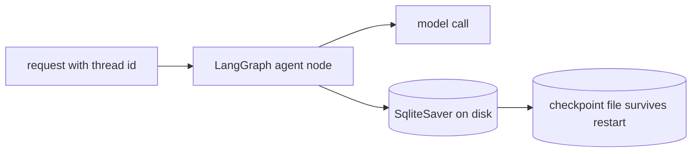
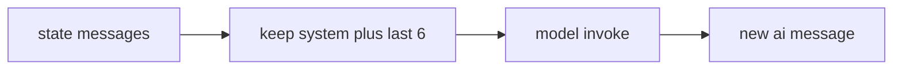

# Exercise 2: Ship It Without Forgetting

**Language:** Python
**Topics:** Instance Amnesia, 3-Axis debugging, Restart Test, Replay Tax, trim_messages, LangGraph persistence, thread_id, checkpointers
**Level:** Intermediate

Work in pairs. Run the scaffold once, then attempt each question before you open its answer. Fourteen questions across six formats: predict, read, order, match, debug, and build. Everything runs offline.

The customer for every question: Rao, PNR `JX48Q2`, Gold tier, BLR to DEL leg cancelled.

---

## Scaffold (run once)

```python
# pip install langchain langchain-core langgraph langgraph-checkpoint-sqlite
import re, os, sqlite3
from langchain_core.messages import HumanMessage, AIMessage, SystemMessage, trim_messages
from langchain_core.language_models.chat_models import BaseChatModel
from langchain_core.outputs import ChatResult, ChatGeneration
from langchain_core.prompts import ChatPromptTemplate, MessagesPlaceholder
from langchain_core.output_parsers import StrOutputParser
from langchain_core.chat_history import InMemoryChatMessageHistory
from langchain_core.runnables.history import RunnableWithMessageHistory
from langgraph.graph import StateGraph, MessagesState, START
from langgraph.checkpoint.memory import MemorySaver
import warnings; warnings.filterwarnings("ignore", message=".*RunnableWithMessageHistory.*")

class LocalAgent(BaseChatModel):
    def _generate(self, messages, stop=None, run_manager=None, **kwargs):
        seen = " ".join(m.content for m in messages if isinstance(m.content, str))
        mm = re.search(r"PNR\s+([A-Z0-9]{5,8})", seen)
        pnr = mm.group(1) if mm else None
        last = next((m.content for m in reversed(messages)
                     if m.type == "human" and isinstance(m.content, str)), "")
        low = last.lower()
        if "pnr" in low and "?" in last:
            r = f"Your PNR is {pnr}." if pnr else "I do not have your PNR. Could you share it?"
        elif "cancel" in low or "leg" in low:
            r = "I see the BLR to DEL leg on your booking. I can help with that."
        elif last:
            r = f"Noted: {last}"
        else:
            r = "How can I help with your booking today?"
        return ChatResult(generations=[ChatGeneration(message=AIMessage(content=r))])

    @property
    def _llm_type(self):
        return "local-agent"

model = LocalAgent()

def make_rwmh_bot(store):
    prompt = ChatPromptTemplate.from_messages([
        ("system", "You are a concise airline support agent."),
        MessagesPlaceholder("history"),
        ("human", "{input}"),
    ])
    chain = prompt | model | StrOutputParser()
    def get_session_history(sid):
        if sid not in store:
            store[sid] = InMemoryChatMessageHistory()
        return store[sid]
    return RunnableWithMessageHistory(chain, get_session_history,
        input_messages_key="input", history_messages_key="history")
```

---

## Part A: Predict

### Q1. Predict the output  ·  Predict

The Replay Tax, measured.

```python
convo = [SystemMessage("Airline support.")]
per_turn = []
for t in ["one", "two", "three"]:
    convo.append(HumanMessage(t))
    per_turn.append(len(convo))
    convo.append(AIMessage("ack"))
print(per_turn)
print(sum(per_turn))
```

<details><summary>Show answer</summary>

```
[2, 4, 6]
12
```

Messages re-sent per turn grow 2, 4, 6. The running total (12) climbs faster than the turn count (3). That widening gap is the quadratic Replay Tax.

$$
Total \approx \sum_{n=1}^{N}\left(system + \sum_{i=1}^{n-1} msg_i + input_n\right) = O(N^2)
$$
</details>

### Q2. Predict the output  ·  Predict

```python
convo = [SystemMessage("s")]
for i in range(5):
    convo.append(HumanMessage(f"q{i}"))
    convo.append(AIMessage(f"a{i}"))

trimmed = trim_messages(convo, max_tokens=4, strategy="last",
                        token_counter=len, include_system=True)
print(len(convo), len(trimmed))
print([m.type for m in trimmed])
```

<details><summary>Show answer</summary>

```
11 4
['system', 'ai', 'human', 'ai']
```

- `token_counter=len` counts one per message, so `max_tokens=4` keeps four messages.
- `include_system=True` forces the system message in, then `strategy="last"` keeps the three most recent: a3, q4, a4.

**Skeptic asks:** the kept window starts on an ai turn (a3) with no matching human. Is that safe to send? It runs, but a dangling ai turn can confuse some models. Pass `start_on="human"` and the window becomes `['system', 'human', 'ai']`, beginning cleanly on q4. Trim by count is blunt; trim on turn boundaries is safer.
</details>

---

## Part B: Read

### Q3. Read and classify  ·  Read

Bug report: "the copilot answers fine, but after we scaled to three servers it forgets customers at random." Which of the 3 axes is the fault?

- (a) WHO (identity, `session_id`)
- (b) HOW (wiring, `RunnableWithMessageHistory`)
- (c) WHERE (storage)

<details><summary>Show answer</summary>

(c) **WHERE**. Each server has its own in-process store, so a request routed to a fresh replica sees no history. The id is right and the wiring is right; the storage is not shared. Fix: one shared backend (Redis or Postgres).
</details>

### Q4. Multi-select  ·  Read

Which storages pass the Restart Test (history survives a process restart)? Pick all.

- (a) in-memory dict
- (b) SQLite file
- (c) Redis
- (d) Postgres
- (e) a Python list held in a module global

<details><summary>Show answer</summary>

Pass: **(b), (c), (d)**.
Fail: (a) and (e) both live in process memory and die on restart. SQLite passes on a single instance; Redis and Postgres pass across replicas too.
</details>

### Q5. True or false  ·  Read

1. `MemorySaver` survives a process restart.
2. `SqliteSaver` writes checkpoints to a file, so it survives a restart.
3. Swapping `MemorySaver` for `SqliteSaver` changes the graph logic.
4. `PostgresSaver` is the rung you climb to when one instance is not enough.

<details><summary>Show answer</summary>

1 **False** (in-memory, lost on restart).
2 **True**.
3 **False** (only the saver changes; nodes and edges stay identical).
4 **True**.
</details>

---

## Part C: Order and match

### Q6. Order the ladder  ·  Order

Put these storages in order of increasing durability and reach. Lowest first.

Shuffled cards: `Redis`, `in-memory dict`, `Postgres`, `SQLite file`, `LangGraph checkpointer on Postgres`

<details><summary>Show answer</summary>

1. in-memory dict
2. SQLite file
3. Redis
4. Postgres
5. LangGraph checkpointer on Postgres

Each rung buys back one failure: restart, then concurrency, then horizontal scale, then resumable agent state.
</details>

### Q7. Match symptom to root cause  ·  Match

Bank: restart wiped in-process RAM; requests hit different replicas with unshared storage.

| Symptom the customer reports | Root cause |
|---|---|
| "It forgot everything after the app updated overnight" | ? |
| "It forgets randomly, but only sometimes" | ? |

<details><summary>Show answer</summary>

| Symptom | Root cause |
|---|---|
| forgot after the overnight update | restart wiped in-process RAM |
| forgets randomly, only sometimes | requests hit different replicas with unshared storage |
</details>

---

## Part D: Debug and fix

Each snippet has one defect. Name the bad line, give a one line fix.

### Q8. Debug  ·  Debug

```python
replica_A, replica_B = {}, {}
botA = make_rwmh_bot(replica_A)
botB = make_rwmh_bot(replica_B)

botA.invoke({"input": "I am Rao, PNR JX48Q2."},
            config={"configurable": {"session_id": "rao"}})
print(botB.invoke({"input": "What is my PNR?"},
                  config={"configurable": {"session_id": "rao"}}))
```

Symptom: prints `I do not have your PNR. Could you share it?` even though Rao just gave it.

<details><summary>Show answer</summary>

Bad: `botA` and `botB` use separate dicts, so turn two lands on a store that never saw turn one. This is **Instance Amnesia**.
Fix: back both bots with one shared store:

```python
shared = {}
botA = make_rwmh_bot(shared)
botB = make_rwmh_bot(shared)
```

In production the shared store is Redis or Postgres, not a dict.
</details>

### Q9. Debug  ·  Debug

```python
def call_model(state):
    return {"messages": [model.invoke(state["messages"])]}

b = StateGraph(MessagesState)
b.add_node("agent", call_model)
b.add_edge(START, "agent")
graph = b.compile()

cfg = {"configurable": {"thread_id": "rao"}}
graph.invoke({"messages": [HumanMessage("I am Rao, PNR JX48Q2.")]}, config=cfg)
graph.get_state(cfg)
```

Symptom: the last line raises `ValueError: No checkpointer set`, and turns never persist.

<details><summary>Show answer</summary>

Bad line: `graph = b.compile()` has no checkpointer, so there is nothing to save or read state from.
Fix: `graph = b.compile(checkpointer=MemorySaver())`, or a durable saver in production.
</details>

### Q10. Debug  ·  Debug

```python
convo = [SystemMessage("You are a concise airline support agent.")]
for i in range(5):
    convo.append(HumanMessage(f"q{i}"))
    convo.append(AIMessage(f"a{i}"))

recent = trim_messages(convo, max_tokens=4, strategy="last", token_counter=len)
print([m.type for m in recent])
```

Symptom: prints `['human', 'ai', 'human', 'ai']`. The agent loses its instructions and drifts off script.

<details><summary>Show answer</summary>

Bad: `include_system` defaults to False, so the system message is trimmed away with the old turns.
Fix: add `include_system=True`:

```python
recent = trim_messages(convo, max_tokens=4, strategy="last",
                       token_counter=len, include_system=True)
```

Now the output starts with `system`.
</details>

---

## Part E: Diagram to code

### Q11. Boilerplate, fill the TODOs  ·  Build

Build a durable agent that survives a restart.



Complete the TODOs:

```python
from langgraph.checkpoint.sqlite import SqliteSaver

def call_model(state):
    return {"messages": [model.invoke(state["messages"])]}

def build_durable_graph(conn):
    saver = SqliteSaver(conn)          # writes checkpoints to the sqlite connection
    b = StateGraph(MessagesState)
    b.add_node("agent", call_model)
    b.add_edge(START, "agent")
    # TODO 1: compile the graph so it uses `saver`
    ...

conn = sqlite3.connect("ckpt.sqlite", check_same_thread=False)
graph = build_durable_graph(conn)
# TODO 2: run one turn for thread_id "cust-rao"
...
```

<details><summary>Show answer</summary>

```python
from langgraph.checkpoint.sqlite import SqliteSaver

def build_durable_graph(conn):
    saver = SqliteSaver(conn)
    b = StateGraph(MessagesState)
    b.add_node("agent", call_model)
    b.add_edge(START, "agent")
    return b.compile(checkpointer=saver)                # TODO 1

conn = sqlite3.connect("ckpt.sqlite", check_same_thread=False)
graph = build_durable_graph(conn)

cfg = {"configurable": {"thread_id": "cust-rao"}}       # TODO 2
graph.invoke({"messages": [HumanMessage("I am Rao, PNR JX48Q2.")]}, config=cfg)
```

Reopen the same file with a fresh connection and the history is still there. That is the Restart Test passing where the in-memory dict failed.
</details>

### Q12. Bare code, write from scratch  ·  Build

Write a graph node that caps context before calling the model.



Requirements:

- a function `call_model_cap(state)` for `MessagesState`
- trim to the last 6 messages, keep the system message
- return the model reply under the `messages` key

<details><summary>Show answer</summary>

```python
def call_model_cap(state):
    recent = trim_messages(state["messages"], max_tokens=6, strategy="last",
                           token_counter=len, include_system=True)
    return {"messages": [model.invoke(recent)]}
```

This is where the Replay Tax gets paid down: the node sees at most seven messages, no matter how long the thread grows.
</details>

---

## Part F: Predict and reason

### Q13. Case study  ·  Predict

Prod runs three replicas behind a load balancer, each with its own in-memory store. Rao's turn one (`I am Rao, PNR JX48Q2.`) lands on replica A. His turn two (`What is my PNR?`) is routed to replica B.

1. What does replica B reply?
2. Name the failure.
3. Give the one architectural fix.

<details><summary>Show answer</summary>

1. `I do not have your PNR. Could you share it?` Replica B's store is empty for Rao.
2. Instance Amnesia.
3. Move the store out of process to one shared, durable backend (Redis or Postgres). Sticky sessions only hide it, and a redeploy still wipes that replica's RAM.
</details>

### Q14. Predict the output  ·  Predict

```python
def call_model(state):
    return {"messages": [model.invoke(state["messages"])]}

b = StateGraph(MessagesState)
b.add_node("agent", call_model)
b.add_edge(START, "agent")
graph = b.compile(checkpointer=MemorySaver())

rao = {"configurable": {"thread_id": "rao"}}
mehta = {"configurable": {"thread_id": "mehta"}}

graph.invoke({"messages": [HumanMessage("I am Rao, PNR JX48Q2.")]}, config=rao)
graph.invoke({"messages": [HumanMessage("What is my PNR?")]}, config=rao)
graph.invoke({"messages": [HumanMessage("I am Mehta, PNR ZZ90Q1.")]}, config=mehta)

print(len(graph.get_state(rao).values["messages"]))
print(len(graph.get_state(mehta).values["messages"]))
```

<details><summary>Show answer</summary>

```
4
2
```

- `rao` thread: two turns, each adds a human and an ai message, so 4.
- `mehta` thread: one turn, so 2.
- A different `thread_id` means a different checkpoint. The raw graph adds no system message (no prompt template), so counts are pure turn pairs.

**Skeptic asks:** the counts differ, but did the threads truly stay separate, or did we just not look? Ask for Rao's PNR on the `mehta` thread. You get ZZ90Q1, not JX48Q2. Isolation is real, and it is keyed entirely by `thread_id`.
</details>

---

If Q9 and Q10 bit you, those two lines (missing checkpointer, missing `include_system`) are the two most common production regressions in this stack. Ship neither.
