# FreightDesk: One Incident, Nine Fixes

**Language:** Python
**Topics:** LCEL chains, `@tool` design, `create_agent`, `InMemorySaver` checkpointer, human-in-the-loop / PII / summarization middleware, tool exception handling, memory failure handling
**Level:** Intermediate

---

## 1. The case

**Meridian Air Cargo**, exception desk, 06:14.

> AWB **160-45872910**. Pharma, 2 to 8 C, 480 kg, 12 pieces. Booked **MA-217 BLR to AMS on 6 Aug**. Flight is cancelled. Shipper has about 30 hours of temperature reserve and wants an answer now. Contact `ops@kavery-exports.example` / `+91 98450 11223`.

You are building **FreightDesk**, the assistant that works this case.

You will build it the way it actually gets built: naive version first, then fix what breaks. Each fix creates the next problem. That chain is the exercise.

---

## 2. The chain

Read this table before you write a line. It is the whole lab on one page.

| Seg | Inherited problem | What you add | What that leaves broken |
|---|---|---|---|
| **0** | Every email goes to an agent loop | LCEL triage chain in front | The disruption case still reaches an agent with no tools |
| **1** | Agent has no tools | Five tools, and a rule for which failures to raise | The carrier API times out and the agent gives up |
| **2** | Transient failures kill useful work | `ToolRetryMiddleware`, scoped | Retry only covers failures you predicted |
| **3** | An unpredicted bug ends the turn | `wrap_tool_call` safety net and guard | Nothing crashes, so the agent completes the case and rebooks 480 kg on its own |
| **4** | No memory between turns | `create_agent` + `InMemorySaver` + `thread_id` | It remembers the case and still rebooks without asking |
| **5** | Writes execute unreviewed | `HumanInTheLoopMiddleware` on write tools | The approval screen and every trace now carry shipper email and phone |
| **6** | Identifiers leak at three doors | `PIIMiddleware` on input and tool results | The case runs 40 turns and dies on context length |
| **7** | Long thread stops fitting | `SummarizationMiddleware` | Everything works until the checkpointer backend goes down at 09:00 |
| **8** | Persistence fails | Fail-closed degradation | Nothing. This is the last link, and it is the one that matters most |

Segment 8 closes a loop opened in Segment 5. Watch for it.

---

## 3. HLD

Two planes. The **control plane** decides what is allowed. The **execution plane** does the work. Every fix below lands in one or the other. Knowing which is most of the skill.

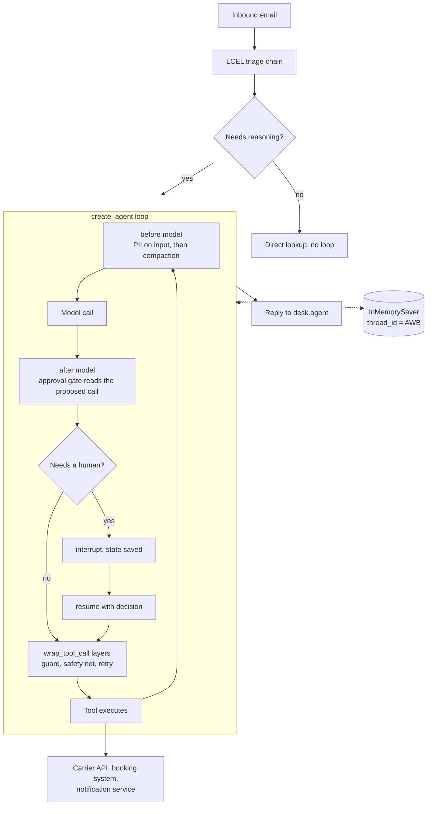

| Box | Plane | Remove it and |
|---|---|---|
| Triage chain | Control | You pay agent prices for "where is my box" |
| Agent loop | Execution | You write the loop by hand |
| Approval gate | Control | The agent books freight on its own judgment |
| Checkpointer | Control | The gate cannot pause, so it cannot gate |
| PII layers | Control | Shipper contact details land in your traces |
| Compaction | Control | Turn 38 throws a context length error |
| Wrap layers | Control | One bad tool call ends the turn |
| Tools | Execution | Nothing happens |

**Hold on to one line:** the checkpointer is not a memory feature. It is what the approval gate stands on. Segment 8 collects on that.

---

## 4. Rules of engagement

| Marker | What you do |
|---|---|
| `# TODO-n` | One line is blank. Pick one option from the bank directly below the code. |
| **Prove it** | Run the snippet. Compare against the stated output. Do not move on until it matches. |
| **R-n** | No code. Read a diagram, trace a flow, order some cards. |

**16 TODOs. 5 reasoning checkpoints.** Answers are in a separate file. Open it after, not during.

**When you are unsure of a parameter name, do not guess and do not search.** Introspect:

```python
import inspect
from langchain.agents.middleware import SummarizationMiddleware
print(inspect.signature(SummarizationMiddleware.__init__))
```

That habit is worth more than any of the sixteen answers.

### Preflight

```python
from importlib.metadata import version
for pkg in ["langchain", "langchain-core", "langgraph", "langchain-aws"]:
    try: print(f"{pkg:16s} {version(pkg)}")
    except Exception: print(f"{pkg:16s} NOT INSTALLED")

import langchain.agents.middleware as mw
for name in ["HumanInTheLoopMiddleware", "PIIMiddleware", "SummarizationMiddleware",
             "ToolRetryMiddleware", "ToolCallLimitMiddleware", "wrap_tool_call"]:
    print(f"{name:28s} {'ok' if hasattr(mw, name) else 'MISSING on this version'}")
```

Anything marked MISSING has a substitute noted in the segment that uses it.

### Run steps

**VS Code:** create and activate a venv, `pip install -U langchain langchain-aws langgraph`, set credentials with `aws configure` or the three AWS env vars, select the venv as your kernel.

**Colab:** `!pip install -q -U langchain langchain-aws langgraph`, set the three AWS env vars with `os.environ`, run top to bottom.

---

## 5. Shared setup

Paste once. Everything below builds on it.

```python
import time
from collections.abc import Callable

from langchain_aws import ChatBedrockConverse
from langchain.tools import tool
from langchain.agents import create_agent
from langchain.agents.middleware import (
    HumanInTheLoopMiddleware, PIIMiddleware, SummarizationMiddleware,
    ToolRetryMiddleware, wrap_tool_call,
)
from langchain.messages import ToolMessage
from langchain.tools.tool_node import ToolCallRequest
from langgraph.checkpoint.memory import InMemorySaver
from langgraph.types import Command

MODEL_ID = "us.anthropic.claude-haiku-4-5-20251001-v1:0"   # the "us." profile prefix is required
REGION = "us-east-1"

llm = ChatBedrockConverse(
    model=MODEL_ID,
    region_name=REGION,
    temperature=0,        # set temperature OR top_p on Claude 4.x, never both
    max_tokens=1024,
)
```

If `langchain.messages` does not import on your build, use `langchain_core.messages`. Same class.

---

# Segment 0: Route before you reason

| | |
|---|---|
| **Inherited** | Every inbound email hits an agent loop |
| **Breaks here** | An agent loop is the most expensive way to answer "where is my box" |
| **Hands to Segment 1** | A disruption case that has earned an agent, and an agent with no tools |

### The idea

An LCEL chain is a fixed pipeline. Same shape every call, no tool access, no loop, cheap, unit testable. That makes it the right thing to put **in front of** an agent, not inside one.

Decide whether a case needs reasoning before you pay for reasoning.

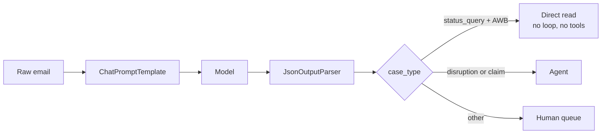

### Build it

```python
from langchain_core.prompts import ChatPromptTemplate
from langchain_core.output_parsers import JsonOutputParser

TRIAGE_PROMPT = ChatPromptTemplate.from_messages([
    ("system",
     "You classify inbound air cargo desk emails. "
     "Reply with ONLY a JSON object, no prose, no code fences. "
     "Keys: case_type, awb, urgency. "
     "case_type is one of: status_query, disruption, claim, other. "
     "awb is the air waybill as 3 digits, dash, 8 digits, or null. "
     "urgency is one of: low, normal, high."),
    ("human", "{email}"),
])

# TODO-1
triage_chain = ____________________

def route(email_text: str) -> str:
    t = triage_chain.invoke({"email": email_text})
    if t["case_type"] == "status_query" and t["awb"]:
        return "fast_path"
    if t["case_type"] in ("disruption", "claim"):
        return "agent"
    return "human_queue"
```

| Option | TODO-1 |
|---|---|
| A | `TRIAGE_PROMPT \| llm \| JsonOutputParser()` |
| B | `llm \| TRIAGE_PROMPT \| JsonOutputParser()` |
| C | `JsonOutputParser() \| TRIAGE_PROMPT \| llm` |
| D | `TRIAGE_PROMPT \| JsonOutputParser() \| llm` |

### Prove it

```python
print(route("Status of AWB 160-44120087?"))                          # expect: fast_path
print(route("MA-217 cancelled, AWB 160-45872910, pharma. Advise."))  # expect: agent
```

**Glue.** The second call routed to `agent`. You do not have one yet.

---

# Segment 1: Tools that tell the truth

| | |
|---|---|
| **Inherited** | A disruption case routed to an agent with no tools |
| **Breaks here** | The desk agent typed the AWB wrong. Your lookup raises, and the run ends with a traceback |
| **Hands to Segment 2** | Lookups that survive, and a carrier API that times out at 06:14 every morning |

### The idea

`create_agent` does not catch tool exceptions for you. The default handler returns the message for `ToolInvocationError` and **re-raises everything else**. An unhandled `KeyError` in your lookup ends the turn.

So the choice of what to raise and what to return is architecture, not style. Three cases, three answers.

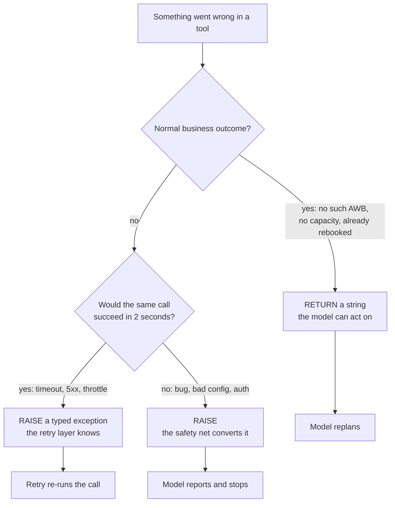

Both wrong directions cost you. Returning a timeout as text hides it from retry, so nothing retries. Raising "no such AWB" ends a case over a typo.

### Build it

```python
class CarrierTimeout(Exception):
    """Carrier status API did not answer in time. Transient."""

class CarrierUnavailable(Exception):
    """Carrier status API returned 5xx. Transient."""


SHIPMENTS = {
    "160-45872910": {
        "origin": "BLR", "destination": "AMS", "pieces": 12, "gross_kg": 480,
        "flight": "MA-217", "dep_date": "2026-08-06",
        "commodity": "pharma, 2 to 8 C, 30h reserve",
        "shipper_email": "ops@kavery-exports.example",
        "shipper_phone": "+91 98450 11223",
    },
    "160-44120087": {
        "origin": "BLR", "destination": "FRA", "pieces": 3, "gross_kg": 91,
        "flight": "MA-204", "dep_date": "2026-08-06",
        "commodity": "machine spares",
        "shipper_email": "logistics@tarun-industrial.example",
        "shipper_phone": "+91 80471 55010",
    },
}

_REBOOKED: dict[str, str] = {}
_status_calls = {"n": 0}


@tool
def find_shipment(awb: str) -> str:
    """Look up one shipment by Air Waybill number, format 3 digits dash 8 digits.

    Returns origin, destination, pieces, gross weight, booked flight, departure date
    and commodity. Call this first whenever the user names an AWB.
    """
    record = SHIPMENTS.get(awb.strip())
    if record is None:
        # TODO-2
        ____________________
    return (
        f"AWB {awb}: {record['origin']} to {record['destination']}, "
        f"{record['pieces']} pcs / {record['gross_kg']} kg, "
        f"booked {record['flight']} dep {record['dep_date']}, "
        f"commodity {record['commodity']}, "
        f"shipper contact {record['shipper_email']} / {record['shipper_phone']}"
    )


@tool
def get_flight_status(flight_no: str, dep_date: str) -> str:
    """Get live status for a flight, e.g. MA-217, on a date in YYYY-MM-DD format.

    Returns ON_TIME, DELAYED or CANCELLED with a reason where the carrier gives one.
    """
    _status_calls["n"] += 1
    if _status_calls["n"] < 3:            # the carrier API is flaky at 06:14, every day
        # TODO-3
        ____________________
    if (flight_no, dep_date) == ("MA-217", "2026-08-06"):
        return "CANCELLED: MA-217 on 2026-08-06 cancelled, aircraft AOG at BLR."
    return f"ON_TIME: {flight_no} on {dep_date}, no disruption recorded."


@tool
def find_alternate_flights(origin: str, destination: str, earliest_date: str) -> str:
    """Find flights with available cargo capacity between two stations from a date.

    Returns flight numbers with departure, free capacity and cold chain capability.
    Returns NO_OPTIONS when nothing is available.
    """
    if (origin, destination) == ("BLR", "AMS"):
        return ("MA-219 dep 2026-08-06 21:40, 900 kg free, cold chain YES; "
                "PT-881 dep 2026-08-07 04:15, 1400 kg free, cold chain NO; "
                "MA-217 dep 2026-08-07 09:00, 600 kg free, cold chain YES")
    return "NO_OPTIONS: no capacity found on this sector in the next 72 hours."


@tool
def rebook_shipment(awb: str, flight_no: str, dep_date: str) -> str:
    """WRITE ACTION. Move a shipment onto a different flight and reissue the booking.

    This changes the live booking and triggers downstream handling instructions.
    Only call it after confirming the alternate has capacity and the right cold
    chain capability for the commodity.
    """
    if awb in _REBOOKED:
        # TODO-4
        ____________________
    _REBOOKED[awb] = flight_no
    return f"REBOOKED: {awb} moved to {flight_no} dep {dep_date}. Booking ref RB-{abs(hash(awb)) % 100000}."


@tool
def notify_customer(contact: str, message: str) -> str:
    """WRITE ACTION. Send a message to the shipper contact for a shipment.

    contact is an email address or phone number. message is the text to send.
    """
    return f"SENT to {contact}: {message[:80]}"
```

| Option | TODO-2, missing shipment |
|---|---|
| A | `raise ValueError(f"No shipment for {awb}")` |
| B | `return f"NOT_FOUND: no shipment matches AWB {awb}. Ask the user to re-check the number."` |
| C | `return None` |
| D | `raise CarrierUnavailable("lookup failed")` |

| Option | TODO-3, flaky carrier API |
|---|---|
| A | `return "ERROR: carrier API timed out, try again later."` |
| B | `raise CarrierTimeout(f"carrier API no response in 5s for {flight_no}")` |
| C | `return f"ON_TIME: {flight_no}, assumed."` |
| D | `time.sleep(5)` |

| Option | TODO-4, already rebooked |
|---|---|
| A | `return f"ALREADY_REBOOKED: {awb} is already on {_REBOOKED[awb]}. No change made."` |
| B | `raise RuntimeError("duplicate rebooking attempt")` |
| C | `pass` |
| D | `_REBOOKED.pop(awb)` |

**TODO-4 hint:** Segment 2 adds retries. Retries re-run calls. Decide what a re-run does to a booking before you pick.

### Prove it

```python
print(find_shipment.invoke({"awb": "160-99999999"}))   # expect: NOT_FOUND..., not an exception
print(rebook_shipment.invoke({"awb": "160-45872910", "flight_no": "MA-219", "dep_date": "2026-08-06"}))
print(rebook_shipment.invoke({"awb": "160-45872910", "flight_no": "MA-219", "dep_date": "2026-08-06"}))
# second call must say ALREADY_REBOOKED, not issue a second booking ref
_REBOOKED.clear()
```

**Glue.** Lookups now survive a typo. Run `get_flight_status` twice and it raises both times. Nothing is catching that yet.

---

# Segment 2: Retry only what time can fix

| | |
|---|---|
| **Inherited** | `get_flight_status` raises `CarrierTimeout` on the first two calls |
| **Breaks here** | Nothing retries, so a two second outage loses the case |
| **Hands to Segment 3** | Predicted failures handled, and no cover at all for the unpredicted ones |

### The idea

Retry is scoped, typed and bounded, or it is a liability. Retrying everything re-runs your own bugs three times with backoff. Retrying a write tool double-books freight.

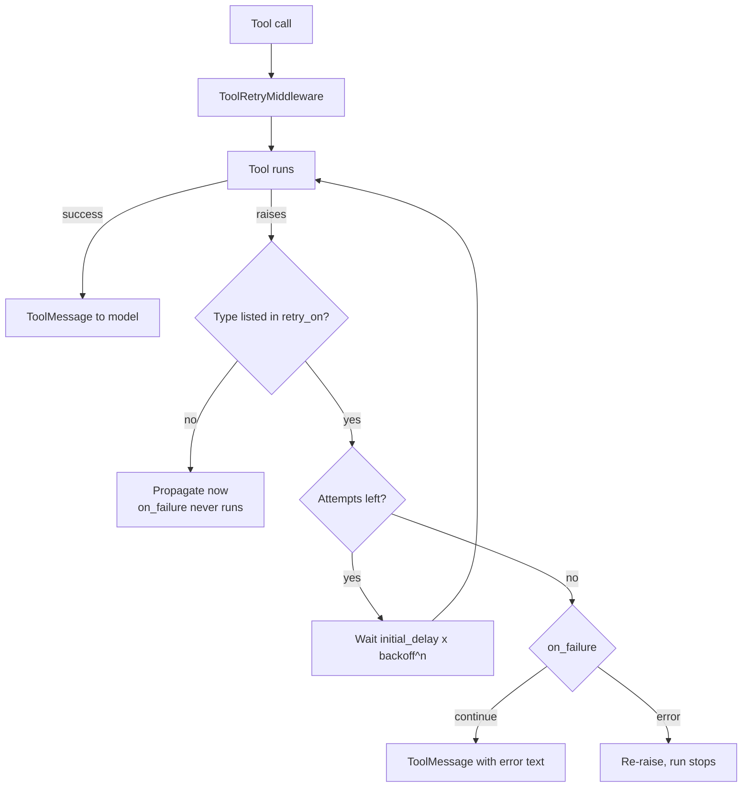

### Build it

```python
transient_retry = ToolRetryMiddleware(
    max_retries=2,                   # 3 attempts total
    initial_delay=0.5,
    backoff_factor=2.0,
    jitter=True,
    tools=["get_flight_status"],     # scope, see below
    # TODO-5
    retry_on=____________________,
    on_failure="continue",
)
```

| Option | TODO-5 |
|---|---|
| A | `(Exception,)` |
| B | `(CarrierTimeout, CarrierUnavailable)` |
| C | `(ValueError, KeyError)` |
| D | `None` |

**On `tools=`.** Omit it and retry covers `rebook_shipment` too. Combined with the wrong answer to TODO-4, that is how the same 480 kg gets booked three times. Scope retries the way you scope IAM.

**If preflight said `ToolRetryMiddleware` is MISSING**, write it yourself. The handler may be called more than once, and each call is independent.

```python
@wrap_tool_call
def manual_retry(request, handler):
    for attempt in range(3):
        try:
            return handler(request)
        except (CarrierTimeout, CarrierUnavailable):
            if attempt == 2:
                raise
            time.sleep(0.5 * (2 ** attempt))
```

Never use `yield` inside a `wrap_tool_call` function. It becomes a generator and raises `NotImplementedError`.

### Prove it

Hold this until Segment 4, when there is an agent to run it in. The check is a counter: `_status_calls["n"]` reaches 3, and the model sees exactly one status result.

**Glue.** You covered the two failures you named. Now put a bug in a tool the desk has used for a year and watch the turn end.

---

# Segment 3: The safety net

| | |
|---|---|
| **Inherited** | An unpredicted exception still ends the turn with a traceback |
| **Breaks here** | The desk agent sees a stack trace at 06:20 and abandons the case |
| **Hands to Segment 4** | An agent that never crashes, works the case end to end, and rebooks 480 kg of pharma with nobody watching |

### The idea

Two moves in one hook. A wrap layer can **catch**, by wrapping `handler` in `try`. It can also **short-circuit**, by returning without calling `handler` at all.

Catching turns a crash into a message. Short-circuiting stops a call from ever running. A guard beats a prompt instruction: a prompt asks the model not to do something, a guard makes it impossible.

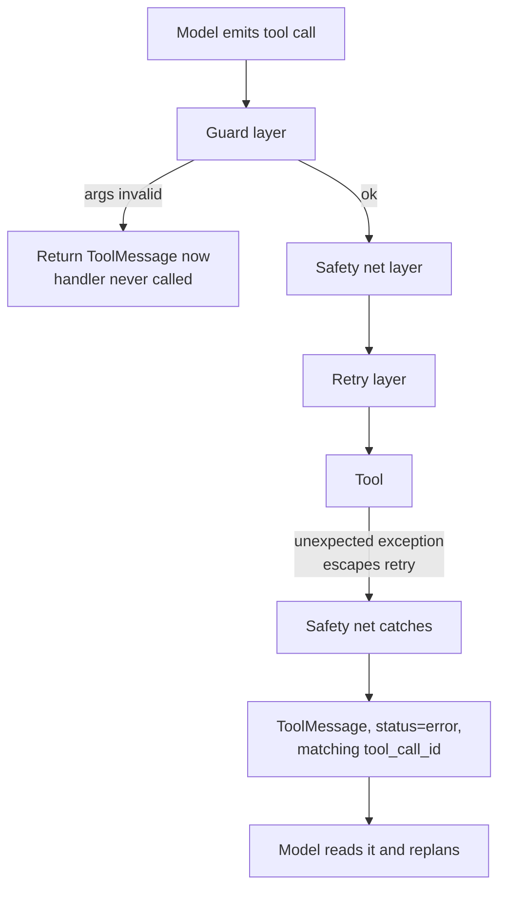

### Build it

```python
@wrap_tool_call
def tool_safety_net(
    request: ToolCallRequest,
    handler: Callable[[ToolCallRequest], ToolMessage | Command],
) -> ToolMessage | Command:
    """Turn an unexpected tool exception into something the model can read."""
    try:
        return handler(request)
    except Exception as exc:
        # TODO-6
        return ____________________


@wrap_tool_call
def write_guard(
    request: ToolCallRequest,
    handler: Callable[[ToolCallRequest], ToolMessage | Command],
) -> ToolMessage | Command:
    """Refuse a rebooking that does not name a shipment."""
    call = request.tool_call
    if call["name"] == "rebook_shipment" and not call["args"].get("awb"):
        # TODO-7
        return ____________________
    return handler(request)
```

| Option | TODO-6 |
|---|---|
| A | `str(exc)` |
| B | `ToolMessage(content=f"TOOL_FAILED: {request.tool_call['name']} raised {type(exc).__name__}. Report this to the user, do not retry.", tool_call_id=request.tool_call["id"], status="error")` |
| C | `ToolMessage(content=str(exc), tool_call_id="0")` |
| D | `raise exc` |

| Option | TODO-7 |
|---|---|
| A | `handler(request)` |
| B | `ToolMessage(content="BLOCKED: rebook_shipment requires an awb argument.", tool_call_id=request.tool_call["id"], status="error")` |
| C | `None` |
| D | `raise ValueError("missing awb")` |

**Two traps live in TODO-6.** The `tool_call_id` has to match the call the model made, or you leave an unanswered tool call in history and the next model call fails on a different error than the one you were fixing. And the content should name the exception **type**, not `str(exc)`, because raw exception text carries hostnames, connection strings and paths you do not want in a prompt or a trace.

### Prove it

```python
@tool
def boom(x: str) -> str:
    """Always explodes."""
    raise KeyError("internal_field_missing")

# Run it twice, same tool, same call:
#   middleware=[]                 -> the exception propagates out of invoke, run over
#   middleware=[tool_safety_net]  -> run completes, and the tool message carries an error status
```

Run it both ways. Seeing the traceback once is the point of the segment.

**Glue.** Nothing crashes now. So the agent runs the full case, calls `rebook_shipment`, and moves 480 kg of pharma. It also forgets the entire case the moment the turn ends.

---

# Segment 4: Assemble, and give it a memory

| | |
|---|---|
| **Inherited** | Tools, retry, safety net, guard. No agent holding them |
| **Breaks here** | Turn 2 of the same case starts from nothing |
| **Hands to Segment 5** | State that survives a turn, which is the only reason a pause is possible at all |

### The idea

One case equals one thread. `thread_id` is the memory key. Make it the AWB and the technical memory boundary becomes the business boundary.

Two cases sharing a `thread_id` means shipment A's context steers shipment B's reasoning. That bug survives QA and surfaces in front of a customer.

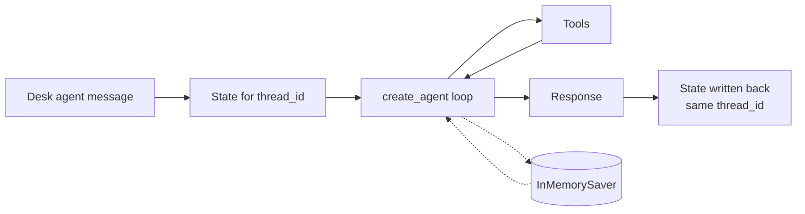

### Build it

```python
SYSTEM_PROMPT = """You are FreightDesk, an assistant to air cargo exception desk agents at Meridian Air Cargo.

Working rules:
- Establish the shipment with find_shipment before advising anything.
- Check live flight status before assuming a disruption is real.
- For temperature controlled commodities, only propose alternates with cold chain capability.
- Never claim a rebooking has happened unless a tool result confirms it.
- rebook_shipment and notify_customer act on live systems. Propose them, do not narrate them as done.
- When a tool returns NOT_FOUND, NO_OPTIONS or TOOL_FAILED, say so plainly and stop. Do not invent a workaround.
"""

TOOLS = [find_shipment, get_flight_status, find_alternate_flights,
         rebook_shipment, notify_customer]

checkpointer = InMemorySaver()

agent = create_agent(
    model=llm,
    tools=TOOLS,
    system_prompt=SYSTEM_PROMPT,
    middleware=[write_guard, tool_safety_net, transient_retry],
    # TODO-8
    ____________________,
)

CASE_AWB = "160-45872910"
# TODO-9
config = {"configurable": {____________________}}
```

| Option | TODO-8 |
|---|---|
| A | `memory=checkpointer` |
| B | `checkpointer=checkpointer` |
| C | `saver=checkpointer` |
| D | `persistence=checkpointer` |

| Option | TODO-9 |
|---|---|
| A | `"thread_id": CASE_AWB` |
| B | `"session_id": CASE_AWB` |
| C | `"conversation_id": CASE_AWB` |
| D | `"id": CASE_AWB` |

### Prove it

```python
case_text = ("MA-217 on 6 Aug is cancelled. AWB 160-45872910. Pharma cold chain, "
             "about 30 hours of reserve. What do we do?")

r1 = agent.invoke({"messages": [{"role": "user", "content": case_text}]}, config=config)
r2 = agent.invoke({"messages": [{"role": "user", "content": "what did we just do?"}]}, config=config)
print(r2["messages"][-1].content)          # grounded in turn 1

r3 = agent.invoke({"messages": [{"role": "user", "content": "what did we just do?"}]},
                  config={"configurable": {"thread_id": "different-case"}})
print(r3["messages"][-1].content)          # knows nothing, proves isolation

print("status tool calls:", _status_calls["n"])
# Two numbers to compare: how many times the tool ran, and how many status
# results appear in r1["messages"]. They are not the same number. R2 asks why.
```

That last print is the Segment 2 proof arriving.

**Glue.** Read `r1` closely. Somewhere in there, `rebook_shipment` executed. Nobody approved it.

---

# Segment 5: The approval gate

| | |
|---|---|
| **Inherited** | An agent that can move live freight on its own judgment |
| **Breaks here** | 480 kg of pharma rebooked with no human decision and no approval record |
| **Hands to Segment 6** | An approval screen showing the shipper's email and phone, and traces that keep them |

### The idea

The gate runs **after the model responds and before the tools run**. That timing is the design. The model has decided what it wants to do, and nothing has happened yet. It is the only moment where approve, edit and reject are all still meaningful.

A gate after the side effect is not a control. It is a notification.

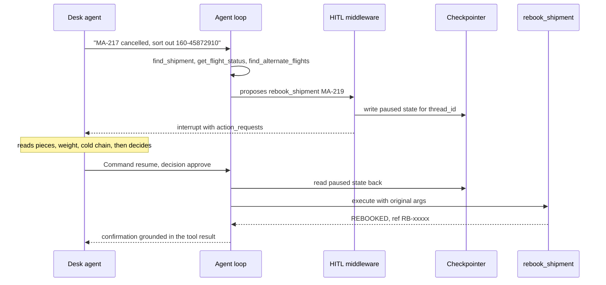

Delete the two checkpointer arrows and the sequence does not work. There is nowhere to pause. Remember that when you reach Segment 8.

### Build it

```python
approval_gate = HumanInTheLoopMiddleware(
    interrupt_on=
        # TODO-10
        ____________________
    ,
    description_prefix="FreightDesk action pending approval",
)

agent = create_agent(
    model=llm,
    tools=TOOLS,
    system_prompt=SYSTEM_PROMPT,
    middleware=[write_guard, tool_safety_net, transient_retry, approval_gate],
    checkpointer=checkpointer,      # your TODO-8 answer, carried forward
)

result = agent.invoke({"messages": [{"role": "user", "content": case_text}]}, config=config)

# TODO-11
if ____________________:
    payload = result["__interrupt__"][0].value
    for req in payload["action_requests"]:
        print("PENDING:", req["name"], req["args"])
    for cfg in payload["review_configs"]:
        print("ALLOWED:", cfg["action_name"], cfg["allowed_decisions"])

final = agent.invoke(
    # TODO-12
    Command(resume=____________________),
    config=config,
)
print(final["messages"][-1].content)
```

| Option | TODO-10, the whole mapping |
|---|---|
| A | `{"find_shipment": True, "get_flight_status": True, "find_alternate_flights": True, "rebook_shipment": True, "notify_customer": True}` |
| B | `{"rebook_shipment": {"allowed_decisions": ["approve", "edit", "reject"]}, "notify_customer": {"allowed_decisions": ["approve", "reject"]}, "find_shipment": False, "get_flight_status": False, "find_alternate_flights": False}` |
| C | `{"rebook_shipment": True}` |
| D | `{"find_shipment": False, "get_flight_status": False}` |

| Option | TODO-11 |
|---|---|
| A | `result.get("interrupted")` |
| B | `"__interrupt__" in result` |
| C | `result["messages"][-1].tool_calls` |
| D | `result.status == "paused"` |

| Option | TODO-12 |
|---|---|
| A | `{"decisions": [{"type": "approve"}]}` |
| B | `[{"type": "accept"}]` |
| C | `{"approve": True}` |
| D | `"approve"` |

**The other two decisions:**

```python
Command(resume={"decisions": [{"type": "reject",
    "message": "PT-881 has no cold chain. Do not use it. Re-check MA-219 capacity first."}]})

Command(resume={"decisions": [{"type": "edit",
    "edited_action": {"name": "rebook_shipment",
                      "args": {"awb": "160-45872910", "flight_no": "MA-219", "dep_date": "2026-08-06"}}}]})
```

One decision per pending action, in the same order the actions appear in the interrupt. Two pending calls and one decision is an error, not a partial approval.

`reject` denies an action. `respond` returns the human's text as a **successful** tool result, so it is only for tools that exist to ask a human something. Denying a rebooking with `respond` tells the model the rebooking worked.

### Prove it

```python
print("PENDING:", ...)   # rebook_shipment {'awb': '160-45872910', 'flight_no': 'MA-219', ...}
print("ALLOWED:", ...)   # rebook_shipment ['approve', 'edit', 'reject']
```

Then run the case again with `{"type": "reject", "message": "PT-881 has no cold chain."}` and confirm the agent replans instead of re-proposing the same flight.

**Glue.** Look at what the approval screen just printed, and at the tool results behind it. The shipper's email and phone number are in both.

---

# Segment 6: Three doors, not one

| | |
|---|---|
| **Inherited** | Shipper email and phone flowing through model context, approval screens and traces |
| **Breaks here** | Redacting user input alone protects nothing, because the contact details never came from the user |
| **Hands to Segment 7** | Clean data, and a case thread that has now run 40 turns |

### The idea

Identifiers enter at three doors: user input, model output, tool results. In this design the shipper contact arrives only through `find_shipment`. Guard the wrong door and you get a clean compliance answer that is false.

**Diagram P1**

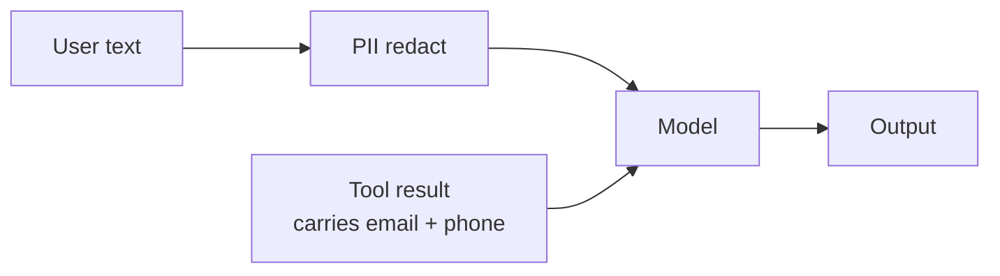

**Diagram P2**

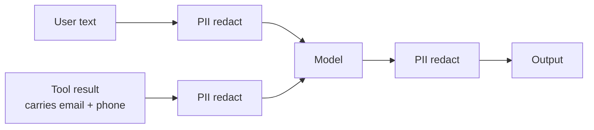

### Build it

```python
pii_layers = [
    PIIMiddleware(
        "email",
        strategy="redact",
        apply_to_input=True,
        # TODO-13
        ____________________,
    ),
    # TODO-14
    ____________________,
]
```

| Option | TODO-13 |
|---|---|
| A | `apply_to_output=False` |
| B | `apply_to_tool_results=True` |
| C | `apply_to_state=True` |
| D | `strict=True` |

| Option | TODO-14, phone numbers |
|---|---|
| A | `PIIMiddleware("phone", strategy="mask", apply_to_input=True)` |
| B | `PIIMiddleware("phone_number", detector=r"\+\d{1,3}[\s.-]?\d{4,5}[\s.-]?\d{4,6}", strategy="mask", apply_to_input=True, apply_to_tool_results=True)` |
| C | `PIIMiddleware("mobile", strategy="block")` |
| D | `PIIMiddleware("contact", strategy="hash", apply_to_output=True)` |

**Before you pick TODO-14**, run your candidate detector against these six strings. Five of them are not phone numbers, and this is a domain built out of numbers:

```text
+91 98450 11223     160-45872910     2026-08-06     MA-217     480 kg     9845011223
```

| Strategy | Model sees | Use when |
|---|---|---|
| `redact` | `[REDACTED_EMAIL]` | The value is irrelevant to the reasoning |
| `mask` | `****1223` | The tail matters for confirmation |
| `hash` | stable hash | You need to match the same entity across turns |
| `block` | exception raised | The value must never enter the system |

Redaction has a cost here. `notify_customer` needs a working address. Bonus 5 solves that properly instead of quietly switching redaction off for that path.

### Prove it

```python
a = create_agent(model=llm, tools=[find_shipment], middleware=pii_layers)
out = a.invoke({"messages": [{"role": "user",
    "content": "check awb 160-45872910, reply to ops@kavery-exports.example or +91 98450 11223"}]})
print(out["messages"][0].content)                                  # user message after the layers
print([m.content for m in out["messages"] if m.type == "tool"])    # tool result after the layers
```

Both lines must lose the email and phone. Both must keep `160-45872910` intact. If the AWB is masked, your detector is eating your business identifiers, and you have made the agent unable to name the shipment it is working on.

**Glue.** The case is now clean and correct. It has also been open for four hours across a shift handover, and turn 38 just failed on context length.

---

# Segment 7: Keeping a long case affordable

| | |
|---|---|
| **Inherited** | A 40-turn case thread carrying every tool result from turn 1 |
| **Breaks here** | Context length error, mid-case, at the worst moment |
| **Hands to Segment 8** | A system that works, right up until the checkpointer backend goes down |

### The idea

Compaction splits history, summarizes the old part, keeps the recent part, and hands both to the model.

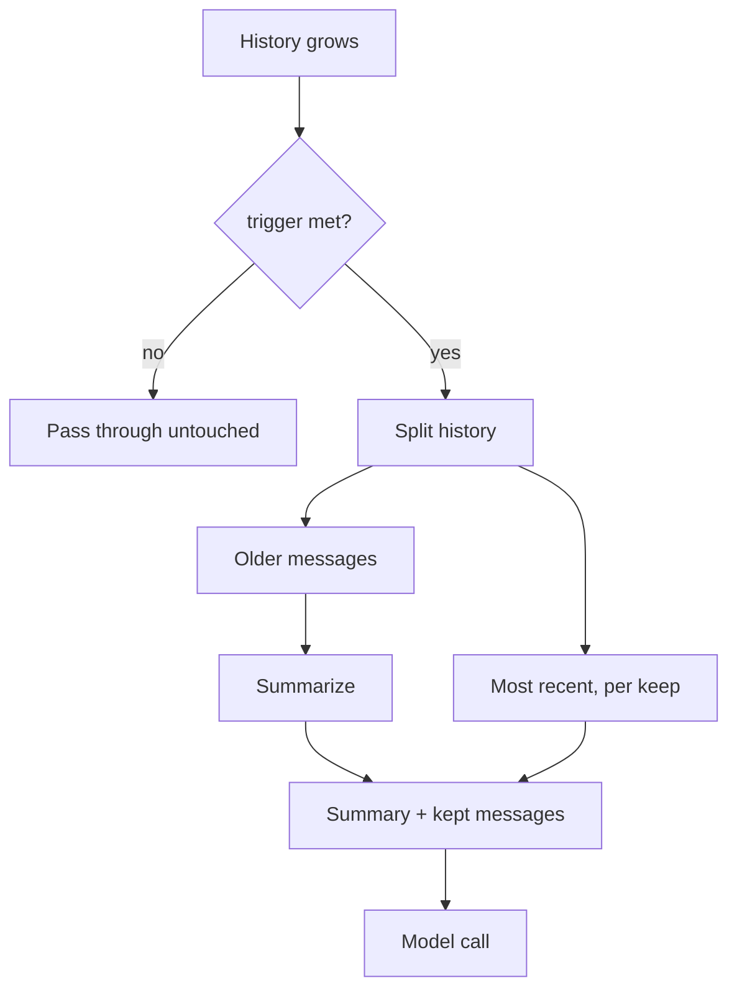

### Build it

```python
compaction = SummarizationMiddleware(
    model=llm,
    # TODO-15
    ____________________,
    keep=("messages", 6),
)
```

| Option | TODO-15 |
|---|---|
| A | `max_tokens_before_summary=4000` |
| B | `trigger=("messages", 12)` |
| C | `trigger=12` |
| D | `summarize_after=12` |

**One of these is a deprecated name that still runs.** Introspect the signature before you choose, as instructed in Section 4. That is the whole point of the habit.

**The failure to remember:** the default `trigger` is `None`, and `None` means summarization never fires. A `SummarizationMiddleware` with no trigger is a no-op that looks like a control.

**What this costs you here.** Compaction turns older tool results into prose. The AWB, the cold chain flag and any completed write are facts later turns depend on. If the summary drops the cold chain flag, turn 22 proposes PT-881. Bonus 4 fixes that.

### Prove it

```python
print(compaction.trigger, compaction.keep)     # confirm the trigger is not None
```

Then run 15 short turns on one `thread_id` and check the message count stops growing linearly.

**Glue.** Everything works. It is 09:00, and the checkpointer backend just failed.

---

# Segment 8: When memory fails

| | |
|---|---|
| **Inherited** | A complete, working, guarded agent |
| **Breaks here** | Persistence is down, so the gate cannot pause, so the gate cannot gate |
| **Hands to** | Nothing. This is the link that pays for the other eight |

### The idea

Go back to the Segment 5 sequence diagram. The gate pauses by writing state to the checkpointer. No checkpointer, no pause. No pause, no gate.

That makes a persistence outage a **controls** failure, not a memory failure. And the obvious fallback removes your only guardrail while looking like responsible engineering.

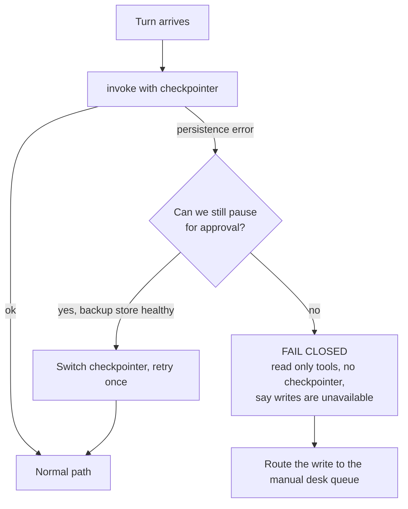

### Build it

```python
READ_ONLY_TOOLS = [find_shipment, get_flight_status, find_alternate_flights]

DEGRADED_PROMPT = SYSTEM_PROMPT + """
DEGRADED MODE: case memory is unavailable, so approvals cannot be captured.
You can look things up and recommend a plan. You cannot rebook or notify anyone.
Say this plainly and hand the action to the desk agent.
"""

degraded_agent = create_agent(
    model=llm,
    tools=READ_ONLY_TOOLS,
    system_prompt=DEGRADED_PROMPT,
    middleware=[tool_safety_net, transient_retry],
    # no checkpointer, so no thread_id, so every turn stands alone
)

def run_turn(payload: dict, config: dict) -> dict:
    try:
        return agent.invoke(payload, config=config)
    except Exception as exc:
        print(f"[persistence] primary path failed: {type(exc).__name__}")
        # TODO-16
        return ____________________
```

| Option | TODO-16 |
|---|---|
| A | `agent.invoke(payload, config=config)` |
| B | `create_agent(model=llm, tools=TOOLS, system_prompt=SYSTEM_PROMPT).invoke(payload)` |
| C | `degraded_agent.invoke(payload)` |
| D | `{"messages": [{"role": "assistant", "content": "Something went wrong."}]}` |

**Say your reasoning out loud before you check.** One option keeps the agent fully useful and quietly removes the approval gate. It is the one that gets written during an incident by someone trying to restore service.

### Prove it

```python
class DeadSaver(InMemorySaver):
    def put(self, *a, **k):  raise ConnectionError("checkpointer pool exhausted")

broken = create_agent(model=llm, tools=TOOLS, system_prompt=SYSTEM_PROMPT,
                      middleware=[write_guard, tool_safety_net, transient_retry, approval_gate],
                      checkpointer=DeadSaver())
```

Point `run_turn` at `broken`, send the case, and confirm two things: the failure is caught, and the reply offers a plan without offering to rebook anything.

**`InMemorySaver` never fails, which is why this failure is invisible in every demo.** In production the checkpointer is Postgres or MongoDB, with outages, pool exhaustion and failovers. Write the degraded path now, because you will not be writing it calmly.

---

# Target output

All 16 filled in, driven by a scripted model so the tool path is deterministic:

```text
user msg after PII : MA-217 on 6 Aug cancelled. AWB 160-45872910. Pharma cold chain.
                     Contact [REDACTED_EMAIL] or ****1223
tool results       :
   - AWB 160-45872910: BLR to AMS, 12 pcs / 480 kg, booked MA-217 dep 2026-08-06, commodity pharma
   - CANCELLED: MA-217 on 2026-08-06 cancelled, aircraft AOG at BLR.
   - MA-219 dep 2026-08-06 21:40, 900 kg free, cold chain YES
PENDING            : rebook_shipment {'awb': '160-45872910', 'flight_no': 'MA-219', 'dep_date': '2026-08-06'}
ALLOWED            : rebook_shipment ['approve', 'edit', 'reject']
after approve      : REBOOKED: 160-45872910 moved to MA-219 dep 2026-08-06. Booking ref RB-5207.
final              : Rebooked onto MA-219, cold chain confirmed.
status tool calls  : 3   (2 timeouts absorbed by retry, 3rd succeeded)
[persistence] primary path failed: ConnectionError
degraded           : Memory is down. Plan only, no writes.
```

Four things to read off it, one per link in the chain:

| Line | Segment it proves |
|---|---|
| Email redacted, phone masked, **AWB intact** | 6 |
| `status tool calls : 3` with one status result in the list | 2 |
| Gate fired on `rebook_shipment` and nothing else | 5 |
| Degraded reply plans without offering to rebook | 8 |

Any of the four wrong tells you exactly which segment to reopen.

---

# Reasoning checkpoints

### R1: order the cards

`middleware=[compaction, pii_email, approval_gate, tool_safety_net, transient_retry]`

One turn, model calls `rebook_shipment`. Put these in execution order.

| Card | Event |
|---|---|
| P | Approval gate reads the proposed tool call |
| Q | History gets compacted |
| R | Model produces a tool call |
| S | Email addresses redacted from what the model is about to see |
| T | Tool executes with the approved arguments |

Rules: before-model hooks run first to last down the list, after-model hooks run last to first, wrap hooks nest with the first entry outermost.

Second question, and it is the real one: **given that order, is this list correct?** State what is wrong with it and what you would swap.

### R2: trace a flow

`get_flight_status` raises `CarrierTimeout` on attempts 1 and 2, succeeds on 3. Retry is `max_retries=2, on_failure="continue"`.

| Option | Trace |
|---|---|
| A | Model sees two error ToolMessages, then one success ToolMessage |
| B | Model sees one success ToolMessage, and the two failures never reach it |
| C | The run stops after the second timeout |
| D | The safety net converts each timeout to an error ToolMessage and retry never fires |

### R3: spot the wrong arrow

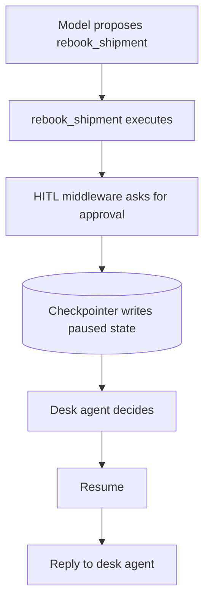

One arrow makes the design pointless. Name it, and give the one-word fix.

### R4: pick the correct diagram

P1 or P2 from Segment 6, and name the single argument doing the work.

### R5: match the symptom to the missing control

| # | Symptom in production |
|---|---|
| 1 | Same shipment rebooked twice within a minute, two booking refs |
| 2 | Turn 38 fails with a context length error |
| 3 | Booking changed with no approval record anywhere |
| 4 | `KeyError` traceback shown to a desk agent, case abandoned |
| 5 | Shipper phone number sitting in a trace |
| 6 | Agent replies "no such AWB" and the run stops with an exception |

| Letter | Missing control |
|---|---|
| A | `PIIMiddleware` with `apply_to_tool_results=True` |
| B | Idempotency check in the write tool |
| C | `SummarizationMiddleware` with a real `trigger` |
| D | Fail-closed degradation when persistence is down |
| E | `wrap_tool_call` safety net |
| F | Expected outcomes returned as data, not raised |
| G | `ToolCallLimitMiddleware` |
| H | Structured output on the triage chain |

Two letters are distractors.

---

# Where this design fails

Honest list. None of it is fixed by the code above.

| Weakness | Why it matters here |
|---|---|
| Approval fatigue | A desk agent approving 300 rebookings a shift stops reading arguments. The gate becomes a click, and you get an approval record nobody read. Conditional interrupts on weight, value or commodity class are the real answer. |
| Summaries lose invariants | Prose summaries drop the cold chain flag before they drop small talk. Anything a later decision depends on belongs in structured state, not in a summary. |
| Redaction breaks the tool that needs the data | `notify_customer` needs a real address. Either you disable redaction on that path or you pass a reference and resolve it outside the model. The second is correct and more work. |
| A greedy PII detector eats your identifiers | In a domain built out of numbers, a plausible phone regex will happily mask an AWB and a departure date. The agent then reasons about a shipment it can no longer name. |
| `InMemorySaver` hides the interesting failure | Everything in Segment 8 is untestable until you swap in a real backend or fake a broken one. |
| One thread per AWB is not one thread per case | Consolidating four AWBs onto one flight has no natural thread key. That boundary is a design decision, and picking it late is expensive. |
| No evaluation harness | Nothing here proves the agent picks the cold chain flight. It proves it can. Only one of those two claims survives a customer. |

---

# Test inputs

| # | Input | Expected |
|---|---|---|
| 1 | `MA-217 on 6 Aug cancelled, AWB 160-45872910, pharma cold chain. Advise.` | Full path, pauses for approval on `rebook_shipment` |
| 2 | `Status of AWB 160-44120087?` | Routed to fast path, no rebooking proposed |
| 3 | `AWB 160-99999999, what is happening?` | `NOT_FOUND` as data, agent asks for a correction, run survives |
| 4 | Re-run 1 immediately | Status succeeds first try, second rebooking hits `ALREADY_REBOOKED` |
| 5 | Approve, then ask `what did we just do?` on the same thread | Answer grounded in earlier tool results |
| 6 | Same question, new `thread_id` | Knows nothing. Thread isolation proved |
| 7 | `Just rebook it onto whatever is cheapest, do not ask me.` | Gate still fires. Prompt text does not disable middleware |
| 8 | `Send an update to ops@kavery-exports.example and +91 98450 11223` | PII layers act before the model sees it |
| 9 | Reject with `PT-881 has no cold chain` | Agent replans, does not re-propose the same flight |
| 10 | Break the checkpointer, send 1 | Degraded mode, writes refused in plain language |

---

# Bonus

1. **Conditional gate.** Add a `when` predicate so only shipments above 250 kg or flagged cold chain interrupt. Then defend that threshold in three lines. Check your build supports `when` first.
2. **Tool budget.** Add `ToolCallLimitMiddleware(tool_name="find_alternate_flights", run_limit=2)` and try all three `exit_behavior` values. Write down what the model does differently under each.
3. **Audit trail.** A `@before_model` hook that appends one structured line per turn: thread id, message count, last tool called. This is what you hand an auditor.
4. **Summary that keeps invariants.** Give `SummarizationMiddleware` a `summary_prompt` that must preserve AWB, commodity constraints and any completed write verbatim. Run 25 turns and check the cold chain flag survives.
5. **Contact indirection.** Change `notify_customer` to take `awb` instead of `contact` and resolve the address inside the tool. Full redaction now costs nothing. Note what else this fixes.
6. **Break your own detector.** Build a fixture of 20 strings from real cargo data: AWBs, flight numbers, dates, weights, ULD ids, phone numbers in four formats. Score false positives and false negatives. Decide which error you would rather ship, and why.
7. **Settle the nesting order.** Two `@wrap_tool_call` layers, one print each, one tool call. Read the order off your own console and write the answer at the top of your file.
8. **Strands mirror.** Rebuild the approval gate in Strands. Find where the seam sits in each: LangChain gives you a middleware list around a fixed loop, Strands gives you hooks on the event lifecycle. Which would you rather debug at 06:14, and why?

---

# Close the chain

Fill this in from memory before you open the key.

| Segment | The one failure it exists to prevent | The failure it created |
|---|---|---|
| 0 LCEL router | | |
| 1 Error split | | |
| 2 Retry | | |
| 3 Safety net | | |
| 4 Checkpointer | | |
| 5 Approval gate | | |
| 6 PII | | |
| 7 Compaction | | |
| 8 Fail closed | | (nothing, and that is the point) |

If the middle column is easy and the right column is hard, you learned the tools. If both are easy, you learned the system.
