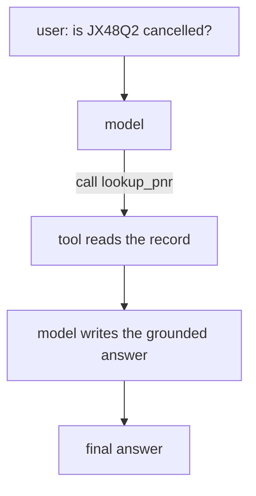
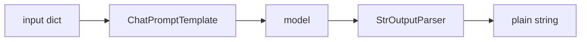

# LangChain Coding · Exercise 1: Agents and Pipes

**Language:** Python  **Topics:** create_agent, tools, LCEL pipes (`prompt | model | parser`), debugging, porting from Strands  **Level:** Intermediate

Target time: about 20 minutes. You write and run real code against Bedrock.

There are two ways to run a model in LangChain, and this exercise builds both:

- an **agent**, a model in a loop that can call tools, for when the task needs to fetch or act
- a **pipe** (LCEL), a straight line of `prompt | model | parser`, for when there are no tools and you just want a clean answer

Knowing which to reach for is half the skill. An agent loop is overhead when a pipe would do.

### Setup (run once)

```python
# pip install langchain langgraph langchain-aws
from langchain_aws import ChatBedrockConverse

model = ChatBedrockConverse(
    model="us.anthropic.claude-haiku-4-5-20251001-v1:0",
    region_name="us-east-1",
    temperature=0,
)
```

You need AWS credentials with Bedrock access (your lab account). The `us.` prefix is the inference-profile routing label and is required.

---

## Part 1 · Build a tool and an agent

**Goal:** wire TravelMind's booking lookup into an agent and run one turn.

The loop you are building:



**Starter code:**

```python
from langchain.agents import create_agent
from langchain.tools import tool

BOOKINGS = {"JX48Q2": "BLR-DEL cancelled, Rao, Gold tier"}

@tool
def lookup_pnr(pnr: str) -> str:
    # TODO 1: write a one-line docstring that tells the model exactly when to call this tool.
    # TODO 2: return BOOKINGS[pnr], or "PNR not found" when the pnr is missing.
    ...

# TODO 3: build the agent with the lookup_pnr tool and a short TravelMind system prompt.
agent = ...

# TODO 4: invoke the agent on "is JX48Q2 cancelled?" and print the final message text.
```

**Your task:**

1. Fill the docstring. It is the only thing the model reads to decide when to call the tool, so make it specific.
2. Return a safe value on a missing PNR, not an exception.
3. Call `create_agent(model, tools=[...], system_prompt=...)`.
4. The final text is `result["messages"][-1].content`.

**Done when:** the printout names the cancelled BLR-DEL segment and the Gold tier, and it came from the tool, not from the model guessing.

**Hint:** `tools` must be a list even for one tool. `agent.invoke({"messages": [{"role": "user", "content": "..."}]})`.

---

## Part 2 · Convert a diagram into an LCEL pipe

**Goal:** implement this pipeline exactly as drawn. No tools, no loop, just composition.



Read the diagram left to right. The prompt turns your input into messages, the model answers, the parser strips the `AIMessage` down to a plain string.

**Starter code:**

```python
from langchain_core.prompts import ChatPromptTemplate
from langchain_core.output_parsers import StrOutputParser

# TODO 1: a prompt with a system line "You are TravelMind." and a human line
#         that asks to summarise the disruption for {pnr} in one sentence.
prompt = ...

# TODO 2: compose the pipe in the order the diagram shows: prompt, then model, then parser.
chain = ...

# TODO 3: invoke on {"pnr": "JX48Q2"} and print the result.
```

**Your task:**

1. Use `ChatPromptTemplate.from_messages([...])` with a `("system", ...)` and a `("human", ...)` tuple. Put `{pnr}` in the human line.
2. Compose with the pipe operator, matching the arrows in the diagram.
3. `invoke` takes the dict of template variables, not a bare string.

**Done when:** the printout is a one-sentence **string** (not an `AIMessage`, not a dict). If you see `content=...` wrapping it, the parser is missing.

**Hint:** the whole pipe is three objects joined by `|`. The parser is `StrOutputParser()`.

**Why it matters:** Part 1 spun up a full agent loop. Part 2 answered with three composed objects. Same model, far less machinery. Reach for the pipe when nothing needs fetching.

---

## Part 3 · Debug and fix a broken agent

**Goal:** this agent should look up a booking, but it will not run. Find the bugs and write the corrected lines.

```python
L1  from langchain import create_agent
L2  from langchain.tools import tool
L3
L4  BOOKINGS = {"JX48Q2": "BLR-DEL cancelled, Rao, Gold tier"}
L5
L6  @tool
L7  def lookup_pnr(pnr: str) -> str:
L8      '''Return the booking status for a PNR.'''
L9      return BOOKINGS.get(pnr, "PNR not found")
L10
L11 agent = create_agent(model, lookup_pnr, system_prompt="You are TravelMind.")
L12 result = agent.invoke("is JX48Q2 cancelled?")
L13 print(result)
```

**Your task:** three things are wrong. For each, name the line and give the corrected version.

1. One line imports from the wrong place.
2. One line passes a tool where a list is expected.
3. One line hands the agent the wrong input shape.

**Done when:** you have three corrected lines and the agent runs, printing a grounded answer. Bonus: line L13 prints the whole state dict, so also show how to print just the final text.

**Hint:** the correct import path for the agent constructor, the shape `tools` expects, and the shape `invoke` expects are all in Part 1.

---

## Part 4 · Port a Strands agent to LangChain

**Goal:** you already know this in Strands. Rebuild it in LangChain, part for part.

**Strands (works):**

```python
from strands import Agent, tool
from strands.models import BedrockModel

@tool
def disruption_reason(flight: str) -> str:
    '''Return why a flight was cancelled or delayed, given its flight number.'''
    return "weather hold at BLR"

agent = Agent(
    model=BedrockModel(model_id="us.anthropic.claude-haiku-4-5-20251001-v1:0", region_name="us-east-1"),
    system_prompt="You are TravelMind.",
    tools=[disruption_reason],
)
print(str(agent("why was AI-506 delayed?")))
```

**Your task:** write the LangChain version. Four things change:

| Strands | LangChain |
|---|---|
| `BedrockModel(model_id=..., region_name=...)` | `ChatBedrockConverse(model=..., region_name=...)` |
| `Agent(model=, system_prompt=, tools=[...])` | `create_agent(model, tools=[...], system_prompt=)` |
| `agent("...")` | `agent.invoke({"messages": [...]})` |
| `str(result)` | `result["messages"][-1].content` |

**Done when:** your LangChain agent prints the same kind of grounded answer about the delay. The `@tool` and its docstring do not change at all.

**Hint:** the tool definition ports unchanged. Only the model constructor, the agent constructor, and the run-and-read lines differ.

---

## Part 5 · Stretch: feed a pipe's output into the agent

**Goal:** compose the two halves. Use a pipe to build a clean instruction, then hand it to the agent from Part 1.

**Starter code:**

```python
from langchain_core.runnables import RunnableLambda

# TODO 1: a small step that takes {"pnr": "JX48Q2"} and returns the string
#         "Please check booking JX48Q2 and tell me the status."
build_question = RunnableLambda(...)

# TODO 2: a step that takes that string, runs the Part 1 agent on it, and returns the final text.
ask_agent = RunnableLambda(...)

# TODO 3: compose build_question | ask_agent and invoke on {"pnr": "JX48Q2"}.
```

**Your task:**

1. `build_question` formats the PNR into the instruction string.
2. `ask_agent` runs `agent.invoke({"messages": [{"role": "user", "content": <the string>}]})` and returns `["messages"][-1].content`.
3. Compose the two steps with `|` and invoke.

**Done when:** one `invoke` on `{"pnr": "JX48Q2"}` produces the grounded booking answer, with the pipe and the agent working as one chain.

**Hint:** a `RunnableLambda` wraps any function into a pipe step, so an agent can live inside an LCEL chain.

---

### What you practised

- built an agent and an LCEL pipe, and felt when each fits
- read a diagram and turned it into a composed pipe
- fixed the three bugs that stop most first agents from running
- ported a Strands agent to LangChain, tool definition unchanged
- composed a pipe and an agent into one chain
