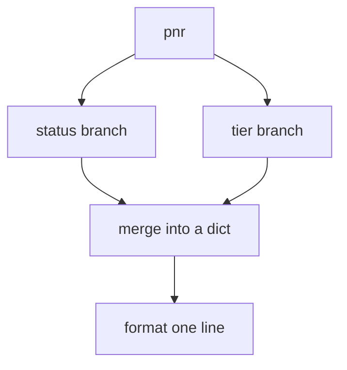
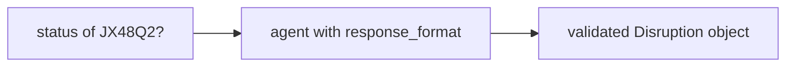
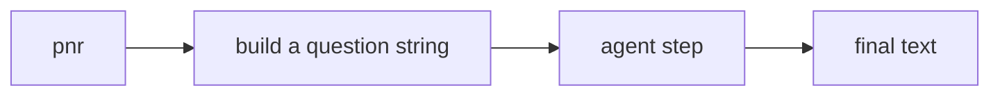

# LangChain Coding · Exercise 2: Composition and Control

**Language:** Python  **Topics:** LCEL composition (`RunnableParallel`, `RunnableLambda`), structured output with `response_format`, debugging a chain, porting from Strands  **Level:** Intermediate

Target time: about 20 minutes. You write and run real code against Bedrock.

Exercise 1 built a straight pipe. This one bends it. Two ideas:

- a pipe can **fan out**, running several steps on the same input, then merge the results
- an agent can return a **typed object** instead of prose, so the next line of code can trust it

Both are about control: shaping exactly what flows through, and what comes out.

### Setup (run once)

```python
# pip install langchain langgraph langchain-aws pydantic
from langchain_aws import ChatBedrockConverse

model = ChatBedrockConverse(
    model="us.anthropic.claude-haiku-4-5-20251001-v1:0",
    region_name="us-east-1",
    temperature=0,
)
```

AWS credentials with Bedrock access required (your lab account).

---

## Part 1 · Convert a diagram into a parallel pipe

**Goal:** implement this fan-out. The same input feeds two branches, the results merge into a dict, and a final step formats one line.



`RunnableParallel` runs the branches on the same input and returns a dict keyed by branch name. `RunnableLambda` wraps any function into a pipe step.

**Starter code:**

```python
from langchain_core.runnables import RunnableParallel, RunnableLambda

BOOKINGS = {"JX48Q2": {"status": "BLR-DEL cancelled", "tier": "Gold"}}

# TODO 1: status_branch takes {"pnr": "JX48Q2"} and returns the status string.
status_branch = RunnableLambda(...)

# TODO 2: tier_branch takes {"pnr": "JX48Q2"} and returns the tier string.
tier_branch = RunnableLambda(...)

# TODO 3: run both branches in parallel, producing {"status": ..., "tier": ...}.
fan_out = RunnableParallel(...)

# TODO 4: format_step takes that dict and returns
#         "JX48Q2: BLR-DEL cancelled, Gold tier, no rebooking fee."
format_step = RunnableLambda(...)

# TODO 5: compose fan_out then format_step, and invoke on {"pnr": "JX48Q2"}.
chain = ...
```

**Your task:**

1. `status_branch` reads `BOOKINGS[d["pnr"]]["status"]`.
2. `tier_branch` reads the tier the same way.
3. `RunnableParallel(status=status_branch, tier=tier_branch)` gives you the merged dict.
4. `format_step` reads `d["status"]` and `d["tier"]` and builds the sentence. Gold tier means no fee.
5. Compose with `|` and invoke on the dict.

**Done when:** the printout is the one-line briefing string, assembled from two branches that ran on the same input.

**Hint:** the fan-out output is a dict, so `format_step` receives a dict, not a string. There is no model in this pipe at all, it is pure composition.

**Why it matters:** fan-out is how you gather several facts about one thing without three sequential round trips. It is the parallelization pattern, in three lines.

---

## Part 2 · Build an agent with structured output

**Goal:** return a validated object your code can branch on, not a paragraph you have to parse.



**Starter code:**

```python
from pydantic import BaseModel, Field
from langchain.agents import create_agent

class Disruption(BaseModel):
    pnr: str = Field(description="the passenger name record")
    status: str = Field(description="cancelled, delayed, or on-time")
    rebook_fee_waived: bool = Field(description="true if the passenger is Gold tier")

# TODO 1: build an agent with response_format=Disruption and a TravelMind system prompt.
agent = ...

# TODO 2: invoke on "Status of JX48Q2? Rao is Gold tier." and read result["structured_response"].
# TODO 3: print obj.pnr, obj.status, and branch on obj.rebook_fee_waived (a real bool).
```

**Your task:**

1. Pass `response_format=Disruption` to `create_agent`.
2. `result["structured_response"]` is a validated `Disruption` instance.
3. Use the boolean directly, for example `print("no fee" if obj.rebook_fee_waived else "fee applies")`.

**Done when:** you print typed fields and branch on a real Python `bool`, not on the string `"true"`.

**Hint:** the difference between this and "reply in JSON" is validation. A missing or wrong-typed field fails at the boundary instead of corrupting a later step.

---

## Part 3 · Debug and fix a broken pipe

**Goal:** this briefing pipe will not run. Find the bugs and write the corrected lines.

```python
L1  from langchain_core.prompts import ChatPromptTemplate
L2  from langchain_core.output_parsers import StrOutputParser
L3
L4  prompt = ChatPromptTemplate.from_template("Summarise the disruption for {pnr} in one line.")
L5  chain = model | prompt | StrOutputParser()
L6  print(chain.invoke("JX48Q2"))
```

**Your task:** two things are wrong. For each, name the line and give the corrected version.

1. One line composes the pipe in the wrong order.
2. One line passes the wrong input shape to `invoke`.

**Done when:** the pipe runs and prints a one-line string. Explain in your head why order matters here: what does each stage expect as its input?

**Hint:** LCEL flows left to right, and the prompt has to run first because the model needs messages, not a template. The template variable `{pnr}` is filled from a dict.

---

## Part 4 · Port a Strands structured-output call to LangChain

**Goal:** rebuild this Strands snippet in LangChain, keeping the typed result.

**Strands (works):**

```python
from pydantic import BaseModel
from strands import Agent
from strands.models import BedrockModel

class Rebooking(BaseModel):
    pnr: str
    new_flight: str
    fee: float

agent = Agent(
    model=BedrockModel(model_id="us.anthropic.claude-haiku-4-5-20251001-v1:0", region_name="us-east-1"),
    system_prompt="You are TravelMind.",
)
result = agent.structured_output(Rebooking, "Rebook JX48Q2 onto AI-506, no fee for Gold.")
print(result.new_flight)
```

**Your task:** write the LangChain version. The mapping:

| Strands | LangChain |
|---|---|
| `Agent(model=, system_prompt=)` | `create_agent(model, tools=[], system_prompt=)` |
| `agent.structured_output(Rebooking, "...")` | agent with `response_format=Rebooking`, then `result["structured_response"]` |
| `result.new_flight` | `obj.new_flight` on the returned object |

**Done when:** your LangChain code prints the same `new_flight` value from a validated `Rebooking` object. The Pydantic model does not change.

**Hint:** Strands exposes structured output as a separate method call. LangChain folds it into the agent result under `structured_response`.

---

## Part 5 · Stretch: put an agent inside a pipe

**Goal:** wrap the Part 2 agent as a pipe step so it composes with the fan-out from Part 1.



**Starter code:**

```python
from langchain_core.runnables import RunnableLambda

# TODO 1: build_question takes {"pnr": "JX48Q2"} and returns "Status of JX48Q2?"
build_question = RunnableLambda(...)

# TODO 2: ask_agent takes that string, runs the agent, and returns result["messages"][-1].content
ask_agent = RunnableLambda(...)

# TODO 3: compose build_question | ask_agent and invoke on {"pnr": "JX48Q2"}.
```

**Your task:**

1. `build_question` formats the PNR into the question.
2. `ask_agent` calls `agent.invoke({"messages": [{"role": "user", "content": <string>}]})` and returns the final text. (Use an agent with tools or a plain prompt-answer agent, either runs.)
3. Compose and invoke.

**Done when:** a single `invoke` on `{"pnr": "JX48Q2"}` runs the whole chain, with the agent living inside the pipe as just another step.

**Hint:** anything wrapped in `RunnableLambda` becomes composable, which is why an agent, a model, and a plain function can all sit in the same `|` chain.

---

### What you practised

- turned a fan-out diagram into a parallel pipe with `RunnableParallel`
- made an agent return a validated object instead of prose
- fixed the two bugs that break most first LCEL chains: wrong order and wrong input shape
- ported a Strands structured-output call to LangChain
- placed an agent inside an LCEL pipe as a composable step
