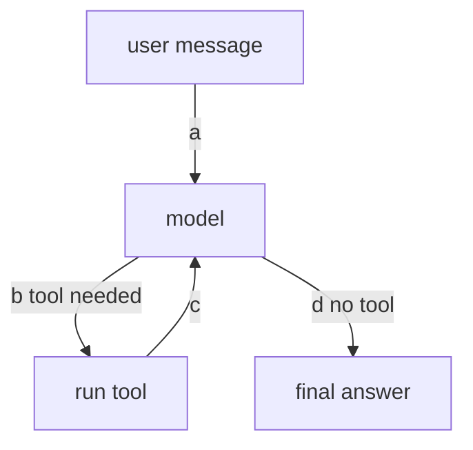
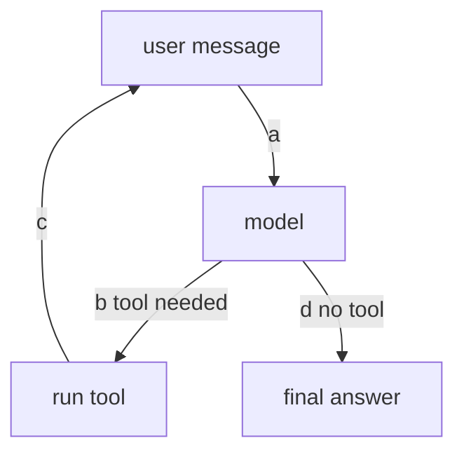
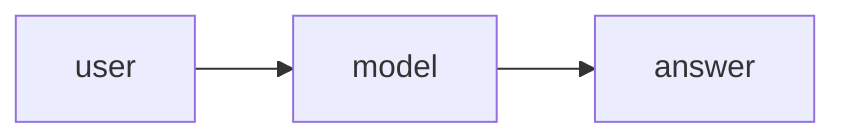
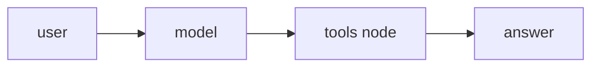
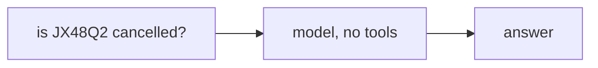

# LangChain Agents · Exercise 1

**Language:** Python  **Topics:** the agent loop, message types, bare vs tool agents, reading LangChain and Strands syntax  **Level:** Foundational

Answers are letters, pairs like `1-C`, `T`/`F`, or a sequence. You read code here, you do not write any.

---

**Q1 · (2 pts)** A language model, stripped to its core, is:

- A) a fact database it queries
- B) a next-token predictor that samples from a probability distribution
- C) a keyword-to-intent rules engine
- D) a search index over training data

---

**Q2 · Trace the loop (3 pts)** Edges are tagged `a` `b` `c` `d`. Start at the user message.



Right after the tool runs, which edge fires?

- A) `a`  B) `b`  C) `c`  D) `d`

---

**Q3 · One arrow is flipped (3 pts)**



Which tagged edge is wrong?

- A) `a`  B) `b`  C) `c`  D) `d`

---

**Q4 · Read the code (3 pts)**

```python
model = ScriptedChatModel(responses=[AIMessage(content="How can I help?")])
agent = create_agent(model, tools=[], system_prompt="You are TravelMind.")
result = agent.invoke({"messages": [{"role": "user", "content": "Hi"}]})
```

How many messages are in `result["messages"]`?

- A) 1  B) 2  C) 3  D) 4

---

**Q5 · Read the code (3 pts)**

```python
AIMessage(content="", tool_calls=[{"name": "lookup_pnr", "args": {"pnr": "JX48Q2"}, "id": "t1", "type": "tool_call"}])
```

What is the model doing here?

- A) returning the final answer
- B) asking to run `lookup_pnr` with `pnr="JX48Q2"`
- C) raising an error
- D) nothing, the content is empty

---

**Q6 · Match the message to its job (4 pts)**

| Message type | | Its job |
|---|---|---|
| 1. `SystemMessage` | | A. the user's request |
| 2. `HumanMessage` | | B. standing instructions, set once |
| 3. `AIMessage` | | C. an answer, or a request to call a tool |
| 4. `ToolMessage` | | D. the result of a tool the model asked for |
| | | E. a raw string with no role |

---

**Q7 · Pick the correct bare agent (2 pts)** A bare agent has no tools.

Option A



Option B



---

**Q8 · Order the turn (3 pts)** One tool-using turn runs these. Put them in order.

- a) the tools node runs the requested tool
- b) the user message enters the loop
- c) the model reads the tool result and writes the answer
- d) the model requests a tool by name and arguments

---

**Q9 · Spot the line that does not belong (3 pts)** In LangChain 1.0:

```python
L1  from langchain.agents import create_agent
L2  from langchain.agents import AgentExecutor
L3  from langchain.tools import tool
L4  from langgraph.checkpoint.memory import InMemorySaver
```

- A) L1  B) L2  C) L3  D) L4

---

**Q10 · Same idea, two frameworks (4 pts)** You know the left from Strands. Match each to its LangChain twin.

| Strands | | LangChain |
|---|---|---|
| 1. `agent("...")` | | A. `ChatBedrockConverse(model=..., region_name=...)` |
| 2. `str(result)` | | B. `agent.invoke({"messages": [...]})` |
| 3. `BedrockModel(model_id=..., region_name=...)` | | C. `result["messages"][-1].content` |
| | | D. `create_agent(model, tools, system_prompt=)` |

---

**Q11 · Pick all that apply (3 pts)** Which are real LangChain message types?

- A) `SystemMessage`
- B) `HumanMessage`
- C) `PromptMessage`
- D) `AIMessage`
- E) `ToolMessage`
- F) `UserBlock`

---

**Q12 · True or false (3 pts)** Mark each `T` or `F`.

1. A bare agent still reaches the tools node on every run.
2. The tools node runs the code, the model only asks for it.
3. A transcript is a growing list of typed messages.

---

**Q13 · Read the model output (2 pts)** The `us.` prefix on `us.anthropic.claude-haiku-4-5-20251001-v1:0` is there because:

- A) it names a US-only model
- B) Bedrock requires the inference-profile prefix to route the call
- C) it is optional styling
- D) it sets the region

---

**Case study · TravelMind day one (5 pts)**

TravelMind launches with a bare agent, no tools. Rao asks: "is JX48Q2 cancelled?"



**Q14a (2 pts)** With no tool to check the booking, the agent is forced to:

- A) look the record up anyway
- B) guess from training data, ungrounded
- C) refuse to answer
- D) call a tool it does not have

**Q14b (3 pts)** The single change that grounds the answer:

- A) a longer system prompt
- B) a `lookup_pnr` tool wired into the agent
- C) higher temperature
- D) a larger model
