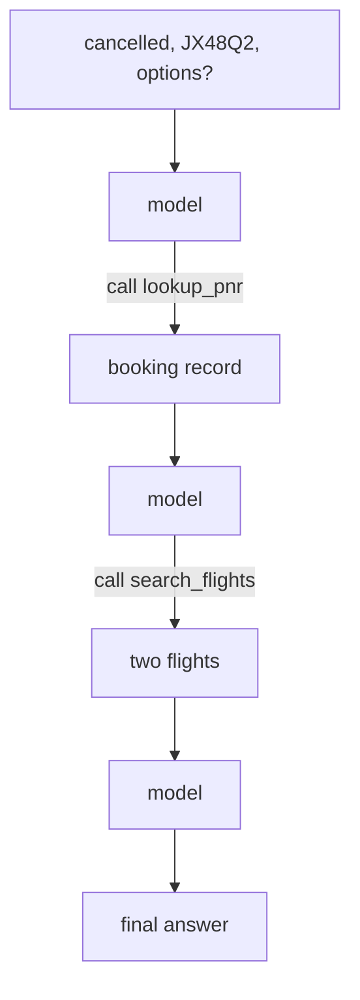
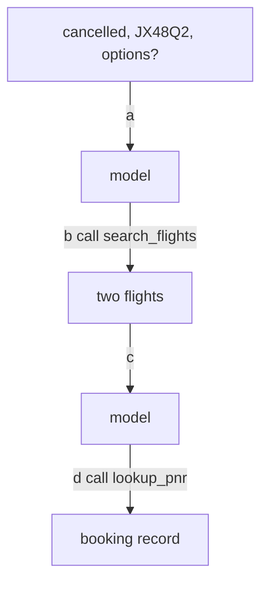
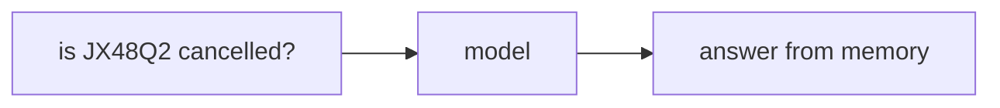
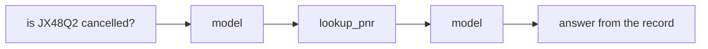
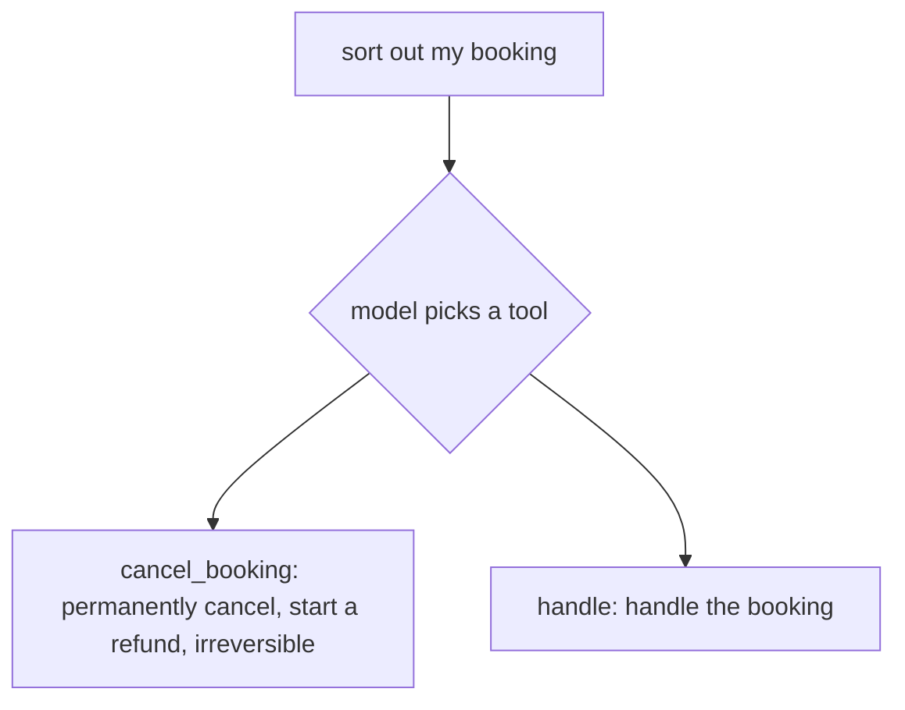

# LangChain Agents · Exercise 2

**Language:** Python  **Topics:** tools with @tool, the schema the model reads, tool selection by docstring, multi-tool loops, tool errors  **Level:** Foundational to Applied

Answers are letters, pairs like `1-C`, `T`/`F`, or a sequence. Still reading code, not writing it.

---

**Q1 · (2 pts)** When the model decides whether to call `lookup_pnr`, it reads:

- A) the function body
- B) the name, the docstring, and the argument schema
- C) the return value
- D) the whole file

---

**Q2 · Dead on arrival (2 pts)** Copied from a 2023 blog. Which import no longer belongs in LangChain 1.0?

- A) `from langchain.agents import create_agent`
- B) `from langchain.agents import AgentExecutor`
- C) `from langchain.tools import tool`
- D) `from langgraph.graph import StateGraph`

---

**Q3 · Read the tool, match the schema (4 pts)**

```python
@tool
def disruption_reason(flight: str) -> str:
    '''Return why a flight was cancelled or delayed, given its flight number.'''
    ...
```

| Field | | Value the model sees |
|---|---|---|
| 1. name | | A. `{"flight": {"type": "string"}}` |
| 2. description | | B. `disruption_reason` |
| 3. args | | C. `Return why a flight was cancelled or delayed, given its flight number.` |
| | | D. the function body |

---

**Q4 · Code walkthrough, match line to role (4 pts)**

```python
L1  @tool
L2  def lookup_pnr(pnr: str) -> str:
L3      '''Return the booking status for a PNR.'''
L4      return records.get(pnr, "PNR not found")
L5  agent = create_agent(model, tools=[lookup_pnr], system_prompt="You are TravelMind.")
```

| Line | | What it does |
|---|---|---|
| 1. L3 | | A. registers the tool with the agent |
| 2. L4 | | B. the description the model reads to pick this tool |
| 3. L5 | | C. returns a safe result even on a bad PNR |
| | | D. sets the model temperature |

---

**Q5 · Trace the two-tool flow (3 pts)**



How many times does the model node run before the final answer?

- A) 1  B) 2  C) 3  D) 4

---

**Q6 · One step is out of order (3 pts)** This flow searches before it knows the booking.



Which tagged edge is the problem?

- A) `a`  B) `b`  C) `c`  D) `d`

---

**Q7 · Order the trace (3 pts)** The model calls `lookup_pnr`, then answers. Order the four messages.

- a) `AIMessage` requesting `lookup_pnr`
- b) `HumanMessage` with the question
- c) `AIMessage` with the grounded answer
- d) `ToolMessage` with the booking record

---

**Q8 · Predict the output (3 pts)**

```python
model = ScriptedChatModel(responses=[
    AIMessage(content="", tool_calls=[{"name": "lookup_pnr", "args": {"pnr": "ZZZZZZ"}, "id": "e", "type": "tool_call"}]),
    AIMessage(content="I could not find booking ZZZZZZ. Please recheck the PNR."),
])
agent = create_agent(model, tools=[lookup_pnr], system_prompt="You are TravelMind.")
result = agent.invoke({"messages": [{"role": "user", "content": "check ZZZZZZ"}]})
print(result["messages"][-1].content)
```

Assume `lookup_pnr` returns `"PNR not found"` for unknown PNRs. The printout is:

- A) `PNR not found`
- B) `I could not find booking ZZZZZZ. Please recheck the PNR.`
- C) an exception
- D) an empty string

---

**Q9 · Spot the risky line (3 pts)**

```python
L1  @tool
L2  def rebook(pnr, flight):
L3      '''handle it'''
L4      return f"{pnr} moved to {flight}"
```

Which line most weakens the model's ability to pick this tool correctly?

- A) L1  B) L2 (no type hints)  C) L3 (empty description)  D) L4

---

**Q10 · Pick the flow that grounds its answer (2 pts)**

Option A



Option B



---

**Q11 · Match across frameworks (4 pts)**

| Strands | | LangChain |
|---|---|---|
| 1. `@tool` on a function | | A. `create_agent(model, tools=[...], system_prompt=)` |
| 2. `Agent(model=, tools=[...])` | | B. `@tool` on a function |
| 3. `str(agent("..."))` | | C. `result["messages"][-1].content` after `invoke` |
| | | D. `response_format=Model` |

---

**Q12 · Pick all that apply (3 pts)** A good tool description:

- A) says what the tool does in plain terms
- B) is left blank to keep the schema small
- C) names the arguments' meaning when it is not obvious
- D) warns if the action is irreversible
- E) uses the function name only, no sentence

---

**Case study · Two tools, one wrong pick (5 pts)**

Two tools ship together. A user types "sort out my booking."



**Q13a (2 pts)** Which tool is the model most likely to misfire on?

- A) `cancel_booking`, its description is too detailed
- B) `handle`, its description says nothing about what it does
- C) neither, the model always asks first
- D) both fail equally

**Q13b (3 pts)** The safest fix:

- A) delete `cancel_booking`
- B) give `handle` a precise description of exactly what it does
- C) rename `handle` to `handle2`
- D) raise the model temperature

---

**Q14 · Pick the docstring that steers the model right (3 pts)** For a `search_flights(origin, dest, date)` tool:

- A) `'''search'''`
- B) `'''does flight stuff'''`
- C) `'''Find alternate flights between two airport codes on a given date.'''`
- D) `'''flights table'''`
