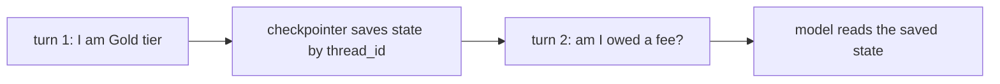
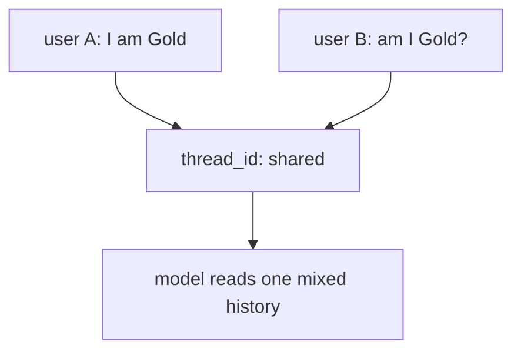
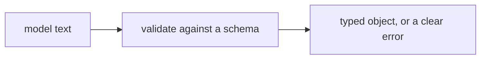
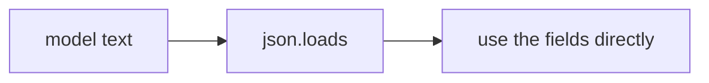
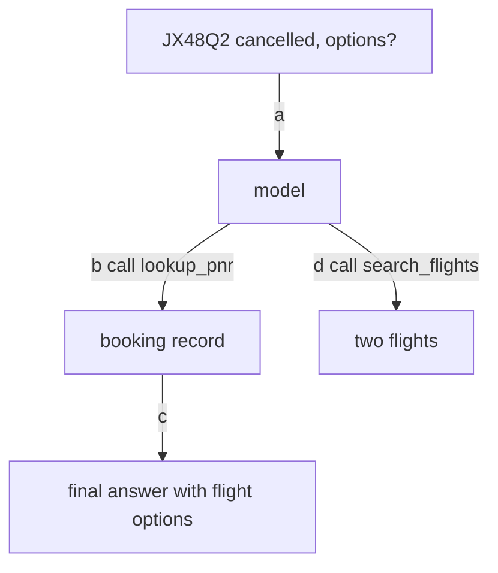

# LangChain Agents · Exercise 3

**Language:** Python  **Topics:** memory (checkpointer + thread_id), structured output with Pydantic, tool error recovery, LangChain vs Strands mapping  **Level:** Applied to Intermediate

Answers are letters, pairs like `1-C`, `T`/`F`, sequences, exact numbers, or one short snippet where asked. This set starts asking you to fix a line and write a small model.

---

**Q1 · (2 pts)** An agent remembers across turns because of:

- A) the system prompt
- B) a checkpointer plus a `thread_id`
- C) a larger `max_steps`
- D) the model remembering on its own

---

**Q2 · Trace the two turns (3 pts)**



At turn 2, the model receives:

- A) only turn 2, the tier fact is gone
- B) turn 1 and turn 2, the checkpointer replayed the history
- C) nothing, memory needs a database
- D) a summary the user must resend

---

**Q3 · Code walkthrough, count the state (4 pts)** Give exact numbers.

```python
agent = create_agent(model, tools=[], checkpointer=InMemorySaver())
thread = {"configurable": {"thread_id": "rao"}}
r1 = agent.invoke({"messages": [{"role": "user", "content": "I'm Gold tier"}]}, thread)
r2 = agent.invoke({"messages": [{"role": "user", "content": "am I owed a fee?"}]}, thread)
```

1. `len(r1["messages"])` = ?
2. `len(r2["messages"])` = ?

---

**Q4 · Spot the flaw (3 pts)** Two users share one thread.



What breaks?

- A) nothing, both are Gold
- B) user B reads user A's history, one thread id is shared across users
- C) the model runs slower
- D) the checkpointer refuses to save

---

**Q5 · Debug and fix one line (4 pts)** This setup leaks memory across users.

```python
L1  agent = create_agent(model, tools=[lookup_pnr], checkpointer=InMemorySaver())
L2  cfg = {"configurable": {"thread_id": "shared"}}
L3  agent.invoke({"messages": user_a_messages}, cfg)
L4  agent.invoke({"messages": user_b_messages}, cfg)
```

1. Which line is the root cause?
2. Give the corrected version of that line (one line).

---

**Q6 · Read the code (3 pts)**

```python
class Disruption(BaseModel):
    pnr: str
    status: str
    rebook_fee_waived: bool

Disruption.model_validate_json('{"pnr": "JX48Q2", "status": "cancelled"}')
```

What happens?

- A) a `Disruption` object with `rebook_fee_waived = False`
- B) a `ValidationError` naming `rebook_fee_waived` as required
- C) it returns `None`
- D) it prints the JSON

---

**Q7 · Write a small model (4 pts)** Write a Pydantic model `Rebooking` with fields `pnr` (str), `new_flight` (str), `fee` (float). Three fields, nothing more.

---

**Q8 · Match across frameworks (4 pts)**

| LangChain | | Strands |
|---|---|---|
| 1. `agent.invoke({"messages": [...]})` | | A. `agent.structured_output(Model, "...")` |
| 2. `result["messages"][-1].content` | | B. `agent("...")` |
| 3. `response_format=Model`, read `structured_response` | | C. conversation manager or session |
| 4. `checkpointer=InMemorySaver()` + `thread_id` | | D. `str(result)` |

---

**Q9 · Pick the flow you can trust in code (3 pts)** The next step charges a fee, no human reads it.

Option A



Option B



---

**Q10 · Order the recovery (3 pts)** The user sends a bad PNR. Order the flow.

- a) the model apologises and asks for a correct PNR
- b) the model calls `lookup_pnr` with the bad PNR
- c) the tool returns `PNR not found`
- d) the user sends `check booking ZZZZZZ`

---

**Q11 · One arrow skips a step (3 pts)** This flow answers before searching alternatives.



Which tagged edge is wrong?

- A) `a`  B) `b`  C) `c`  D) `d`

---

**Q12 · True or false (3 pts)** Mark each `T` or `F`.

1. Reusing one `thread_id` across two users keeps their chats separate.
2. `structured_response` is filled only when a `response_format` is set.
3. A tool that returns `PNR not found` keeps the loop alive better than one that throws.

---

**Case study · The refund that fired on prose (6 pts)**

A refund path does this:

```python
data = json.loads(model_text)     # model_text was: "Sure, here you go: {...}"
issue_refund(data["amount"])
```

The model returned a friendly sentence with JSON buried inside.

**Q13a (2 pts)** What breaks first?

- A) `issue_refund` charges twice
- B) `json.loads` raises, the leading prose is not valid JSON
- C) the model apologises
- D) nothing, it works

**Q13b (2 pts)** The fix that makes the output safe for code:

- A) ask the model to "please only send JSON"
- B) `response_format` with a Pydantic schema, then read `structured_response`
- C) wrap it in a longer prompt
- D) retry until it parses

**Q13c (2 pts)** With `response_format=Refund` set, `result["structured_response"]` gives you:

- A) the raw model text
- B) a validated `Refund` object your code can trust
- C) a list of messages
- D) a JSON string you still parse
