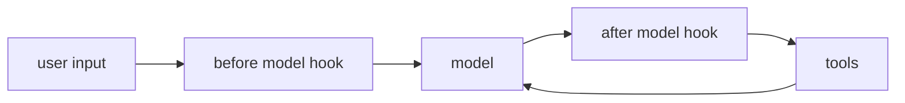
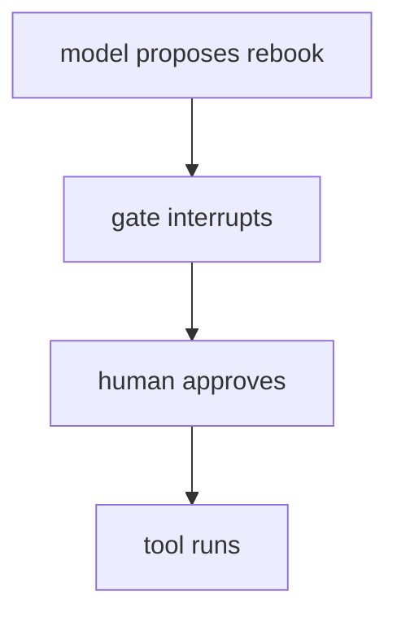
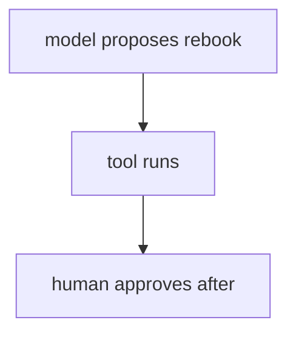
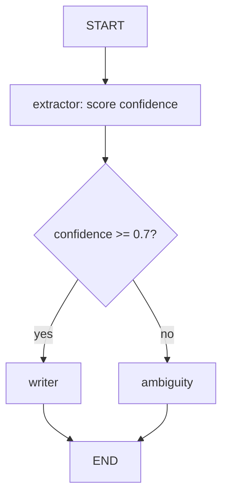
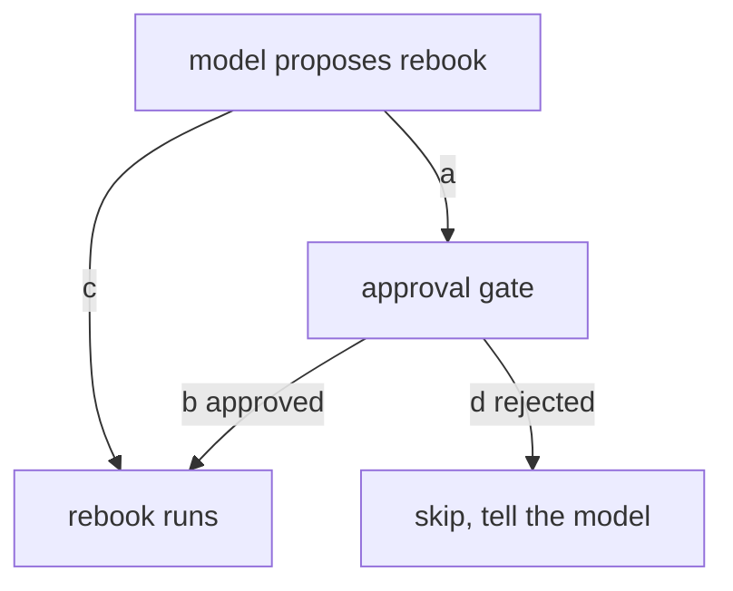

# LangChain Agents · Exercise 4

**Language:** Python  **Topics:** middleware (PII redaction, summarisation, human-in-the-loop), StateGraph routing, deterministic control  **Level:** Intermediate to Advanced

Answers are letters, pairs like `1-C`, `T`/`F`, sequences, or one short snippet where asked. Expect a code review, a targeted fix, and a small function to write.

---

**Q1 · (2 pts)** `HumanInTheLoopMiddleware` interrupts:

- A) before the model runs
- B) after the model responds, before the tool runs
- C) after the tool runs
- D) only on errors

---

**Q2 · Read the pipeline (3 pts)**



A card number must never reach the model. Which hook catches it?

- A) the before model hook
- B) the after model hook
- C) the tools node
- D) none, it always reaches the model

---

**Q3 · Match the middleware to its job (4 pts)**

| Middleware | | What it does |
|---|---|---|
| 1. `PIIMiddleware` | | A. compress old turns when history grows long |
| 2. `SummarizationMiddleware` | | B. pause for human approval before a risky tool |
| 3. `HumanInTheLoopMiddleware` | | C. redact private data before it reaches the model |
| | | D. retry the model on an error |

---

**Q4 · Pick the correct approval flow (3 pts)** The `rebook` tool must not fire without a human yes.

Option A



Option B



---

**Q5 · Trace the routing graph (4 pts)**



1. Confidence `0.55`, which node runs?
2. Confidence `0.92`, which node runs?

- A) writer  B) ambiguity

---

**Q6 · Match the code line to the diagram (4 pts)**

| Code | | Diagram element |
|---|---|---|
| 1. `graph.add_node("writer", writer)` | | A. the branch after `extractor` that splits two ways |
| 2. `graph.add_edge(START, "extractor")` | | B. the `writer` box as a node |
| 3. `graph.add_conditional_edges("extractor", route, {...})` | | C. the arrow from START into `extractor` |
| | | D. the arrow from `writer` to END |

---

**Q7 · Code review (4 pts)** Pick the two real problems with this approval gate.

```python
L1  agent = create_agent(
L2      model,
L3      tools=[rebook],
L4      middleware=[HumanInTheLoopMiddleware(interrupt_on={"rebook": True})],
L5  )
L6  out = agent.invoke({"messages": [{"role": "user", "content": "rebook JX48Q2 onto AI-506"}]})
L7  resumed = agent.invoke({"resume": "yes"})
```

- A) no `checkpointer`, so the paused state cannot be saved or resumed
- B) `rebook` should not be in `tools`
- C) the resume payload is wrong, it is not the shape the gate expects
- D) `interrupt_on` cannot take a tool name
- E) `system_prompt` is required and missing

(Pick two.)

---

**Q8 · Debug, pick the correct resume (3 pts)** Replacing line L7, the right resume is:

- A) `agent.invoke(Command(resume={"decisions": [{"type": "approve"}]}), thread)`
- B) `agent.invoke({"approve": True}, thread)`
- C) `agent.resume("yes")`
- D) `agent.invoke("yes", thread)`

---

**Q9 · Write a small function (4 pts)** Write the `route(state)` used by the graph above: return `"writer"` when `state["confidence"] >= 0.7`, else `"ambiguity"`. Two or three lines.

---

**Q10 · Order the pause and resume (3 pts)** A gated rebook runs. Order the flow.

- a) a human approves the pending action
- b) the first `invoke` returns with a pause, no rebooking yet
- c) the tool runs, the booking is confirmed
- d) a resume `Command` is sent with the decision

---

**Q11 · One edge misses the gate (3 pts)** This lets `rebook` slip past approval.



Which tagged edge is wrong?

- A) `a`  B) `b`  C) `c`  D) `d`

---

**Q12 · True or false (3 pts)** Mark each `T` or `F`.

1. Summarisation can drop a detail that mattered later.
2. A `StateGraph` router can be a plain function with no model call.
3. The approval gate works without a checkpointer.

---

**Q13 · Pick all that apply (3 pts)** Reasons to drop from `create_agent` to a hand-wired `StateGraph`:

- A) a compliance rule must hold on every run, not depend on the model
- B) you want a branch you can unit test with no model
- C) the task is one model call with no tools
- D) a fixed, auditable path matters more than flexibility

---

**Case study · The junior who shipped no guardrails (5 pts)**

TravelMind must never rebook without human approval, and must never log card numbers. A junior ships an agent with neither.

**Q14a (3 pts)** In production, the two incidents that show up:

- A) the agent rebooks passengers with no human check
- B) the agent is too slow to respond
- C) card numbers land in the model prompt and the logs
- D) the agent refuses every request

(Pick two.)

**Q14b (2 pts)** The two middlewares that close both gaps:

- A) `SummarizationMiddleware` and `PIIMiddleware`
- B) `PIIMiddleware` and `HumanInTheLoopMiddleware`
- C) `HumanInTheLoopMiddleware` and `SummarizationMiddleware`
- D) none, this needs a new model
