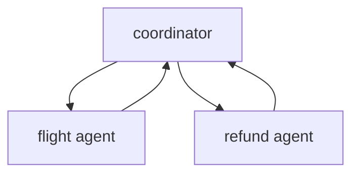
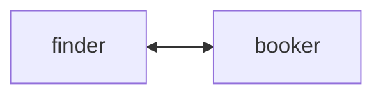
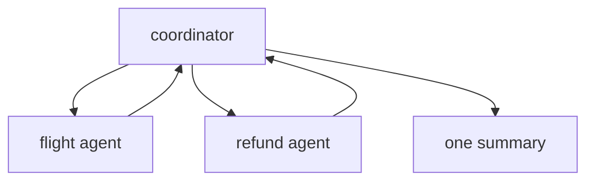
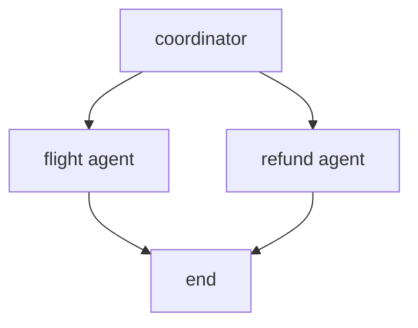
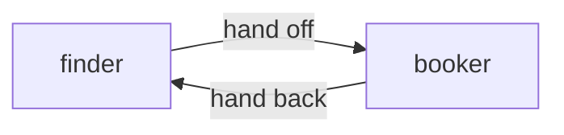

# LangChain Agents · Exercise 5

**Language:** Python  **Topics:** multi-agent (supervisor, swarm), LangChain vs Strands, architecture decisions  **Level:** Advanced, capstone

Answers are letters, pairs, triples like `1-B-Y`, sequences, or one short snippet where asked. This set has a code review, a targeted fix, a small build, and a design case study.

---

**Q1 · Which topology is the supervisor (2 pts)**

Option A



Option B



---

**Q2 · Match the Rosetta pairs (6 pts)**

| LangChain 1.0 | | Strands |
|---|---|---|
| 1. `create_agent(model, tools, system_prompt=)` | | A. `agent("...")` |
| 2. `agent.invoke({"messages": [...]})` | | B. `strands.multiagent.Swarm([...])` |
| 3. `response_format=Model` | | C. `Agent(model=, tools=[], system_prompt=)` |
| 4. `langgraph_supervisor.create_supervisor(...)` | | D. `agent.structured_output(Model, "...")` |
| 5. `langgraph_swarm.create_swarm(...)` | | E. orchestrator holding agents as tools |
| 6. `langgraph.StateGraph` | | F. `strands.multiagent.GraphBuilder` |

---

**Q3 · Pick the correct supervisor wiring (3 pts)** Workers should report back so the coordinator can summarise.

Option A



Option B



---

**Q4 · Code review (4 pts)** Pick the two problems.

```python
L1  flight_agent = create_agent(model, tools=[search_flights], system_prompt="Flights.")
L2  refund_agent = create_agent(model, tools=[issue_refund], system_prompt="Refunds.")
L3  supervisor = create_supervisor(
L4      [flight_agent, refund_agent],
L5      model=model,
L6      prompt="Route to the right specialist.",
L7  ).compile()
```

- A) the workers have no `name`, so the coordinator cannot tell them apart
- B) `create_supervisor` cannot take a list
- C) `.compile()` has no checkpointer, so handoff state is not tracked
- D) `prompt` is not a valid argument
- E) `model` must be a string

(Pick two.)

---

**Q5 · Debug, add the missing argument (3 pts)** Give the corrected version of this line so the coordinator can identify the worker.

```python
flight_agent = create_agent(model, tools=[search_flights], system_prompt="Flights.")
```

---

**Q6 · Write the supervisor (5 pts)** Write the `create_supervisor(...).compile(...)` call over `flight_agent` and `refund_agent`, compiled with a checkpointer so handoffs are tracked. Assume both workers already carry a `name`.

---

**Q7 · Trace the handoff (3 pts)**



After the finder hands off, who talks to the user?

- A) the finder  B) the booker  C) the coordinator  D) both at once

---

**Q8 · Order the delegation (3 pts)** A supervisor handles a rebooking request. Order the flow.

- a) the flight agent runs and returns options
- b) the supervisor summarises for the user
- c) the request reaches the supervisor
- d) the supervisor calls `transfer_to_flight_agent`

---

**Q9 · Port recognition (3 pts)** This Strands swarm maps to which LangChain call?

```python
from strands.multiagent import Swarm
swarm = Swarm([finder, booker])
```

- A) `create_supervisor([finder, booker], model=model)`
- B) `create_swarm([finder, booker], default_active_agent="finder")`
- C) `StateGraph([finder, booker])`
- D) `create_agent(finder, tools=[booker])`

---

**Q10 · Match the framework to its multi-agent tool (4 pts)**

| Pattern | | LangChain | | Strands |
|---|---|---|---|---|
| 1. central coordination | | A. `create_swarm` | | X. `Swarm([...])` |
| 2. peer handoff | | B. `create_supervisor` | | Y. agents as tools |

Give two triples, for example `1-B-Y`.

---

**Q11 · True or false (3 pts)** Mark each `T` or `F`.

1. A swarm has a central boss agent.
2. A `StateGraph` gives you a fixed, testable path.
3. A single agent with three good tools often beats a five-agent committee.

---

**Q12 · Pick all that apply (3 pts)** Signs a system is over-engineered:

- A) five agents where one with three tools would do
- B) a graph node for a step that never needs a guarantee
- C) a raw model call for a one-shot task with no tools
- D) coordination added before any single agent has struggled

---

**Case study · TravelMind, one team, real constraints (8 pts)**

TravelMind must handle four jobs for a single support team: FAQ answers, rebooking, refunds, and baggage rules. Every refund must be logged and approved by a human. The team is one engineer.

**Q13a (2 pts)** The best first architecture:

- A) a swarm of four peer agents
- B) one agent with four tools, plus a human approval gate on the refund tool
- C) four separate apps
- D) a raw model call, no tools

**Q13b (2 pts)** The non-negotiable feature for the refund path:

- A) streaming
- B) a human-in-the-loop gate on the refund tool
- C) a bigger model
- D) a swarm

**Q13c (2 pts)** You go single-agent. Which pressure most likely forces a later split?

- A) the FAQ answers get too polite
- B) one prompt piles up conflicting rules across four very different jobs
- C) the model runs out of tokens on hello
- D) nothing ever forces a split

**Q13d (2 pts)** When splitting, the coordination style to reach for first:

- A) swarm, for maximum flexibility
- B) supervisor, central control is easier to log, audit, and debug
- C) two raw calls
- D) a deeper `StateGraph` only

---

**Q14 · The last call (2 pts)** Your next task is a single model call, no tools, no memory. The right choice:

- A) a supervisor of three agents
- B) a swarm, for flexibility
- C) a raw model call, a framework is pure overhead here
- D) a `StateGraph` with one node
