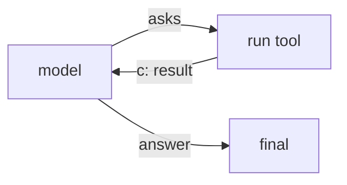
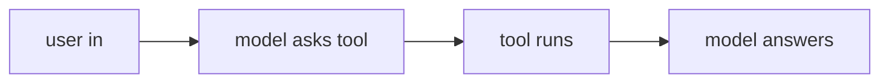
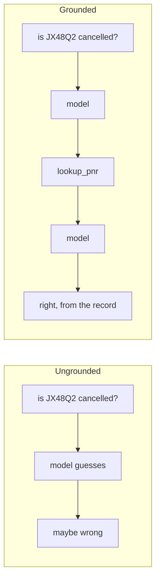

# Solutions · Exercise 1 (Foundations)

Topics: the agent loop, message types, bare vs tool agents, reading LangChain and Strands syntax.

Three ideas run under every answer here:

- A model predicts the next token. That is the engine and the ceiling of a single call.
- An agent is that model wrapped in a loop that can call tools and read results.
- The transcript is a list of typed messages, and the loop reads and grows that list.

---

### Q1 · Answer: B

- **Why:** a language model outputs a probability distribution over the next token and samples from it, repeatedly. That is the whole mechanism.
- **Context:** the lineage runs from n-gram counts, to neural language models, to the 2017 transformer with attention, to today's large models. Scale plus attention turned "guess the next word" into something that also captures syntax, facts, and reasoning as a side effect.
- **Intuition:** autocomplete is the engine, not the limit. Bigger engine, same motion.

$$
P(\text{next token} \mid \text{tokens so far})
$$

---

### Q2 · Answer: C

- **Why:** the tool result flows back into the model so it can read the fact and decide the next move. Edge `c` carries tool output to the model.
- **Intuition:** the model does not run tools, it asks. Someone runs the tool and hands the answer back.



---

### Q3 · Answer: C

- **Why:** edge `c` points from the tool back to the user. A tool result the user never asked to read is useless. It must return to the model, which turns the raw record into a grounded reply.
- **Intuition:** the model is the only thing that can phrase the record as an answer. Skip it and you hand the passenger a database row.

---

### Q4 · Answer: B

- **Why:** with no tools, the loop runs once. State ends with two messages: the `HumanMessage` and the model's `AIMessage`.
- **Context:** every tool round-trip adds two more messages, one `AIMessage` requesting the tool and one `ToolMessage` with the result. No tools, no extra messages.
- **Intuition:** count the messages and you can read how many times the loop turned.

---

### Q5 · Answer: B

- **Why:** an `AIMessage` with empty `content` and a populated `tool_calls` is the model saying "do not answer yet, run this tool with these arguments."
- **Context:** this is structured tool calling. The model emits a tool name and JSON arguments, the runtime dispatches. The empty content is the tell that no user-facing text is ready.
- **Intuition:** two kinds of `AIMessage`. One talks to the user, one talks to your tools.

---

### Q6 · Answer: 1-B, 2-A, 3-C, 4-D

- **Why:** `SystemMessage` sets standing instructions, `HumanMessage` is the request, `AIMessage` is the model's turn (answer or tool request), `ToolMessage` carries a tool result. `E` is a distractor, there are no roleless strings in the loop.
- **Context:** chat models are trained on role-tagged transcripts. The `tool` role was added so a tool result has a clear place to live, keyed to the call that produced it.
- **Intuition:** four speakers at a table, each with a fixed job.

---

### Q7 · Answer: A

- **Why:** a bare agent has no tools, so the tools node is never reachable. Option B draws a tools node that cannot run.
- **Intuition:** this is the true baseline. Every later capability adds exactly one thing to this picture.

---

### Q8 · Answer: b, d, a, c

- **Why:** the user message enters, the model requests a tool, the tools node runs it, the model reads the result and writes the answer.
- **Intuition:** request, decide, act, respond. Memorise this shape, everything else is a variation on it.



---

### Q9 · Answer: B (L2)

- **Why:** `AgentExecutor` is the legacy agent runner. LangChain 1.0 builds agents with `create_agent` on the LangGraph runtime.
- **Context:** LangChain shifted shape. The 2022 to 2023 "chains" era gave us `LLMChain` and `AgentExecutor`. The October 2025 v1.0 rebuilt agents on a graph engine and committed to no breaking changes until a 2.0. Copying `AgentExecutor` off an old blog is the single most common way to start with dead code.
- **Intuition:** if a tutorial imports `AgentExecutor`, it predates the rebuild.

---

### Q10 · Answer: 1-B, 2-C, 3-A

- **Why:** `agent("...")` in Strands maps to `agent.invoke({"messages": [...]})`, `str(result)` maps to `result["messages"][-1].content`, and `BedrockModel(...)` maps to `ChatBedrockConverse(...)`. `D` is a distractor.
- **Context:** both frameworks wrap the same loop. Strands calls the agent like a function and reads the text with `str()`. LangChain passes a messages dict and reads the last message. Different ergonomics, same machine.
- **Intuition:** the concepts port. The method names are a lookup table.

---

### Q11 · Answer: A, B, D, E

- **Why:** `SystemMessage`, `HumanMessage`, `AIMessage`, `ToolMessage` are the real types. `PromptMessage` and `UserBlock` are invented.
- **Intuition:** if you cannot place a "message type" at one of the four seats, it is not real.

---

### Q12 · Answer: 1-F, 2-T, 3-T

- **Why:** a bare agent never reaches the tools node, so 1 is false. The model asks for tools, your side runs them, so 2 is true. A transcript is a growing list of typed messages, so 3 is true.
- **Intuition:** the model reasons, tools touch the world, the runtime moves the list along. Keep those three jobs separate.

---

### Q13 · Answer: B

- **Why:** on Bedrock, the `us.` prefix selects a cross-region inference profile, and the call is rejected without it. It is not styling and it is not the region argument.
- **Context:** the model id `us.anthropic.claude-haiku-4-5-20251001-v1:0` plus `region_name="us-east-1"` are two separate things. Drop the prefix and Bedrock refuses to route.
- **Intuition:** the prefix is a routing label, not decoration.

---

### Case study · Q14a: B, Q14b: B

- **Why:** with no tool, the agent cannot read the booking system, so it guesses from training data. The fix is a `lookup_pnr` tool that reads the real record.
- **Context:** this is the exact moment a framework earns its place. A single call reasons and writes. It cannot fetch a fact it does not hold. Tools plus the loop close that gap.
- **Intuition:** a longer prompt or a bigger model does not know Rao's booking. Only a tool that reads the record does.



---

## Putting it together in code

A bare agent and a single-tool agent, side by side, running the real loop with a scripted model so it is deterministic and needs no credentials. Swap `ScriptedChatModel` for `ChatBedrockConverse` and it is production.

```python
from typing import Any, List
from langchain_core.language_models.chat_models import BaseChatModel
from langchain_core.messages import AIMessage
from langchain_core.outputs import ChatResult, ChatGeneration
from langchain.agents import create_agent
from langchain.tools import tool


class ScriptedChatModel(BaseChatModel):
    '''Deterministic stand-in. Real framework, scripted replies, no credentials.'''
    responses: List[Any]
    idx: int = 0

    @property
    def _llm_type(self) -> str:
        return "scripted"

    def _generate(self, messages, stop=None, run_manager=None, **kwargs):
        reply = self.responses[min(self.idx, len(self.responses) - 1)]
        object.__setattr__(self, "idx", self.idx + 1)
        return ChatResult(generations=[ChatGeneration(message=reply)])

    def bind_tools(self, tools, **kwargs):
        return self


@tool
def lookup_pnr(pnr: str) -> str:
    '''Return the booking status for a PNR.'''
    return {"JX48Q2": "BLR-DEL cancelled, Rao, Gold tier"}.get(pnr, "PNR not found")


# Bare agent: no tools, the loop turns once.
bare = create_agent(
    ScriptedChatModel(responses=[AIMessage(content="How can I help?")]),
    tools=[],
    system_prompt="You are TravelMind.",
)
print("bare:", bare.invoke({"messages": [{"role": "user", "content": "Hi"}]})["messages"][-1].content)

# Tool agent: the model asks for lookup_pnr, the tool answers, the model replies.
tool_agent = create_agent(
    ScriptedChatModel(responses=[
        AIMessage(content="", tool_calls=[{"name": "lookup_pnr", "args": {"pnr": "JX48Q2"}, "id": "t", "type": "tool_call"}]),
        AIMessage(content="JX48Q2 is cancelled. Gold tier, free rebooking."),
    ]),
    tools=[lookup_pnr],
    system_prompt="You are TravelMind.",
)
result = tool_agent.invoke({"messages": [{"role": "user", "content": "is JX48Q2 cancelled?"}]})
print("messages:", len(result["messages"]))     # 4: human, AI(tool call), tool, AI(answer)
print("final:", result["messages"][-1].content)

# Production swap:
# from langchain_aws import ChatBedrockConverse
# model = ChatBedrockConverse(model="us.anthropic.claude-haiku-4-5-20251001-v1:0", region_name="us-east-1")
```

The bare agent returns two messages. The tool agent returns four, and those four are the loop from Q8 made real: human in, model asks, tool runs, model answers.
