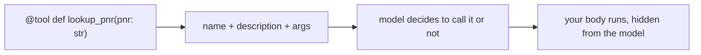
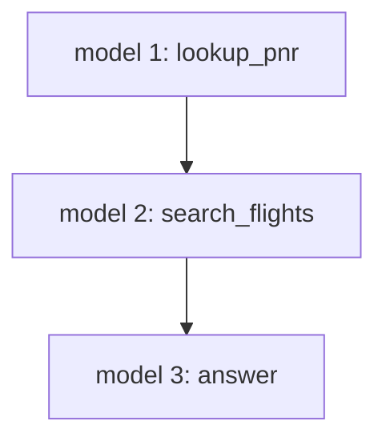
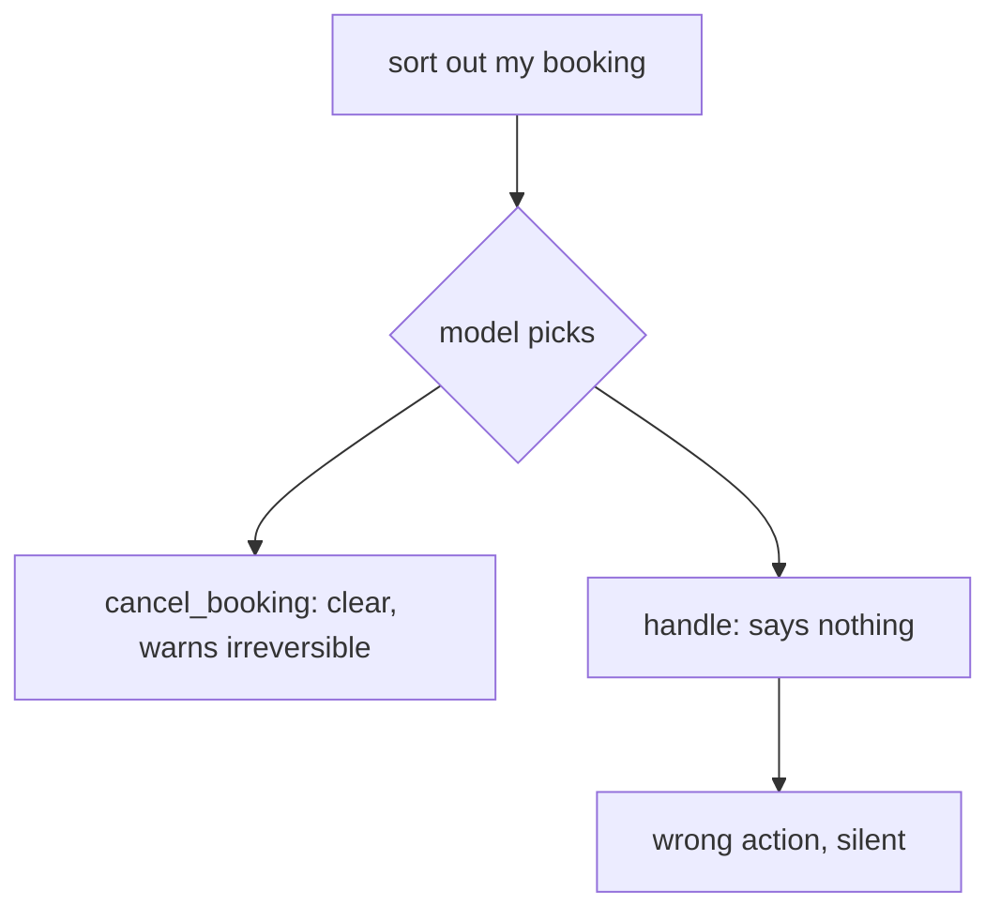

# Solutions · Exercise 2 (Tools)

Topics: tools with @tool, the schema the model reads, tool selection by docstring, multi-tool loops, tool errors.

The spine of this set:

- The model sees a tool as a name, a description, and an argument schema. Never the body.
- Tool choice is a matching problem over those descriptions. A weak docstring is a weak interface.
- Tools call the real world, so they fail. A returned error keeps the loop alive, an exception kills it.

---

### Q1 · Answer: B

- **Why:** the model reads the name, the docstring, and the argument schema. The body runs on your machine after the model asks, and the model never sees it.
- **Context:** tool calling works by exposing a compact contract to the model. That contract is generated from the function signature and docstring.
- **Intuition:** the model is choosing from menu descriptions, not reading the kitchen.



---

### Q2 · Answer: B

- **Why:** `AgentExecutor` is the legacy runner. LangChain 1.0 uses `create_agent` on LangGraph.
- **Context:** same trap as Exercise 1. `create_agent`, `@tool`, and `StateGraph` are current. `AgentExecutor` marks pre-rebuild code.
- **Intuition:** the import list dates the tutorial.

---

### Q3 · Answer: 1-B, 2-C, 3-A

- **Why:** the name is `disruption_reason`, the description is the docstring sentence, the args are `{"flight": {"type": "string"}}`. The body is a distractor, the model never reads it.
- **Intuition:** three fields go out to the model, and the docstring is the one that decides whether it gets picked.

---

### Q4 · Answer: 1-B, 2-C, 3-A

- **Why:** L3 (the docstring) is the description the model reads, L4 returns a safe result even on a bad PNR, L5 registers the tool with the agent. Temperature is a distractor.
- **Context:** reading code as intent is a core skill. Each line has a job: describe, return safely, register.
- **Intuition:** you can point at exactly where the model's understanding of a tool comes from, and it is the docstring line.

---

### Q5 · Answer: C

- **Why:** the model node runs three times: request `lookup_pnr`, request `search_flights`, then write the answer. Two tool round-trips means three model turns.
- **Intuition:** model turns are one more than tool calls in a clean run. Count the tools, add one.



---

### Q6 · Answer: B

- **Why:** edge `b` searches flights before the booking is known. You cannot pick alternatives for a segment you have not confirmed.
- **Context:** the passenger's one sentence implies an order: find the booking, then find replacements. The agent has to recover that order.
- **Intuition:** search before lookup is answering a question you have not asked yet.

---

### Q7 · Answer: b, a, d, c

- **Why:** the human question, then the model's request for `lookup_pnr`, then the tool's record, then the grounded answer.
- **Intuition:** the trace reads like the loop: ask, request, result, answer.

---

### Q8 · Answer: B

- **Why:** the loop appends the tool result, then the model's scripted second message is the final answer. `result["messages"][-1].content` is that friendly not-found sentence, not the raw `PNR not found` string.
- **Context:** the tool returned `PNR not found`, the model read it and turned it into a helpful correction. The last message is always the model's, not the tool's.
- **Intuition:** the tool result is an input to the model, not the reply to the user.

---

### Q9 · Answer: C (L3)

- **Why:** the docstring `handle it` tells the model nothing about when to use the tool. Missing type hints hurt, but an empty description is what breaks selection outright.
- **Context:** a tool description is an API contract the model consumes at runtime. You would not ship a public function documented as "handle it."
- **Intuition:** name it clearly, describe it precisely, or watch the model guess.

---

### Q10 · Answer: B

- **Why:** option B routes through `lookup_pnr` and answers from the record. Option A answers from memory, ungrounded.
- **Intuition:** grounding is the extra hop through a tool. No hop, no ground truth.

---

### Q11 · Answer: 1-B, 2-A, 3-C

- **Why:** `@tool` maps to `@tool`, `Agent(model=, tools=[...])` maps to `create_agent(model, tools=[...], system_prompt=)`, `str(agent("..."))` maps to reading `result["messages"][-1].content`. `D` is a distractor.
- **Context:** tool definitions are nearly identical across the two frameworks, which is the good news. Your tool design ports. The differences live in orchestration and memory.
- **Intuition:** learn tools once, use them in either framework.

---

### Q12 · Answer: A, C, D

- **Why:** a good description says what the tool does, names non-obvious arguments, and warns on irreversible actions. Leaving it blank or using the name alone starves the model of the one thing it reads.
- **Intuition:** write the docstring for the model, because the model is the only reader that matters at selection time.

---

### Case study · Q13a: B, Q13b: B

- **Why:** `handle` misfires because its description says nothing, so the model cannot tell it apart from anything else. The fix is a precise description, not deletion or a rename.
- **Context:** faced with "sort out my booking," the model reads both descriptions. `cancel_booking` is unambiguous and even warns it is irreversible. `handle` is a coin flip, and a wrong flip here starts a refund nobody asked for.
- **Intuition:** ambiguity in a docstring becomes ambiguity in behaviour, and here that behaviour is a refund.



---

### Q14 · Answer: C

- **Why:** the description that says what the tool does and names its inputs is the one that steers the model to it for "find me another flight."
- **Intuition:** the winning docstring answers "when should I call this?" in one plain sentence.

---

## Putting it together in code

A two-tool TravelMind agent that grounds its answer, plus a bad-PNR path where the tool returns a clean error and the model recovers. Real loop, scripted model.

```python
from typing import Any, List
from langchain_core.language_models.chat_models import BaseChatModel
from langchain_core.messages import AIMessage
from langchain_core.outputs import ChatResult, ChatGeneration
from langchain.agents import create_agent
from langchain.tools import tool


class ScriptedChatModel(BaseChatModel):
    '''Deterministic stand-in. Real framework, scripted replies, no credentials.'''
    responses: List[Any]
    idx: int = 0

    @property
    def _llm_type(self) -> str:
        return "scripted"

    def _generate(self, messages, stop=None, run_manager=None, **kwargs):
        reply = self.responses[min(self.idx, len(self.responses) - 1)]
        object.__setattr__(self, "idx", self.idx + 1)
        return ChatResult(generations=[ChatGeneration(message=reply)])

    def bind_tools(self, tools, **kwargs):
        return self


@tool
def lookup_pnr(pnr: str) -> str:
    '''Return the booking status for a PNR.'''
    return {"JX48Q2": "BLR-DEL cancelled, Rao, Gold tier"}.get(pnr, "PNR not found")


@tool
def search_flights(origin: str, dest: str) -> str:
    '''Find alternate flights between two airport codes.'''
    return "AI-506 09:40, AI-812 14:15"


# Grounded answer: lookup, then search, then reply. Three model turns.
agent = create_agent(
    ScriptedChatModel(responses=[
        AIMessage(content="", tool_calls=[{"name": "lookup_pnr", "args": {"pnr": "JX48Q2"}, "id": "a", "type": "tool_call"}]),
        AIMessage(content="", tool_calls=[{"name": "search_flights", "args": {"origin": "BLR", "dest": "DEL"}, "id": "b", "type": "tool_call"}]),
        AIMessage(content="Cancelled. Options: AI-506 09:40 or AI-812 14:15."),
    ]),
    tools=[lookup_pnr, search_flights],
    system_prompt="You are TravelMind.",
)
print(agent.invoke({"messages": [{"role": "user", "content": "JX48Q2 cancelled, options?"}]})["messages"][-1].content)

# Bad PNR: the tool returns a clean error, the model recovers instead of crashing.
recover = create_agent(
    ScriptedChatModel(responses=[
        AIMessage(content="", tool_calls=[{"name": "lookup_pnr", "args": {"pnr": "ZZZZZZ"}, "id": "e", "type": "tool_call"}]),
        AIMessage(content="I could not find booking ZZZZZZ. Please recheck the PNR."),
    ]),
    tools=[lookup_pnr],
    system_prompt="You are TravelMind.",
)
print(recover.invoke({"messages": [{"role": "user", "content": "check ZZZZZZ"}]})["messages"][-1].content)
```

The first agent proves grounding: every claim traces to a `ToolMessage`. The second proves resilience: `records.get(pnr, "PNR not found")` returns a value the model can act on, so a typo becomes a polite correction, not a stack trace.
