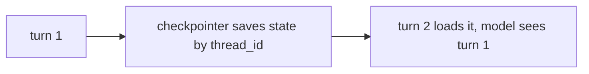
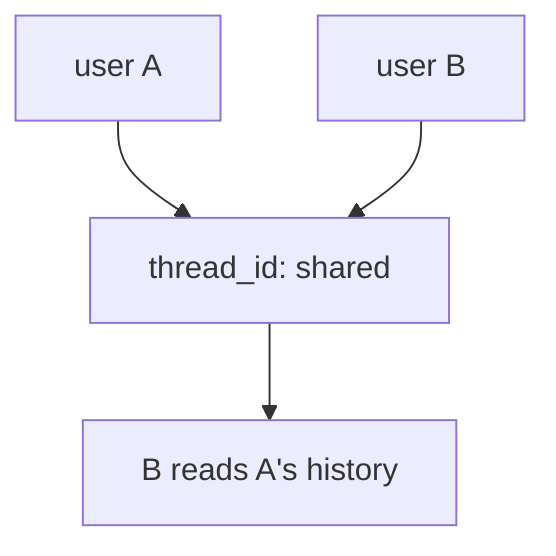
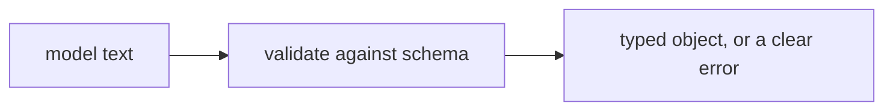
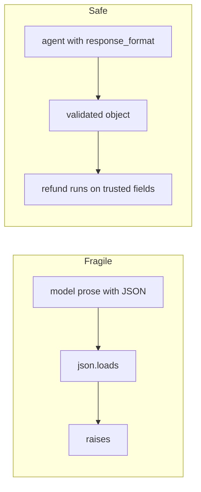

# Solutions · Exercise 3 (Memory and Structured Output)

Topics: memory (checkpointer + thread_id), structured output with Pydantic, tool error recovery, LangChain vs Strands mapping.

What ties this set together:

- A chat model is stateless per call. Continuity is the checkpointer replaying history, keyed by thread.
- The `thread_id` is the identity of a conversation. Share one across users and you leak state.
- Free text is for humans, validated objects are for code. Validation fails at the boundary, on purpose.

---

### Q1 · Answer: B

- **Why:** a checkpointer saves the message list after each turn, keyed by `thread_id`, and replays it next turn. That is the mechanism of memory.
- **Context:** the model itself remembers nothing between calls. The framework re-feeds prior messages into context so the model appears to remember.
- **Intuition:** the model has amnesia, the checkpointer keeps the notebook.



---

### Q2 · Answer: B

- **Why:** at turn 2 the model receives turn 1 and turn 2, because the checkpointer replayed the saved history into context.
- **Intuition:** nothing was resent by the user. The notebook was reopened.

---

### Q3 · Answer: 1 = 2, 2 = 4

- **Why:** after turn 1 the state holds a `HumanMessage` and an `AIMessage`, so 2. Turn 2 appends another human and AI turn on top of the replayed history, so 4.
- **Context:** message count is a clean, unambiguous readout of memory. Growth across turns is the checkpointer at work.
- **Intuition:** the list only grows on a shared thread. Watch the number climb and you are watching memory.

---

### Q4 · Answer: B

- **Why:** one `thread_id` shared across two users means user B loads user A's history. B reads A's data.
- **Context:** this is the most common memory bug in production. It is silent, nothing errors, and it leaks private context between people.
- **Intuition:** one notebook, two people writing in it. Everyone reads everyone.



---

### Q5 · Answer: root is L2, fix is a per-user thread id

- **Why:** L2 hardcodes `thread_id: "shared"`, so both users write to the same thread. The fix is a unique thread per user session.

```python
# Corrected L2:
cfg = {"configurable": {"thread_id": user_id}}   # unique per user session, never hardcoded
```

- **Context:** derive the id from the authenticated session, never from user-supplied input, or a user can read another's thread by guessing an id.
- **Intuition:** one notebook per person.

---

### Q6 · Answer: B

- **Why:** `rebook_fee_waived` is required and absent, so `model_validate_json` raises a `ValidationError` naming that field. It does not silently default.
- **Context:** this is the whole point of a schema. A missing field fails loudly at parse, not three functions later.
- **Intuition:** the validator is a bouncer at the door, not a cleanup crew after the party.

---

### Q7 · Answer: a three-field model

```python
from pydantic import BaseModel

class Rebooking(BaseModel):
    pnr: str
    new_flight: str
    fee: float
```

- **Why:** three declared fields with types is the contract. Anything parsed into `Rebooking` is guaranteed to have a string `pnr`, a string `new_flight`, and a float `fee`, or it fails.
- **Intuition:** you are describing the shape once, so every downstream line can trust it.

---

### Q8 · Answer: 1-B, 2-D, 3-A, 4-C

- **Why:** `invoke(...)` maps to `agent("...")`, reading `content` maps to `str(result)`, `response_format` maps to `structured_output`, and a checkpointer plus thread maps to a conversation manager or session.
- **Context:** LangChain folds structure into the agent result under `structured_response`. Strands exposes it as a separate `structured_output` call. Same destination, different door.
- **Intuition:** the multi-agent and memory rows are where the two frameworks diverge most. The basics line up cleanly.

---

### Q9 · Answer: A

- **Why:** option A validates the model text against a schema before use, so a bad payload becomes a clear error. Option B runs `json.loads` and uses the fields raw, trusting the model completely.
- **Intuition:** when code consumes the output, validate first. "Usually valid JSON" is a bug generator.



---

### Q10 · Answer: d, b, c, a

- **Why:** the user sends a bad PNR, the model calls `lookup_pnr`, the tool returns `PNR not found`, the model apologises and asks for a correct one.
- **Intuition:** a returned error is fuel for the next model turn, not a dead end.

---

### Q11 · Answer: C

- **Why:** edge `c` jumps from the booking record straight to a final answer that promises flight options, but `search_flights` never ran. The answer claims data it does not have.
- **Context:** a grounded agent answers only after every fact it cites has come back from a tool. Skipping the search is answering from thin air.
- **Intuition:** if the reply mentions flights, a flight search must sit above it in the trace.

---

### Q12 · Answer: 1-F, 2-T, 3-T

- **Why:** a shared `thread_id` mixes users, so 1 is false. `structured_response` is populated only with a `response_format`, so 2 is true. A returned `PNR not found` keeps the loop alive better than an exception, so 3 is true.
- **Intuition:** scope memory per user, validate output for code, fail tools softly.

---

### Case study · Q13a: B, Q13b: B, Q13c: B

- **Why:** `json.loads` raises because the model wrapped the JSON in prose. The fix is a `response_format` with a Pydantic schema, after which `result["structured_response"]` is a validated object your code can trust.
- **Context:** the model was being friendly, adding "Sure, here you go." Friendliness is fine for a person and fatal for `json.loads`. Schema plus validation removes the guesswork.
- **Intuition:** never let a sentence reach code that expected an object.



---

## Putting it together in code

A multi-turn agent that remembers on a per-user thread, and a validated structured result your code can act on. The memory path runs live. The `response_format` path is shown as the production version, with a runnable validation standing in for it.

```python
from typing import Any, List
from langchain_core.language_models.chat_models import BaseChatModel
from langchain_core.messages import AIMessage
from langchain_core.outputs import ChatResult, ChatGeneration
from langchain.agents import create_agent
from langgraph.checkpoint.memory import InMemorySaver
from pydantic import BaseModel, ValidationError


class ScriptedChatModel(BaseChatModel):
    '''Deterministic stand-in. Real framework, scripted replies, no credentials.'''
    responses: List[Any]
    idx: int = 0

    @property
    def _llm_type(self) -> str:
        return "scripted"

    def _generate(self, messages, stop=None, run_manager=None, **kwargs):
        reply = self.responses[min(self.idx, len(self.responses) - 1)]
        object.__setattr__(self, "idx", self.idx + 1)
        return ChatResult(generations=[ChatGeneration(message=reply)])

    def bind_tools(self, tools, **kwargs):
        return self


# Memory: two turns on one per-user thread. The tier fact survives into turn 2.
agent = create_agent(
    ScriptedChatModel(responses=[AIMessage(content="Noted, Gold tier."), AIMessage(content="No fee, you are Gold.")]),
    tools=[],
    checkpointer=InMemorySaver(),
    system_prompt="You are TravelMind.",
)
thread = {"configurable": {"thread_id": "rao-session"}}   # unique per user, never hardcoded to 'shared'
agent.invoke({"messages": [{"role": "user", "content": "I'm Gold tier"}]}, thread)
second = agent.invoke({"messages": [{"role": "user", "content": "Do I owe a fee?"}]}, thread)
print("messages after turn 2:", len(second["messages"]))     # 4
print("reply:", second["messages"][-1].content)

# Structured output: define the shape, then trust it. Validation fails loudly on a bad payload.
class Disruption(BaseModel):
    pnr: str
    status: str
    rebook_fee_waived: bool

good = '{"pnr": "JX48Q2", "status": "cancelled", "rebook_fee_waived": true}'
print("typed:", Disruption.model_validate_json(good))

bad = '{"pnr": "JX48Q2", "status": "cancelled"}'   # missing a required field
try:
    Disruption.model_validate_json(bad)
except ValidationError as e:
    print("rejected:", e.errors()[0]["loc"][0])

# Production: let the agent return the validated object for you.
# agent = create_agent(model, tools=[...], response_format=Disruption)
# result = agent.invoke({"messages": [{"role": "user", "content": "status of JX48Q2?"}]})
# disruption = result["structured_response"]   # a validated Disruption
```

Turn 2 holding four messages is memory you can see. The `ValidationError` naming the missing field is the boundary doing its job, which is exactly what the refund case study needed and did not have.
