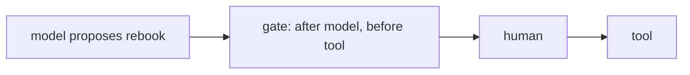
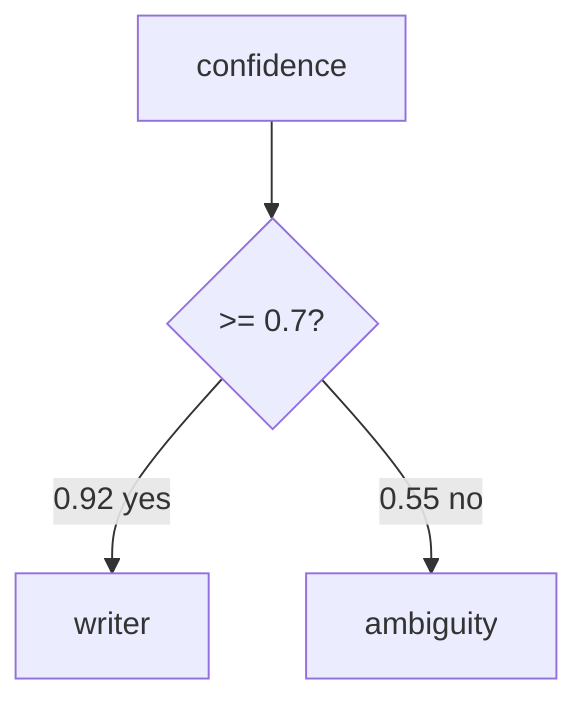
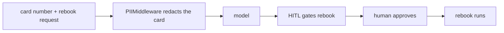

# Solutions · Exercise 4 (Middleware and Graphs)

Topics: middleware (PII redaction, summarisation, human-in-the-loop), StateGraph routing, deterministic control.

The through-line:

- Middleware runs your logic at fixed points in the loop, before the model or after it, without you rewriting the loop.
- Some actions must not fire on the model's word alone. The gate makes the model propose and a human dispose.
- When a path must hold every time, drop below the agent to a graph you can unit test.

---

### Q1 · Answer: B

- **Why:** the human-in-the-loop gate interrupts after the model responds and before the tool runs, which is the only moment you can review the exact action and still stop it.
- **Context:** before-model is too early, there is nothing to approve yet. After-tool is too late, the irreversible thing already happened.
- **Intuition:** catch the action while it is still a proposal.



---

### Q2 · Answer: A

- **Why:** the before-model hook catches a card number on the way in, so it never reaches the model.
- **Context:** redaction protects the model and your logs. If sensitive data reaches the prompt, it can also reach anything that stores prompts.
- **Intuition:** clean the input before the model ever sees it.

---

### Q3 · Answer: 1-C, 2-A, 3-B

- **Why:** PII redacts private data before the model, summarisation compresses old turns, the gate pauses for approval. Retry-on-error is a distractor.
- **Intuition:** three controls, three jobs: hide, shrink, pause.

---

### Q4 · Answer: A

- **Why:** option A interrupts before the tool runs, so approval gates the action. Option B runs the tool and asks after, which approves nothing.
- **Intuition:** approval after the fact is a receipt, not a gate.

---

### Q5 · Answer: 1 = B (ambiguity), 2 = A (writer)

- **Why:** the router sends confidence below 0.7 to ambiguity and 0.7 or higher to writer. 0.55 goes to ambiguity, 0.92 goes to writer.
- **Context:** the branch is decided by a plain comparison, so it is deterministic. The same input always takes the same path.
- **Intuition:** a number and a threshold, no model opinion involved.



---

### Q6 · Answer: 1-B, 2-C, 3-A

- **Why:** `add_node("writer", writer)` draws the writer box, `add_edge(START, "extractor")` draws the arrow from START into extractor, `add_conditional_edges(...)` draws the branch that splits two ways.
- **Context:** a `StateGraph` is nodes plus edges. Reading the wiring back to the picture is how you verify a graph does what you meant.
- **Intuition:** each line is one shape on the diagram.

---

### Q7 · Answer: A and C

- **Why:** there is no `checkpointer`, so the paused state cannot be saved or resumed, and the resume payload `{"resume": "yes"}` is the wrong shape. `rebook` belongs in tools, `interrupt_on` takes tool names, and `system_prompt` is optional, so those are distractors.
- **Context:** the gate and persistence ship together. Without a checkpointer there is nowhere to hold the paused run.
- **Intuition:** two failures, both about the pause: nowhere to save it, wrong way to resume it.

---

### Q8 · Answer: A

- **Why:** the resume must carry a decision in the shape the gate expects: `Command(resume={"decisions": [{"type": "approve"}]})`. The other options invent a shape.
- **Context:** the allowed decisions are approve, reject, edit, and respond. Reject skips the tool and tells the model.
- **Intuition:** the resume is a structured decision, not a loose "yes."

---

### Q9 · Answer: a two-line router

```python
def route(state):
    return "writer" if state["confidence"] >= 0.7 else "ambiguity"
```

- **Why:** the router returns the next node name from a plain comparison. No model call, fully testable.
- **Intuition:** this function is the branch. You can assert its output in a unit test and never touch a model.

---

### Q10 · Answer: b, a, d, c

- **Why:** the first invoke returns a pause with no rebooking, the human approves, a resume `Command` carries that decision, then the tool runs.
- **Intuition:** pause, decide, resume, act.

---

### Q11 · Answer: C

- **Why:** edge `c` runs `rebook` straight from the model, bypassing the gate entirely. The tool must only run through the approved branch.
- **Context:** a stray path around a gate is a classic way a "gated" action quietly runs ungated.
- **Intuition:** if any arrow reaches the tool without passing the gate, the gate is decorative.

---

### Q12 · Answer: 1-T, 2-T, 3-F

- **Why:** summarisation is lossy so 1 is true, a `StateGraph` router can be plain Python so 2 is true, and the gate needs a checkpointer so 3 is false.
- **Intuition:** summaries forget, routers are code, gates need persistence.

---

### Q13 · Answer: A, B, D

- **Why:** drop to a `StateGraph` when a rule must hold every run, when you want a branch you can unit test with no model, or when a fixed auditable path matters more than flexibility. A one-call no-tool task is the opposite, a framework is overhead there.
- **Intuition:** a graph buys certainty and costs flexibility. Pay it for the transitions that must hold.

---

### Case study · Q14a: A and C, Q14b: B

- **Why:** with no gate the agent rebooks with no human check, and with no redaction card numbers land in the prompt and the logs. `PIIMiddleware` plus `HumanInTheLoopMiddleware` closes both gaps.
- **Context:** these are two separate controls for two separate risks. One protects the action, one protects the data. Neither substitutes for the other.
- **Intuition:** gate the action, redact the data, and do both on purpose.



---

## Putting it together in code

An agent with both guardrails, redacting cards and gating `rebook`, then a `StateGraph` that routes deterministically. The gate interrupts and resumes live. The router runs with no model at all.

```python
from typing import Any, List, TypedDict
from langchain_core.language_models.chat_models import BaseChatModel
from langchain_core.messages import AIMessage
from langchain_core.outputs import ChatResult, ChatGeneration
from langchain.agents import create_agent
from langchain.tools import tool
from langchain.agents.middleware import PIIMiddleware, HumanInTheLoopMiddleware
from langgraph.checkpoint.memory import InMemorySaver
from langgraph.graph import StateGraph, START, END
from langgraph.types import Command


class ScriptedChatModel(BaseChatModel):
    '''Deterministic stand-in. Real framework, scripted replies, no credentials.'''
    responses: List[Any]
    idx: int = 0

    @property
    def _llm_type(self) -> str:
        return "scripted"

    def _generate(self, messages, stop=None, run_manager=None, **kwargs):
        reply = self.responses[min(self.idx, len(self.responses) - 1)]
        object.__setattr__(self, "idx", self.idx + 1)
        return ChatResult(generations=[ChatGeneration(message=reply)])

    def bind_tools(self, tools, **kwargs):
        return self


@tool
def rebook(pnr: str, flight: str) -> str:
    '''Rebook a PNR onto a new flight. May charge a fee.'''
    return f"{pnr} on {flight}, confirmation RBK-77"


# Guardrails: redact cards before the model, gate rebook behind human approval.
agent = create_agent(
    ScriptedChatModel(responses=[
        AIMessage(content="", tool_calls=[{"name": "rebook", "args": {"pnr": "JX48Q2", "flight": "AI-506"}, "id": "r", "type": "tool_call"}]),
        AIMessage(content="Done, JX48Q2 on AI-506."),
    ]),
    tools=[rebook],
    middleware=[
        PIIMiddleware("credit_card", strategy="redact", apply_to_input=True),
        HumanInTheLoopMiddleware(interrupt_on={"rebook": True}),
    ],
    checkpointer=InMemorySaver(),
    system_prompt="You are TravelMind.",
)
thread = {"configurable": {"thread_id": "g1"}}
paused = agent.invoke({"messages": [{"role": "user", "content": "rebook JX48Q2 onto AI-506, card 4111 1111 1111 1111"}]}, thread)
print("card redacted in state:", "[REDACTED_CREDIT_CARD]" in paused["messages"][0].content)
print("paused at the gate:", "__interrupt__" in paused)
done = agent.invoke(Command(resume={"decisions": [{"type": "approve"}]}), thread)
print("after approval:", done["messages"][-1].content)


# Deterministic routing: nodes are plain functions, the branch is a plain comparison.
class State(TypedDict):
    text: str
    confidence: float
    result: str

def extractor(state): return {"confidence": 0.92 if "cancel" in state["text"].lower() else 0.45}
def writer(state): return {"result": f"resolved (confidence {state['confidence']})"}
def ambiguity(state): return {"result": "confidence too low, ask one clarifying question"}
def route(state): return "writer" if state["confidence"] >= 0.7 else "ambiguity"

graph = StateGraph(State)
graph.add_node("extractor", extractor)
graph.add_node("writer", writer)
graph.add_node("ambiguity", ambiguity)
graph.add_edge(START, "extractor")
graph.add_conditional_edges("extractor", route, {"writer": "writer", "ambiguity": "ambiguity"})
graph.add_edge("writer", END)
graph.add_edge("ambiguity", END)
app = graph.compile()

for text in ["My flight JX48Q2 is cancelled", "something feels off"]:
    print(text, "->", app.invoke({"text": text, "confidence": 0.0, "result": ""})["result"])
```

The gate proves the model cannot rebook alone, and the card never reaches the prompt. The router proves a branch can be certain and testable, because no model ever touches the decision.
