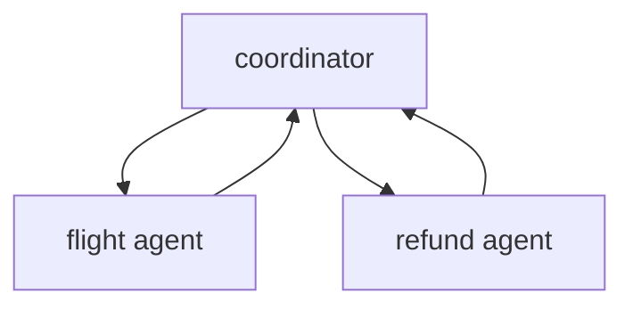
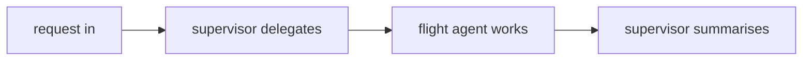
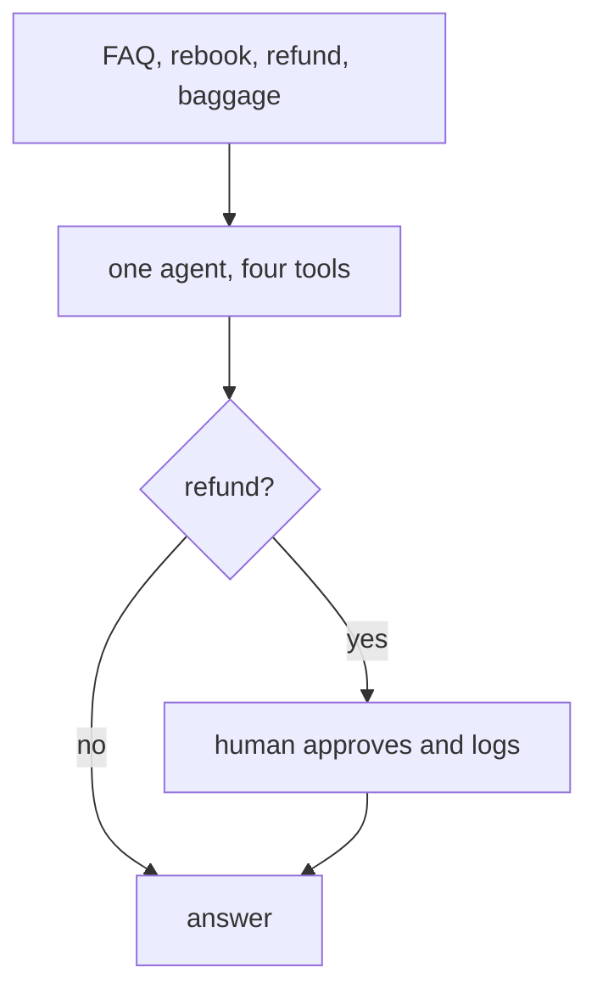

# Solutions · Exercise 5 (Multi-Agent Capstone)

Topics: multi-agent (supervisor, swarm), LangChain vs Strands, architecture decisions.

The ideas under this set:

- Splitting agents helps when domains are genuinely distinct. A supervisor is a hub, a swarm is peers.
- The concepts port across frameworks. The method names are a lookup table.
- Complexity is a cost paid in debugging time forever. Add coordination only when one agent has actually struggled.

---

### Q1 · Answer: A

- **Why:** the hub, a coordinator delegating to specialists that report back, is the supervisor. The peer pair is a swarm.
- **Context:** the supervisor stays thin and central, each specialist stays focused. Adding a baggage agent means adding one spoke.
- **Intuition:** one boss, several specialists, all roads back to the boss.



---

### Q2 · Answer: 1-C, 2-A, 3-D, 4-E, 5-B, 6-F

- **Why:** create an agent maps to `Agent(...)`, invoke maps to `agent("...")`, `response_format` maps to `structured_output`, `create_supervisor` maps to an orchestrator holding agents as tools, `create_swarm` maps to `Swarm([...])`, and `StateGraph` maps to `GraphBuilder`.
- **Context:** LangChain names the supervisor with a dedicated helper and a compiled graph. Strands expresses the same hub with agents-as-tools. Same mental model, different surface.
- **Intuition:** learn one framework deeply, and the other reads like a translation.

---

### Q3 · Answer: A

- **Why:** option A returns each worker to the coordinator, so it can fold the results into one answer. Option B sends workers straight to end, so nothing gets synthesised.
- **Intuition:** a coordinator that never hears back cannot summarise anything.

---

### Q4 · Answer: A and C

- **Why:** the workers have no `name`, so the coordinator cannot tell them apart, and `.compile()` has no checkpointer, so the paused handoff state is not tracked. Lists, `prompt`, and a model object are all valid, so those are distractors.
- **Context:** the supervisor delegates through auto-generated tools named `transfer_to_<name>`. No name, no target.
- **Intuition:** name the workers so the hub can address them, and give the graph a checkpointer so it can track who is active.

---

### Q5 · Answer: add the `name`

```python
flight_agent = create_agent(model, tools=[search_flights], system_prompt="Flights.", name="flight_agent")
```

- **Why:** the `name` is what the supervisor's `transfer_to_flight_agent` tool points at. Without it the handoff has no address.
- **Intuition:** the name is the worker's phone number.

---

### Q6 · Answer: a compiled supervisor

```python
supervisor = create_supervisor(
    [flight_agent, refund_agent],
    model=model,
    prompt="Route each request to the right specialist, then summarise.",
).compile(checkpointer=InMemorySaver())
```

- **Why:** the list of named workers plus a model plus a prompt, compiled with a checkpointer so handoffs are tracked across the run.
- **Intuition:** three lines and the hub exists. The workers do the work, the hub routes and summarises.

---

### Q7 · Answer: B

- **Why:** after the finder hands off, the booker holds control and talks to the user until it hands back.
- **Context:** a handoff moves the active agent, it does not just return a value. Whoever holds control owns the conversation.
- **Intuition:** control moved sideways, so the voice moved with it.

---

### Q8 · Answer: c, d, a, b

- **Why:** the request reaches the supervisor, it calls `transfer_to_flight_agent`, the flight agent runs and returns options, the supervisor summarises.
- **Intuition:** arrive, delegate, work, summarise.



---

### Q9 · Answer: B

- **Why:** a Strands `Swarm([finder, booker])` maps to `create_swarm([finder, booker], default_active_agent="finder")`. Strands runs the handoff for you, LangChain builds it from handoff tools and a compiled graph.
- **Intuition:** same peer pattern, one framework hides the wiring, the other exposes it.

---

### Q10 · Answer: 1-B-Y, 2-A-X

- **Why:** central coordination is `create_supervisor` in LangChain and agents-as-tools in Strands. Peer handoff is `create_swarm` in LangChain and `Swarm` in Strands.
- **Intuition:** two patterns, two rows, mapped both ways.

---

### Q11 · Answer: 1-F, 2-T, 3-T

- **Why:** a swarm has no central boss so 1 is false, a `StateGraph` gives a fixed testable path so 2 is true, and a single agent with three good tools often beats a five-agent committee so 3 is true.
- **Intuition:** swarms are peers, graphs are certainty, and fewer agents are usually easier to run.

---

### Q12 · Answer: A, B, D

- **Why:** five agents where one would do, a graph node for a step that needs no guarantee, and coordination added before any agent has struggled are all over-engineering. A raw call for a one-shot task is the correct minimal choice, not a symptom.
- **Intuition:** the smell is structure you added before a simpler version failed.

---

### Case study · Q13a: B, Q13b: B, Q13c: B, Q13d: B

- **Why:** start with one agent holding four tools plus a human gate on the refund tool. The non-negotiable is that refund gate. The pressure that forces a later split is one prompt piling up conflicting rules across four very different jobs. When you split, reach for a supervisor first, because central control is easier to log, audit, and debug.
- **Context:** the requirement to log and approve every refund is a hard control, so it drives the design more than the number of jobs does. One agent is the cheapest thing that can work, and the gate is the one piece you cannot skip.
- **Intuition:** build the smallest thing that satisfies the hard control, then split only when a single prompt visibly buckles.



---

### Q14 · Answer: C

- **Why:** a single model call with no tools and no memory needs no framework. A framework there is pure overhead.
- **Context:** this mirrors the whole series. The framework earns its place with tools, memory, or control flow. Without those, a raw call is the honest choice.
- **Intuition:** ask whether the framework earns its complexity. Sometimes the best engineering is the structure you did not add.

---

## Putting it together in code

A supervisor over one specialist, running the real handoff with scripted models. The supervisor delegates through `transfer_to_flight_agent`, the worker runs, and the supervisor summarises. Add a refund agent the same way and the hub stays thin.

```python
from typing import Any, List
from langchain_core.language_models.chat_models import BaseChatModel
from langchain_core.messages import AIMessage
from langchain_core.outputs import ChatResult, ChatGeneration
from langchain.agents import create_agent
from langchain.tools import tool
from langgraph.checkpoint.memory import InMemorySaver
from langgraph_supervisor import create_supervisor


class ScriptedChatModel(BaseChatModel):
    '''Deterministic stand-in. Real framework, scripted replies, no credentials.'''
    responses: List[Any]
    idx: int = 0

    @property
    def _llm_type(self) -> str:
        return "scripted"

    def _generate(self, messages, stop=None, run_manager=None, **kwargs):
        reply = self.responses[min(self.idx, len(self.responses) - 1)]
        object.__setattr__(self, "idx", self.idx + 1)
        return ChatResult(generations=[ChatGeneration(message=reply)])

    def bind_tools(self, tools, **kwargs):
        return self


@tool
def search_flights(origin: str, dest: str) -> str:
    '''Find alternate flights between two airport codes.'''
    return "AI-506 09:40, AI-812 14:15"


# A named specialist. The name is the address the supervisor transfers to.
flight_agent = create_agent(
    ScriptedChatModel(responses=[
        AIMessage(content="", tool_calls=[{"name": "search_flights", "args": {"origin": "BLR", "dest": "DEL"}, "id": "f", "type": "tool_call"}]),
        AIMessage(content="Options: AI-506 09:40 or AI-812 14:15."),
    ]),
    tools=[search_flights],
    system_prompt="You find flights.",
    name="flight_agent",
)

# The supervisor delegates via the auto-generated transfer_to_flight_agent tool, then summarises.
supervisor = create_supervisor(
    [flight_agent],
    model=ScriptedChatModel(responses=[
        AIMessage(content="", tool_calls=[{"name": "transfer_to_flight_agent", "args": {}, "id": "s", "type": "tool_call"}]),
        AIMessage(content="For JX48Q2, your options are AI-506 09:40 or AI-812 14:15."),
    ]),
    prompt="Route each request to the right specialist, then summarise.",
).compile(checkpointer=InMemorySaver())

result = supervisor.invoke(
    {"messages": [{"role": "user", "content": "JX48Q2 cancelled, find options BLR to DEL"}]},
    {"configurable": {"thread_id": "sup-1"}},
)
print("final:", result["messages"][-1].content)

# Production swap for every model above:
# from langchain_aws import ChatBedrockConverse
# model = ChatBedrockConverse(model="us.anthropic.claude-haiku-4-5-20251001-v1:0", region_name="us-east-1")
```

The supervisor never knew how to search flights. It knew who did, delegated by name, and summarised the result. That is the whole capstone: split by domain, coordinate through a thin hub, and only when one agent has genuinely outgrown its job.
