# Building Memory Into Agents
### LCEL Mechanics • LLM Memory • InMemoryChatMessageHistory • RunnableWithMessageHistory • Session IDs • Replit

Module deck. Read top-to-bottom. Each `---` is a slide. Facilitator notes carry durations only.

---

## Run of show (105 min)

| # | Segment | Duration | Type |
|---|---------|----------|------|
| 1 | Inquisition cold-open quiz | 10 min | Quiz (no reveal yet) |
| 2 | The Amnesia Problem | 8 min | Concept |
| 3 | LCEL deep dive | 15 min | Concept + code |
| 4 | Activity A: Trace-the-Pipe | 10 min | Hands-on |
| 5 | Mechanics of LLM memory | 10 min | Concept + math |
| 6 | InMemoryChatMessageHistory | 8 min | Concept + code |
| 7 | RunnableWithMessageHistory | 12 min | Concept + code |
| 8 | Activity B: Session Leak Hunt | 12 min | Debug |
| 9 | Session IDs + Replit | 13 min | Concept + code |
| 10 | Forward view + recap quiz | 7 min | Synthesis + quiz |

Five running frameworks you will reuse all hour:

| Framework | One-line job |
|-----------|--------------|
| Goldfish Principle | Explains why the model forgets |
| LCEL Assembly Line | Explains how chains are wired |
| 3-Axis Memory Model | Separates WHERE / HOW / WHO |
| The Replay Tax | Explains what memory costs |
| The Restart Test | Classifies dev-toy vs production |

---

# Segment 1
## Inquisition cold-open quiz

Language: Python • Topics: LLM statelessness, LCEL pipe, message history, session IDs, Replit • Level: Warm-up to intermediate

Rule: answer on gut. No reveal until we earn it later. Track how many you are unsure about. That count is your learning target for today.

---

## Cold-open: Q1 to Q5

**Q1 (predict).** You call a raw model twice in one script:
```python
model.invoke("My name is Rao.")
model.invoke("What is my name?")
```
What does call two most likely answer, and why?

**Q2 (single-select).** A chatbot recalls your name across turns. Where does that recall physically live?
- (a) inside the model weights
- (b) in the text you send on the next call
- (c) in hidden server-side state tied to your API key
- (d) in a session cookie the API sets

**Q3 (code-reading).** Given:
```python
chain = prompt | model | StrOutputParser()
```
What is the `|` doing here?
- (a) bitwise OR on three objects
- (b) piping each stage's output into the next stage's input
- (c) running all three in parallel and merging
- (d) importing a plugin

**Q4 (true/false, pick one).** "RunnableWithMessageHistory saves your conversation inside the model so the model remembers next time."
- True
- False

**Q5 (spot the risk).** On a Replit autoscale deployment you keep history in a module-level `store = {}` dict. What is the first thing that breaks in production?
- (a) nothing, dicts are fine
- (b) memory leak from too many keys
- (c) two requests from the same user hit different instances, each with its own empty `store`
- (d) the dict becomes read-only after deploy

---

## Cold-open: Q6 to Q10

**Q6 (predict-the-output).** Two users, same code, but you hardcoded `session_id="default"` for everyone.
```python
config = {"configurable": {"session_id": "default"}}
```
User A says "I am allergic to peanuts." Ten seconds later User B (different person) asks "what am I allergic to?" What happens?

**Q7 (multi-select).** Which of these survive a Replit process restart if history is a plain in-memory dict? Pick all that apply.
- (a) messages from 2 minutes ago
- (b) messages written to SQLite on disk
- (c) values in the module-level dict
- (d) rows in an external Postgres

**Q8 (case).** Your bot works perfectly in the Replit workspace when you press Run. You deploy it. Users report it "forgot" their API access and crashes on startup. Nothing in your code changed. What is the single most likely cause?

**Q9 (matching).** Match the term to its layer. Bank has one distractor.

| Term | |
|------|-|
| 1. InMemoryChatMessageHistory | |
| 2. RunnableWithMessageHistory | |
| 3. session_id | |

Bank: (A) identity of a conversation, (B) automatic read/write wiring around a chain, (C) storage that holds the message list, (D) the model's private scratchpad

**Q10 (provocative, discuss).** If the LLM truly has no memory of its own, then what exactly are we building when we "add memory"? Say it in one sentence before we start.

Facilitator note (2 min): collect the room's unsure-count with a show of hands. Do not reveal answers. Every answer gets earned by a later slide. Park Q10 on the board.

---

# Segment 2
## The Amnesia Problem

The core fact everything else hangs on.

---

## The Goldfish Principle

> Every call to an LLM is stateless. The model is a goldfish: it wakes up, reads only what is on the page in front of it, answers, and forgets everything the instant it finishes.

What this means, concretely:

- The model keeps zero state between two API calls
- It does not "know" what it said 5 seconds ago
- Two calls in the same script are as unrelated as two calls from two strangers on two continents
- The API is a pure function: same input tokens in, same distribution out

So "memory" is never in the fish. Memory is the notepad you clip to the bowl and read aloud, in full, on every single call.

Skeptic's corner: "But ChatGPT clearly remembers my last message." Correct, and that product is doing exactly what we are about to build: re-sending the prior turns as text on every call. The remembering lives in the plumbing, not the model.

---

## Stateless vs stateful, side by side

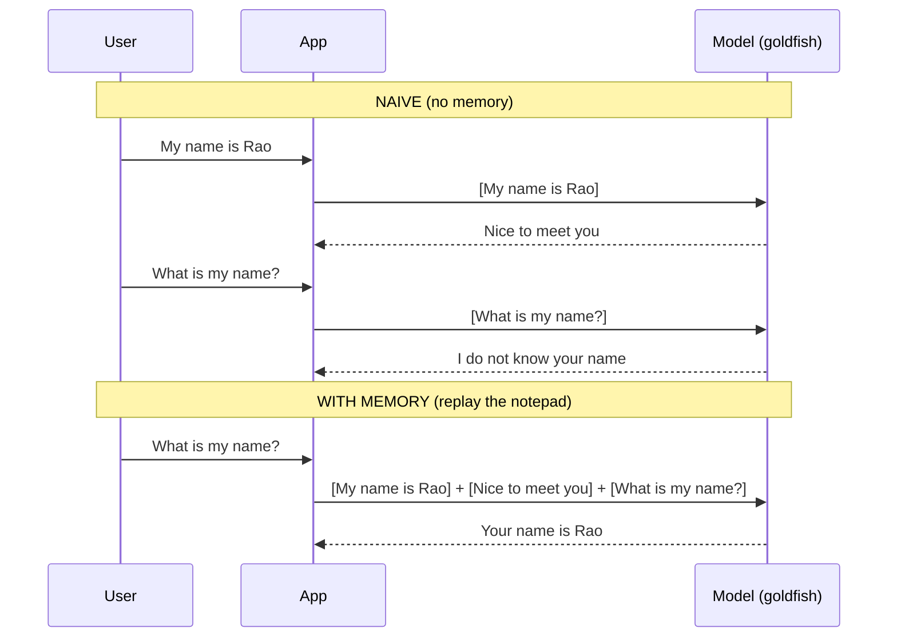

The only difference between the two halves is what the App chose to put in the brackets. Same model. Same goldfish. Different notepad.

---

## Reframing Q10

"Adding memory" decodes to three jobs, nothing more:

| Job | Plain words |
|-----|-------------|
| Store | Keep a list of past messages somewhere |
| Retrieve | Fetch that list before the next call |
| Inject | Paste it into the prompt so the goldfish re-reads it |

Every memory tool in LangChain, from a toy dict to LangGraph checkpointers, is just a fancier way to do Store, Retrieve, Inject. Hold that.

---

# Segment 3
## LCEL deep dive

Before memory can be wired in, you need to see how LangChain wires anything. That is LCEL.

---

## What LCEL actually is

LCEL = LangChain Expression Language. It is the pipe (`|`) syntax for gluing components into a chain.

The one idea that makes it click:

> Every LangChain building block is a Runnable, and every Runnable speaks the same three verbs. The pipe just connects them.

The shared interface on every Runnable:

| Verb | Meaning |
|------|---------|
| `invoke(x)` | run once, one input to one output |
| `batch([x, y])` | run many inputs |
| `stream(x)` | run once, yield output in chunks |
| `ainvoke` / `abatch` / `astream` | async versions of the above |

Because they all share this interface, you can snap them together in any order and the joint is always the same shape.

---

## The LCEL Assembly Line

Picture a factory conveyor belt.

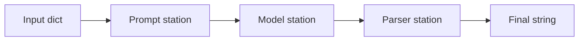

- The belt is the `|`
- Each station is a Runnable
- A station takes the box handed to it, does one job, hands the result to the next station
- You can add, remove, or reorder stations without rewiring the belt

Code for that exact line:
```python
from langchain_anthropic import ChatAnthropic
from langchain_core.prompts import ChatPromptTemplate
from langchain_core.output_parsers import StrOutputParser

prompt = ChatPromptTemplate.from_messages([
    ("system", "You are a concise travel support agent."),
    ("human", "{input}"),
])

model = ChatAnthropic(model="claude-haiku-4-5-20251001", temperature=0)

chain = prompt | model | StrOutputParser()

chain.invoke({"input": "Give me one packing tip for Oman in November."})
```

Bootcamp swap note: same chain runs on the AWS path by replacing the model station with `ChatBedrockConverse(model="us.anthropic.claude-haiku-4-5-20251001-v1:0", region_name="us-east-1")`. The belt does not change.

---

## Line-by-line walkthrough

| Line | What | Why | Syntax note |
|------|------|-----|-------------|
| `ChatPromptTemplate.from_messages([...])` | builds a prompt station from a list of role/text pairs | keeps roles explicit and reusable | each tuple is `(role, template)`; `{input}` is a slot |
| `ChatAnthropic(...)` | the model station | this is the only station that calls out to the LLM | `temperature=0` for repeatable demos |
| `StrOutputParser()` | pulls plain text out of the model's message object | so downstream code gets a `str`, not an object | no args needed |
| `prompt \| model \| parser` | welds three stations into one Runnable | one object you can `invoke`, `batch`, `stream` | left-to-right data flow |
| `chain.invoke({"input": ...})` | pushes one box down the belt | runs the whole line once | input is a dict keyed to the template slots |

Runtime behavior: the dict fills the prompt slots, the filled prompt becomes messages, messages go to the model, the model's reply object is unwrapped to a string. One `invoke` call, four transformations.

---

## The three glue Runnables you will actually use

LCEL ships a few utility stations. These three cover most wiring:

| Runnable | Job | Mental image |
|----------|-----|--------------|
| `RunnablePassthrough` | pass input through untouched, or add keys alongside it | a clear pipe segment |
| `RunnableLambda` | wrap any plain Python function as a station | a custom machine you bolt on |
| `RunnableParallel` (dict form) | run several stations on the same input, collect results by key | a splitter with labeled bins |

Example of adding a computed field without breaking the belt:
```python
from langchain_core.runnables import RunnablePassthrough, RunnableLambda

add_len = RunnablePassthrough.assign(
    char_count=RunnableLambda(lambda d: len(d["input"]))
)

add_len.invoke({"input": "hello"})
# {"input": "hello", "char_count": 5}
```

Why this matters for memory: in the next segments, history gets injected as one more field alongside `input`. Same trick, higher stakes.

---

## Why LCEL earns its keep

| Property | Payoff |
|----------|--------|
| Uniform interface | learn `invoke` once, use it on every component |
| Composability | swap the model station without touching the rest |
| Streaming for free | `stream()` works on the whole chain, not just the model |
| Config plumbing | runtime settings (like a session id) ride along in one `config` argument |

That last row is the hook. Memory wiring is going to lean entirely on the `config` channel.

---

# Segment 4
## Activity A: Trace-the-Pipe

Language: Python • Topics: LCEL data flow, Runnable interface • Level: Warm-up

Work in pairs. 10 min. No running code yet, trace on paper.

---

## Activity A tasks

**A1 (trace-a-flow).** For this chain:
```python
chain = prompt | model | StrOutputParser()
```
Write down the data type of the box at each arrow:


Fill the four `?` blanks: input to prompt, prompt to model, model to parser, parser output.

**A2 (predict-the-output).** What does this print?
```python
add_len = RunnablePassthrough.assign(
    char_count=RunnableLambda(lambda d: len(d["input"]))
)
print(add_len.invoke({"input": "Rao"}))
```

**A3 (spot-the-wrong-arrow).** One arrow below is wrong for a working chat chain. Which tag, a, b, or c?
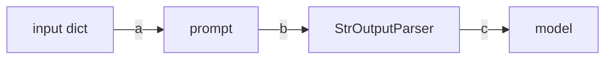

**A4 (small fresh-code).** Write a one-line `RunnableLambda` station that upper-cases the value of `d["input"]`. Just the lambda station, not the whole chain.

**A5 (multi-select).** Which of these are valid on any Runnable? Pick all.
- (a) `.invoke`
- (b) `.stream`
- (c) `.remember`
- (d) `.batch`
- (e) `.ainvoke`

Facilitator note (2 min to close): take answers to A3 and A4 out loud. A3 is the teaching moment: parser and model are swapped, so the belt order is broken.

---

## Activity A key (reveal on close)

| Q | Answer |
|---|--------|
| A1 | dict, then a prompt value (chat messages), then a chat message object, then `str` |
| A2 | `{"input": "Rao", "char_count": 3}` |
| A3 | tag b is wrong; parser must come after model, not before |
| A4 | `RunnableLambda(lambda d: d["input"].upper())` |
| A5 | a, b, d, e valid; c is invented |

---

# Segment 5
## Mechanics of LLM memory

Now that you can wire a chain, wire in the notepad. First, understand the cost, because it drives every production decision.

---

## Memory is replay, and replay is not free

Since the goldfish re-reads the whole notepad every call, the notepad rides along as tokens each turn.

Tokens sent on turn `n`:

$$
\text{tokens}_n = \text{system} + \sum_{i=1}^{n-1} \text{msg}_i + \text{input}_n
$$

Every new turn re-sends all prior turns. So the total tokens billed across an `N`-turn chat:

$$
\text{Total} \approx \sum_{n=1}^{N}\left(\text{system} + \sum_{i=1}^{n-1}\text{msg}_i + \text{input}_n\right) = O(N^2)
$$

Read that again. Naive full-history memory is quadratic in conversation length. This is The Replay Tax.

---

## The Replay Tax, in a picture

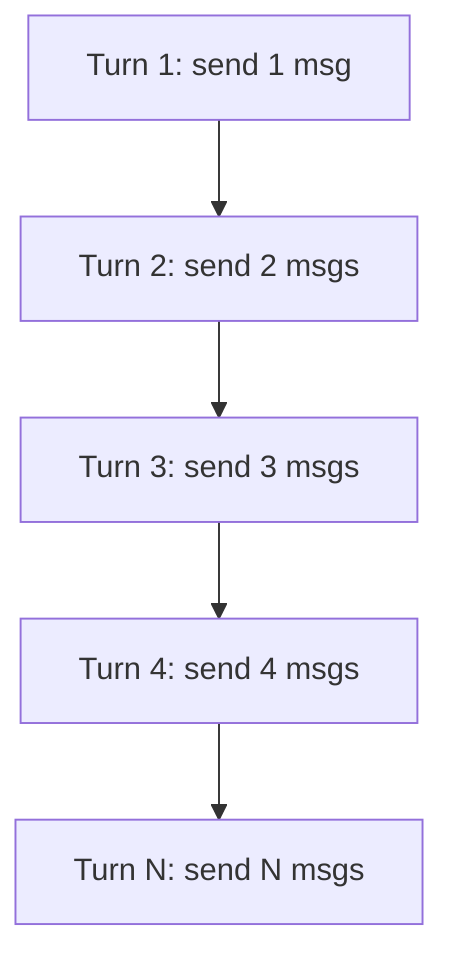

Consequences you will feel:

| Symptom | Cause |
|---------|-------|
| Cost creeps up mid-conversation | each turn re-bills all past turns |
| Latency grows with chat length | more tokens to process each call |
| Eventually the call fails | history overflows the context window |

Tax deductions (later modules, named here so you know they exist):

- Trimming: keep only the last K messages
- Summarizing: replace old turns with a short recap
- Windowing: a moving frame over recent turns

Today's scope stops at plain full history, so you can see the mechanism clean before optimizing it.

---

## The 3-Axis Memory Model

The single most useful map for the rest of the module. Any memory setup is three independent choices:

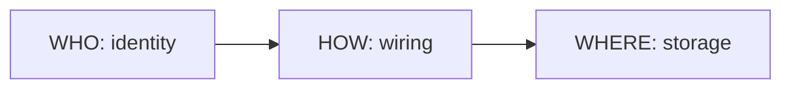

| Axis | Question | Today's answer | Other options |
|------|----------|----------------|---------------|
| WHERE | Where do messages live? | `InMemoryChatMessageHistory` | SQLite, Redis, Postgres |
| HOW | How does history reach the prompt? | `RunnableWithMessageHistory` | LangGraph checkpointer |
| WHO | Whose history is this? | `session_id` | `thread_id`, user id |

Diagnostic power: almost every memory bug is two of these axes tangled. "The bot forgot" is usually a WHO bug (wrong session key) or a WHERE bug (storage got wiped), not a model problem. Keep the axes separate in your head and bugs sort themselves.

---

# Segment 6
## InMemoryChatMessageHistory

The WHERE axis, simplest rung. This is the storage primitive.

---

## What it is

A tiny object that holds an ordered list of chat messages in RAM. Nothing more.

```python
from langchain_core.chat_history import InMemoryChatMessageHistory

history = InMemoryChatMessageHistory()
history.add_user_message("My name is Rao.")
history.add_ai_message("Noted, Rao.")

history.messages
# [HumanMessage("My name is Rao."), AIMessage("Noted, Rao.")]
```

The surface you will use:

| Member | Job |
|--------|-----|
| `.messages` | the list of stored messages |
| `.add_user_message(text)` | append a human turn |
| `.add_ai_message(text)` | append an AI turn |
| `.add_messages([...])` | append a list at once |
| `.clear()` | wipe this conversation |
| `.aget_messages()` | async read of the list |

That is the whole class. It is a list with manners.

---

## Runtime behavior and honesty about limits

Behavior:

- Lives entirely in the Python process memory
- Read and write are instant, no I/O
- Perfect for notebooks, tests, and a single-session demo

Limits, stated plainly:

| Limit | What it means |
|-------|---------------|
| Not durable | process restart wipes it, every message gone |
| Not shared | a second process or instance cannot see it |
| Not bounded | it grows forever until you trim or clear it |

Apply The Restart Test now: if Replit restarts your app, does this history survive? No. So `InMemoryChatMessageHistory` on its own is a dev-time tool, not a production store. Remember that verdict for the Replit segment.

---

## One store, many conversations

A single history object holds one conversation. Real apps have many users, so you keep a lookup table from id to history:

```python
from langchain_core.chat_history import BaseChatMessageHistory, InMemoryChatMessageHistory

store: dict[str, BaseChatMessageHistory] = {}

def get_session_history(session_id: str) -> BaseChatMessageHistory:
    if session_id not in store:
        store[session_id] = InMemoryChatMessageHistory()
    return store[session_id]
```

Walkthrough:

| Line | What | Why |
|------|------|-----|
| `store: dict[...] = {}` | one global table | maps id to that user's message list |
| `def get_session_history(session_id)` | factory function | the wiring layer will call this to fetch the right history |
| `if session_id not in store` | lazy create | first time we see an id, make a fresh history |
| `return store[session_id]` | hand back the object | same id always returns the same conversation |

This function is the bridge to the next segment. `RunnableWithMessageHistory` calls exactly this.

---

# Segment 7
## RunnableWithMessageHistory

The HOW axis. This is the wrapper that automates Store, Retrieve, Inject so you stop doing it by hand.

---

## The problem it removes

By hand, every turn you would: fetch history, paste it into the prompt, call the model, append the new question, append the new answer. Five steps, every turn, easy to get wrong.

`RunnableWithMessageHistory` (RWMH) wraps your chain and does all five for you. You call `invoke` once with a session id, it handles the notepad.

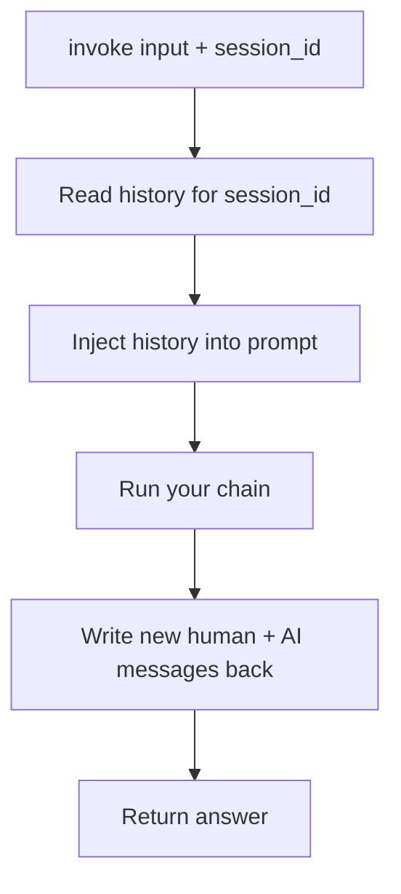

You write the chain. RWMH writes the loop around it.

---

## Wiring it up

Two requirements the chain must satisfy first:

1. The prompt needs a slot for history, using `MessagesPlaceholder`
2. That slot's `variable_name` must match the key you tell RWMH

```python
from langchain_anthropic import ChatAnthropic
from langchain_core.prompts import ChatPromptTemplate, MessagesPlaceholder
from langchain_core.output_parsers import StrOutputParser
from langchain_core.runnables.history import RunnableWithMessageHistory

prompt = ChatPromptTemplate.from_messages([
    ("system", "You are a concise travel support agent."),
    MessagesPlaceholder(variable_name="history"),
    ("human", "{input}"),
])

model = ChatAnthropic(model="claude-haiku-4-5-20251001", temperature=0)
chain = prompt | model | StrOutputParser()

chat = RunnableWithMessageHistory(
    chain,
    get_session_history,
    input_messages_key="input",
    history_messages_key="history",
)
```

---

## Line-by-line walkthrough

| Argument | What | Why it must be right |
|----------|------|----------------------|
| `chain` | your LCEL chain | the thing being wrapped |
| `get_session_history` | the factory from Segment 6 | RWMH calls it with the session id to fetch storage |
| `input_messages_key="input"` | which input key holds the new user text | RWMH needs to know what to save as the human turn |
| `history_messages_key="history"` | which prompt slot receives past messages | must equal the `MessagesPlaceholder` name |

The most common failure: `history_messages_key` does not match `variable_name` in the placeholder. History gets fetched, then dropped into a slot that does not exist, and the bot "forgets." That is a HOW-axis bug, not a model bug.

---

## Invoking with a session

The session id rides in the `config` channel, under `configurable`:

```python
chat.invoke(
    {"input": "My name is Rao, PNR JX48Q2."},
    config={"configurable": {"session_id": "user-42"}},
)

chat.invoke(
    {"input": "What is my PNR?"},
    config={"configurable": {"session_id": "user-42"}},
)
# Answer references JX48Q2, because both calls share session user-42
```

Runtime behavior for call two:

| Step | RWMH action |
|------|-------------|
| 1 | reads `session_id` = user-42 from config |
| 2 | calls `get_session_history("user-42")`, gets the history holding turn one |
| 3 | injects those messages into the `history` slot |
| 4 | runs the chain, model now sees the PNR from turn one |
| 5 | appends the new question and answer to user-42's history |

Change the session id and you get a clean, empty conversation. Same id, continuity. That is the entire trick.

---

## Scenarios and production use cases

| Scenario | What RWMH gives you |
|----------|---------------------|
| Support agent per customer | one session id per customer, isolated histories |
| Multi-turn form filling | the bot recalls earlier answers without you re-passing them |
| A/B of two prompts | wrap two chains, compare, storage code unchanged |
| Swap storage for prod | keep the factory signature, return a Redis-backed history instead of in-memory |

Design note that saves you later: RWMH is stable and not deprecated, and it is the LCEL-native way to add memory. For heavier needs (durable state, resume-after-crash, human-in-the-loop), the newer path is LangGraph persistence. We close with that bridge. For today's goal, one chain plus one notepad, RWMH is exactly right.

---

# Segment 8
## Activity B: Session Leak Hunt

Language: Python • Topics: session isolation, RWMH keys, storage lifetime • Level: Intermediate

Pairs. 12 min. These are real bugs from real deployments. Find the bad line, give a one-line fix.

---

## Activity B tasks

**B1 (debugging, one-line fix).** Every user shares one conversation and can read each other's secrets. Find the bug, fix in one line.
```python
config = {"configurable": {"session_id": "default"}}
chat.invoke({"input": user_text}, config=config)
```

**B2 (code review).** Two lines below are wrong. Name both.
```python
prompt = ChatPromptTemplate.from_messages([
    ("system", "You help with bookings."),
    MessagesPlaceholder(variable_name="chat_history"),
    ("human", "{input}"),
])
chat = RunnableWithMessageHistory(
    chain,
    get_session_history,
    input_messages_key="question",
    history_messages_key="history",
)
```

**B3 (trace-a-flow).** Two users, session ids user-A and user-B. Trace which history each message lands in.
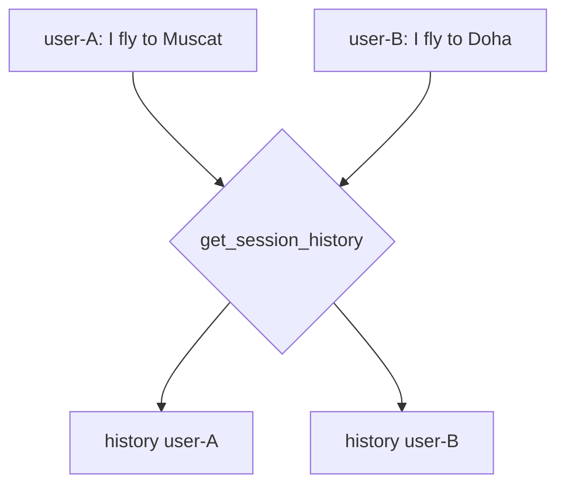
Question: after both calls, how many messages are in history user-A, and does it contain "Doha"?

**B4 (predict, Restart Test).** The store is a plain in-memory dict. A user chats 6 turns, the Replit app restarts, the user sends turn 7 asking "what did I say first?" What happens, and which axis (WHO / HOW / WHERE) is responsible?

**B5 (small fresh-code).** Write a corrected `get_session_history` that also caps memory by clearing a session once it exceeds 50 messages before returning it. Signature stays the same.

Facilitator note: B1 and B4 are the anchors. B1 is a WHO bug, B4 is a WHERE bug. If the room only remembers two things from this activity, make it those two axis labels.

---

## Activity B key (reveal on close)

| Q | Answer |
|---|--------|
| B1 | session id is hardcoded; fix: `"session_id": user_id` (a real per-user value) |
| B2 | placeholder name `chat_history` does not match `history_messages_key="history"`; and `input_messages_key="question"` does not match the `{input}` slot |
| B3 | user-A history has 1 message and does not contain "Doha"; the factory keeps them isolated by id |
| B4 | in-memory dict is wiped on restart, so turn 1 is gone and the bot cannot answer; WHERE axis (non-durable storage) |
| B5 | see snippet below |

```python
def get_session_history(session_id: str) -> BaseChatMessageHistory:
    if session_id not in store:
        store[session_id] = InMemoryChatMessageHistory()
    h = store[session_id]
    if len(h.messages) > 50:
        h.clear()
    return h
```

---

# Segment 9
## Session IDs and Replit

WHO axis in depth, then the deployment reality that makes or breaks all of the above.

---

## What should the session id actually be?

The id decides who shares a memory. Choose it on purpose.

Session ID Design Matrix:

| Key choice | Memory scope | Good for | Watch out |
|------------|--------------|----------|-----------|
| Per browser tab (random UUID) | one tab | quick demos | new tab loses history |
| Per logged-in user | all that user's chats merge | personal assistants | one long ever-growing history |
| Per user + conversation | one thread per user | support tools, most apps | you must generate and track thread ids |
| Per API key or tenant | whole org shares | shared team bot | cross-user leakage risk |

Default recommendation for real apps: `user_id + ":" + conversation_id`. It isolates people and lets one person keep separate threads.

Thought question for the room: if your session id is guessable (like an email), what stops user B from reading user A's history by passing A's id? Answer: nothing at the memory layer. Ids must be treated as access-controlled, not just labels.

---

## Session id, one call in one picture

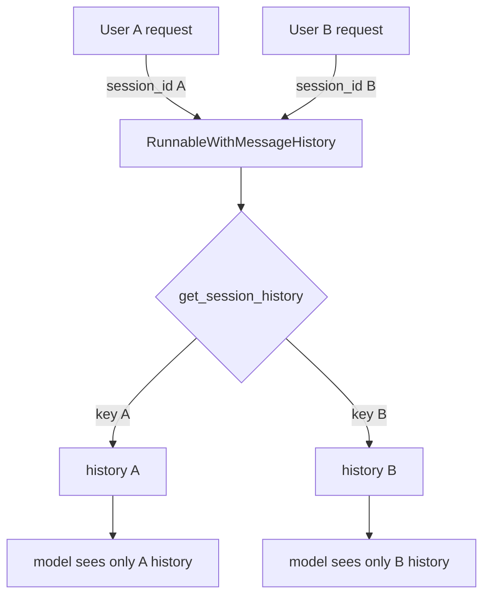

The id is the routing key. Everything downstream is isolated by it. Get the id wrong and you either leak or forget.

---

## Replit reality check

Replit runs your Python app and injects secrets as environment variables. The two facts that matter most for memory:

Secrets:

| Fact | Detail |
|------|--------|
| Where keys go | Secrets pane (lock icon), encrypted at rest |
| How to read them | `os.environ["ANTHROPIC_API_KEY"]` or `os.getenv(...)` |
| The classic trap | workspace secrets are separate from deployment secrets; you must add them again in the Deployments pane, or the deployed app reads `None` and crashes |

That trap is the answer to cold-open Q8: the app worked in the workspace, then crashed deployed, because the secret was never added on the deployment side.

```python
import os

api_key = os.environ.get("ANTHROPIC_API_KEY")
if not api_key:
    raise RuntimeError("Missing ANTHROPIC_API_KEY. Add it in the Deployments Secrets pane, not only the workspace.")

is_deployed = os.getenv("REPLIT_DEPLOYMENT") == "1"
```

---

## Replit and the in-memory trap

This is where the whole module converges. Your `store = {}` dict lives in RAM on a Replit instance. Two ways it betrays you:

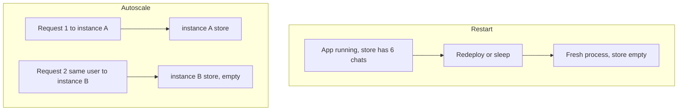

| Trap | What the user sees | Root cause |
|------|--------------------|-----------|
| Restart wipes RAM | "it forgot everything overnight" | non-durable WHERE |
| Autoscale spreads requests | "it forgets randomly, works sometimes" | multiple instances, unshared WHERE |

Single-instance deploys (Reserved VM) hide the second trap while running, so the bug looks fixed in testing and returns under real traffic. That is the cruel version.

---

## The Restart Test as a gate

Before shipping any memory setup, ask one question:

> If this process restarts right now, does the user's history survive?

- Answer "no" to that question means you have a dev toy, ship it only for demos
- Answer "yes" means storage is external to the process, you are production-shaped

Where each rung lands on the test:

| Storage | Survives restart? | Survives multi-instance? |
|---------|-------------------|--------------------------|
| In-memory dict | No | No |
| SQLite file on disk | Yes on one instance | No |
| Redis | Yes | Yes |
| Postgres | Yes | Yes |

---

## The Persistence Ladder (roadmap)

Climb only as high as your needs require. Do not start at the top for a prototype, do not stay at the bottom in production.

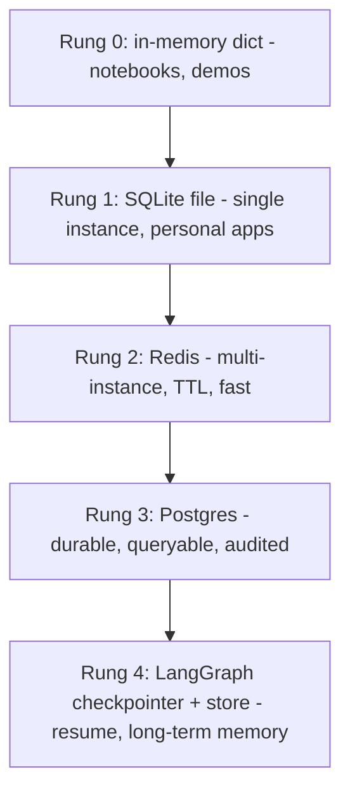

| Rung | Reach for it when | Cost of moving up |
|------|-------------------|-------------------|
| 0 | you are learning or demoing | none |
| 1 | one instance, you want survival across restarts | swap the history class, keep the factory |
| 2 | you autoscale and need shared, expiring memory | run Redis, point history at it |
| 3 | you need durability, queries, compliance | run Postgres, schema for messages |
| 4 | you need crash-resume, branching, cross-thread facts | adopt LangGraph persistence |

The kind design property: because RWMH takes a factory, moving from Rung 0 to Rung 2 changes one function body, not your chain. The 3-Axis model pays off here, WHERE moves while HOW and WHO stay put.

---

## Implementation checklist (pin this)

Session isolation and deployment, the short list that prevents the top bugs:

- Session id is a real per-user or per-conversation value, never a constant
- Session ids are treated as access-controlled, not guessable labels
- `history_messages_key` matches the `MessagesPlaceholder` variable name exactly
- `input_messages_key` matches your input dict slot
- Secrets are added in both workspace and Deployments panes
- Storage passes the Restart Test for your target environment
- If you autoscale, storage is external to the process (Rung 2 or higher)
- History has a cap or trim, so The Replay Tax stays bounded

---

# Segment 10
## Forward view and recap

Where this is heading, then prove you own it.

---

## Forward view: RWMH today, LangGraph next

RWMH is correct and supported for single-chain memory. The industry direction for stateful agents is LangGraph persistence, and it is worth knowing why before you need it.

| Dimension | RunnableWithMessageHistory | LangGraph persistence |
|-----------|----------------------------|-----------------------|
| Identity key | `session_id` | `thread_id` |
| Storage abstraction | chat message history | checkpointers (short-term) + stores (long-term) |
| Best fit | one chain, chat history | multi-step agents, branching, tools |
| Crash resume | not built in | built in, resume from last checkpoint |
| Human-in-the-loop | manual | first-class support |
| Long-term cross-thread facts | roll your own | stores handle it |

Decision rule:

- Building a chat chain that just needs to remember the conversation, use RWMH
- Building an agent with tools, steps, approvals, or resume-after-failure, reach for LangGraph

The mental model transfers cleanly: `session_id` becomes `thread_id`, the notepad becomes a checkpoint, Store-Retrieve-Inject becomes save-checkpoint and restore-checkpoint. Same Goldfish Principle underneath.

---

## Connect all the dots

One diagram for the whole hour:

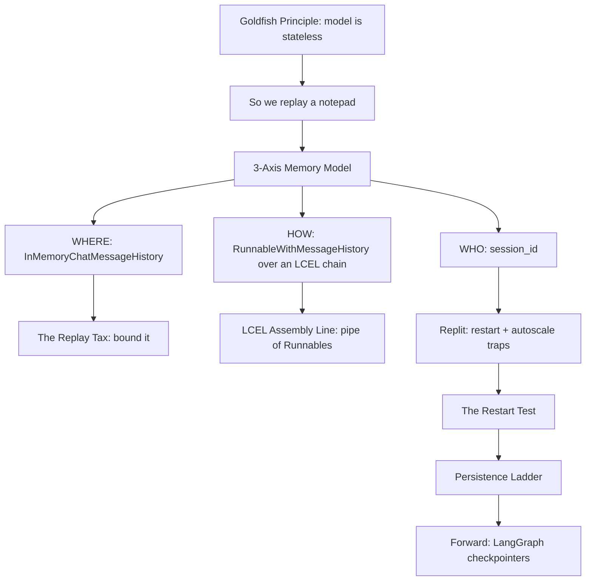

If you can narrate this diagram top to bottom, you own the module.

---

## Recap quiz

Language: Python • Topics: full module • Level: Intermediate

15 items, mixed formats. Reveal answers after each cluster.

---

## Recap: Q1 to Q6

**R1 (single-select).** The real reason a chatbot "remembers" is:
- (a) the model stores state between calls
- (b) the app re-sends past turns as tokens each call
- (c) the API keeps a session on the server
- (d) fine-tuning on the conversation

**R2 (code-reading).** In `prompt | model | StrOutputParser()`, the model station receives:
- (a) a raw dict
- (b) formatted chat messages from the prompt
- (c) a plain string
- (d) the parser's output

**R3 (matching).** Match term to axis. One distractor.

| Term | |
|------|-|
| 1. session_id | |
| 2. RunnableWithMessageHistory | |
| 3. InMemoryChatMessageHistory | |

Bank: (A) WHERE, (B) HOW, (C) WHO, (D) the model's internal memory

**R4 (true/false, pick).** "Reserved VM single-instance deploy makes an in-memory dict production-safe against restarts."
- True
- False

**R5 (predict).** Same code, `session_id="team"` for all 40 users. User 3 says "my card ends 1234." User 40 asks "what is my card?" Result?

**R6 (spot-the-wrong-arrow).** One arrow breaks RWMH flow. Which tag?
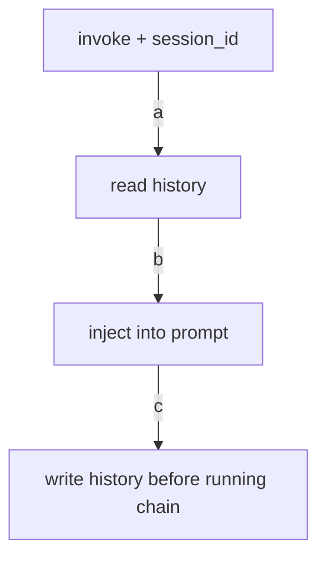

---

## Recap: Q1 to Q6 key

| Q | Answer |
|---|--------|
| R1 | b |
| R2 | b |
| R3 | 1-C, 2-B, 3-A; D is the distractor |
| R4 | False; a redeploy still wipes RAM |
| R5 | user 40 sees card 1234; all share one history, a WHO-axis leak |
| R6 | tag c; write happens after running the chain, not before |

---

## Recap: Q7 to Q11

**R7 (ordering, shuffled).** Put the Persistence Ladder in order, lowest to highest durability:
- SQLite file
- LangGraph checkpointer
- in-memory dict
- Redis
- Postgres

**R8 (debugging, one-line fix).** History never appears in the prompt. Placeholder is `MessagesPlaceholder(variable_name="history")`. Wiring is `history_messages_key="messages"`. Fix in one line.

**R9 (multi-select).** Which pass The Restart Test (survive a process restart)? Pick all.
- (a) in-memory dict
- (b) SQLite on disk
- (c) Redis
- (d) module-level Python list

**R10 (case).** Works in Replit workspace, crashes on deploy reading the API key as None. One-sentence root cause and one-sentence fix.

**R11 (trace, numeric).** Start with empty history for `user-9`. Run these:
```python
chat.invoke({"input": "A"}, config={"configurable": {"session_id": "user-9"}})
chat.invoke({"input": "B"}, config={"configurable": {"session_id": "user-9"}})
```
How many messages are in user-9's history now? (count human and AI turns)

---

## Recap: Q7 to Q11 key

| Q | Answer |
|---|--------|
| R7 | in-memory dict, SQLite file, Redis, Postgres, LangGraph checkpointer |
| R8 | change wiring to `history_messages_key="history"` (match the placeholder) |
| R9 | b and c pass; a and d are wiped on restart |
| R10 | secret exists only in the workspace pane; add it in the Deployments Secrets pane |
| R11 | 4 messages: human A, AI reply, human B, AI reply |

---

## Recap: Q12 to Q15

**R12 (small fresh-code).** Write a minimal `get_session_history(session_id)` using `InMemoryChatMessageHistory` and a global `store` dict.

**R13 (single-select).** You are building an agent with tools, approvals, and resume-after-crash. Best fit?
- (a) RunnableWithMessageHistory
- (b) a bigger in-memory dict
- (c) LangGraph persistence
- (d) hardcode the history

**R14 (multi-select).** Symptoms of The Replay Tax on a long chat. Pick all.
- (a) rising per-turn cost
- (b) growing latency
- (c) eventual context-window overflow
- (d) the model changing personality

**R15 (synthesis, one sentence).** Explain the Goldfish Principle and why it forces Store-Retrieve-Inject, in one sentence, to a new teammate.

---

## Recap: Q12 to Q15 key

| Q | Answer |
|---|--------|
| R12 | see snippet below |
| R13 | c |
| R14 | a, b, c; d is not a memory symptom |
| R15 | the model keeps no state between calls, so to give it memory we store past turns, retrieve them, and inject them into the next prompt so it re-reads the conversation |

```python
store: dict[str, BaseChatMessageHistory] = {}

def get_session_history(session_id: str) -> BaseChatMessageHistory:
    if session_id not in store:
        store[session_id] = InMemoryChatMessageHistory()
    return store[session_id]
```

---

## Close: the five things to keep

| Keep this | So that |
|-----------|---------|
| Goldfish Principle | you never expect the model to remember on its own |
| LCEL Assembly Line | you can wire and rewire chains with confidence |
| 3-Axis Memory Model | you debug memory by isolating WHO, HOW, WHERE |
| The Restart Test | you never ship a dev-toy store as production |
| Persistence Ladder | you climb storage only as far as you need |

Callback to cold-open Q10: "adding memory" is Store, Retrieve, Inject, keyed by identity, held in storage that survives what your deployment throws at it. That is the whole game.

Next module preview: bounding The Replay Tax with trimming and summarization, then climbing to LangGraph checkpointers for agents that resume after a crash.
