# Mechanics of LLM Memory

### Build it by hand, watch it break, then let LangChain carry it

LCEL • InMemoryChatMessageHistory • RunnableWithMessageHistory • Session IDs • Replit • Production memory

Format: each `---` is a slide. Facilitator notes use durations only. Every concept is introduced as a field incident first, then explained, then made production-grade.

---

## The spine: you are the engineer in the room

You are a GenAI engineer (Forward Deployed) sitting at an airline client. You shipped a customer support copilot two weeks ago.

| Character  | Who                                                                                |
| ---------- | ---------------------------------------------------------------------------------- |
| You        | the GenAI engineer / FDE who owns the copilot                                      |
| Rao        | a real customer using the copilot: Gold tier, PNR JX48Q2, BLR to DEL leg cancelled |
| Head of CX | the client stakeholder who reports every bug straight to you                       |

The whole session is a sequence of bug reports from the Head of CX. Each bug has a root cause, a named diagnosis, and a fix. By the end you can build memory that survives real traffic, not just a demo.

Two lenses run in parallel, because you will answer to both:

| Engineer view                     | PM view                                    |
| --------------------------------- | ------------------------------------------ |
| Does the code remember correctly? | What does one conversation cost?           |
| Is it thread-safe and isolated?   | Are two customers ever mixed? (compliance) |
| Does it survive a restart?        | What is the p95 latency the SLA promises?  |

---

## Run of show (105 min)

| #   | Segment                                               | Duration | Type             |
| --- | ----------------------------------------------------- | -------- | ---------------- |
| 1   | Cold-open quiz (problem first)                        | 9        | Quiz, no reveal  |
| 2   | The stateless wall + live demo                        | 8        | Concept          |
| 3   | Build memory by hand, watch it break                  | 13       | Code + failure   |
| 4   | Activity A: Fix the broken loop                       | 9        | Hands-on         |
| 5   | Refactor to LCEL + prompt template + placeholder      | 13       | Code             |
| 6   | The primitives: InMemory + RunnableWithMessageHistory | 11       | Code             |
| 7   | Session IDs and isolation                             | 7        | Concept          |
| 8   | Activity B: Instance Amnesia hunt                     | 11       | Debug            |
| 9   | Replit deploy: hot memory and the dictionary          | 9        | Concept + code   |
| 10  | Production depth: bloat, Replay Tax, KV cache         | 8        | Advanced         |
| 11  | Forward view + recap quiz                             | 7        | Synthesis + quiz |

---

## Your toolkit for the hour

Eight named tools. You will reach for each one by name during the session.

| Tool                   | One-line job                                        |
| ---------------------- | --------------------------------------------------- |
| Goldfish Principle     | why the model forgets at all                        |
| RAIL                   | the 4 steps every memory system runs                |
| 3-Axis Model           | how to debug any memory bug                         |
| Replay Tax             | what remembering costs, in tokens                   |
| Instance Amnesia       | why it forgets in production but not on your laptop |
| Restart Test           | one question that separates a toy from production   |
| Persistence Ladder     | the storage roadmap from demo to scale              |
| Prefix-First Prompting | how to earn the caching discount                    |

**RAIL** is the spine. Every memory system, from your 6-line hand-rolled loop to LangGraph, does these four in order:

| Step         | Meaning                                           |
| ------------ | ------------------------------------------------- |
| R - Retrieve | pull this user's past turns from storage          |
| A - Augment  | paste them into the prompt                        |
| I - Invoke   | call the model                                    |
| L - Log      | write the new question and answer back to storage |

Memory runs on RAILs. Miss a step and the train derails in a specific, predictable way. You will see all four derailments today.

---

## The territory (mind map)

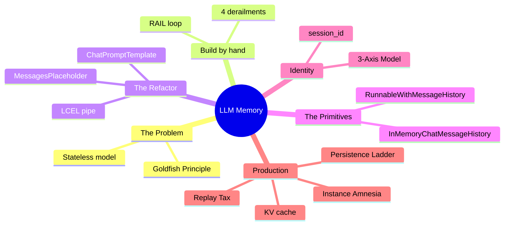

---

# Segment 1

## Cold-open quiz

Language: Python • Topics: statelessness, RAIL, LCEL, session isolation, production memory • Level: Warm-up to intermediate

Answer on gut. No reveal yet. Count how many you are unsure about. That count is today's target.

---

## Cold-open: Q1 to Q6

**Q1 (predict).** The copilot calls the model twice in one process:

```python
model.invoke("I am Rao, PNR JX48Q2.")
model.invoke("What is my PNR?")
```

What does call two answer, and why?

**Q2 (single-select).** When the copilot recalls Rao's PNR across turns, that recall physically lives in:

- (a) the model weights
- (b) the text you re-send on the next call
- (c) server-side session state tied to your API key
- (d) a cookie the API sets

**Q3 (code-reading).** In `chain = prompt | model | StrOutputParser()`, the `|` does what?

- (a) bitwise OR
- (b) feeds each stage's output into the next
- (c) runs all three in parallel
- (d) imports a plugin

**Q4 (spot the derailment).** This hand-rolled loop has a bug that gives the bot amnesia for its own answers. Which line is missing?

```python
def ask(text):
    messages.append(HumanMessage(text))
    reply = model.invoke(messages)
    return reply.content
```

**Q5 (production).** Your copilot works flawlessly on your laptop. In production it forgets customers at random, roughly one call in three. Most likely cause?

- (a) the model got dumber
- (b) three replicas behind a load balancer, each with its own in-memory store
- (c) rate limiting
- (d) the prompt is too long

**Q6 (true/false, pick).** "Prompt caching (KV cache reuse) makes the model actually remember the conversation, so you can stop re-sending history."

- True
- False

---

## Cold-open: Q7 to Q11

**Q7 (predict-the-output).** You hardcoded one session id for everyone:

```python
config = {"configurable": {"session_id": "default"}}
```

Rao tells the copilot "I am allergic to peanuts." Ten seconds later a different customer asks "what am I allergic to?" Result?

**Q8 (multi-select).** After a Replit process restart, which survive if history is a plain in-memory dict? Pick all.

- (a) messages from 2 minutes ago
- (b) rows in an external Postgres
- (c) values in the module-level dict
- (d) messages written to a SQLite file on disk

**Q9 (matching).** Match term to the RAIL step it automates. One distractor.

| Item                                               |     |
| -------------------------------------------------- | --- |
| 1. get_session_history                             |     |
| 2. MessagesPlaceholder                             |     |
| 3. RunnableWithMessageHistory appending both turns |     |

Bank: (A) Augment, (B) Retrieve, (C) Log, (D) Invoke

**Q10 (case).** The copilot works when you press Run in the Replit workspace. Deployed, it crashes on startup reading the API key as `None`. Nothing in the code changed. Single most likely cause?

**Q11 (provocative, discuss).** If the model has no memory of its own, what exactly are you building when you "add memory"? One sentence, before we start.

Facilitator note (2 min): hands up for the unsure-count. No reveals. Park Q11 on the board. Every answer gets earned by a later slide.

---

# Segment 2

## The stateless wall

Incident 0. Demo day. Rao types three messages. On the third, the copilot asks for his PNR again. The Head of CX: "It just forgot him mid-chat. Fix this."

---

## The Goldfish Principle

> Every call to an LLM is stateless. The model is a goldfish: it wakes up, reads only the page in front of it, answers, forgets everything the instant it finishes.

Concretely:

- Zero state is kept between two API calls
- The model does not know what it said 5 seconds ago
- Two calls in one script are as unrelated as two calls from two strangers
- The API is a pure function: same input tokens in, same output distribution

So memory is never inside the fish. Memory is the notepad you clip to the bowl and read aloud, in full, every single call.

Skeptic's corner: "ChatGPT clearly remembers my last message." Correct, and that product is doing exactly what you are about to build: re-sending prior turns as text on every call. The remembering lives in the plumbing, not the model.

---

## Stateless vs stateful, one picture

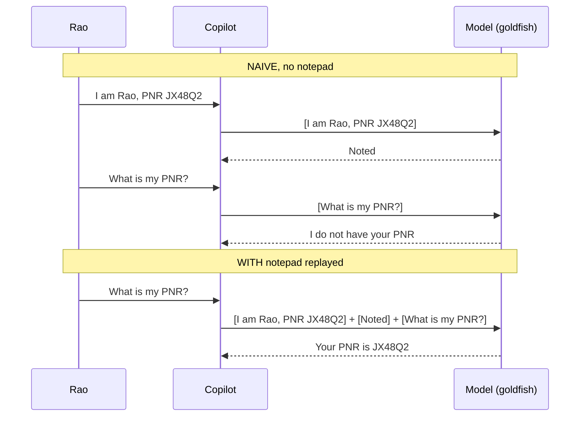

Same model. Same goldfish. The only difference is what the Copilot chose to put in the brackets.

---

## Reframing Q11: memory decodes to RAIL

"Adding memory" is not one mysterious feature. It is four plain steps:

| RAIL step | Plain words           | If you skip it              |
| --------- | --------------------- | --------------------------- |
| Retrieve  | fetch past turns      | nothing to remember         |
| Augment   | paste into the prompt | model never sees the past   |
| Invoke    | call the model        | no answer                   |
| Log       | save the new exchange | next turn forgets this turn |

Every memory tool in the ecosystem, from a 6-line loop to LangGraph checkpointers, is a fancier RAIL. Hold that and the rest of the hour is just implementation detail.

---

## Anticipated questions (Segment 2)

| Q                                              | Short answer                                                                                 |
| ---------------------------------------------- | -------------------------------------------------------------------------------------------- |
| Does temperature or a bigger model add memory? | No. Statelessness is architectural, not a setting. A larger goldfish is still a goldfish.    |
| Do system prompts persist across calls?        | Only if you re-send them. The system message is part of the notepad, not stored server-side. |
| Is there any per-key server memory?            | No conversational memory. The API does not stitch your calls together for you.               |

---

# Segment 3

## Build memory by hand, then watch it break

Incident 1. Before reaching for any library, you build the notepad yourself. This is the fastest way to understand what every tool is quietly doing for you, and exactly where things snap.

---

## The RAIL loop, hand-rolled

```python
from langchain_anthropic import ChatAnthropic
from langchain_core.messages import HumanMessage, AIMessage, SystemMessage

model = ChatAnthropic(model="claude-haiku-4-5-20251001", temperature=0)

messages = [SystemMessage("You are a concise airline support agent.")]

def ask(user_text):
    messages.append(HumanMessage(user_text))   # part of Log (user side)
    reply = model.invoke(messages)             # Augment happens here (full list) + Invoke
    messages.append(reply)                     # Log (AI side)
    return reply.content

ask("I am Rao, PNR JX48Q2, Gold tier.")
ask("My BLR to DEL leg was cancelled. Options?")
ask("Remind me, what is my PNR?")   # answers JX48Q2, because we logged every turn
```

Bootcamp swap: same loop on the AWS path with `ChatBedrockConverse(model="us.anthropic.claude-haiku-4-5-20251001-v1:0", region_name="us-east-1")`. The loop does not change.

Line-by-line:

| Line                                 | What                              | Why                                                    |
| ------------------------------------ | --------------------------------- | ------------------------------------------------------ |
| `messages = [SystemMessage(...)]`    | the notepad starts with the rules | system message rides in the list, not stored elsewhere |
| `messages.append(HumanMessage(...))` | add the new question              | so the model sees it                                   |
| `model.invoke(messages)`             | send the whole notepad            | Augment + Invoke in one call                           |
| `messages.append(reply)`             | write the answer back             | so the next turn remembers it                          |

This works. Now break it four ways, on purpose.

---

## Derailment 1: skip the Log of the AI turn

```python
def ask(user_text):
    messages.append(HumanMessage(user_text))
    reply = model.invoke(messages)
    # messages.append(reply)   <-- removed
    return reply.content
```

| Symptom                                                  | Root cause                         |
| -------------------------------------------------------- | ---------------------------------- |
| Bot re-asks for info it already gave, contradicts itself | it never sees its own past answers |

The model has amnesia for its own words. The `L` in RAIL is half-done. This is cold-open Q4.

---

## Derailment 2: wrong order

```python
def ask(user_text):
    reply = model.invoke(messages)          # invoked before adding the new question
    messages.append(HumanMessage(user_text))
    messages.append(reply)
    return reply.content
```

| Symptom                         | Root cause                                                   |
| ------------------------------- | ------------------------------------------------------------ |
| Every answer is one turn behind | Augment ran on stale history, before the new question landed |

An off-by-one across the whole conversation. Order inside RAIL is not optional.

---

## Derailment 3: one shared list for all customers

```python
messages = [SystemMessage("...")]   # module-level, shared by everyone
```

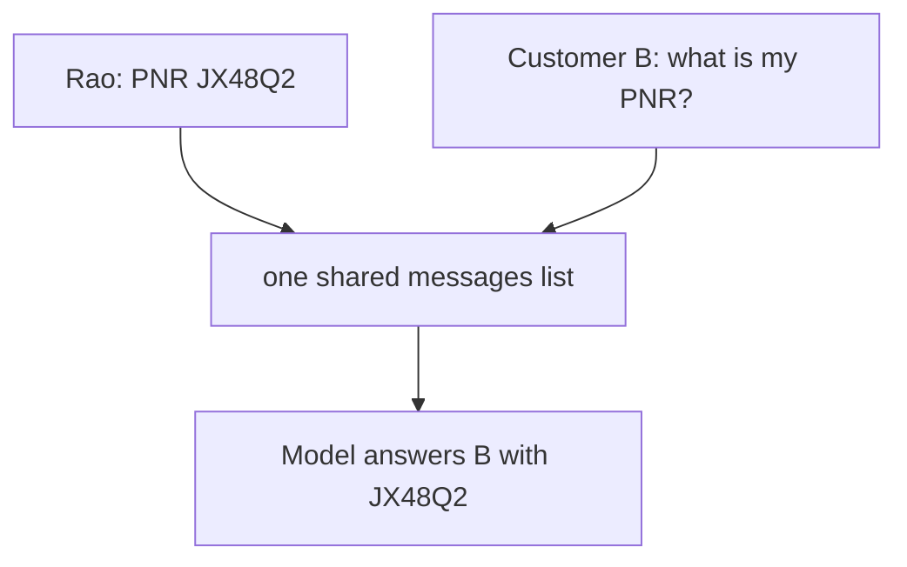

| Symptom                   | Root cause                                                   |
| ------------------------- | ------------------------------------------------------------ |
| Customer B sees Rao's PNR | no identity on the notepad, everyone writes to the same page |

This is a data-isolation incident, not a bug in tone. Session IDs exist to fix exactly this.

---

## Derailment 4: flatten history to a string, lose the roles

```python
history_str = "\n".join(m.content for m in messages)
reply = model.invoke("History:\n" + history_str + "\nUser: " + user_text)
```

| Symptom                                                                                | Root cause                                         |
| -------------------------------------------------------------------------------------- | -------------------------------------------------- |
| Model treats its own past replies as user commands, gets confused about who wants what | roles were thrown away, everything became one blob |

Roles carry meaning. A `HumanMessage` and an `AIMessage` are not interchangeable text. This is precisely why `MessagesPlaceholder` exists: it keeps role-typed messages intact instead of smashing them into a string.

---

## The four derailments map to the four fixes

This is the bridge to everything that follows. Each hand-rolled failure has a named tool that removes it.

| Derailment                   | The tool that fixes it                             |
| ---------------------------- | -------------------------------------------------- |
| 1. Forgot to Log the AI turn | RunnableWithMessageHistory logs both turns for you |
| 2. Wrong order               | RunnableWithMessageHistory owns the ordering       |
| 3. Shared list, cross-talk   | session_id plus a per-session store                |
| 4. Roles flattened           | MessagesPlaceholder preserves role-typed history   |

You are not learning four random APIs. You are buying back four specific failures.

---

## Anticipated questions (Segment 3)

| Q                                               | Short answer                                                                                                             |
| ----------------------------------------------- | ------------------------------------------------------------------------------------------------------------------------ |
| Why not just build it by hand in production?    | You can, and you will get all four derailments plus concurrency bugs. The library is four bugs you do not have to write. |
| Is appending to a Python list the real storage? | For now, yes, in RAM. That is the weak point we upgrade in Segment 9.                                                    |
| Does the order of system vs history matter?     | Yes. System first, history next, new input last. This ordering also unlocks caching later.                               |

---

# Segment 4

## Activity A: Fix the broken loop

Language: Python • Topics: RAIL, message roles, isolation • Level: Warm-up

Pairs. 9 min. On paper, no running.

---

## Activity A tasks

**A1 (debugging, one-line fix).** This loop gives the bot amnesia for its own replies. Add the one missing line.

```python
def ask(text):
    messages.append(HumanMessage(text))
    reply = model.invoke(messages)
    return reply.content
```

**A2 (predict).** Trace this exact sequence and say what call three returns.

```python
messages = [SystemMessage("Airline support.")]
ask("I am Rao, PNR JX48Q2.")
ask("Cancel my BLR-DEL leg.")
ask("What did I just ask you to cancel?")
```

**A3 (spot-the-derailment).** Which RAIL step is wrong here, and what is the visible symptom?

```python
def ask(text):
    reply = model.invoke(messages)
    messages.append(HumanMessage(text))
    messages.append(reply)
    return reply.content
```

**A4 (small fresh-code).** Two customers keep leaking into each other. Write two lines that give each customer their own `messages` list keyed by a `customer_id` (a dict is fine).

**A5 (multi-select).** Which are true about message roles? Pick all.

- (a) HumanMessage and AIMessage are interchangeable text
- (b) flattening to a string loses role information
- (c) MessagesPlaceholder preserves role-typed messages
- (d) SystemMessage must be re-sent every call to take effect

Facilitator note (2 min close): take A3 and A4 out loud. A3 is the off-by-one, A4 previews the per-session store.

---

## Activity A key (reveal on close)

| Q   | Answer                                                                                                    |
| --- | --------------------------------------------------------------------------------------------------------- |
| A1  | `messages.append(reply)` after the invoke                                                                 |
| A2  | it returns "the BLR-DEL leg", because all turns were logged                                               |
| A3  | Augment ran before the new question was added, so every answer is one turn behind                         |
| A4  | `store = {}` then inside: `messages = store.setdefault(customer_id, [SystemMessage("Airline support.")])` |
| A5  | b, c, d true; a false                                                                                     |

---

# Segment 5

## Refactor to LCEL

Incident 2. Your hand-rolled loop grew to 40 lines with formatting, ordering, and per-user plumbing tangled together. Every change risks a derailment. Time to let LangChain own the wiring. That is LCEL.

---

## What LCEL is, and the one idea that unlocks it

LCEL is the pipe (`|`) syntax for gluing components into a chain.

> Every LangChain building block is a Runnable, and every Runnable speaks the same verbs. The pipe connects them.

| Verb                             | Meaning                |
| -------------------------------- | ---------------------- |
| `invoke(x)`                      | run once               |
| `batch([x, y])`                  | run many               |
| `stream(x)`                      | run once, yield chunks |
| `ainvoke` / `abatch` / `astream` | async versions         |

Because the interface is uniform, you can snap stations together in any order and the joint is always the same shape.

---

## The LCEL Assembly Line

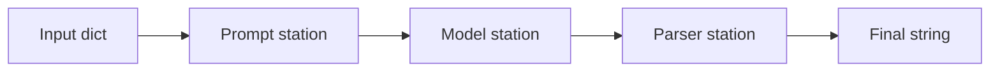

- The belt is the `|`
- Each station is a Runnable
- A station takes the box, does one job, hands it on
- Swap or reorder stations without rewiring the belt

```python
from langchain_anthropic import ChatAnthropic
from langchain_core.prompts import ChatPromptTemplate
from langchain_core.output_parsers import StrOutputParser

prompt = ChatPromptTemplate.from_messages([
    ("system", "You are a concise airline support agent."),
    ("human", "{input}"),
])
model = ChatAnthropic(model="claude-haiku-4-5-20251001", temperature=0)

chain = prompt | model | StrOutputParser()
chain.invoke({"input": "One carry-on tip for a Gold tier flyer."})
```

---

## Chat prompt template and the history slot

The hand-rolled loop kept history in a raw list. LCEL keeps it in the prompt, in a dedicated slot that preserves roles. That slot is `MessagesPlaceholder`.

```python
from langchain_core.prompts import ChatPromptTemplate, MessagesPlaceholder

prompt = ChatPromptTemplate.from_messages([
    ("system", "You are a concise airline support agent."),
    MessagesPlaceholder(variable_name="history"),   # role-typed past turns land here
    ("human", "{input}"),
])
```

What each part earns you:

| Part                             | Job                           | Derailment it removes                     |
| -------------------------------- | ----------------------------- | ----------------------------------------- |
| `("system", ...)`                | the standing rules            | none, but keep it first for caching later |
| `MessagesPlaceholder("history")` | inject role-typed past turns  | Derailment 4 (roles flattened)            |
| `("human", "{input}")`           | the new question, always last | keeps ordering clean (Derailment 2)       |

Notice the shape: system, then history, then the new input. That order matters for correctness now and for caching in Segment 10.

---

## Line-by-line walkthrough

| Line                             | What                                | Why                                       | Syntax note                          |
| -------------------------------- | ----------------------------------- | ----------------------------------------- | ------------------------------------ |
| `from_messages([...])`           | build a prompt from role/text pairs | roles stay explicit                       | each tuple is`(role, template)`      |
| `MessagesPlaceholder("history")` | reserve a slot for past messages    | history stays role-typed, not stringified | name must match the wiring key later |
| `ChatAnthropic(...)`             | the model station                   | only station that calls the LLM           | `temperature=0` for repeatable demos |
| `StrOutputParser()`              | unwrap the reply to plain text      | downstream code gets a`str`               | no args                              |
| `prompt \| model \| parser`      | weld into one Runnable              | one object to invoke, batch, stream       | left-to-right flow                   |

Runtime: the input dict fills the slots, the filled prompt becomes role-typed messages, the model answers, the parser returns a string. RAIL's Augment and Invoke now live inside the chain. Retrieve and Log still need an owner. That owner is next.

---

## Anticipated questions (Segment 5)

| Q                                                          | Short answer                                                                                                        |
| ---------------------------------------------------------- | ------------------------------------------------------------------------------------------------------------------- |
| Is `                                                       | ` real Python?                                                                                                      |
| Difference between a string prompt and ChatPromptTemplate? | The chat template keeps roles and a real history slot. A string prompt collapses everything, which is Derailment 4. |
| Can I stream the whole chain?                              | Yes,`stream()` works on the composed chain, not just the model.                                                     |

---

# Segment 6

## The primitives: InMemory and RunnableWithMessageHistory

Incident 3. The chain answers well but forgets between turns, because nobody is doing Retrieve or Log yet. You add the two primitives that own those steps.

---

## InMemoryChatMessageHistory: the storage (WHERE)

A tiny object that holds an ordered list of role-typed messages in RAM. That is all.

```python
from langchain_core.chat_history import InMemoryChatMessageHistory

h = InMemoryChatMessageHistory()
h.add_user_message("I am Rao, PNR JX48Q2.")
h.add_ai_message("Noted, Rao.")
h.messages
# [HumanMessage("I am Rao, PNR JX48Q2."), AIMessage("Noted, Rao.")]
```

| Member                    | Job                    |
| ------------------------- | ---------------------- |
| `.messages`               | the stored list        |
| `.add_user_message(text)` | append a human turn    |
| `.add_ai_message(text)`   | append an AI turn      |
| `.add_messages([...])`    | append a batch         |
| `.clear()`                | wipe this conversation |
| `.aget_messages()`        | async read             |

It is a list with manners. Apply the Restart Test: if the process restarts, does this survive? No. So it is a dev-time store. Remember that verdict for Segment 9.

---

## One store, many customers (why a dictionary)

One history holds one conversation. You have many customers, so you need O(1) lookup from an id to that customer's history. The natural data structure for id to value with instant lookup is a hash map, a Python dict.

```python
from langchain_core.chat_history import BaseChatMessageHistory, InMemoryChatMessageHistory

store: dict[str, BaseChatMessageHistory] = {}

def get_session_history(session_id: str) -> BaseChatMessageHistory:
    if session_id not in store:
        store[session_id] = InMemoryChatMessageHistory()
    return store[session_id]
```

Why a dict, stated for the room:

| Property     | Payoff                                                  |
| ------------ | ------------------------------------------------------- |
| key to value | session id maps straight to that customer's notepad     |
| O(1) lookup  | no scanning, instant fetch each turn                    |
| lives in RAM | "hot memory", fast reads and writes, no disk or network |

The catch, stated honestly: a plain dict is single-process, not thread-safe under heavy concurrency, has no expiry, and grows forever. Redis is, in one line, this same dict moved out of your process onto a shared server with expiry and eviction. That is the upgrade path.

---

## RunnableWithMessageHistory: the wiring (HOW)

This wrapper owns Retrieve and Log so you never hand-roll RAIL again.

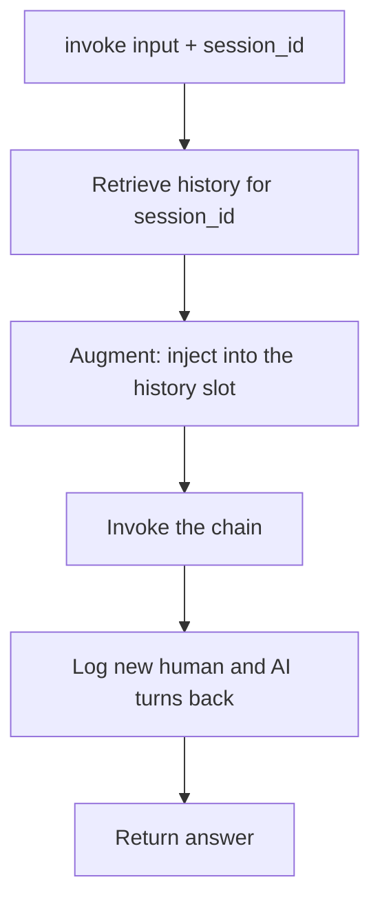

You write the chain. The wrapper writes the RAIL loop around it.

```python
from langchain_core.runnables.history import RunnableWithMessageHistory

chain = prompt | model | StrOutputParser()

copilot = RunnableWithMessageHistory(
    chain,
    get_session_history,
    input_messages_key="input",
    history_messages_key="history",
)
```

| Argument                         | What                                  | Must be right because                                     |
| -------------------------------- | ------------------------------------- | --------------------------------------------------------- |
| `chain`                          | your LCEL chain                       | the thing being wrapped                                   |
| `get_session_history`            | the dict-backed factory               | the wrapper calls it with the session id to fetch storage |
| `input_messages_key="input"`     | which input key is the new user text  | the wrapper logs it as the human turn                     |
| `history_messages_key="history"` | which prompt slot receives past turns | must equal the`MessagesPlaceholder` name                  |

The classic silent failure: `history_messages_key` does not match the placeholder's `variable_name`. History gets fetched, dropped into a slot that does not exist, and the bot "forgets". That is a HOW-axis bug, not a model bug.

---

## Invoking with a session

```python
copilot.invoke(
    {"input": "I am Rao, PNR JX48Q2, Gold tier."},
    config={"configurable": {"session_id": "cust-rao"}},
)
copilot.invoke(
    {"input": "What is my PNR?"},
    config={"configurable": {"session_id": "cust-rao"}},
)
# Answers JX48Q2, because both calls share session cust-rao
```

What the wrapper does on call two:

| Step     | Action                                                                                |
| -------- | ------------------------------------------------------------------------------------- |
| Retrieve | reads session cust-rao, calls`get_session_history`, gets the history holding turn one |
| Augment  | injects those messages into the`history` slot                                         |
| Invoke   | runs the chain, model now sees the PNR                                                |
| Log      | appends the new question and answer to cust-rao                                       |

Change the session id and you get a clean, empty conversation. Same id, continuity. That is the entire trick, and it is Derailments 1, 2, and 4 gone in one wrapper.

---

## Anticipated questions (Segment 6)

| Q                                              | Short answer                                                                                                                                       |
| ---------------------------------------------- | -------------------------------------------------------------------------------------------------------------------------------------------------- |
| Is RunnableWithMessageHistory deprecated?      | No. LangChain's own guidance: existing code keeps working, no deprecation planned. The old ConversationBufferMemory family is what got deprecated. |
| Where do I swap in Redis?                      | Return a Redis-backed history from`get_session_history`. The chain and wrapper do not change.                                                      |
| What if my chain returns a dict, not a string? | Add`output_messages_key` so the wrapper knows which key to log.                                                                                    |
| Does this trim old messages?                   | No. It stores everything. Trimming is Segment 10, and you will want it.                                                                            |

---

# Segment 7

## Session IDs and isolation

Incident 4 (setup). The Head of CX asks the question that decides your compliance story: "Can two customers ever see each other's chat?" The answer depends entirely on the session id.

---

## The session id is the routing key

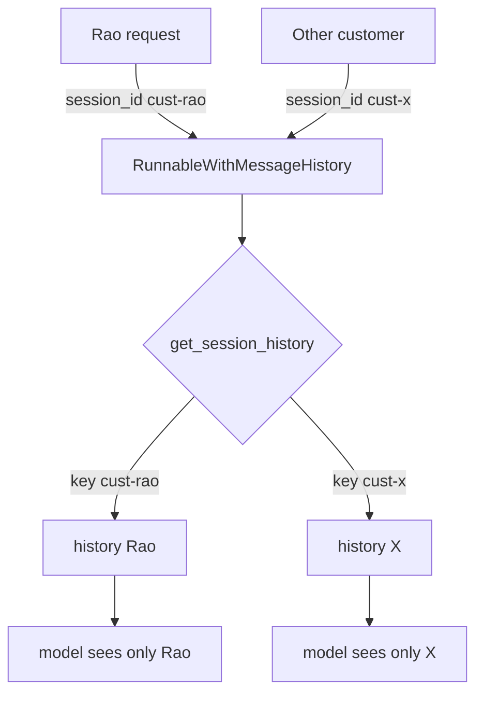

Everything downstream is isolated by the id. Get the id wrong and you either leak (Derailment 3) or forget.

---

## Session ID Design Matrix

The id decides who shares a memory. Choose it on purpose.

| Key choice                    | Memory scope                    | Good for                 | Watch out                         |
| ----------------------------- | ------------------------------- | ------------------------ | --------------------------------- |
| Per browser tab (random UUID) | one tab                         | quick demos              | new tab loses history             |
| Per logged-in customer        | all that customer's chats merge | personal copilots        | one ever-growing history          |
| Per customer + conversation   | one thread per customer         | support tools, most apps | you generate and track thread ids |
| Per tenant or API key         | whole org shares                | shared team bot          | cross-user leakage risk           |

Default for a real client copilot: `customer_id + ":" + conversation_id`. It isolates people and lets one person keep separate threads.

Skeptic's corner: if your session id is guessable, like a bare email, what stops customer B from reading Rao's history by passing Rao's id? Nothing at the memory layer. Ids are access-controlled keys, not friendly labels. Treat a session id like a password to a conversation.

| Engineer view               | PM view                                                   |
| --------------------------- | --------------------------------------------------------- |
| id keys the store correctly | two customers never mix, so the data-privacy clause holds |
| collisions cause leaks      | a single leak is an incident report, not a bug ticket     |

---

# Segment 8

## Activity B: Instance Amnesia hunt

Language: Python • Topics: session isolation, storage lifetime, replicas • Level: Intermediate

Pairs. 11 min. Real production bugs. Find the bad line, give a one-line fix.

---

## Activity B tasks

**B1 (debugging, one-line fix).** Every customer shares one conversation. Find the bug, fix in one line.

```python
config = {"configurable": {"session_id": "default"}}
copilot.invoke({"input": user_text}, config=config)
```

**B2 (code review).** Two lines are wrong. Name both.

```python
prompt = ChatPromptTemplate.from_messages([
    ("system", "Airline support."),
    MessagesPlaceholder(variable_name="chat_history"),
    ("human", "{input}"),
])
copilot = RunnableWithMessageHistory(
    chain,
    get_session_history,
    input_messages_key="question",
    history_messages_key="history",
)
```

**B3 (trace, numeric).** Sessions cust-rao and cust-x. Trace whose history each message lands in.

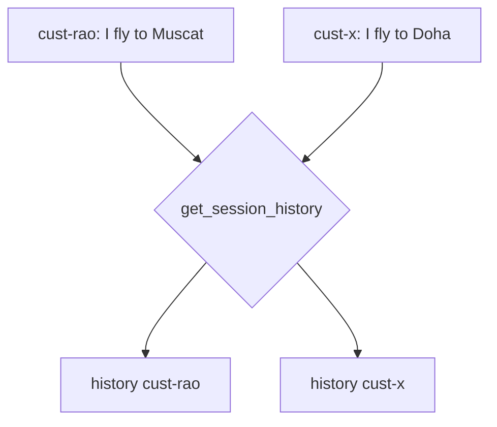

After both calls, how many messages are in cust-rao's history, and does it contain "Doha"?

**B4 (predict, Restart Test).** The store is a plain dict. Rao chats 6 turns, the Replit app redeploys, Rao sends turn 7 asking "what did I say first?" What happens, and which axis (WHO / HOW / WHERE) is responsible?

**B5 (the production one).** Your copilot runs on 3 autoscaled replicas behind a load balancer, each with its own in-memory dict. Rao's turn 1 hits replica A, turn 2 hits replica B. Describe what Rao experiences, name the failure, and give the one architectural fix.

Facilitator note: B4 and B5 are the anchors. B4 is a WHERE bug (non-durable). B5 is Instance Amnesia. If the room keeps two things, make it those.

---

## Activity B key (reveal on close)

| Q   | Answer                                                                                                                                                                                              |
| --- | --------------------------------------------------------------------------------------------------------------------------------------------------------------------------------------------------- |
| B1  | session id is hardcoded; fix:`"session_id": customer_id` (a real per-customer value)                                                                                                                |
| B2  | placeholder`chat_history` does not match `history_messages_key="history"`; and `input_messages_key="question"` does not match the `{input}` slot                                                    |
| B3  | cust-rao has 1 message and does not contain "Doha"; the factory isolates by id                                                                                                                      |
| B4  | the dict is wiped on redeploy, turn 1 is gone, the bot cannot answer; WHERE axis                                                                                                                    |
| B5  | Rao's turn 2 lands on a replica whose dict never saw turn 1, so the bot forgets him at random; this is Instance Amnesia; fix: move the store out of process to a shared backend (Redis or Postgres) |

---

# Segment 9

## Replit deploy: hot memory and the dictionary problem

Incident 5. You deploy the copilot to Replit. It forgets customers at random, roughly one call in three, and only in production. Your laptop never saw this. Welcome to Instance Amnesia.

---

## The 3-Axis Model: your debugging map

Every memory setup is three independent choices. Almost every memory bug is two of them tangled.


| Axis  | Question                           | Today's answer             | Upgrades                |
| ----- | ---------------------------------- | -------------------------- | ----------------------- |
| WHERE | where do messages live?            | in-memory dict             | SQLite, Redis, Postgres |
| HOW   | how does history reach the prompt? | RunnableWithMessageHistory | LangGraph checkpointer  |
| WHO   | whose history is this?             | session_id                 | thread_id, customer id  |

"The bot forgot" is usually WHO (wrong key) or WHERE (storage wiped or not shared), almost never the model. Keep the axes separate and bugs sort themselves.

---

## Replit secrets, and cold-open Q10

Replit runs your Python app and injects secrets as environment variables.

| Fact          | Detail                                                                                                                                               |
| ------------- | ---------------------------------------------------------------------------------------------------------------------------------------------------- |
| Where keys go | Secrets pane (lock icon), encrypted at rest                                                                                                          |
| How to read   | `os.environ["ANTHROPIC_API_KEY"]` or `os.getenv(...)`                                                                                                |
| The trap      | workspace secrets are separate from deployment secrets, you must add them again in the Deployments pane, or the deployed app reads`None` and crashes |

That trap is the answer to cold-open Q10: worked in the workspace, crashed deployed, because the secret was never added on the deployment side.

```python
import os

api_key = os.environ.get("ANTHROPIC_API_KEY")
if not api_key:
    raise RuntimeError("Missing ANTHROPIC_API_KEY. Add it in the Deployments Secrets pane, not only the workspace.")

is_deployed = os.getenv("REPLIT_DEPLOYMENT") == "1"
```

---

## Instance Amnesia, drawn

Your `store = {}` lives in the RAM of one process. Two forces break it in production.

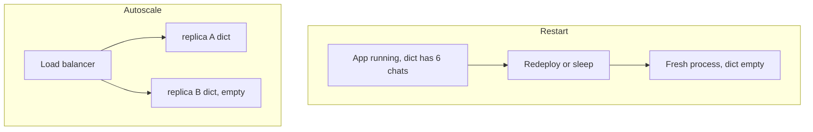

| Trap                       | What Rao sees                          | Root cause                    |
| -------------------------- | -------------------------------------- | ----------------------------- |
| Restart wipes RAM          | "it forgot everything overnight"       | non-durable WHERE             |
| Autoscale spreads requests | "it forgets randomly, works sometimes" | many replicas, unshared WHERE |

The cruel part: a single-instance deploy (Reserved VM) hides the autoscale trap while running, so the bug looks fixed in testing and returns under real traffic. Sticky sessions (pin a user to one replica) is a band-aid, not a fix, because a redeploy still wipes that replica's RAM.

---

## The Restart Test as a shipping gate

Before shipping any memory setup, ask one question:

> If this process restarts right now, does the customer's history survive?

- "No" means you have a demo, ship it only as a demo
- "Yes" means storage lives outside the process, you are production-shaped

| Storage             | Survives restart?   | Survives multi-replica? |
| ------------------- | ------------------- | ----------------------- |
| In-memory dict      | No                  | No                      |
| SQLite file on disk | Yes on one instance | No                      |
| Redis               | Yes                 | Yes                     |
| Postgres            | Yes                 | Yes                     |

---

## The Persistence Ladder (roadmap)

Climb only as high as the deployment needs. Do not start at the top for a prototype, do not stay at the bottom under real traffic.

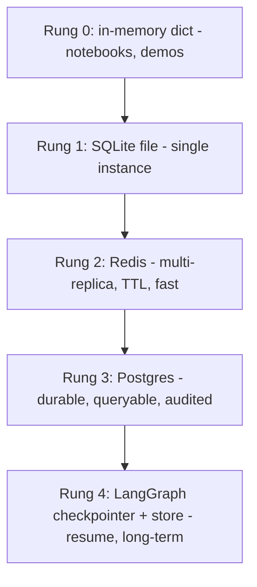

| Rung | Reach for it when                          | Cost of moving up                        |
| ---- | ------------------------------------------ | ---------------------------------------- |
| 0    | learning or demoing                        | none                                     |
| 1    | one instance, survive restarts             | swap the history class, keep the factory |
| 2    | you autoscale, need shared expiring memory | run Redis, point the factory at it       |
| 3    | durability, queries, compliance            | run Postgres, schema for messages        |
| 4    | crash-resume, branching, long-term facts   | adopt LangGraph persistence              |

The kind design property: because RunnableWithMessageHistory takes a factory, moving Rung 0 to Rung 2 changes one function body, not your chain. WHERE moves while HOW and WHO stay put. The 3-Axis Model pays for itself here.

---

## Anticipated questions (Segment 9)

| Q                                                 | Short answer                                                                                                 |
| ------------------------------------------------- | ------------------------------------------------------------------------------------------------------------ |
| Can I just use sticky sessions and keep the dict? | It masks the autoscale trap but not the restart trap. Not production-safe.                                   |
| Is Replit DB enough?                              | It survives restarts, so it clears the Restart Test. Redis or Postgres give you TTL, concurrency, and scale. |
| Do I lose everything on every deploy?             | With an in-memory dict, yes. With an external store, no. That is the whole point of externalizing.           |
| Is a dict ever fine in prod?                      | Single replica, low traffic, memory you are happy to lose on restart. Rare for a client copilot.             |

---

# Segment 10

## Production depth: bloat, the Replay Tax, and KV cache

Incident 6. Rao has a long conversation. It gets slower and pricier each turn, then one message fails outright. This is the C2 question about caching, answered properly.

---

## The Replay Tax: memory costs tokens, quadratically

Since the goldfish re-reads the whole notepad every call, the notepad rides along as tokens each turn.

Tokens sent on turn `n`:

$$
\text{tokens}_n = \text{system} + \sum_{i=1}^{n-1}\text{msg}_i + \text{input}_n
$$

Every turn re-sends all prior turns. Total tokens across an `N`-turn chat:

$$
\text{Total} \approx \sum_{n=1}^{N}\left(\text{system} + \sum_{i=1}^{n-1}\text{msg}_i + \text{input}_n\right) = O(N^2)
$$

Naive full-history memory is quadratic in conversation length. This is the Replay Tax.

The growth, shown (bar length is relative token load per turn):

| Turn | Messages sent | Relative load |
| ---- | ------------- | ------------- |
| 1    | 1             | ▉             |
| 2    | 2             | ▉▉            |
| 3    | 3             | ▉▉▉           |
| 5    | 5             | ▉▉▉▉▉         |
| 10   | 10            | ▉▉▉▉▉▉▉▉▉▉    |

| Symptom                    | Cause                                |
| -------------------------- | ------------------------------------ |
| Cost creeps up mid-chat    | each turn re-bills all past turns    |
| Latency grows with length  | more tokens to process each call     |
| A message eventually fails | history overflows the context window |

| Engineer view                  | PM view                                       |
| ------------------------------ | --------------------------------------------- |
| bound the token count per call | cost per conversation stays flat, not runaway |
| avoid context-window errors    | the SLA on p95 latency survives long chats    |

---

## Three ways to pay less Replay Tax

You do not stop remembering, you stop re-sending everything.

| Strategy    | What it does                                               | Tradeoff                                                |
| ----------- | ---------------------------------------------------------- | ------------------------------------------------------- |
| Trimming    | keep only the last K messages                              | cheap, but forgets old turns                            |
| Windowing   | slide a moving frame over recent turns                     | simple, same forgetting risk                            |
| Summarizing | replace old turns with a short recap, done by a model call | keeps the gist, costs an extra call and can drop detail |

Decision path:

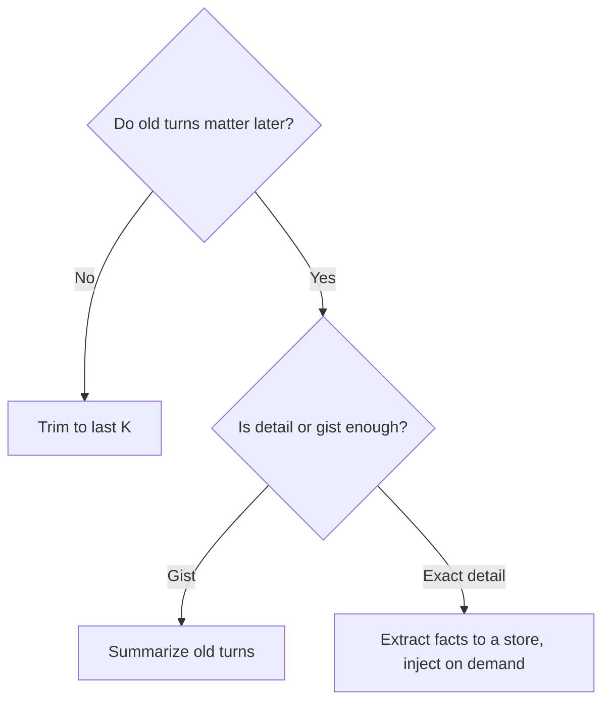

LangChain ships message trimming and summarization helpers for exactly this. Today's scope stops here so you see the mechanism clean before optimizing.

---

## KV cache and prompt caching: the caching question, answered

Two different things share the word "cache". Keep them apart.

| Term           | Level                          | What it is                                                                                                                               |
| -------------- | ------------------------------ | ---------------------------------------------------------------------------------------------------------------------------------------- |
| KV cache       | model inference internals      | while generating, the model stores key/value tensors for tokens already processed, so it does not recompute attention for them           |
| Prompt caching | provider API lever you control | the provider reuses those KV tensors across separate requests when the prompt prefix is identical, skipping recomputation of that prefix |

The one sentence that resolves cold-open Q6:

> Prompt caching does not make the model remember. It makes re-reading the same prefix cheaper. You still re-send the history, the provider just does not recompute the unchanged part.

Reported impact on long prompts, from Anthropic's own figures: up to about 90 percent lower cost and up to about 85 percent lower latency on the cached portion, with a documented 100K-token example dropping from roughly 11.5s to 2.4s. The cache is prefix-based and exact-match, not semantic. Default lifetime is short, on the order of minutes, with a longer option available.

---

## Prefix-First Prompting: how to earn the discount

The cache only helps if the reused part sits at the front and stays byte-identical. So structure the prompt stable-first, volatile-last.

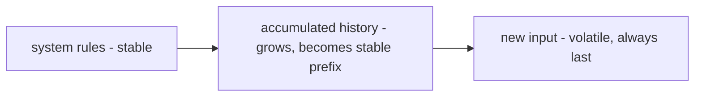

Rules of thumb:

- Put system and long stable context first, mark it cacheable
- Let history accumulate as the growing stable prefix
- Keep the new user input last, so only the tail changes each turn
- Never rewrite the stable prefix mid-conversation, one edit breaks the exact-match and the cache misses

Concrete shape at the API level, caching the stable system block:

```python
system = [
    {
        "type": "text",
        "text": "You are a concise airline support agent. Policies: ...",
        "cache_control": {"type": "ephemeral"},
    }
]
```

In LangChain you attach the same `cache_control` marker to the stable system or history block. Same content, same order, one annotation. The model receives an identical prompt, only the cache tag differs.

This is why the system, history, input ordering from Segment 5 was not cosmetic. Correct ordering and cache-friendly ordering are the same ordering.

---

## Anticipated questions (Segment 10)

| Q                                                           | Short answer                                                                                             |
| ----------------------------------------------------------- | -------------------------------------------------------------------------------------------------------- |
| Does caching replace re-sending history?                    | No. You still send it. Caching skips recomputing the identical prefix. Goldfish still needs the notepad. |
| Why did my cache stop hitting?                              | You edited the prefix, or the short TTL expired. Exact-match prefix, minutes-scale lifetime.             |
| Trim or cache first?                                        | They stack. Trim to bound tokens, then cache the stable prefix to cut the cost of what remains.          |
| Is the KB cache the student asked about the same as memory? | No. It is a compute optimization, not conversational memory. Different layer entirely.                   |

---

# Segment 11

## Forward view and recap

Where this is heading, then prove you own it.

---

## RunnableWithMessageHistory today, LangGraph next

RunnableWithMessageHistory is correct and supported for single-chain chat memory. For agents with tools, steps, and recovery, the direction is LangGraph persistence. Knowing why prepares you before you need it.

| Dimension                    | RunnableWithMessageHistory | LangGraph persistence                           |
| ---------------------------- | -------------------------- | ----------------------------------------------- |
| Identity key                 | session_id                 | thread_id                                       |
| Storage                      | chat message history       | checkpointers (short-term) + stores (long-term) |
| Best fit                     | one chain, chat history    | multi-step agents, branching, tools             |
| Crash resume                 | not built in               | built in, resume from last checkpoint           |
| Human-in-the-loop            | manual                     | first-class                                     |
| Long-term cross-thread facts | roll your own              | stores handle it                                |

Decision rule:

- Chat chain that just needs to remember the conversation: RunnableWithMessageHistory
- Agent with tools, approvals, or resume-after-failure: LangGraph

Why this matters for the agents track: when you build an agent, each sub-agent inside it uses exactly these pieces, chat prompt template, message history, session identity. The mental model transfers cleanly. `session_id` becomes `thread_id`, the notepad becomes a checkpoint, RAIL becomes save-checkpoint and restore-checkpoint. Same Goldfish underneath.

---

## Connect every dot

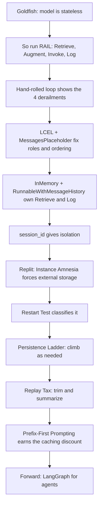

Narrate this top to bottom and you own the module.

---

## Recap quiz

Language: Python • Topics: full module • Level: Intermediate

15 items, mixed formats. Reveal after each cluster.

---

## Recap: Q1 to Q6

**R1 (single-select).** The real reason the copilot remembers Rao is:

- (a) the model stores state between calls
- (b) the app re-sends past turns as tokens each call
- (c) the API keeps a server session
- (d) fine-tuning on the chat

**R2 (matching).** Match to the RAIL step. One distractor.

| Item                          |     |
| ----------------------------- | --- |
| 1. get_session_history        |     |
| 2. MessagesPlaceholder        |     |
| 3. wrapper appends both turns |     |

Bank: (A) Augment, (B) Retrieve, (C) Log, (D) Invoke

**R3 (spot-the-derailment).** A hand-rolled loop skips `messages.append(reply)`. Visible symptom?

**R4 (true/false, pick).** "Prompt caching lets you stop re-sending history because the model now remembers it."

- True
- False

**R5 (predict).** One hardcoded `session_id="team"` for all 40 customers. Customer 3 says "my card ends 1234". Customer 40 asks "what is my card?" Result and which axis?

**R6 (spot-the-wrong-arrow).** One arrow breaks the RAIL loop. Which tag?

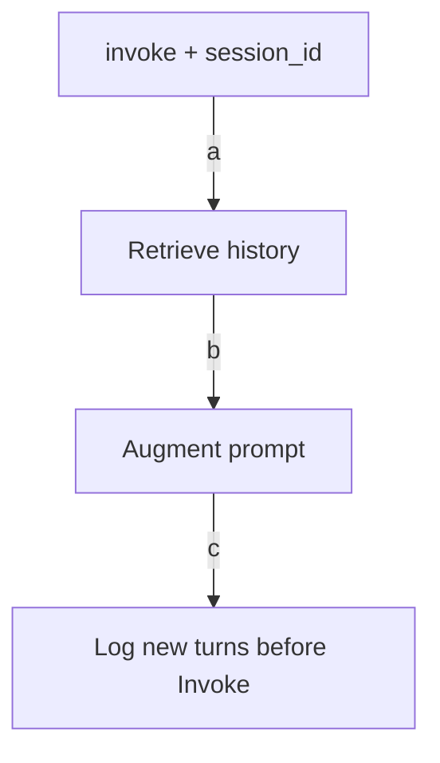

---

## Recap: Q1 to Q6 key

| Q   | Answer                                                                                |
| --- | ------------------------------------------------------------------------------------- |
| R1  | b                                                                                     |
| R2  | 1-B, 2-A, 3-C; D is the distractor                                                    |
| R3  | the bot forgets its own past answers, re-asks and contradicts itself                  |
| R4  | False, you still re-send history, caching only skips recomputing the identical prefix |
| R5  | customer 40 sees card 1234, a WHO-axis leak from a shared session id                  |
| R6  | tag c, Log happens after Invoke, not before                                           |

---

## Recap: Q7 to Q11

**R7 (ordering, shuffled).** Order the Persistence Ladder, lowest to highest durability:

- SQLite file
- LangGraph checkpointer
- in-memory dict
- Redis
- Postgres

**R8 (debugging, one-line fix).** History never reaches the prompt. Placeholder is `variable_name="history"`, wiring is `history_messages_key="messages"`. One-line fix.

**R9 (case, production).** Copilot on 3 replicas, in-memory dict each. Name the failure and the one architectural fix.

**R10 (multi-select).** Which pass the Restart Test? Pick all.

- (a) in-memory dict
- (b) SQLite on disk
- (c) Redis
- (d) module-level Python list

**R11 (trace, numeric).** Empty history for cust-9. Run:

```python
copilot.invoke({"input": "A"}, config={"configurable": {"session_id": "cust-9"}})
copilot.invoke({"input": "B"}, config={"configurable": {"session_id": "cust-9"}})
```

How many messages are in cust-9's history now?

---

## Recap: Q7 to Q11 key

| Q   | Answer                                                                        |
| --- | ----------------------------------------------------------------------------- |
| R7  | in-memory dict, SQLite file, Redis, Postgres, LangGraph checkpointer          |
| R8  | set`history_messages_key="history"` to match the placeholder                  |
| R9  | Instance Amnesia, fix by moving the store out of process to Redis or Postgres |
| R10 | b and c pass, a and d are wiped on restart                                    |
| R11 | 4: human A, AI reply, human B, AI reply                                       |

---

## Recap: Q12 to Q15

**R12 (small fresh-code).** Write a minimal `get_session_history(session_id)` using `InMemoryChatMessageHistory` and a global dict.

**R13 (single-select).** Building an agent with tools, approvals, and resume-after-crash. Best fit?

- (a) RunnableWithMessageHistory
- (b) a bigger in-memory dict
- (c) LangGraph persistence
- (d) hardcode the history

**R14 (multi-select).** Symptoms of the Replay Tax on a long chat. Pick all.

- (a) rising per-turn cost
- (b) growing latency
- (c) eventual context-window overflow
- (d) the model changing personality

**R15 (synthesis, one sentence).** Explain the Goldfish Principle and why it forces RAIL, to a new teammate, in one sentence.

---

## Recap: Q12 to Q15 key

| Q   | Answer                                                                                                                                                             |
| --- | ------------------------------------------------------------------------------------------------------------------------------------------------------------------ |
| R12 | see snippet                                                                                                                                                        |
| R13 | c                                                                                                                                                                  |
| R14 | a, b, c; d is not a memory symptom                                                                                                                                 |
| R15 | the model keeps no state between calls, so to give it memory we Retrieve past turns, Augment the prompt with them, Invoke the model, and Log the new exchange back |

```python
store: dict[str, BaseChatMessageHistory] = {}

def get_session_history(session_id: str) -> BaseChatMessageHistory:
    if session_id not in store:
        store[session_id] = InMemoryChatMessageHistory()
    return store[session_id]
```

---

## Close: the eight tools, one line each

| Keep this              | So that                                                    |
| ---------------------- | ---------------------------------------------------------- |
| Goldfish Principle     | you never expect the model to remember on its own          |
| RAIL                   | you can name what any memory system is doing               |
| 3-Axis Model           | you debug memory by isolating WHO, HOW, WHERE              |
| Replay Tax             | you bound cost and latency before they runaway             |
| Instance Amnesia       | you externalize storage before autoscaling                 |
| Restart Test           | you never ship a demo store as production                  |
| Persistence Ladder     | you climb storage only as far as you need                  |
| Prefix-First Prompting | you earn the caching discount instead of paying full price |

Callback to cold-open Q11: "adding memory" is RAIL, keyed by identity, held in storage that survives what your deployment throws at it, sent in an order that the cache can reuse. That is the whole game.

Next module: bounding the Replay Tax with trimming and summarization in depth, then climbing to LangGraph checkpointers so an agent resumes exactly where it crashed.
