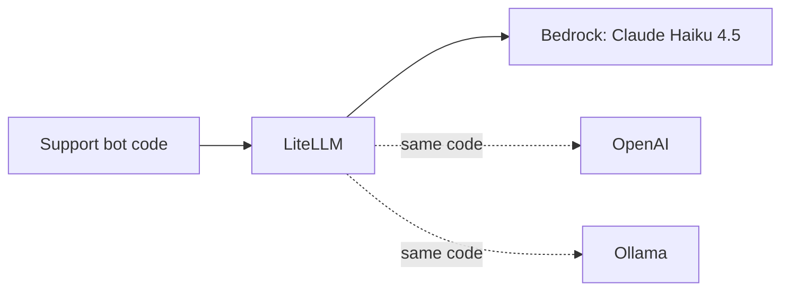
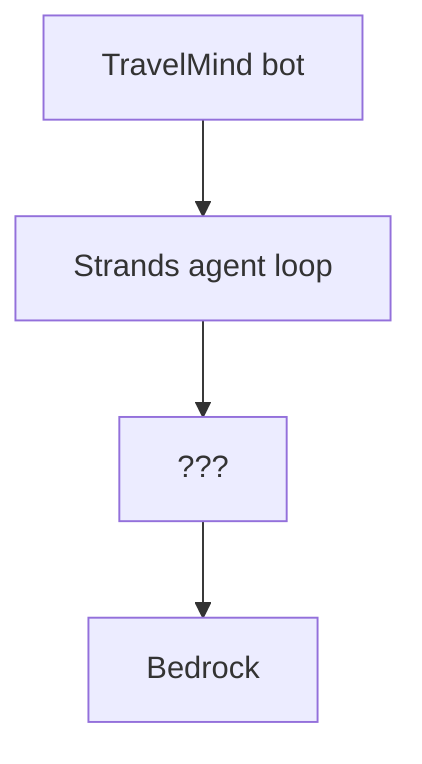

# Exercise · LiteLLM · Interim

**Language:** Python · **Topics:** LiteLLM core, Bedrock routing, unified I/O, streaming · **Level:** Foundational

---

## Scenario

TravelMind is wiring its support bot to Amazon Bedrock through LiteLLM. Passenger Rao (Gold tier, booking PNR JX48Q2) will chat with it. Before you change anything, you must read the pipeline and prove you understand what each line does.

**Mental model: USB-C for LLMs.** Your code has one plug. LiteLLM fits every socket.



Reference snippet for this sheet:

```python
import litellm
litellm.drop_params = True

MODEL = "bedrock/us.anthropic.claude-haiku-4-5-20251001-v1:0"

resp = litellm.completion(
    model=MODEL,
    messages=[{"role": "user", "content": "One sentence: what is Amazon Bedrock?"}],
    max_tokens=200,
)
print(resp.choices[0].message.content)
```

---

## Part A · Read the pipeline (MCQ)

**Q1.** The `bedrock/` prefix in the model string tells LiteLLM to:
- A) cache the response
- B) pick the provider and its routing
- C) enable streaming
- D) skip authentication

**Q2.** On Bedrock you must NOT pass `api_key`. Why?
- A) LiteLLM ignores it silently
- B) Bedrock authenticates with AWS credentials, and passing a key breaks the credential chain
- C) The key is only for OpenAI
- D) It slows the request

**Q3.** In the snippet, `resp.choices[0].message.content` holds:
- A) the raw Bedrock payload
- B) the token count
- C) the generated text, in OpenAI-shaped response
- D) the model id

**Q4.** The `us.` in `us.anthropic.claude-haiku-4-5-...` is:
- A) the AWS region
- B) a mandatory cross-region inference-profile id for on-demand Claude on Bedrock
- C) optional sugar
- D) the account number

---

## Part B · True or false (pick only)

Mark each T or F.

**Q5.**
- (a) LiteLLM is an agent framework that plans and calls tools.
- (b) `completion()` returns the same response shape whatever the provider.
- (c) Swapping `model="bedrock/..."` for `model="openai/gpt-4o"` forces you to rewrite the parsing code.
- (d) LiteLLM can also fetch embeddings, not just chat completions.

---

## Part C · Multi-select

**Q6.** Which are real LiteLLM capabilities? (choose all)
- A) fallbacks to a backup model
- B) automatic retries with backoff
- C) training and fine-tuning models
- D) cost tracking per call
- E) routing across deployments
- F) storing vectors for search

---

## Part D · Predict the output

**Q7.** Given this loop, what does the FINAL `print` statement put on screen (describe exactly)?

```python
print("Streaming: ", end="")
for chunk in litellm.completion(model=MODEL, messages=msgs, stream=True, max_tokens=60):
    piece = chunk.choices[0].delta.content or ""
    print(piece, end="", flush=True)
print("\n[OK] Streaming deltas received.")
```

**Q8.** What is the effect of `end=""` on how the streamed pieces appear?

---

## Part E · Match the columns

**Q9.** Match each term to its meaning. One meaning is a distractor with no match.

| Term | | Meaning |
|---|---|---|
| 1. `drop_params=True` | | A) spreads calls across deployments |
| 2. `bedrock/converse/<model>` | | B) removes params the provider will not accept |
| 3. Router | | C) forces the Converse route explicitly |
| 4. `completion()` | | D) the one call that reaches any model by string |
| | | E) compresses the prompt to save tokens |

---

## Part F · Trace the flow

**Q10.** A request travels through the layer. Put these in order:

- (i) LiteLLM parses Bedrock's native response back into OpenAI shape
- (ii) your code calls `completion(model="bedrock/us...")`
- (iii) LiteLLM translates the request to Bedrock Converse format
- (iv) Bedrock runs the model and returns a native payload

---

## Part G · Spot the issues and pick the fix

**Q11.** This call fails on Bedrock. Two things are wrong.

```python
resp = litellm.completion(
    model="anthropic.claude-haiku-4-5-20251001-v1:0",   # line 2
    messages=msgs,
    temperature=0.3,
    top_p=0.9,
)
```

Identify both problems, then pick the correct minimal fix.

- A) Add `stream=True`
- B) Line 2 needs the `bedrock/us.` prefix, and set `litellm.drop_params = True` so the temperature + top_p conflict is handled
- C) Remove `messages`
- D) Change `max_tokens`

---

## Part H · Tweak and reason

**Q12.** You change `max_tokens=200` to `max_tokens=10` and rerun. Based on the output you would see, what is the most likely observation, and what does that tell you about `max_tokens`?

**Q13.** A product manager asks: "Can we switch from Bedrock to another provider later without rewriting the bot?" Give the accurate one-line answer and name the exact change required.

---

## Part I · Order the steps

**Q14.** To make your first Bedrock call through LiteLLM, order these:

- (i) call `litellm.completion(...)` and read `choices[0].message.content`
- (ii) set the model string `bedrock/us.anthropic.claude-haiku-4-5-...`
- (iii) ensure AWS credentials and region are available
- (iv) set `litellm.drop_params = True`

---

## Part J · Placement

**Q15.** Which box is LiteLLM in this stack?



- A) the agent loop
- B) the ??? box: the model access layer
- C) Bedrock itself
- D) it wraps the whole stack

---

## Part K · Skeptic check

**Q16.** TravelMind will only ever use Bedrock and runs one small service. Name one honest reason LiteLLM might be pure overhead here, and one future event that would flip that.

---

<details>
<summary><b>Answer key (instructor)</b></summary>

1. B. 2. B. 3. C. 4. B.
5. (a) F, (b) T, (c) F, (d) T.
6. A, B, D, E. (C and F are not LiteLLM.)
7. A newline, then `[OK] Streaming deltas received.` on its own line.
8. `end=""` suppresses the newline per print, so streamed pieces appear joined on one line as they arrive.
9. 1-B, 2-C, 3-A, 4-D. E is the distractor.
10. ii, iii, iv, i.
11. Problems: missing `bedrock/us.` prefix, and temperature + top_p sent together. Fix: B.
12. Output likely cut off mid-sentence. `max_tokens` caps output length, not quality of reasoning.
13. Yes, without rewriting logic; change only the model string (and provider auth). One line.
14. iii, ii, iv, i (accept iv before ii: setting drop_params can come before the model string; the fixed call order is region/creds first, then model, drop_params, then call).
15. B.
16. Overhead: one extra dependency and one network hop for zero swap benefit. Flip: procurement, a price cut, an outage, or a multi-team rollout forcing provider or key management.
</details>
