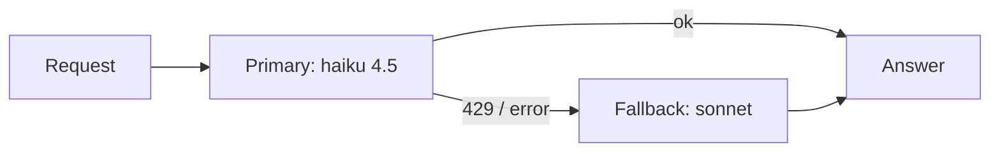

# Exercise · LiteLLM · Final

**Language:** Python · **Topics:** fallbacks, retries, routing, cost, structured output, Strands / LangChain / LangGraph integration · **Level:** Applied

---

## Scenario

TravelMind's bot survived launch. Now it must not fall over under Diwali-rush load, must track spend per feature, and must plug into the Strands agent the team already built. You will read, debug, and complete small pieces.



Relative cost intuition (illustrative bars, not exact prices):

```
haiku 4.5   ██        cheap, fast
sonnet      ████████  stronger, pricier
```

---

## Part A · Read the resilience layer (MCQ)

**Q1.** In this Router, what happens when `primary` errors?

```python
from litellm import Router
router = Router(
    model_list=[
        {"model_name": "primary",
         "litellm_params": {"model": "bedrock/us.anthropic.claude-nonexistent-v1:0",
                            "aws_region_name": "us-east-1"}},
        {"model_name": "backup",
         "litellm_params": {"model": "bedrock/us.anthropic.claude-haiku-4-5-20251001-v1:0",
                            "aws_region_name": "us-east-1"}},
    ],
    fallbacks=[{"primary": ["backup"]}],
)
resp = router.completion(model="primary", messages=msgs)
```

- A) the whole call raises and stops
- B) LiteLLM retries `backup` and returns its answer
- C) it returns an empty string
- D) it switches to OpenAI

**Q2.** `num_retries=3` on `completion()` handles which class of failure best?
- A) a wrong model string
- B) transient throttling and network errors
- C) invalid JSON in your prompt
- D) missing messages

**Q3.** `litellm.completion_cost(completion_response=resp)` returns:
- A) the token count
- B) an estimated dollar cost for that call
- C) the latency
- D) the model name

---

## Part B · Multi-select

**Q4.** Which of these are correct about the Bedrock temperature + top_p conflict? (choose all)
- A) Bedrock Claude rejects a request carrying both
- B) many frameworks default `top_p=1.0`, tripping it unexpectedly
- C) `litellm.drop_params = True` removes the unsupported param
- D) the fix is to lower `max_tokens`

---

## Part C · Predict the output

**Q5.** Given the Router in Q1, when `router.completion(model="primary", ...)` runs successfully, which deployment produced the answer, and why?

**Q6.** What does this print, structurally (not the exact fact)?

```python
u = resp.usage
print(f"Tokens in/out: {u.prompt_tokens}/{u.completion_tokens}")
cost = litellm.completion_cost(completion_response=resp)
print(f"Estimated cost: ${cost:.6f}")
```

---

## Part D · Match feature to call

**Q7.** Match. One is a distractor.

| Need | | Call |
|---|---|---|
| 1. failover to another model | | A) `litellm.embedding(model="bedrock/amazon.titan-embed-text-v2:0", ...)` |
| 2. dollar cost of a call | | B) `Router(..., fallbacks=[{"primary": ["backup"]}])` |
| 3. vectors for search | | C) `litellm.completion_cost(completion_response=resp)` |
| 4. balance across deployments | | D) `Router(model_list=[... same model_name twice ...])` |
| | | E) `litellm.moderation(...)` |

---

## Part E · Spot the wrong line and fix it (free fix)

**Q8.** This Router config will not balance as intended. Identify the wrong part and write the one-line correction.

```python
router = Router(model_list=[
    {"name": "claude", "litellm_params": {"model": MODEL, "aws_region_name": "us-east-1"}},
    {"name": "claude", "litellm_params": {"model": MODEL, "aws_region_name": "us-east-1"}},
])
```

**Q9.** A teammate's tool-calling code fails only when streaming. Identify the bug and give the one-line fix.

```python
from langchain_litellm import ChatLiteLLM
llm = ChatLiteLLM(model="bedrock/us.anthropic.claude-haiku-4-5-20251001-v1:0")
llm_with_tools = llm.bind_tools([multiply])
async for chunk in llm_with_tools.astream("What is 6 times 7?"):   # fails
    print(chunk)
```

---

## Part F · Rectify the wrong suggestion

**Q10.** A teammate says: "For Bedrock, put the AWS key in `LiteLLMModel(client_args={'api_key': ...})` like we do for OpenAI." Explain why this is wrong and state the correct approach in one line.

---

## Part G · Read the Strands integration (MCQ + predict)

**Q11.** For Strands on Bedrock through LiteLLM, `model_id` should be:
- A) `anthropic.claude-haiku-4-5-20251001-v1:0`
- B) `bedrock/us.anthropic.claude-haiku-4-5-20251001-v1:0`
- C) `us-east-1/claude`
- D) `openai/claude`

**Q12.** Predict what `percent_of` returns when the agent answers "What is 15 percent of 240?"

```python
@tool
def percent_of(part: float, whole: float) -> float:
    """Return part percent of whole."""
    return whole * part / 100.0
```

---

## Part H · Complete the code (small)

**Q13.** Fill the two blanks so this Strands agent runs on Bedrock through LiteLLM.

```python
from strands import Agent
from strands.models.litellm import LiteLLMModel
from strands_tools import calculator

model = LiteLLMModel(
    model_id="____________________",          # blank 1: Bedrock Haiku 4.5 via LiteLLM
    params={"max_tokens": 600, "temperature": 0.3},
)
agent = Agent(model=model, tools=[calculator])
print(agent("What is 15 percent of 240?"))
```

**Q14.** Fill the blank so `primary` falls back to `backup`.

```python
router = Router(
    model_list=[
        {"model_name": "primary", "litellm_params": {"model": BAD_MODEL, "aws_region_name": "us-east-1"}},
        {"model_name": "backup",  "litellm_params": {"model": GOOD_MODEL, "aws_region_name": "us-east-1"}},
    ],
    fallbacks=[____________________],          # blank
)
```

---

## Part I · Case study

**Q15.** Five teams at TravelMind share one AWS account and keep hitting each other's rate limits and spend. SDK in each app, or the LiteLLM Proxy? Pick one and give two reasons tied to the symptoms.

---

## Part J · Skeptic check

**Q16.** "Abstraction always wins, so route everything through LiteLLM." Give one case where the native SDK is the better call, and why.

---

<details>
<summary><b>Answer key (instructor)</b></summary>

1. B. 2. B. 3. B.
4. A, B, C.
5. `backup`. The invalid primary errors, and the `fallbacks` mapping reroutes to `backup`.
6. Two lines: a tokens in/out line, then an estimated cost formatted to 6 decimals.
7. 1-B, 2-C, 3-A, 4-D. E is the distractor.
8. Key must be `model_name`, not `name`. Fix: rename both `"name"` keys to `"model_name"`.
9. `bind_tools().astream()` on Bedrock misroutes to an OpenAI endpoint (Jan 2026 bug). Fix: use `llm_with_tools.invoke(...)` instead of `astream`, or use `langchain-aws` `ChatBedrockConverse`.
10. Bedrock uses AWS credentials, not an api_key; passing one breaks the credential chain. Correct: leave `api_key` out and rely on env vars, profile, or IAM role.
11. B.
12. `240 * 15 / 100 = 36.0`.
13. `"bedrock/us.anthropic.claude-haiku-4-5-20251001-v1:0"`.
14. `[{"primary": ["backup"]}]`.
15. Proxy. It centralises virtual keys, per-team budgets, and rate limits, which directly fix shared-spend and cross-team throttling.
16. Ultra-low-latency single-model paths, or needing a provider-only feature at the bleeding edge before the adapter supports it. Native removes a hop and the lag.
</details>
