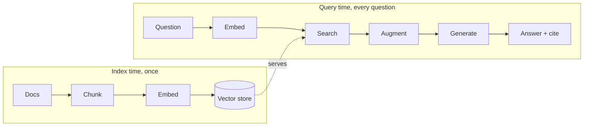

# Exercise · RAG · Interim 1

**Language:** Python · **Topics:** embeddings, chunking, cosine retrieval, naive RAG · **Level:** Foundational

---

## Scenario

TravelMind's FAQ bot keeps inventing refund rules that do not exist. Passengers get wrong answers about their PNR JX48Q2 cancellation. You are building the retrieval layer so the bot reads before it speaks.

**Mental model: open-book exam.** A closed book tests memory (bare model). An open book lets you look things up (RAG). Two separate phases:



Similarity is geometry:

$$\cos(\theta) = \frac{a \cdot b}{\lVert a \rVert \, \lVert b \rVert}$$

Reference snippets:

```python
def embed(texts):
    e = litellm.embedding(model="bedrock/amazon.titan-embed-text-v2:0", input=texts)
    return np.array([d["embedding"] for d in e.data], dtype=float)

def retrieve(query, k=3):
    qv = embed([query])[0]
    sims = MATRIX @ qv / (np.linalg.norm(MATRIX, axis=1) * np.linalg.norm(qv) + 1e-9)
    order = np.argsort(-sims)[:k]
    return [{"id": CHUNKS[i]["id"], "text": CHUNKS[i]["text"], "score": float(sims[i])} for i in order]
```

---

## Part A · Why RAG (MCQ)

**Q1.** Why RAG rather than fine-tuning to give the bot current refund rules?
- A) fine-tuning is always less accurate
- B) RAG updates by editing a document, fine-tuning bakes knowledge in and is slow to redo
- C) fine-tuning cannot use Bedrock
- D) RAG needs no model

**Q2.** An embedding turns text into:
- A) a summary
- B) a vector where similar meaning lands nearby
- C) a token count
- D) a keyword list

**Q3.** Cosine close to 1 means, and close to 0 means:
- A) unrelated / same topic
- B) same topic / unrelated
- C) both mean identical
- D) error / success

---

## Part B · Read the retrieval code (MCQ)

**Q4.** In the `embed` snippet, the returned array shape is:
- A) `(embedding_dim,)`
- B) `(len(texts), embedding_dim)`
- C) `(len(texts),)`
- D) a Python list of strings

**Q5.** In `retrieve`, `np.argsort(-sims)[:k]` gives:
- A) the k lowest-scoring chunk indices
- B) the k highest-scoring chunk indices
- C) a random k chunks
- D) all chunks sorted ascending

---

## Part C · Predict from the bars

**Q6.** A query embeds and scores against three chunks:

```
refund and money-back policy   ████████████████  0.83
how to reset your password     ██████            0.31
office lunch menu              ██                0.09
```

With `k=1`, which chunk does `retrieve` return, and what would the bot's answer be grounded in?

**Q7.** Predict the print for this call given a corpus of 9 chunks with 1024-dim Titan vectors:

```python
MATRIX = embed([c["text"] for c in CHUNKS])
print("Index shape:", MATRIX.shape)
```

---

## Part D · True or false (pick only)

**Q8.**
- (a) A chunk that is too large blurs many topics into one averaged vector, weakening retrieval.
- (b) You may embed documents with one model and queries with a different model.
- (c) Overlap between chunks stops a sentence on a boundary from being cut in half.
- (d) Retrieval returns the k passages closest to the question vector.

---

## Part E · Multi-select

**Q9.** Symptoms of chunks that are TOO SMALL: (choose all)
- A) topic split across chunks, context lost
- B) one vector covers many topics
- C) retrieves a fragment that answers nothing
- D) the answer chunk drowns in surrounding noise

---

## Part F · Match the pipeline

**Q10.** Match each stage to its job. One is a distractor.

| Stage | | Job |
|---|---|---|
| 1. Chunk | | A) turn text into vectors |
| 2. Embed | | B) split docs into focused passages |
| 3. Store | | C) find the closest passages to the query |
| 4. Retrieve | | D) hold vectors for fast nearest-neighbour search |
| | | E) rewrite the user's question |

---

## Part G · Spot the bug, pick the fix

**Q11.** This retrieval always returns nonsense. What is wrong, and which fix is correct?

```python
doc_vecs = litellm.embedding(model="bedrock/amazon.titan-embed-text-v2:0", input=docs)
qv = litellm.embedding(model="bedrock/cohere.embed-english-v3", input=[query])   # line 2
```

- A) `docs` must be a single string
- B) documents and query are embedded with different models, so vectors are not comparable; embed both with the same model
- C) add `k=3`
- D) the query needs `stream=True`

---

## Part H · Trace the flow

**Q12.** Sort these into the correct order for naive RAG at query time:

- (i) build a grounded prompt with the retrieved passages
- (ii) embed the question
- (iii) generate the answer with the model
- (iv) search the index for the top-k chunks

---

## Part I · Read the grounding prompt (MCQ)

**Q13.** The grounding prompt says: "Answer ONLY from the context. If the answer is not there, say you do not know." What does the "say you do not know" clause achieve?

```python
ans = chat(
    "Answer ONLY from the context. Cite the [id]s used. "
    "If the answer is not in the context, say you do not know.\n\n"
    f"Context:\n{ctx}\n\nQuestion: {query}"
)
```
- A) makes the model faster
- B) lets the model refuse instead of hallucinating when retrieval misses
- C) forces JSON output
- D) increases k

---

## Part J · Sort into two buckets

**Q14.** Label each as OFFLINE (index time) or ONLINE (query time):

- (a) chunk the documents
- (b) embed the user's question
- (c) store chunk vectors in the index
- (d) search for the top-k and generate

---

## Part K · Scenario

**Q15.** The bot confidently answered "pets under 5 kg fly free in cabin," but no such rule exists in the corpus. Which single fix addresses this, and why?
- A) add more chunks about seats
- B) enforce the grounding + refusal prompt so the model says "I do not know" when nothing is retrieved
- C) raise `max_tokens`
- D) switch providers

---

## Part L · Skeptic check

**Q16.** Naive RAG already passes your eyeball test on the refund questions. Give one reason to STOP here rather than adding reranking and query rewriting today.

---

<details>
<summary><b>Answer key (instructor)</b></summary>

1. B. 2. B. 3. B.
4. B. 5. B.
6. The refund chunk. The answer is grounded in the refund and money-back policy passage.
7. `Index shape: (9, 1024)`.
8. (a) T, (b) F, (c) T, (d) T.
9. A, C.
10. 1-B, 2-A, 3-D, 4-C. E is the distractor.
11. B.
12. ii, iv, i, iii.
13. B.
14. (a) offline, (b) online, (c) offline, (d) online.
15. B.
16. Every lever adds latency and cost; if the measured baseline passes, added complexity is a liability until a metric demands it.
</details>
