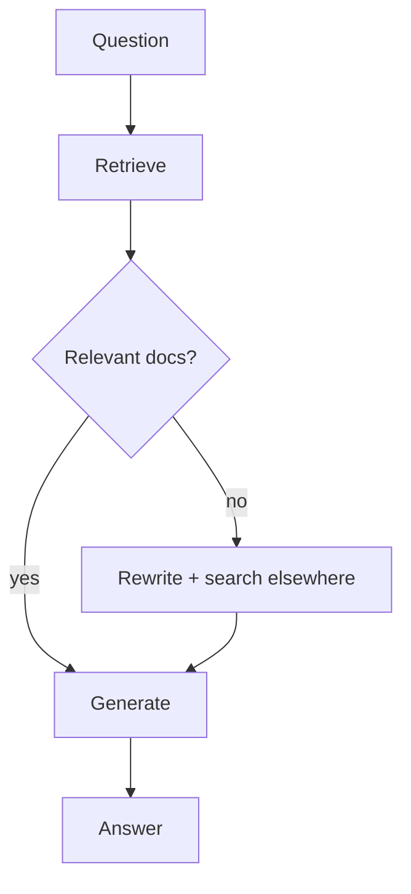
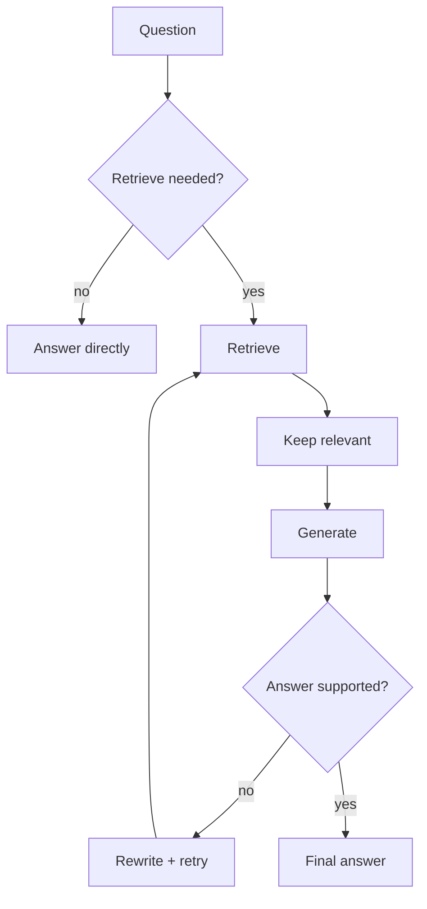
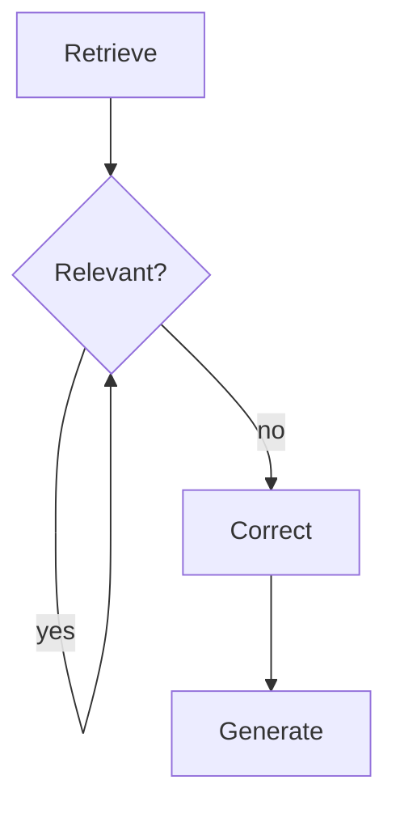
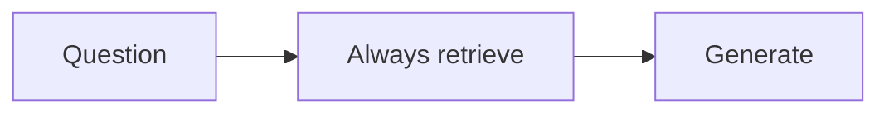
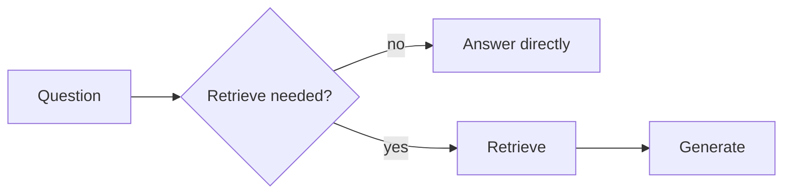

# Exercise · RAG · Interim 2

**Language:** Python · **Topics:** query rewriting, reranking, hybrid search, CRAG, Self-RAG · **Level:** Intermediate

---

## Scenario

Naive RAG shipped. Two problems surfaced: vague passenger questions retrieve the wrong chunk, and questions about topics missing from the corpus (pet-in-cabin rules) get confidently wrong answers. You will add corrective loops and trace how they route.

CRAG grades retrieval, then corrects:



Self-RAG decides IF to retrieve, then self-checks:



Reference nodes:

```python
def crag_grade(state):
    q = state["question"]; kept = []
    for d in state["documents"]:
        v = chat(f"Question: {q}\nPassage: {d['text']}\nRelevant and sufficient? yes or no.",
                 max_tokens=5, temperature=0.0).strip().lower()
        if v.startswith("y"):
            kept.append(d)
    return {"relevant": kept, "route": "generate" if kept else "correct"}

def sr_route_reflect(state):
    if state["supported"].startswith("y") or state.get("attempts", 0) >= 2:
        return "end"
    return "retry"
```

---

## Part A · What each lever fixes (MCQ)

**Q1.** Reranking fixes which failure?
- A) chunk too small
- B) a good chunk that vector search ranked low
- C) missing documents
- D) slow embedding

**Q2.** Hybrid search fuses semantic and keyword search to rescue:
- A) paraphrased questions only
- B) exact tokens like the PNR `JX48Q2` that a vector may smear
- C) images
- D) streaming

**Q3.** Query rewriting is applied:
- A) after generation
- B) before search, to sharpen a vague question
- C) only in fine-tuning
- D) to compress the answer

---

## Part B · Trace the CRAG graph

**Q4.** Passenger asks "What is the refund window for a cancelled flight?" and the corpus has a refund chunk. Which branch does `crag_grade` route to, and what is in `relevant`?

**Q5.** Passenger asks "How many kilograms can a cabin pet weigh?" and the corpus has no pet rules. Which branch, and what does the correction step do here?

---

## Part C · Read the grade node (MCQ)

**Q6.** In `crag_grade`, what single value decides `route`?
- A) the number of documents retrieved
- B) whether any graded document was kept as relevant
- C) the question length
- D) the model temperature

---

## Part D · Trace Self-RAG

**Q7.** For "What is 2 + 2?", which path does Self-RAG take, and why?

**Q8.** For "How do I change my seat after booking?", list the nodes visited in order, assuming the answer is supported on the first try.

---

## Part E · Match CRAG grades to action

**Q9.** Match the classic CRAG grade to its action. One is a distractor.

| Grade | | Action |
|---|---|---|
| 1. Correct | | A) discard docs, fetch from an external source |
| 2. Incorrect | | B) generate from the retrieved docs |
| 3. Ambiguous | | C) combine store docs with a fresh search |
| | | D) delete the vector store |

---

## Part F · Spot the wrong arrow, pick the fix

**Q10.** This CRAG diagram has one wrong edge. Which fix is correct?



- A) delete the Retrieve node
- B) the `yes` edge must go to `Generate`, not loop back to `GRADE`
- C) add a second Correct node
- D) reverse the Correct edge

---

## Part G · Multi-select

**Q11.** Which are Self-RAG's self-checks? (choose all)
- A) do I even need to retrieve
- B) is each retrieved passage relevant
- C) is the answer supported by the context
- D) how many tokens did I use

---

## Part H · Debug the loop (free fix)

**Q12.** This reflection router can loop forever on a hard question. Identify the missing guard and write the corrected line.

```python
def sr_route_reflect(state):
    if state["supported"].startswith("y"):
        return "end"
    return "retry"
```

---

## Part I · Rectify the wrong suggestion

**Q13.** A teammate says: "Retrieval is flaky, so let us add query rewriting, reranking, hybrid search, contextual compression, and small-to-big all at once." Explain why this is the wrong move and state the correct principle in one line.

---

## Part J · Trace the state table

**Q14.** A CRAG run on a gap question. Fill the `route` and `attempts` columns after each node.

| Step | Node | relevant count | route | attempts |
|---|---|---|---|---|
| 1 | retrieve | 4 | ? | ? |
| 2 | grade (none relevant) | 0 | ? | ? |
| 3 | correct | 4 (broadened) | ? | ? |
| 4 | generate | - | - | ? |

---

## Part K · Pick the correct diagram

**Q15.** Which diagram correctly represents Self-RAG?

Diagram X:


Diagram Y:


- A) X, because RAG always retrieves
- B) Y, because Self-RAG makes retrieval conditional

---

## Part L · Skeptic check

**Q16.** Self-RAG and CRAG both add extra model or retrieval calls per question. Name one situation where that overhead is NOT justified.

---

<details>
<summary><b>Answer key (instructor)</b></summary>

1. B. 2. B. 3. B.
4. Route `generate`; `relevant` holds the refund chunk (and any other graded-relevant chunks).
5. Route `correct`; the correction rewrites the query broader and re-retrieves (the hook where a real web search tool would run), then generates.
6. B.
7. The `direct` path. The decide node judges general knowledge is enough, so it skips retrieval.
8. decide, retrieve, grade, generate, reflect, END.
9. 1-B, 2-A, 3-C. D is the distractor.
10. B.
11. A, B, C.
12. Add the attempts cap: `if state["supported"].startswith("y") or state.get("attempts", 0) >= 2:` then `return "end"`.
13. Each lever adds latency and cost and can mask which one helped. Correct: add one lever at a time, driven by a measured failure.
14. Step1 route pending / attempts 0; Step2 route `correct` / attempts 0; Step3 relevant 4 / attempts 1; Step4 attempts 1.
15. B.
16. High-volume, latency-sensitive, well-scoped corpora where naive RAG already passes eval; the extra calls buy nothing there.
</details>
