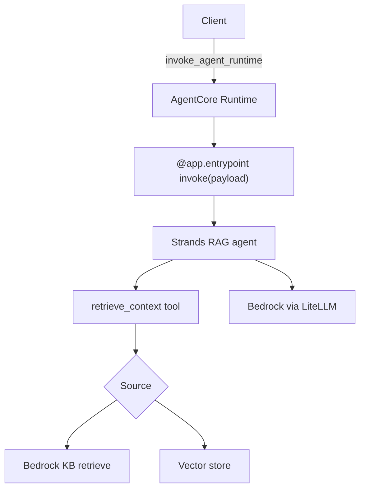

# Exercise · RAG · Final

**Language:** Python · **Topics:** Bedrock Knowledge Bases, retrieval-as-a-tool, AgentCore RAG, evaluation · **Level:** Applied

---

## Scenario

TravelMind's RAG must go to production. The team wants three things: managed retrieval via a Bedrock Knowledge Base, an agent that retrieves on demand rather than always, and a deployed endpoint on AgentCore. You will read, complete, debug, and judge.



Reference snippets:

```python
rt = boto3.client("bedrock-agent-runtime", region_name="us-east-1")
rt.retrieve(
    knowledgeBaseId=KB_ID,
    retrievalQuery={"text": "What is the refund window?"},
    retrievalConfiguration={"vectorSearchConfiguration": {"numberOfResults": 4}},
)

@tool
def retrieve_context(query: str) -> str:
    """Search the knowledge base and return the most relevant passages."""
    hits = retrieve(query, k=3)
    return "\n\n".join(f"[{h['id']}] {h['text']}" for h in hits)
```

---

## Part A · Managed vs DIY (MCQ)

**Q1.** Difference between `retrieve` and `retrieve_and_generate`:
- A) they are identical
- B) `retrieve` returns passages only; `retrieve_and_generate` returns a generated, cited answer in one call
- C) `retrieve` generates text; `retrieve_and_generate` only searches
- D) `retrieve` is for images

**Q2.** In `retrieve_and_generate` responses, the `citation` field is deprecated. Read instead:
- A) `sources`
- B) `retrievedReferences`
- C) `chunks`
- D) `answers`

**Q3.** Choose managed Bedrock Knowledge Bases over DIY when:
- A) you need custom corrective logic like CRAG
- B) you want AWS to run chunking, embedding, and storage and to ship fast
- C) you must control every retrieval step
- D) you have no documents

---

## Part B · Read the tool (MCQ + predict)

**Q4.** In the `retrieve_context` tool, what does the agent gain by retrieval being a tool rather than a fixed pre-step?
- A) faster embeddings
- B) the agent chooses to retrieve only when a question needs it
- C) it forces JSON
- D) it removes the model

**Q5.** For "Hello, how are you?", does the well-prompted RAG agent call `retrieve_context`? Explain in one line.

---

## Part C · Spot the wrong config, pick the fix

**Q6.** This `retrieve` call raises. What is wrong and which fix is correct?

```python
rt.retrieve(
    knowledgeBaseId=KB_ID,
    query={"text": "refund window"},                     # line 3
    retrievalConfiguration={"vectorSearchConfiguration": {"numberOfResults": 4}},
)
```

- A) `numberOfResults` must be a string
- B) the parameter is `retrievalQuery`, not `query`
- C) drop `retrievalConfiguration`
- D) add `stream=True`

---

## Part D · Complete the tool (small)

**Q7.** Fill the blank so the tool returns passages formatted with their ids.

```python
@tool
def retrieve_context(query: str) -> str:
    """Search the internal knowledge base and return the most relevant passages."""
    hits = retrieve(query, k=3)
    return "\n\n".join(________________________ for h in hits)   # blank
```

---

## Part E · Match framework to RAG shape

**Q8.** Match. One is a distractor.

| Framework | | RAG shape |
|---|---|---|
| 1. LangChain | | A) retrieval exposed as a `@tool` the agent may call |
| 2. LangGraph | | B) retriever plus a linear chain |
| 3. Strands | | C) a graph with retrieve, grade, generate nodes and loops |
| 4. AgentCore | | D) hosts the deployed RAG agent |
| | | E) a spreadsheet of embeddings |

---

## Part F · Trace the AgentCore request

**Q9.** Order the path a request takes through the architecture diagram:

- (i) the `retrieve_context` tool queries the source
- (ii) client calls `invoke_agent_runtime`
- (iii) the entrypoint hands the prompt to the Strands agent
- (iv) the agent generates the final answer from retrieved passages
- (v) AgentCore Runtime routes to `@app.entrypoint`

---

## Part G · Rectify the wrong suggestion

**Q10.** A teammate hardcodes `AWS_ACCESS_KEY_ID` and the secret directly in the AgentCore entrypoint file "so it just works in production." Explain why this is wrong and state the correct approach in one line.

---

## Part H · Debug the entrypoint (free fix)

**Q11.** Deployed to AgentCore, this agent never responds and the container's server never starts. Identify the missing piece and write it.

```python
from bedrock_agentcore.runtime import BedrockAgentCoreApp
from strands import Agent
from strands.models.litellm import LiteLLMModel

agent = Agent(model=LiteLLMModel(model_id="bedrock/us.anthropic.claude-haiku-4-5-20251001-v1:0"))
app = BedrockAgentCoreApp()

@app.entrypoint
def invoke(payload):
    return {"result": str(agent(payload.get("prompt", "Hello")))}

# nothing here
```

**Q12.** AgentCore rejects your invocation with a session validation error. The session id you passed was `"user42"`. What is the rule, and what is the smallest fix?

---

## Part I · Complete the entrypoint (small)

**Q13.** Fill the blank so `invoke` returns the agent's answer as a dict from the payload prompt.

```python
@app.entrypoint
def invoke(payload):
    """AgentCore passes the request payload; return a dict."""
    return {"result": ____________________}   # blank
```

---

## Part J · Read the evaluator (MCQ + multi-select)

**Q14.** In this judge, the `faith` check measures:

```python
faith = chat(f"Context:\n{context}\n\nAnswer:\n{answer}\n\n"
             "Is the answer fully supported by the context? yes or no.",
             max_tokens=5, temperature=0.0).strip().lower()
```
- A) whether the answer addresses the question
- B) whether the answer is supported by the retrieved context (faithfulness)
- C) the token cost
- D) retrieval latency

**Q15.** Which belong in a RAG eval? (choose all)
- A) faithfulness
- B) answer relevance
- C) context relevance / recall
- D) font size of the answer

---

## Part K · Skeptic check

**Q16.** "The demo answered three questions correctly, so eval is optional." Rebut this in two lines, referencing what an eval set catches that a demo does not.

---

<details>
<summary><b>Answer key (instructor)</b></summary>

1. B. 2. B. 3. B.
4. B.
5. No. The system prompt scopes the tool to internal-doc questions, so simple greetings skip retrieval.
6. B.
7. `f"[{h['id']}] {h['text']}"`.
8. 1-B, 2-C, 3-A, 4-D. E is the distractor.
9. ii, v, iii, i, iv.
10. Long-lived keys in code leak and cannot rotate cleanly. Correct: use the AgentCore execution IAM role, no keys in the file.
11. Add `if __name__ == "__main__": app.run()`. Without it the HTTP server never starts in the container.
12. Session id must be at least 16 characters. Fix: use a longer id, for example `f"user42_{timestamp}"` padded to 16+ chars.
13. `str(agent(payload.get("prompt", "Hello")))`.
14. B.
15. A, B, C.
16. A demo cherry-picks easy cases; an eval set with labels catches silent regressions, retrieval misses, and unsupported answers across the full question distribution before users hit them.
</details>
