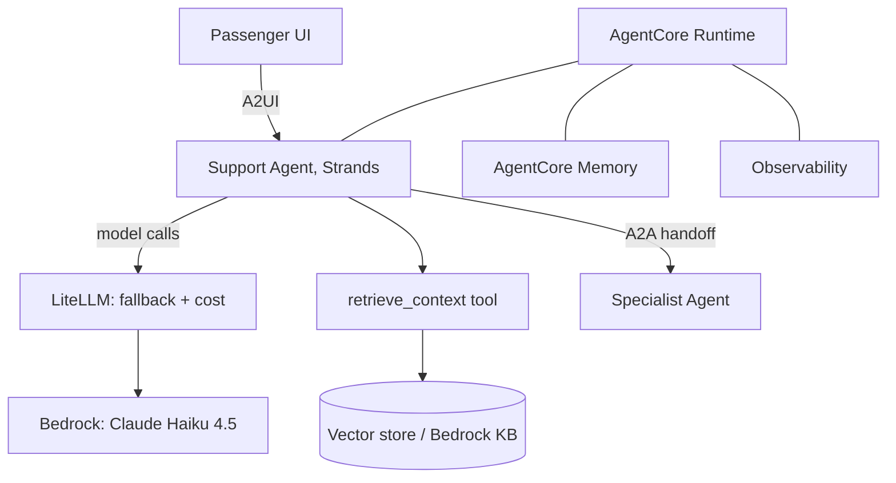
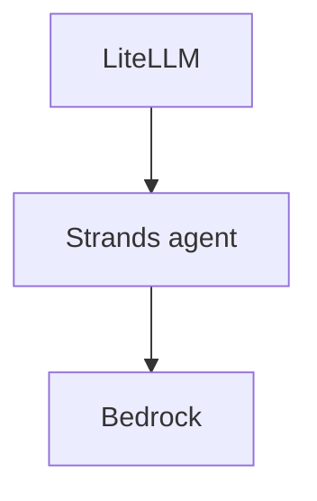
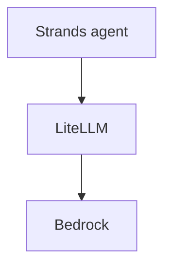

# Take-Home · Consolidated Capstone

**Language:** Python · **Topics:** Strands, A2A, A2UI, AgentCore, LiteLLM, RAG · **Level:** Capstone

---

## Scenario

You are shipping TravelMind's production support agent. It must:

- run a **Strands** agentic loop
- reach the model through **LiteLLM** with a fallback and cost tracking
- answer policy questions with **RAG** (retrieval as a tool)
- deploy on **AgentCore** Runtime
- hand complex cases to a specialist agent over **A2A**, and render replies in a UI via **A2UI**

Passenger Rao (Gold tier, PNR JX48Q2, BLR-DEL cancelled) is the test case. This sheet pulls together everything from the week. Work top to bottom; each part builds on the last.



---

## Part A · Layer map (MCQ)

**Q1.** In this system, LiteLLM sits:
- A) above the Strands loop, deciding tool calls
- B) below the agent, as the model access layer
- C) inside the vector store
- D) as the UI renderer

**Q2.** Which component decides WHAT the agent does (plan, call tools, loop)?
- A) LiteLLM
- B) the Strands agent loop
- C) AgentCore Runtime
- D) the embedding model

**Q3.** AgentCore's role in this system is:
- A) to translate model requests
- B) to host, scale, and observe the agent in production
- C) to chunk documents
- D) to replace Strands

---

## Part B · Concept roles across the week (match)

**Q4.** Match each tool from the week to its job. No distractor here; all six match.

| Concept | | Role |
|---|---|---|
| 1. Strands | | A) model access, one wire to any provider |
| 2. LiteLLM | | B) the agentic loop: plan, call tools, respond |
| 3. RAG | | C) grounding the model in current, private knowledge |
| 4. AgentCore | | D) agent-to-agent handoff between specialists |
| 5. A2A | | E) production hosting, memory, identity, observability |
| 6. A2UI | | F) agent-to-UI rendering of replies |

---

## Part C · Multi-select

**Q5.** Which of these are the MODEL-ACCESS layer, not orchestration or hosting? (choose all)
- A) `litellm.completion(...)`
- B) `LiteLLMModel(model_id="bedrock/us...")`
- C) the Strands `@tool` decorator
- D) `litellm.Router(...)`
- E) `BedrockAgentCoreApp()`

---

## Part D · Spot two bugs, fix both (free fix)

**Q6.** This model setup fails on Bedrock for two independent reasons. Name both and write the corrected setup.

```python
from strands.models.litellm import LiteLLMModel

model = LiteLLMModel(
    client_args={"api_key": AWS_SECRET},     # for Bedrock
    model_id="bedrock/us.anthropic.claude-haiku-4-5-20251001-v1:0",
    params={"temperature": 0.3, "top_p": 0.9},
)
```

---

## Part E · Debug the streaming tool call (free fix)

**Q7.** The support agent's LangChain path fails only when streaming tool calls on Bedrock. Identify the bug and the one-line fix.

```python
from langchain_litellm import ChatLiteLLM
llm = ChatLiteLLM(model="bedrock/us.anthropic.claude-haiku-4-5-20251001-v1:0")
tools_llm = llm.bind_tools([lookup_pnr])
async for chunk in tools_llm.astream("Look up PNR JX48Q2"):   # fails
    ...
```

---

## Part F · Assemble the RAG agent (medium)

**Q8.** Complete the three blanks so the Strands support agent runs on Bedrock through LiteLLM and retrieves policy passages on demand.

```python
from strands import Agent, tool
from strands.models.litellm import LiteLLMModel

@tool
def retrieve_context(query: str) -> str:
    """Search TravelMind policies and return the most relevant passages."""
    hits = retrieve(query, k=3)
    return "\n\n".join(f"[{h['id']}] {h['text']}" for h in hits)

model = LiteLLMModel(
    model_id="____________________",                     # blank 1: Bedrock Haiku 4.5 via LiteLLM
    params={"max_tokens": 600, "temperature": 0.3},
)
agent = Agent(
    model=model,
    tools=[____________________],                        # blank 2: the retrieval tool
    system_prompt=("Use ____________________ for TravelMind policy questions. "  # blank 3
                   "Answer from retrieved passages and cite the [id]s. Say you do not know if absent."),
)
print(agent("Do Gold members pay a fee to change a cancelled flight?"))
```

---

## Part G · Predict behaviour

**Q9.** For the question in Q8, the agent should call `retrieve_context`. Describe what the tool returns (shape and content, not exact policy text) and what the final answer must contain per the system prompt.

**Q10.** The same agent is asked "What time is it right now?" Predict whether it calls `retrieve_context`, and why.

---

## Part H · Rectify the wrong suggestion

**Q11.** A teammate proposes: "Skip RAG. Paste all policy documents into one giant system prompt and let the model answer." Give three concrete reasons RAG wins here, tied to freshness, cost, and verifiability.

---

## Part I · Cost under load (scenario + math)

**Q12.** During the Diwali rush, spend spikes. Which levers from the week reduce cost without dropping the service? (choose all that apply)
- A) fallback to a cheaper model on non-critical calls
- B) provider-side prompt caching for the repeated system prompt
- C) removing the grounding prompt
- D) tracking cost per call with `completion_cost` to find the burner

**Q13.** Assume illustrative rates: $0.001 per 1k input tokens, $0.005 per 1k output tokens. Fill the total.

| Call | Input tokens | Output tokens | Cost |
|---|---|---|---|
| A | 2,000 | 400 | ? |
| B | 1,000 | 200 | ? |
| C | 3,000 | 600 | ? |
| **Total** | | | **?** |

---

## Part J · Pick the correct architecture

**Q14.** Which layering is correct?

Diagram P:


Diagram Q:


- A) P, LiteLLM orchestrates the agent
- B) Q, the agent uses LiteLLM to reach the model

---

## Part K · Wrap for AgentCore (write)

**Q15.** Complete the entrypoint so the assembled agent from Part F deploys on AgentCore Runtime. Fill the two blanks.

```python
from bedrock_agentcore.runtime import BedrockAgentCoreApp

app = BedrockAgentCoreApp()

@app.entrypoint
def invoke(payload):
    return {"result": str(agent(payload.get("prompt", "Hello")))}

if __name__ == "__main__":
    ____________________          # blank 1: start the server
```
Then, blank 2: in one line, name the two CLI commands that deploy this file.

---

## Part L · Order the deploy

**Q16.** Order the steps to put the agent in production on AgentCore:

- (i) `agentcore launch`
- (ii) prove the agent answers locally
- (iii) `agentcore configure --entrypoint rag_agent.py`
- (iv) invoke with `boto3.client("bedrock-agentcore").invoke_agent_runtime(...)`, session id 16+ chars
- (v) wrap the agent in `BedrockAgentCoreApp` with `@app.entrypoint`

---

## Part M · Design (open, no full code)

**Q17.** TravelMind wants Self-RAG so simple questions skip retrieval and answers are grounded. Sketch the graph as a node list with the branch conditions (names only, no full implementation). Reference the pattern you built, do not invent new APIs.

---

## Part N · Skeptic capstone

**Q18.** Leadership asks: "Why not fine-tune one large model to do all of this and drop LiteLLM, RAG, and AgentCore?" Write a five-line rebuttal that separates behaviour from knowledge, and names what each layer buys that fine-tuning cannot.

---

<details>
<summary><b>Answer key (instructor)</b></summary>

1. B. 2. B. 3. B.
4. 1-B, 2-A, 3-C, 4-E, 5-D, 6-F.
5. A, B, D. (C is orchestration glue, E is hosting.)
6. Bug one: Bedrock uses AWS credentials, not `api_key`; remove `client_args={"api_key": ...}`. Bug two: temperature + top_p together are rejected; drop one (or set `litellm.drop_params = True`). Corrected: `LiteLLMModel(model_id="bedrock/us.anthropic.claude-haiku-4-5-20251001-v1:0", params={"temperature": 0.3})` with `litellm.drop_params = True`.
7. `bind_tools().astream()` on Bedrock misroutes to an OpenAI endpoint (Jan 2026 bug). Fix: use `tools_llm.invoke(...)` instead of `astream`, or `langchain-aws` `ChatBedrockConverse`.
8. Blank 1: `"bedrock/us.anthropic.claude-haiku-4-5-20251001-v1:0"`; Blank 2: `retrieve_context`; Blank 3: `retrieve_context`.
9. Returns a string of the top-3 passages formatted `[id] text`, joined by blank lines. The final answer must be drawn from those passages, cite the `[id]s`, and say "I do not know" if the passages do not cover it.
10. No. The system prompt scopes retrieval to policy questions; a clock question is outside scope, so it skips the tool (and the model has no live clock, so it should say it cannot know).
11. Freshness: a giant prompt goes stale and must be re-edited and resent; RAG updates by editing a document. Cost: sending all docs every turn burns input tokens on every call; RAG sends only the top-k. Verifiability: RAG cites retrieved `[id]s`, a stuffed prompt does not, and it is more prone to lost-in-the-middle.
12. A, B, D.
13. A: (2 x 0.001) + (0.4 x 0.005) = 0.002 + 0.002 = $0.004. B: 0.001 + 0.001 = $0.002. C: 0.003 + 0.003 = $0.006. Total = **$0.012**.
14. B.
15. Blank 1: `app.run()`. Blank 2: `agentcore configure --entrypoint rag_agent.py` then `agentcore launch`.
16. ii, v, iii, i, iv.
17. Nodes: decide (retrieve or direct) -> [direct -> END] or [retrieve -> grade relevant -> generate -> reflect supported]; reflect branches: supported yes or attempts cap -> END, else rewrite -> retrieve. Guarded by a max-attempts cap.
18. Fine-tuning teaches behaviour and style and bakes knowledge in permanently, slow and costly to update, and hard to cite. RAG supplies current, private knowledge you update by editing a document, with citations. LiteLLM keeps the model swappable and adds fallback, retries, and cost control. AgentCore supplies hosting, memory, identity, and observability. One fine-tuned model gives none of the operational or freshness properties, so you would rebuild all four badly inside a training run.
</details>
