# RAG

**Day 9 · Agentic AI Bootcamp · Give the frozen model a library card**

Language: Python · Level: Beginner to Advanced · Runtime target: Amazon Bedrock

---

## The bridge from LiteLLM

Last hour: LiteLLM fetches chat completions and embeddings through one interface.

That is exactly the two ingredients RAG needs. So the smallest RAG system is: embed some text, embed the question, find the nearest text, hand it to the model.

Everything advanced today (reranking, Self-RAG, CRAG) is a refinement of that one loop, never a replacement.

---

## Why RAG: three failures of a bare model

A model alone knows only what it saw in training, frozen at a cutoff.

| Failure | Symptom | RAG fixes it by |
|---|---|---|
| Stale | "as of my last update..." | fetching live documents at query time |
| Blind to private data | cannot see your PDFs, wikis, tickets | retrieving from your own store |
| Ungrounded | confident hallucination, no source | forcing answers from retrieved passages, with citations |

**Skeptic check:** why not just fine-tune the model on your data? Fine-tuning teaches style and format, and it bakes knowledge in permanently. It is slow to update, expensive to redo, and still hard to cite. RAG updates by editing a document. Pick fine-tuning for behaviour, RAG for knowledge.

---

## The mental model: open-book exam

A closed-book exam tests memory. That is a bare model.

An open-book exam lets you look things up. That is RAG. The model stops guessing and starts reading.

Two separate phases, and mixing them up is the root of most confusion.

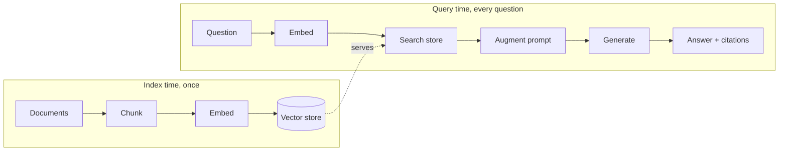

Offline is slow and rare. Online is fast and constant. Build them as two pipelines.

---

## Embeddings: meaning becomes geometry

An embedding turns text into a vector so that similar meaning lands nearby in space.

$$\text{similarity}(a,b) = \cos(\theta) = \frac{a \cdot b}{\lVert a \rVert \, \lVert b \rVert}$$

Cosine near 1 means "about the same topic," near 0 means unrelated.

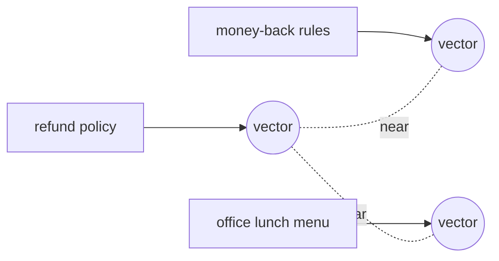

On Bedrock: `amazon.titan-embed-text-v2:0`, reachable through LiteLLM as `bedrock/amazon.titan-embed-text-v2:0`. Read the vector length from the response rather than hardcoding it; Titan v2 supports multiple sizes.

**Key rule:** embed your documents and your questions with the **same** model. Mixing embedding models is comparing metres to inches.

---

## Chunking: why you cannot embed a whole book

Embeddings work best on focused passages. A giant chunk blurs many topics into one averaged vector, and retrieval gets fuzzy.

| Chunk too big | Chunk too small |
|---|---|
| one vector, many topics, weak match | topic split across chunks, context lost |
| retrieves noise around the answer | retrieves a fragment that answers nothing |

The lever is size plus **overlap**, so a sentence spanning a boundary is not cut in half.

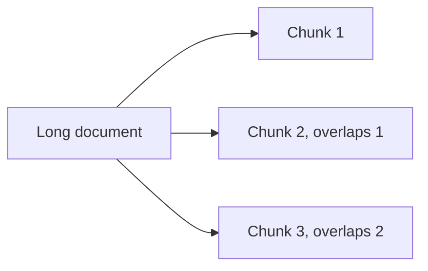

Start around a few hundred tokens with 10 to 20 percent overlap, then tune against your own eval set. There is no universal number.

---

## The vector store: fast nearest-neighbour

Storing vectors is easy. Searching millions fast is the trick. That is approximate nearest neighbour (ANN): trade a sliver of accuracy for a huge speed gain.

| Option | Use when |
|---|---|
| In-memory (numpy, FAISS) | prototypes, small corpora, notebooks |
| Managed (OpenSearch Serverless, pgvector, Pinecone) | production scale, filtering, persistence |
| Bedrock Knowledge Bases | you want AWS to run the whole index for you |

Today's notebook uses plain numpy cosine so the whole pipeline runs on Bedrock with no extra infrastructure. Same math the big stores use, just not sharded.

---

## Retrieval: top-k and hybrid

Retrieval returns the k passages closest to the question.

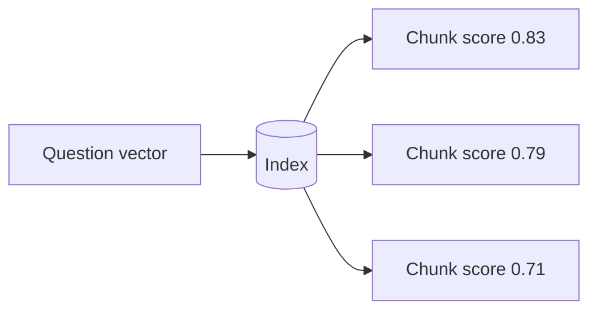

| Search type | Matches on | Weakness |
|---|---|---|
| Semantic (vector) | meaning | misses exact codes, IDs, rare terms |
| Keyword (BM25) | exact words | misses paraphrase |
| Hybrid | both, fused | best recall, slightly more setup |

Vector search finds "money-back" for "refund." Keyword search finds error code "PNR JX48Q2" that a vector may smear. Real systems fuse both.

---

## Augment and Generate: grounding the answer

Retrieved chunks go into the prompt as context. The instruction pins the model to that context.

```python
prompt = f"""Answer ONLY from the context. If the answer is not there, say you do not know.

Context:
{retrieved_chunks}

Question: {question}
"""
```

Three non-negotiables:

- **Ground:** answer from context, not memory.
- **Refuse:** allow "I do not know" so the model stops inventing.
- **Cite:** carry chunk ids or sources into the answer so a human can verify.

Skip these and RAG becomes a hallucinating parrot with extra steps.

---

## Naive RAG, end to end

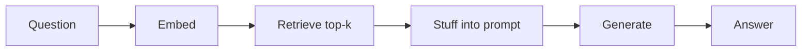

This works, and it is the honest baseline. Ship it, then measure, then improve.

Its failure modes are the map for everything advanced:

| Failure | Cause | Advanced fix |
|---|---|---|
| Retrieves the wrong chunk | vague question, weak match | query rewriting |
| Right chunk ranked low | vector score is coarse | reranking |
| Answer ignores the middle chunk | lost-in-the-middle | fewer, better chunks |
| Retrieves confidently wrong info | no self-check | CRAG, Self-RAG |

---

## Advanced levers: match the fix to the failure

Do not add all of these. Add the one that fixes your measured failure.

| Lever | Problem it solves | One-line idea |
|---|---|---|
| Query rewriting | vague or messy question | model rewrites the query before search |
| Query expansion | narrow recall | search several rephrasings, merge |
| Reranking | good chunk ranked low | a second model rescores top results |
| Metadata filtering | wrong scope | filter by tag, date, source before search |
| Small-to-big | fragment lacks context | retrieve small, feed the parent section |
| Contextual compression | prompt full of noise | trim retrieved text to the relevant lines |
| Hybrid search | misses exact terms | fuse vector plus keyword |

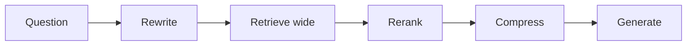

**Skeptic check:** every lever adds latency and cost. If naive RAG already passes your eval, stop. Complexity is a liability until a metric demands it.

---

## Self-RAG: the model decides and critiques

Self-RAG makes retrieval conditional and self-checked. The model asks three questions of itself, using reflection tokens.

1. **Do I even need to retrieve?** Some questions are answerable directly.
2. **Is each retrieved passage relevant?** Drop the ones that are not.
3. **Is my answer actually supported, and useful?** If not, retry.

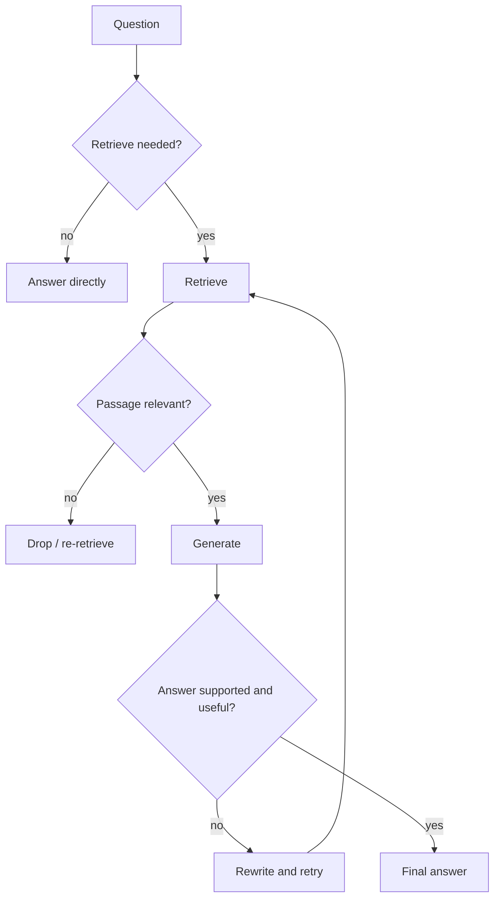

Effect: fewer needless retrievals, and answers that pass a grounding self-check before they reach the user. Guard it with a max-iteration cap or it can loop.

---

## CRAG: grade the retrieval, correct it

Corrective RAG assumes retrieval will sometimes fail, and adds a corrective step. A lightweight grader scores the retrieved docs, then routes.

| Grade | Meaning | Action |
|---|---|---|
| Correct | docs clearly answer the query | generate from them |
| Incorrect | docs miss the query | discard, fetch elsewhere (web search) |
| Ambiguous | partial | combine store docs with a fresh search |

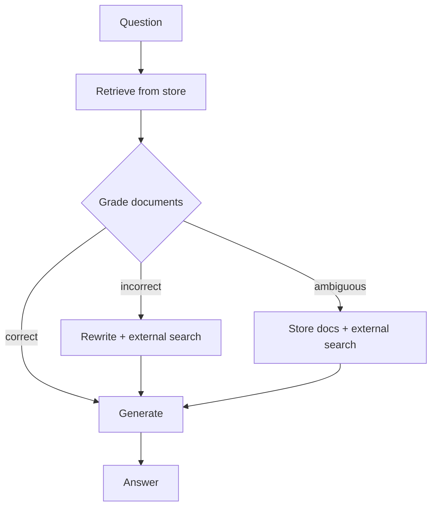

The corrective source is pluggable: a web search tool (Tavily, or AgentCore Web Search), or a broader re-retrieval. The point is that a bad retrieval no longer silently produces a bad answer.

---

## Self-RAG vs CRAG

Same goal, different instinct.

| | Self-RAG | CRAG |
|---|---|---|
| Core question | do I need docs, and is my answer grounded? | are these docs good enough, and how do I fix them? |
| Retrieval | conditional, may skip | always, then graded |
| Correction | rewrite and retry, self-reflection | route to web / external source |
| Best when | mixed questions, some need no lookup | store is patchy, freshness matters |
| Cost | extra model calls for reflection | extra retrieval for correction |

Both are naturally **graphs with loops**, which is why LangGraph is the right home for them, not a straight chain.

---

## RAG on Bedrock: managed vs DIY

Two ways to run RAG on AWS.

| | Bedrock Knowledge Bases (managed) | DIY (your own store) |
|---|---|---|
| Indexing | AWS chunks, embeds, stores | you control every step |
| Retrieve | `retrieve` API | your own search |
| Retrieve + generate | `retrieve_and_generate` (one call, cited) | your own prompt loop |
| Control | less | full |
| Speed to ship | fast | slower |

```python
import boto3
rt = boto3.client("bedrock-agent-runtime", region_name="us-east-1")

# Retrieve only
rt.retrieve(
    knowledgeBaseId=KB_ID,
    retrievalQuery={"text": "What is the refund window?"},
    retrievalConfiguration={"vectorSearchConfiguration": {"numberOfResults": 4}},
)

# Retrieve + generate in one call, returns cited answer
rt.retrieve_and_generate(
    input={"text": "What is the refund window?"},
    retrieveAndGenerateConfiguration={
        "type": "KNOWLEDGE_BASE",
        "knowledgeBaseConfiguration": {
            "knowledgeBaseId": KB_ID,
            "modelArn": "arn:aws:bedrock:us-east-1::foundation-model/us.anthropic.claude-haiku-4-5-20251001-v1:0",
        },
    },
)
```

Note: the old `citation` field is deprecated; read `retrievedReferences` instead. Use a managed KB to ship fast, DIY when you need custom retrieval logic like CRAG.

---

## RAG with the frameworks

Where RAG lives in each tool you already know.

| Framework | RAG shape | Best for |
|---|---|---|
| LangChain | retriever plus a chain (LCEL) | linear RAG, quick to assemble |
| LangGraph | a graph with retrieve, grade, generate nodes | CRAG, Self-RAG, any loop or branch |
| Strands | retrieval exposed as a `@tool` | agent decides when to retrieve |
| AgentCore | the Strands / LangGraph RAG agent, deployed | production hosting of any of the above |

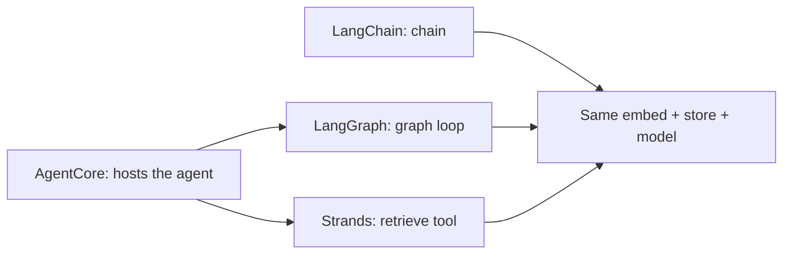

The retrieval and generation core is identical. The framework only decides the control flow around it.

---

## RAG as a Strands tool

Turning retrieval into a tool lets the agent choose to look things up, mid-reasoning, only when needed. This is the shape AgentCore deploys.

```python
from strands import Agent, tool
from strands.models.litellm import LiteLLMModel

@tool
def retrieve_context(query: str) -> str:
    """Search the internal knowledge base and return the most relevant passages."""
    hits = search(query, k=3)          # your vector search or Bedrock KB retrieve
    return "\n\n".join(h["text"] for h in hits)

model = LiteLLMModel(model_id="bedrock/us.anthropic.claude-haiku-4-5-20251001-v1:0")
agent = Agent(model=model, tools=[retrieve_context],
              system_prompt="Use retrieve_context for questions about internal docs. Cite what you use.")
print(agent("What is our refund window?"))
```

The agent calls the tool only when a question needs it, so simple chit-chat skips retrieval entirely. That is Self-RAG's "do I need to retrieve" instinct, expressed as tool choice.

---

## RAG on AgentCore: steps and architecture

Goal: take the Strands RAG agent above and run it as a managed, scaling, observable endpoint.

**Steps**

1. Build the RAG agent locally (Strands agent + `retrieve_context` tool + Bedrock model). Prove it answers.
2. Wrap it in `BedrockAgentCoreApp` with an `@app.entrypoint` that reads `payload["prompt"]` and returns the answer.
3. Choose the retrieval backend for the tool: your vector store, a Bedrock Knowledge Base `retrieve`, or a Lambda exposed through AgentCore Gateway as an MCP tool.
4. `agentcore configure --entrypoint rag_agent.py`, then `agentcore launch`. The toolkit builds and provisions runtime, IAM, and logging.
5. Invoke through the AWS SDK `invoke_agent_runtime`, passing a session id of at least 16 characters.
6. Add AgentCore Memory for conversation history, and Observability traces to CloudWatch, without changing agent logic.

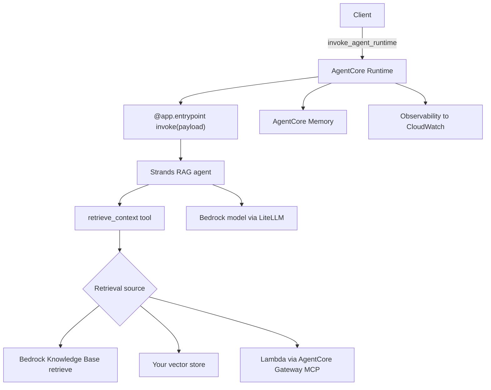

Key idea: the agent code is the same locally and in production. AgentCore adds hosting, memory, identity, and tracing around retrieval you already built.

---

## Evaluation and what not to do

RAG that is not measured is RAG that is quietly failing.

Measure two things with an LLM-as-judge or a labelled set:

| Metric | Question it answers |
|---|---|
| Faithfulness | is the answer supported by retrieved context? |
| Answer relevance | does the answer address the question? |
| Context relevance / recall | did retrieval fetch the right passages? |

**Do not:**

- chunk without an eval loop, then guess at sizes
- trust retrieval blindly; grade it (that is the whole CRAG lesson)
- drop citations; an unverifiable answer is a liability
- feed retrieved PII or secrets into prompts without filtering
- reach for Self-RAG or CRAG before naive RAG has a measured baseline

---

## Recap: pick the right RAG

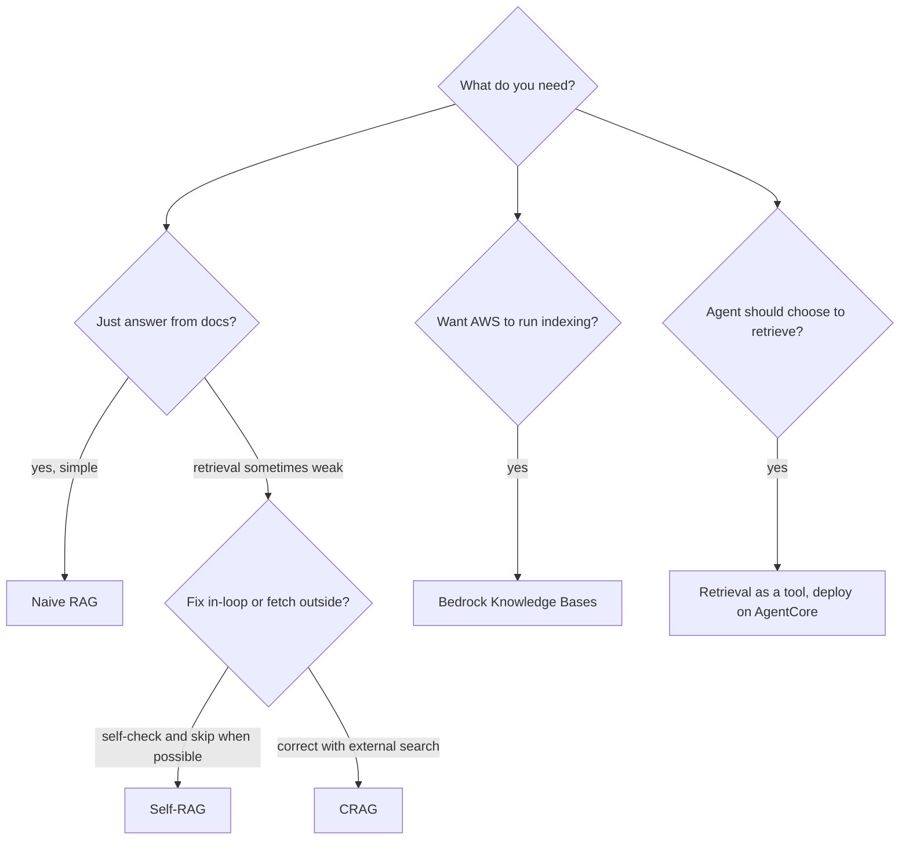

- Naive first, always. Measure before you add anything.
- Advanced levers fix specific measured failures, one at a time.
- Self-RAG for mixed questions and grounding self-checks.
- CRAG when the store is patchy and freshness matters.
- Managed KB to ship fast, retrieval-as-a-tool to put it inside an agent on AgentCore.

**Two things carry from today:** LiteLLM is the one wire to every model. RAG is the library card that keeps that model honest and current. Both sit under the agents you have built all week.
